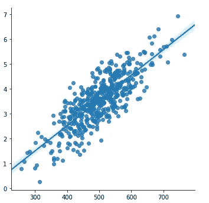
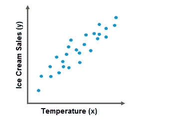
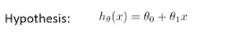
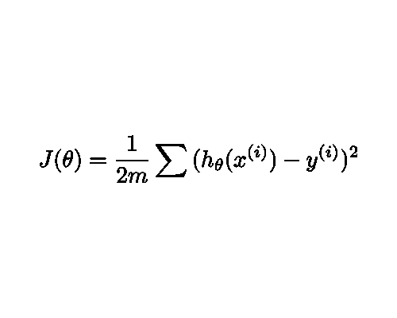
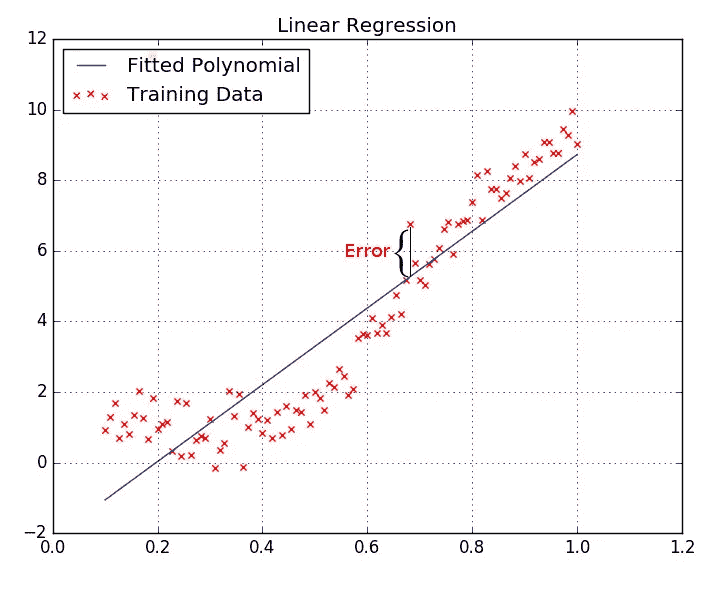
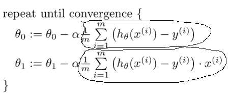
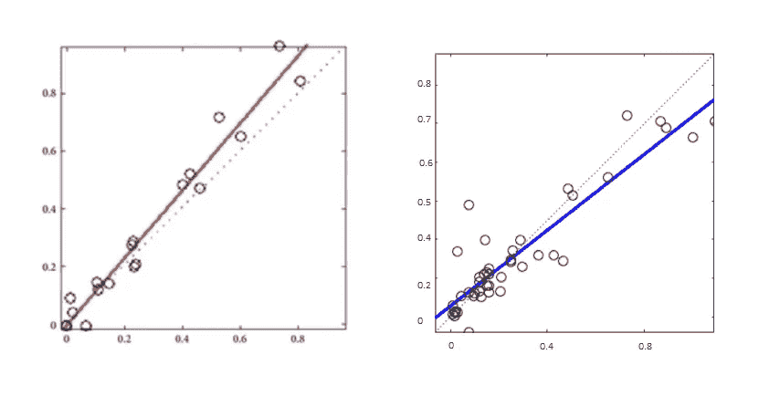
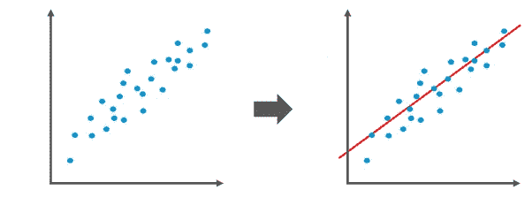
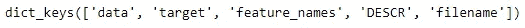
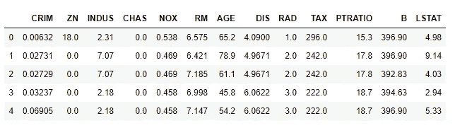

# Python 线性回归完全指南

> 原文：<https://towardsdatascience.com/complete-guide-to-linear-regression-in-python-d95175447255?source=collection_archive---------23----------------------->

## 在本文中，我们将使用 sklearn 在波士顿房价数据集上理解和实现线性回归


Emil Widlund 在 [Unsplash](https://unsplash.com?utm_source=medium&utm_medium=referral) 上的照片

# 什么是线性回归？

**线性回归**是一种有监督的机器学习算法。它根据给定的**因变量(x)** 预测**自变量(y)** 之间的**线性关系。使得**自变量(y)** 具有**最低成本**。**



应用于数据的线性回归，作者提供照片

# 线性回归工作

为了解释**线性回归**的工作原理，我们首先必须假设我们有一些数据，当我们在**散点图**上绘制这些数据时，我们会得到一个类似这样的图。



数据散点图，作者照片

现在，如果我们将**线性回归**应用于它，那么它将计算数据之间的**关系/线**，使得**线**是距离数据中的所有点**最近的**。换句话说，它会计算出**温度(x)** 和**冰淇淋(y)** 销量之间的**关系，并告诉我们在什么**温度**下**销量**会大于**销量**以及在什么**温度**下**销量**会小于**。********

***我们如何找到我们数据之间的这条线/关系？***

现在，在我们深入探讨这个问题之前，我们应该先了解一些**术语**。

*   **假设表示**
*   **成本函数**
*   **梯度下降**

# 假设表示

**假设表示**是我们的**线**的方程，我们用来表示给定的**数据**之间的**关系**。



假设表示公式，作者照片

现在，这个**方程**一开始可能会令人困惑，有些人可能很难把它想象成直线的**方程。但是如果我们考虑直线**的**方程，那就是 **y = mx + c** 。**

在线的方程中， **m** 对应的是**斜率**， **x** 是具有某值的**变量** **， **c** 是一个**常数**。
在假设表示中， **θ1** 对应**斜率**， **x** 为具有某值**的**变量， **θ0** 为**常数**。**

所以这里的 **θ0** & **θ1** 都是**的参数**，它们的**初始值**是我们手动设置的**，但之后又进一步修改为**线**在**数据**中完美设置。**

# **价值函数**

**现在，每当我们第一次绘制数据和计算**线/关系**时，我们都必须选择一些**参数**，如那条线的起点****和线的斜率**。因此，首先，我们不知道任何这些东西的值，我们假设两个**参数**的值，然后对我们的**数据**应用**成本函数**来检查**误差(点和我们的线的距离 b/w)**。****

****现在首先我会给你看我们的**成本函数**的数学版本，然后我会在下面解释它。****

********

****平方误差成本函数，作者照片****

*******重要符号:*******

*   ******m** 代表**训练样本总数******
*   ******x(i)** 代表**输入变量** (x(1)表示第一个训练示例)****
*   ******y(i)** 代表**输出变量******

****所以在这个**成本函数**中，**(hθ(x)-y)**项用我们的**给定值** **(y)** 减去**预测值** ( **x)** ，这样我们就找到了我们的**线**和**给定点**之间的**误差(距离)**。然后我们取答案的**平方**，以防**得到的值**是一个**负数**。之后，我们**对所有**训练示例**和**求和**并将**乘以 **1/2m** ，取**平均值**作为我们**训练示例误差。******

****

**我们的假设和给定数据之间的误差，[中等](https://medium.com/@ahmadbinshafiq/linear-regression-simplified-for-beginners-dcd3afe0b23f)**

*****【细化 1 / 2m(可选)*****

**现在，我们在这里看到的是这个等式被乘以 **1/2m** 。这里的 **m** 是取我们误差的**均值/平均值**，这里的 **2** 是因为当我们取**成本函数**的**导数**时，在**更新**时使用**参数**在**坡度下降**时，即 **2** 在**功率****

# ****梯度下降****

****现在，当我们对**成本函数** & **假设表象**有了更好的理解，由此我们走向第三项，**梯度下降**。****

****所以，现在我们已经成功地实现了**成本函数**，并且得到了一些**成本(误差)> > 0** 。为了减少这个**成本(误差)**我们应用**梯度下降，**其中我们**更新**参数θ0** & **θ1** 的值，并且保持**更新**它们，直到我们的**成本(误差)**几乎等于 **0** 。因此，**梯度下降**的数学公式如下******

****

**梯度下降公式，[中等](https://medium.com/@ahmadbinshafiq/linear-regression-simplified-for-beginners-dcd3afe0b23f)**

*****重要符号:*****

*   ****m** 代表**训练样本总数****
*   ****α** 代表**α**也叫**学习率****
*   ****x(i)** 代表**输入变量** (x(1)表示第一个训练样本)**
*   ****y(i)** 代表**输出变量****

**好了，现在深入这个公式，我们可以看到 **θ0** & **θ1** 在不断变化，直到**成本函数**达到其**最小值**。它的意思是，我们将继续**改变 **θ0** & **θ1** 的值，直到我们的**参数**达到**值**，其中 c **ost(误差)**将是最小的**。******

****现在，如果你看到我们在 **α** 之后有一个类似于**成本函数**的等式，那是因为**梯度下降**是**成本函数**的**导数**。****

********

****突出成本函数的导数，[中](https://medium.com/@ahmadbinshafiq/linear-regression-simplified-for-beginners-dcd3afe0b23f)****

****这里我们将我们的**成本函数的导数** **(平方误差成本函数)**乘以 **α** ，**从当时的 **θ** 的当前值中减去**α，得到一个新值 **theta (θ)** 。****

*****选择α的值*****

**我们总是选择 **α** 的一个非常小的**值**，因为每次迭代后 **θ** 值的**变化**取决于 **α** 的值(如等式所示)。因此，通过选择 **α** 的**非常小的值**，我们的**假设**采取**非常小的步骤**并达到其**最低成本**。通过使用大值的 **α** ，我们可能开始采取**大的步骤**，并且可能**错过**全局最小值，其中我们的**成本(误差)**将是**最低的**。**

****

**使用小值的 **α** 与使用大值的 **α，**作者照片**

*****澄清第二方程中的 x*****

**现在有些人可能会奇怪，在第二个**方程**中，一个额外的 **x(i)** 正被**乘以我们的**方程**，而在第一个**方程**中什么也没有。这里有一个 **x(0)** ，是用**乘以**得到的**等式**，但是我们没有写下来，因为这是**偏差**，并且总是等于 **1。******

*****梯度下降作业*****

**现在**梯度下降**所做的是它采取**小婴儿步骤**并且在每个**步骤**中，它**将**假设(线)**向**位置**收敛**，在那里我们的**成本(误差)**将会是**最小**。**

****

**假设收敛到全局最小值，图像来自[介质](https://medium.com/@ahmadbinshafiq/linear-regression-simplified-for-beginners-dcd3afe0b23f)**

**从 [**这里**](/machine-learning-fundamentals-via-linear-regression-41a5d11f5220) **阅读更多关于**成本函数**和**梯度下降**。****

## **应用线性回归的步骤:**

**现在我们对**假设表示**、**成本函数、**和**梯度下降**有了很好的理解。因此，让我们将**线性回归**应用于我们的数据集。**

****线性回归**可应用于以下步骤:**

1.  **绘制我们的数据(x，y)。**
2.  **取随机值 **θ0** & **θ1** 并初始化我们的**假设**。**
3.  **在我们的**假设**上应用**成本函数**，并计算其**成本**。**
4.  **如果我们的**花费> > 0** ，那么应用**梯度下降**和**更新**我们的**参数θ0** & **θ1** 的**值。****
5.  **继续计算**第 3 步**和**第 4 步**，直到我们的**成本**接近等于 0 或**最小**。**
6.  **如果我们的**成本**已经达到它的**全局最小值**，那么我们停止应用**成本函数**和**梯度下降**，现在我们已经成功地训练了我们的**算法**来预测我们的数据之间正确的**关系**。**

****

**对我们的数据集应用线性回归**

**现在，当我们很好地理解了**线性回归**的工作原理后，让我们使用 **Python 的**著名的**机器学习库**、 **Scikit-learn** 将其应用于一个数据集。**

# **什么是 Scikit-learn？**

****Scikit-learn** (又称 **sklearn** )是一个针对 Python 的机器学习库。它包括各种**分类**、**回归、**和**聚类算法**以及**支持向量机(SVM)** 、**随机森林**、**梯度提升**、**、 *k* -means** 和 **DBSCAN** ，并且被设计为与类似**的 Python 库一起工作****

# **使用 Sklearn 进行线性回归**

****线性回归**是一种非常直接且易于使用的**算法**。特别是在这个 **Scikit learn** 库的帮助下，它的实现和使用变得相当容易。现在，我们开始使用 **Sklearn** 。**

**首先我们需要一些数据对其应用**线性回归**。因此，我们将使用来自 **sklearn** 的**波士顿房价数据集**。**

*****在 Python 中导入波士顿数据集*****

```
from sklearn.datasets import load_boston
boston = load_boston()
```

*****在 Python 中导入其他库*****

```
import pandas as pd
import numpy as np
import matplotlib.pyplot as plt
import seaborn as sns
```

*****检查内容我们的数据集*****

```
print(boston.keys())
```

****

**打印输出(波士顿['target'])代码**

**这些键中的每一个都包含了大量的信息和数据。**

*   **' **data** '键包含我们将提供给模型的数据，它也可以被假定为输入(x)变量。可以使用`boston.data`代码进行访问。**
*   **' **target** '键包含我们的模型应该预测的输出数据(y)。可以使用`boston.target`代码访问它。**
*   **' **feature_names** '键包含我们的数据的列/特征的名称。也可以使用`boston.feature_names`代码访问它们。**
*   **' **DESCR** '键将为我们提供关于数据集的所有信息，其中的列数，甚至每一列的细节/描述。我们可以使用`print(boston['DESCR'])`代码获取这些信息。**
*   **“**文件名**键给了我们这个(波士顿房价)文件的位置。我们可以使用`print(boston['filename'])`代码获得位置。**

*****创建数据帧*****

**现在，为了向前推进并以一种有组织的和可行的方式查看我们的数据，我们将使用 **Pandas** 创建一个数据框。**

```
bostondf = pd.DataFrame(boston.data, columns=boston.feature_names)
```

**在我们的数据框架被创建并且我们的数据被组织之后。我们使用`bostondf.head()`检查数据集的头部。这为我们提供了数据集的整体清晰度/图像。**

****

**我们数据框的头**

**现在，如果我们不明白每一列代表什么，我们可以使用我们之前讨论过的`print(boston['DESCR'])`代码来检查每一列的细节。**

**现在，在对我们的数据做了一些**特征工程**之后，当我们觉得我们的数据现在是可以传递给我们的模型的正确格式时，我们就向我们的下一步前进。
**注意:我不是在这个数据集上做特征工程。****

*****将我们的数据集分割成训练、测试值*****

**现在，当我们的数据准备好传递给我们的模型时，我们的第一步是将数据集分成两组，即**训练集**和**测试集**。**

```
from sklearn.model_selection import train_test_split
X = bostondf
y = boston['target']
X_train, X_test, y_train, y_test = train_test_split(X, y, test_size=0.33, random_state=42)
```

**这里，`X = bostondf`中的 **X** 包含所有的**特征/输入数据(x)** ，我们提供给我们的模型**来预测**的**房价(y)**,`y = boston['target']`中的 **y** 包含**房价**。所以现在我们数据的 **67%** 属于 **training_set** 而**的 33%** 属于 **test_set** 因为 **test_size** 被设置为 **0.33** 。**

*****导入线性回归()*****

**在成功地将我们的数据分成测试和训练集之后，我们将使用 **sklearn** 和`**fit**` 将**线性回归**导入到我们的模型中，然后我们将**预测**我们的模型从我们的训练数据中学习得有多好。**

```
from sklearn.linear_model import LinearRegression
lr = LinearRegression()
lr.fit(X_train, y_train)
lr.score(X_test, y_test)
```

**好了，我们在这两个步骤中所做的是，我们导入了 **LinearRegression( )** 类，并创建了一个名为 **lr** 的 **LinearRegression** 对象。然后我们**将**我们的训练数据`lr.fit(X_train, y_train)`拟合到模型中，为其提供**输入特征(X_train)** 和**输出值(y_train)** 。在模型根据我们的训练数据对**进行了**训练之后，我们使用`lr.score(X_test, y_test)*100`代码来检查我们的模型与我们的训练数据的拟合程度。它会根据 **X_test** 中提供的**特征**来**预测**房屋的**价格，然后将这些价格与 **y_test** 中给出的实际价格进行交叉核对。然后它会给我们一个 1-100 之间的浮点值，告诉我们模型的精度。****

**该模型的**精度**为 **72.45 %。****

*****重要提示*****

**现在，在检查了**精度**之后，如果我们的**精度**看起来不是很**激励**，我们应该继续到我们对我们的**数据集**进行**特征工程**的部分，并做一些**更多的特征工程**。这肯定会提高**的结果。****

****恭喜！**我们已经在**波士顿房价数据集上成功训练了我们的**线性回归**模型。****

## **学习成果**

**到目前为止，我们已经了解了什么是**假设表示**、**代价函数**、**梯度下降**以及它们是如何工作的。此外，我们还学习了如何从 **scratch** 在**数据集**上实现**线性回归**，以及如何使用 **Python** 著名的**机器学习库**即 **Scikit-learn 构建**机器学习模型**。****

**到目前为止，我们已经了解了什么是**假设表示**、**成本函数**、**梯度下降**以及它们是如何工作的。此外，我们还学习了如何从 **scratch** 在**数据集**上实现**线性回归**，以及如何使用 **Python** 著名的**机器学习库**即 **Scikit-learn 构建**机器学习模型**。****