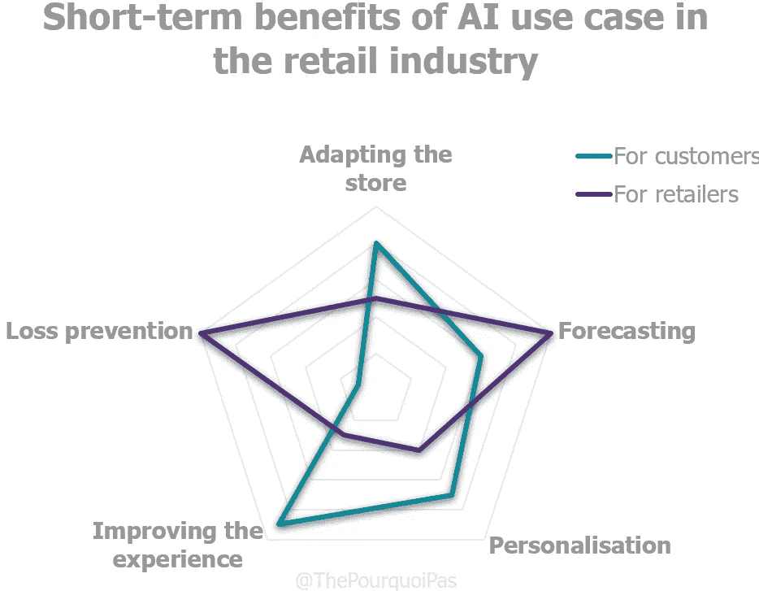

# 零售业机器学习和深度学习完全指南

> 原文：<https://towardsdatascience.com/complete-guide-to-machine-learning-and-deep-learning-in-retail-ca4e05639806?source=collection_archive---------61----------------------->

## 商店还没有死

这里有更多有趣的图表！

商店在变化。我们看到它在我们眼前发生，即使我们并不总是意识到这一点。渐渐地，它们正成为日益复杂的顾客旅程中的一个额外步骤。得益于数字化和零售自动化，**商店本身不再是目的，而是服务于整个品牌需求的手段**。体验的质量、归属感和认同感、购买的舒适度……所有这些参数现在都与每平方米的销售额一样重要，因此必须服从数据科学及其“智能算法”(*又名机器学习和深度学习形式的人工智能*)规定的优化。

首先，人工智能的使用是竞争的需要。事实上，电子商务玩家不会等待任何人:例如，注意在线搜索结果对最终客户的调整，或者基于数字档案的推荐。这两个方面是砖头和砂浆做不到的(目前来说)。但是，实体商业有自己的优势。嗅觉、视觉、听觉等。数据可以用来给消费者一种体验某种独特的、专为他们制造的东西的感觉。除了改善客户关系，人工智能还使寻求解决长期以来一直是零售商负担的问题成为可能:更好的库存管理、商店空间的优化、员工时间的优化…

我们在下面展示了深度学习/机器学习用例的完整视图，这些用例是为了创建未来的**商店而实现的，并有现实生活中的例子支持。**

# 1.调整商店及其库存，以便更好地为顾客服务

众所周知，电子商务参与者可以使用动态统计数据实时优化他们的网站。这使他们能够根据可用资源和预定义的客户细分来定义最有效的策略。像任何物理空间一样，商店没有这种奢侈。

然而，这并不妨碍物理空间的**周期性**优化，这要归功于从智能算法中收集的洞察力。回到过去(不到 20 年前)，我们会雇佣学生跟踪和清点商店特定区域的顾客。谢天谢地，这些时代已经过去了。热图、平均路线图、在屏幕上花费的时间、与总出席率相关的各种比率、相关性……商店里的摄像头和计算机视觉算法现在提供了基于图像的可操作工具。如今，热图和活动识别解决方案不仅有助于定位促销活动，还能帮助制定整体营销策略，并衡量每个部门的绩效以及产品植入的绩效。像 [**RetailFlux**](https://www.retailflux.com/) 这样的公司提供的解决方案可以分析商店视频，为零售商提供他们商店里的人数、他们进去后走的路以及他们在哪里逗留的数据。这有助于营销人员确定受欢迎的地点，使他们能够改变家具、展示、广告或员工的布局，以更好地服务他们的客户并增加收入。

随着技术的发展，我们也开始听说“**人口统计识别**”:这些由初创公司 [**DeepVision AI**](https://www.deepvisionai.com/) 、 [**MyStore-e**](https://www.mystore-e.com/) 、[**retail dep**](https://www.retaildeep.com/)和 [**RetailNext**](https://retailnext.net/en/home/) 创造的工具，让我们能够估计从摄像头前走过的人的年龄和性别，从而让商店能够进入这一点对营销人员和品类经理的理性化至关重要。

虽然这些摄像头经常挂在天花板上，但情况并非总是如此: **Walgreens** (与 **Cooler Screens** 合作)，例如，最近[将摄像头、传感器和数字屏幕集成到其商店的冷却器门](https://www.clickz.com/cooler-screens-is-bringing-the-digital-shopping-experience-to-brick-and-mortar-stores/258916/)中，以创建一个“智能”显示器网络，品牌可以使用它来针对特定类型的客户发布广告。这些门可以作为一个数字销售平台，以最佳方式展示食品和饮料，也可以作为一个店内广告牌，根据大致年龄、性别和当前天气等变量，向正在靠近的消费者展示广告。连接的冷却器内的摄像头和传感器还可以确定买家已经拿起或查看了哪些商品，让广告商了解他们的促销活动在屏幕上的效果，并在产品缺货时迅速通知零售商。

因此，关键问题从“在哪里”和“多少”变成了“谁”、“什么时候”、“多长时间一次”、“吃多少饼干？”。

# 2.增加利润的预测

这些数据与来自结账和忠诚度计划的数据相结合，是**预测需求**和创建商店集群的关键，从而改善零售商的供应链。通过更好地预测哪些产品将在某个领域表现良好，来自诸如[**Symphony RetailAI**](https://www.symphonyretailai.com/)等初创公司的机器学习算法可以减少呆滞库存，帮助优化定价(和利润)，并提高客户忠诚度(人们显然倾向于喜欢在最近的商店找到正确的产品组合)。

事实上，未售出的库存可能是零售业最大的障碍之一:未使用的库存每年给美国零售商造成大约 500 亿美元的损失。减少这一数字是该行业长期生存的关键:花在成为死库存的东西上的每一美元都是宝贵的钱，可以用来培训人才，更好的研发，或者，最明显的，全新的智能算法。

预测也有助于零售商优化他们的促销活动:仓库里的死库存越少，促销就越有战略意义，而不仅仅是被动的。许多定价爱好者会特别欣赏这一点，因为这将使他们的工作容易得多，也不那么吃力不讨好。

# 3.提升店内体验的个性化

与网站可以实时适应最终用户的方式一样，商店也可以增加计算机视觉的粒度，使其能够针对个人。然而，这些算法基于比上述更多的元素，因此更复杂/更不可靠。为了在个人层面上工作，这些算法需要结合人口统计识别、忠诚度代码识别和增强现实，通常集成到镜子等智能物体中。

尽管这些解决方案无法大规模实施，但它们体现了商店销售方式的深刻变化。我们正从销售产品转向销售体验，在这种情况下，实物产品变成了副产品。这就是**shopertainment**的概念。对顾客来说，低廉的价格和丰富的目录已经不够了，他们可以在网上找到这样的价值主张。真实的品牌体验成为生存的关键:商店是吸引人的体验、想法和互动的仓库。

用例当然是众多的(*即使它们经常与人工智能赤道*的科幻技术术语边接壤):在 [2019 年的 NRF](https://www.mediapost.com/publications/article/330262/google-enabled-smart-mirror-is-one-in-a-billion-de.html) ，**谷歌**展示了一个连接视觉识别数据和商店产品数据库的连接镜子。例如，在眼镜店的情况下，镜子可以识别测试的模型，并显示关于它的产品或营销信息。卖家还实时统计了镜子的使用情况:他们知道尝试某种类型眼镜的人已经在那里有一段时间了，或者在两副眼镜之间犹豫不决。这方便了销售人员的工作，他们可以向顾客推荐他们真正感兴趣的产品。

就其本身而言，H & M 已经与**微软**联合测试了[一面通过语音指令进行自拍的镜子](https://www.businessinsider.fr/us/hm-is-trialling-a-mirror-that-suggests-outfits-and-customers-love-it-2018-6)，而 [**Lululemon 的**镜子](https://www.retaildive.com/news/lululemon-invests-in-tech-fitness-startup-mirror/566440/)则更像是一块板子，鼓励其客户参与该品牌创建和维护的社区。

智能镜子当然可以放置在购买过程的不同时间间隔: [**拉夫·劳伦**的](https://digiday.com/marketing/retailtech2016-inside-ralph-laurens-connected-fitting-rooms/)位于试衣间，以改变试穿衣服时经常令人沮丧的体验。买家可以与镜子互动，改变试衣间的照明，并可以为自己的服装选择不同的尺寸或颜色，员工将获得这些。《镜报》还推荐了与正在尝试的食物相匹配的其他食物。

化妆品公司也采用了这些解决方案: [**丝芙兰**智能镜子](https://risnews.com/inside-sephoras-magic-mirror)使用一种智能算法，混合看镜子的人的性别、年龄、外貌和风格，以便提出建议。它甚至声称可以区分穿着中性或明亮颜色、大胆或保守风格以及带有花卉和几何图案的衣服的人。

通过深度学习，我们也看到了一项新技术的出现:**情感计算**。它是计算机识别、解释并可能激发情感的能力。确实有可能识别头部和身体运动等手势，同时声音的语气也能充分说明一个人的情绪状态。这些见解可用于商店，以免给显然不需要帮助或麻烦的顾客带来不便。这些技术仍然是新的(只有 [**可发布**](http://www.releyeble.com/en/index.html) 提供零售用例)和侵入性的:因此最好不要评论未来的用例。

# 4.让顾客的购物体验更加顺畅

镜子、增强现实、虚拟现实……它们很少回应零售商及其客户的真正痛点。我们对这些痛点了如指掌:结账长度、快速产品本地化和库存管理……这些应该是商店寻求使用机器学习和深度学习解决方案的优先事项。

# 减少结账时的摩擦

例如，在中国，某些**肯德基**的顾客可以通过**支付宝**技术、[将他们的面部图像与数字支付系统或银行账户关联后，坐在装有摄像头](https://www.thalesgroup.com/en/markets/digital-identity-and-security/banking-payment/magazine/kfc-use-facial-recognition-payment-china)的 POS 机前进行购物。美国连锁店 **Caliburger** 也在它的一些餐厅[测试了面部识别](https://www.pymnts.com/restaurant-technology/2017/caliburger-john-miller-qsr-face-ordering-kiosks/)的想法:顾客第一次使用店内售货亭点餐时，他们被邀请使用(**NEC**s)[**neo face**的面部识别软件](https://www.nec.com/en/global/solutions/biometrics/face/neofacewatch.html)将他们的脸与他们的账户联系起来，以便从众多优势中受益。银行卡支付仍然是必要的，但如果初步测试阶段成功，该公司打算改用面部识别支付。

然而，对网络安全的担忧可能会阻止这种解决方案大规模问世。事实上，顾客越来越嫉妒他们的个人数据(这是正确的):根据 Wavestone 的一项研究，只有 11%的消费者准备在商店接受面部识别。对于移动应用程序的识别，[这个数字上升到 40%](https://www.wavestone.com/fr/insight/barometre-nouvelles-tendances-consommation-2020/) 。

因此，人们正在考虑其他更可行的方法，利用计算机视觉让结账更加流畅。到目前为止，我们都很熟悉亚马逊 Go 的自动化商店([不太熟悉，希望是](https://www.thepourquoipas.com/post/amazon-go-future-of-retail))，它允许拥有 Prime 账户的顾客用手机上的代码进入商店，购物，然后离开商店，而不经过收银台。一种“跟踪”顾客的算法，购买的金额自动记入借方，发票通过电子邮件发送。这项技术的测试也正在[与](https://www.ladn.eu/adn-business/news-business/actualites-annonceurs/le-groupe-casino-met-de-lia-dans-son-nouveau-magasin-parisien/) [**XXII**](https://www.xxii.fr/) 合作在**赌场** 进行。

这个空间里有很多初创公司: [**标准认知**](https://standard.ai/)[**Zippin**](https://www.getzippin.com/)[**Trigo Vision**](https://www.trigo.tech/)……都声称帮助公司消除客户的结账。与此同时，中国正在通过欧尚**的 [**宾果盒**随意地改造商店的概念。](https://www.altavia-shoppermind.com/bingo-box-the-brink-success/)**

# **减少缺货**

**所有这些摄像头可以用来看的不仅仅是顾客:很多监控货架的解决方案确实出现了。他们提出在出现短缺的情况下向员工发送警报，以便迅速做出反应。**

**这对商店来说很关键:[缺货代表北美每年超过 1290 亿美元的销售损失](https://focal.systems/oos)(约占收入的 4%)。不仅如此，缺货还会积极地将顾客推向竞争的怀抱:亚马逊 24%的收入[来自在当地零售商那里经历过缺货](https://www.ihlservices.com/news/analyst-corner/2018/06/24-of-amazons-revenue-comes-from-customers-who-experienced-out-of-stock-at-local-retailer/)的顾客。这样的解决方案有很多例子:在法国， [**安格斯艾**](https://www.crunchbase.com/organization/angus-ai#section-overview) 与**Les mousequetaires**合作。在美国，**沃尔玛**自去年以来一直致力于这一概念，拥有 [**聚焦系统**](https://focal.systems/) **的 ABInbev 也是如此。**有趣的是， [**Yoobic**](https://yoobic.com/) 的解决方案提供了类似的过程，但相机掌握在个人手中，以便拍摄将由算法分析的照片。与此同时，在中国， **Hema** ( [**阿里巴巴**的未来商店](https://www.cnbc.com/2018/08/30/inside-hema-alibabas-new-kind-of-superstore-robots-apps-and-more.html))比世界上任何其他地方都更能推进扩张商店的边界。**

# **通过语音技术提供购物建议**

**当然，图像不是商店里唯一可以分析的东西；语音在简化客户旅程方面也发挥着作用。这种不太受欢迎的购物方式将迎来一场小小的革命:根据 C 战略咨询公司的数据，2017 年，13%的美国家庭拥有智能音箱。这个数字预计到 2022 年将上升到 55%。**

**亚马逊(Amazon)也是语音技术的领导者，这一事实表明了这家西雅图巨头对其实体统治的重视程度(已经征服了虚拟空间)。该品牌于 2019 年推出的 **Echo Buds** 与 **Alexa** 合作，在客户移动时回答它理解的任何问题。对于零售业来说，更有趣的是，它还会通知用户最近的全食超市(*亚马逊拥有全食超市*)是否有顾客正在寻找的商品。一旦他们被告知并进入商店，回声芽可以指引他们到正确的通道。你可以想象 Alexa 不仅会引导你找到一件商品，而且如果你告诉它你想做千层面，它还会引导你逛商店，让你以最快的方式挑选所有必要的配料。**未来是耳朵** ( *懂了吗？*)。**

**虚拟助手确实在崛起。例如，玛氏公司已经与美国零售商 BevMo 合作。到[测试 **SmartAisle** ，数字威士忌采购助理](https://www.prnewswire.com/news-releases/smartaisle-powered-by-the-mars-agency-brings-talking-whiskey-selector-to-bevmo-300784590.html)。通过混合人工智能、声控技术和货架上的 LED 灯， **SmartAisle** 帮助买家选择完美的威士忌酒瓶。快速交谈后推荐三瓶，相关货架亮起，引导顾客找到喜欢的瓶子。如果顾客心中已经有了一个品牌，店员可以推荐其他品牌或具有相似风味的瓶子。整个体验不超过 2 分钟。语音助手使它成为一种愉快和有益的体验，混合了戏谑和有用的信息。**

**从 NLP 到虚拟助理，上面的两个例子表明，如果使用得当，语音技术可以节省更多的员工时间，并为零售商提供关键数据。**

# **机器人自动化**

**如果没有围绕机器人技术的讨论，关于改进和简化流程的讨论将是不完整的。这些长期以来被归入科幻小说的物品，现在在世界各地的商店中显示出它们的实用性。虽然机器人本身不是人工智能的一个子类，但在过道上漫游的机器人使用了计算机视觉和 NLP 的概念。就像**亚马逊**，**沃尔玛**在这里也处于技术的前沿: [**【波沙·诺瓦】**](https://www.bossanova.com/) 机器人(被称为“Auto-S”)被设计用来扫描货架上的商品，以帮助价格准确性和重新进货，已经出现在他们的 1000 家商店中。这些六英尺高的设备每个都包含 15 个摄像头，可以扫描货架并实时向员工发送警报。这将员工从可重复、可预测的手动任务中解放出来，让他们有时间专注于销售和客户服务。**

**沃尔玛还推出了机器人，这些机器人可以清洁地板，从卡车上卸载和分拣物品，并在商店里接订单。有趣的是，这个利基市场正迅速变得极具竞争力， [**Simbe**](https://www.simberobotics.com/) 的机器人已被部署在美国各地的 **Schnuck** 商店，其价值主张与**波沙·诺瓦**相同，而 **Lowe** 在 2016 年推出了一款可以理解并回答简单客户问题的机器人。几乎可以肯定的是，机器人技术的发展将在未来几个月加速。**

# **5.预防损失的措施**

**“缩水”(盗窃)成本巨大:[在欧洲范围内，€每年 490 亿欧元](https://cdn.uc.assets.prezly.com/89ff440d-942e-4955-89d6-c57141488db7/-/inline/no/)(占分销行业年营业额的 2.1%)，对已经饱受价格战压力的分销商利润造成沉重负担。因此，安全成为一种迫切的需要。因为成本，自动化也是如此。这可以采取多种形式。例如，增强摄像头可以识别产品是否被隐藏，并提醒人们。然而，这将产生大量的假阳性，因为一个无所不知的摄像机在物理上是不可能的。诸如 [**Vaak**](https://vaak.co/) 或 [**DeepCam AI**](https://deepcamai.com/) 等公司声称，只有当访客的行为高度可疑时，才能通过向某人发出警报来避免这个问题。像 [**StopLift**](https://www.stoplift.com/) 这样的解决方案还可以检测“甜心交易”(员工假装进行交易，但实际上是在没有付款的情况下向熟人赠送产品)。重要的是要记住很大一部分商店盗窃是通过员工进行的。这些解决方案的投资回报率很容易计算:商店确切地知道他们因盗窃和错误而损失了多少。因此，这个用例可能是最先实现的用例之一。**

# **结论**

**鉴于所有这些发展，尽管它们对零售商和客户都有许多好处，但客户向零售商询问谁有权访问数据以及如何使用数据是至关重要的。不言而喻，透明度必须是任何个人数据使用的口号，以保证消费者的私人生活得到保护。**

**如果你渴望开始你自己的公司人工智能项目，我建议直接跳到我关于这个问题的最新文章:[你自己的公司人工智能项目的 10 个步骤](https://www.thepourquoipas.com/post/10-steps-to-your-very-own-corporate-ai-project)。**

**[**这篇文章**](https://www.thepourquoipas.com/post/machine-learning-nlp-computer-vision-deep-learning-in-retail) **原本是我的博客，** [**的 Pourquoi Pas。过来打个招呼。**](https://www.thepourquoipas.com/)**