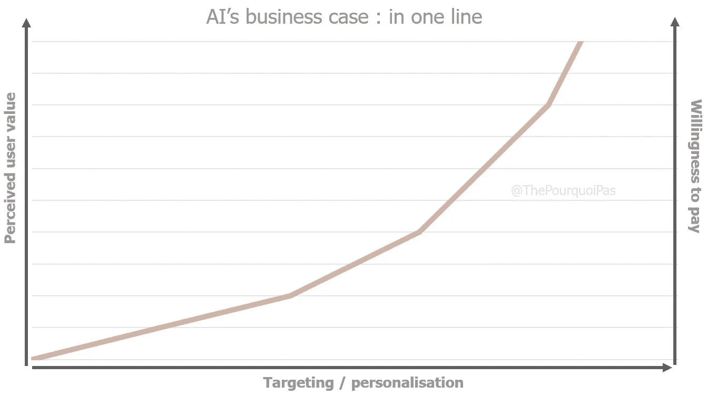

# 媒体行业机器学习完全指南

> 原文：<https://towardsdatascience.com/complete-guide-to-machine-learning-in-the-media-industry-714dc5b9908e?source=collection_archive---------67----------------------->

点击此处查看更多有趣的图表！

在过去的几年里，顾客旅程的日益数字化**和**云技术**和**计算能力的指数级提升**邀请媒体集团重新思考他们做生意的方式。如果听起来我用了很长的词来说“数字颠覆”，请相信你的直觉。许多中断都集中在媒体集团可以访问的大量数据上，以及人工智能(AI)(更具体地说是机器学习)可以用这些数据做什么。事实上，尽管人工智能已经被过多的纯玩家( [Spotify](https://outsideinsight.com/insights/how-ai-helps-spotify-win-in-the-music-streaming-world/) 、[网飞](https://becominghuman.ai/how-netflix-uses-ai-and-machine-learning-a087614630fe)、 [Buzzfeed](https://www.sailthru.com/marketing-blog/washington-post-buzzfeed-business-insider-ai/) 、[迪士尼](https://relate.zendesk.com/articles/ai-is-what-dreams-are-made-of-ask-disney/)……)完全接受，但传统玩家仍然落后，现在他们将这项技术视为实现急需的新增长的捷径。**

**下面是世界各地的老一代卫道士目前正在实施的用例的详细情况。**

# **1.创建流程优化**

## **元数据创建/索引自动化**

**使用机器学习，人工智能既可以翻译数据，也可以使用图像识别来自动创建所有类型内容的元数据(例如，描述一张图像，以便更容易通过谷歌找到)。这使得内部和外部的利益相关者能够更容易地发现内容，允许以更好的标准进行搜索，以获得更精确的结果。自动索引(以及多种数据格式的转换)加快了记者的工作速度，方便了事实的验证，并使人类能够专注于更有附加值的任务。**福克斯**、**纽约时报**、**BBC**……数十家媒体公司已经在其运营中实施了这些解决方案。**

## **文章写作和视频创作的自动化**

**我们也看到了自动化低附加值文章写作工具的出现，从而使记者能够从事需要更多调查和更专业知识的主题。例如，Syllabs 为记者提供自动处理选举结果的机器人:他们的 *Data2Content* 工具在信息到达内政部网站后立即生成文本。《华盛顿邮报》的[*Heliograf*](https://www.washingtonpost.com/pr/wp/2017/09/01/the-washington-post-leverages-heliograf-to-cover-high-school-football/)*从 2016 年开始就在体育方面做的差不多了。其他此类工具通过使用语音识别将音频信息转换为文本，可以大大加快文章写作或视频创作的速度。然后，这些文本被直接“重新编码”到视频中，这使得查找、验证和潜在的修改变得更加容易。***

***请注意，我们讨论的是非常简单的任务:大多数超越事实报告的机器学习测试都失败了([通常很搞笑](https://www.buzzfeed.com/andyneuenschwander/people-are-losing-it-over-this-computers-hilarious-attempt))。***

## ***发现新趋势***

***第一个披露新闻故事的记者得到了所有的荣誉，故事就是这样。因此，最重要的是控制和预测信息流动，同时实时跟踪其传播，以便从竞争对手中脱颖而出。为此，**路透社**新闻机构的 R&D 团队开发了 [*新闻追踪器*](https://blogs.thomsonreuters.com/answerson/making-reuters-news-tracer/) 工具，该工具通过一种算法识别 Twitter 上的重大事件。该工具为这些事件分配了一个“媒体分数”,这使得主要关注最重要的事件成为可能。新闻追踪专家也能够对这些事件的真实性产生信心。***

***这最后一点特别重要，因为它符合媒体对信息可靠性的最高要求。***

## ***事实核查***

***事实上，一些算法也可以帮助记者验证社交网络上发布的图像和视频的可靠性和准确性。 [**ClaimBuster**](https://idir.uta.edu/claimbuster/) 和 [**FactMata**](https://factmata.com/) 为例，是两家利用智能算法打击虚假信息和深度假货的初创企业。这是通过根据终端用户提供的数据为内容分配置信度指数来实现的。***

# ***2.内容的分发、个性化和推荐***

***尽管上述机会确实会对媒体市场产生破坏性影响，但它们只是机器学习为媒体行业提供的机会的一小部分。虽然科幻爱好者热切期待内容创作的自动化，但人工智能的主要影响将通过内容改编和呈现给观众的过程来实现。***

***随着市场产生大量质量和吸引力各不相同的内容**，有效的配对是将这些内容转化为一套适合每个最终消费者或最终消费者群体的价值主张。这种粒度有多种变化方式:*****

## *****它意味着在正确的地方有正确的内容*****

*****以 Buzzfeed 和它的 400 个分销渠道为例。利用人类的智慧将正确的内容放在正确的地方将是耗时的，并且任何优化都是非常不完美的。因此，该公司使用人工智能来告知一篇文章的病毒式传播概率，并在最适合公众的频道上推广它，使公众有最大的欣赏机会。这个概率是产品、社交媒体、工程和数据科学团队共同努力的产物，他们基于高性能内容的历史数据开发了一个机器学习模型。*****

## *****它意味着在正确的时间选择正确的内容*****

*****死人复活了。瑞士杂志 **Le Temps** 使用的机器学习解决方案[**Zombie**](https://www.letemps.ch/societe/projet-zombie-erre-librement) ，能够通过交叉引用其档案与来自 **Chartbeat** (向全球出版商提供数据和分析)和 **Google Analytics** 的数据来识别该杂志的最佳文章。然后，该算法根据定性指标(阅读时间、受众历史、社交网络上引起的参与度和辩论……)分配相关性分数，并建议重新发布和接触新受众的最佳时间。这给了内容第二次生命，随之而来的收入可以直接到达底线。*****

## *****它意味着为合适的人群提供合适的内容*****

*******Business Insider** 的内容比任何人能(或想)阅读或观看的都多。得益于初创企业 [**Sailthru**](https://www.sailthru.com/) 的解决方案，出版商因此根据消费内容的历史(由 cookies 跟踪)创建了简档。根据他们的个人资料，网站和电子邮件都会为读者提供合适的内容。这种对读者细分的投资使得 **Business Insider** 和[的点击率分别提高了 60%和 150%](https://www.sailthru.com/customer/business-insider/) 。此外，返回网站的流量[跃升了 52%](https://www.sailthru.com/customer/business-insider/) 。*****

*******这里最重要的是要注意，这些工具通过提供与现有观点一致的内容，非常有能力进一步分化我们的社会，它们在媒体中的使用不应被轻易接受**。*****

## *****它不能(还)意味着正确的内容适合正确的人*****

*****一种算法可以基于上下文数据和客户旅程做出决策，但几乎无法理解每一个客户的偏好:喜欢和不喜欢很少是稳定的，通常是高度上下文相关的。人类口味的多样性暂时仍困扰着机器。因此，任何个人层面的个性化目前都必须由策展人协助。然而，许多这样的角色只是推迟了看似不可避免的事情:根据路透社 T2 的一项研究，几乎四分之三(72%)的媒体玩家计划积极尝试人工智能，以改善推荐并提高制作效率。*****

# *****3.货币化*****

*****由于货币化是传统媒体生存的最重要杠杆之一，从客户参与到广告空间，许多用例开始在这一领域出现。*****

## *****付费墙*****

*****许多主要出版物都以某种形式使用付费墙(一种限制付费用户访问网站的系统)。它通常以在阅读有限数量的文章后阻止内容的形式出现。在这里，人工智能也提供了一个更具活力、更少胁迫的价值主张。以瑞士报业集团[**Neue zürcher Zeitung**](https://digiday.com/media/swiss-news-publisher-nzz-built-flexible-paywall-using-machine-learning/)为例，该集团使用一种结合了 100 个标准的算法来确定互联网用户最有可能在什么时候触发他的付费参与。一旦发现合适的时机，就会为潜在客户显示个性化的登录页面。三年内转化率乘以 5，结果令人信服。*****

## *****实时竞价*****

*****我们可以想象，当智能算法支持时，实时竞价(RTB)将找到新的维度，特别是在供应商方面:机器学习算法可以优化申请人的选择，管理数据传输的成本，提高绩效的可见性，避免欺诈，甚至检查广告的质量。然而，这样的例子在今天的市场上仍然非常罕见。*****

# *****结论*****

*****A.我将影响媒体价值链的所有部分，帮助内容创作者更具创造性，帮助内容出版商更具生产力，帮助消费者找到符合他们兴趣的内容。*****

*****然而，人工智能只是业务优化战略连续性逻辑的一部分，因此，不应被视为一场革命。这一事实以现在的方式最大限度地减少了实现背后的工作:正如科学家 Peter Skomoroch 去年提到的那样:“*你可以预计你的公司向机器学习的过渡比你向移动设备的过渡要困难大约 100 倍。******

*****[**这个故事**](https://www.thepourquoipas.com/post/complete-guide-to-machine-learning-in-the-media-industry) **本来是为我的博客写的，** [**这个 Pourquoi Pas。过来打个招呼。**](https://www.thepourquoipas.com/)*****