# Python 交叉验证的完整指南及示例

> 原文：<https://towardsdatascience.com/complete-guide-to-pythons-cross-validation-with-examples-a9676b5cac12?source=collection_archive---------2----------------------->

## Sklearn 的 KFold，洗牌，分层，以及它对训练集和测试集中数据的影响。

sklearn 交叉验证的示例和用例，解释了 KFold、洗牌、分层以及训练集和测试集的数据比率。

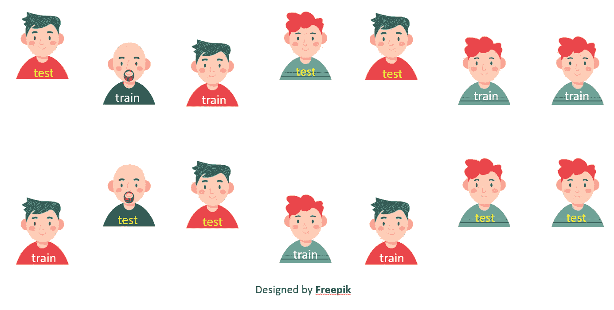

使用两个折叠的源数据的示例性分割，图标由 [Freepik](https://www.freepik.com/free-photos-vectors/people) 提供

交叉验证是机器学习中的一个重要概念，它在两个主要方面帮助了数据科学家:它可以**减少数据的大小**并确保人工智能**模型足够健壮**。交叉验证是以消耗资源为代价的，所以在决定使用它之前，理解它是如何工作的是很重要的。

在本文中，我们将简要回顾交叉验证的好处，然后我将使用流行的 python [Sklearn 库](https://scikit-learn.org/stable/modules/cross_validation.html)中的各种方法向您展示详细的应用。我们将学习:

*   什么是**折叠**、**洗牌折叠**和**分层折叠**，看看它们有什么不同
*   如何使用 **cross_validate** 和 **cross_val_score** 方法在没有 KFold 的情况下交叉验证您的模型
*   其他的分割选项是什么——重复折叠、**离开**和**离开**,以及分组折叠的用例
*   考虑目标和特征分布有多重要

# 好处 1:减少数据量

通常你把数据分成三组。

*   **训练**:用于训练模型，优化模型的超参数
*   **测试**:用于检查优化后的模型对未知数据的作用，测试模型的泛化能力
*   **验证**:在优化过程中，关于测试集的一些信息通过您选择的参数泄露到模型中，因此您对完全未知的数据执行最终检查

在流程中引入交叉验证有助于减少对验证集的需求，因为您可以对相同的数据进行训练和测试。

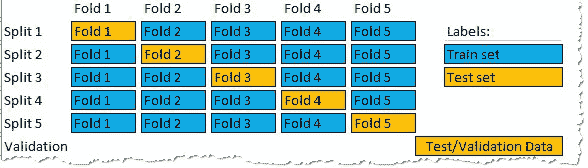

五重交叉验证数据分割示例。

> 在最常见的交叉验证方法中，您使用部分训练集进行测试。这样做几次，以便每个数据点在测试集中出现一次。

# 好处 2:强大的流程

尽管 [sklearn 的 train_test_split 方法](https://scikit-learn.org/stable/modules/generated/sklearn.model_selection.train_test_split.html)使用分层分割，这意味着训练和测试集具有相同的目标变量分布，但您可能会意外地在不反映真实世界的子集上进行训练。

想象一下，你试图通过一个人的身高和体重来预测他是男是女。有人会认为，更高更重的人更愿意是男性；尽管如果你非常不幸，你的训练数据将只包含矮个子男人和高个子亚马逊女人。由于交叉验证，您可以执行多个 train_test 分割，虽然一个折叠可以获得非常好的结果，但另一个折叠可能表现不佳。任何时候一个分割显示出不寻常的结果，就意味着你的数据有异常。

> 如果你的交叉验证分割没有达到相似的分数，你已经错过了一些重要的数据。

# Python 中的交叉验证

你总是可以编写自己的函数来分割数据，但是 [scikit-learn](https://scikit-learn.org/stable/modules/cross_validation.html) 已经包含了 10 种分割数据的方法，这让你可以处理几乎任何问题。

让我们开始编码吧。你可以在 [github](https://github.com/vaasha/Machine-leaning-in-examples/blob/master/sklearn/cross-validation/Cross%20Validation.ipynb) 上下载完整的例子。

首先，让我们创建一个简单的数字范围，从 1，2，3 … 24，25。

```
# create the range 1 to 25
rn = range(1,26)
```

那么我们就启动 sklearn 的 Kfold 方法不洗牌，这是如何拆分数据最简单的选择。我将创建两个 Kfolds，一个将数据分割 3 次，另一个进行 5 次折叠。

```
from sklearn.model_selection import KFoldkf5 = KFold(n_splits=5, shuffle=False)
kf3 = KFold(n_splits=3, shuffle=False)
```

如果我将我的范围传递给 KFold，它将返回两个列表，包含属于训练集和测试集的数据点的索引。

```
# the Kfold function retunrs the indices of the data. Our range goes from 1-25 so the index is 0-24for train_index, test_index in kf3.split(rn):
    print(train_index, test_index)
```

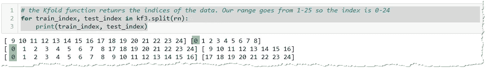

KFold 回报指数

> KFold 返回索引，而不是真正的数据点。

因为 KFold 返回索引，如果你想看到真实的数据，我们必须在 NumPy 数组中使用`np.take`或者在 pandas 中使用`.iloc`。

```
# to get the values from our data, we use np.take() to access a value at particular indexfor train_index, test_index in kf3.split(rn):
    print(np.take(rn,train_index), **np.take**(rn,test_index))
```

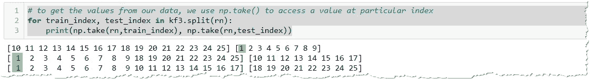

您必须使用 np.take(index)来定位真正的数据点

## KFold 如何拆分数据？

为了更好地理解 KFold 方法是如何划分数据的，让我们用图表来展示它。因为我们已经使用了`shuffled=False`，第一个数据点属于第一个折叠中的测试集，下一个也是。测试和训练数据点排列得很好。

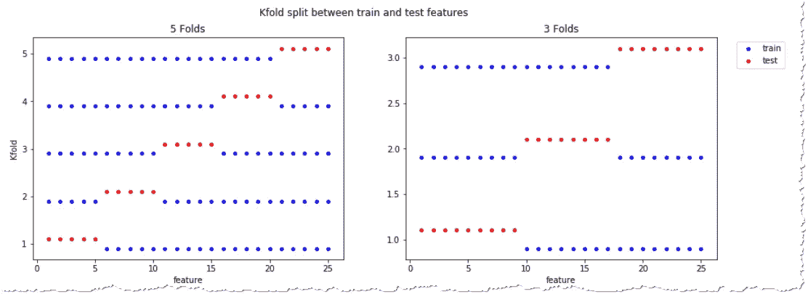

未折叠的 KFold 具有 5 和 3 个折叠，在 [github](https://github.com/vaasha/Machine-leaning-in-examples/blob/master/sklearn/cross-validation/Cross%20Validation.ipynb) 上显示代码

重要的是，折叠的数量会影响测试集的大小。对 33%的数据进行 3 次折叠测试，而对 1/5(相当于 20%的数据)进行 5 次折叠测试。

> 每个数据点在测试集中出现一次，*在训练集中出现 k 次*

## 洗牌折叠

您的数据可能遵循特定的顺序，按出现的顺序选择数据可能会有风险。这可以通过将 KFold 的 shuffle 参数设置为`True`来解决。在这种情况下，KFold 将随机选取将成为训练和测试集一部分的数据点。或者准确地说，不是完全随机的，`random_state`影响每组中出现的点，并且相同的`random_state`总是导致相同的分割。

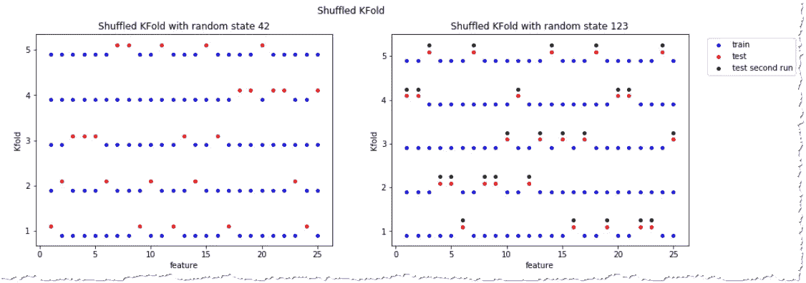

具有不同随机状态的 5 倍混洗分裂

## 使用真实数据集的折叠

在处理实际问题时，很少会有一个小数组作为输入，所以让我们看看使用众所周知的 Iris 数据集的实际例子。


[鸢尾](https://commons.wikimedia.org/wiki/File:Kosaciec_szczecinkowaty_Iris_setosa.jpg)([CC BY _ SA 3.0](https://creativecommons.org/licenses/by-sa/3.0/deed.en))[海滨鸢尾](https://commons.wikimedia.org/wiki/File:Iris_virginica_2.jpg) ( [CC BY_SA 4.0](https://creativecommons.org/licenses/by-sa/4.0/deed.en) )和[杂色鸢尾](https://commons.wikimedia.org/wiki/File:Blue_Flag,_Ottawa.jpg) ( [CC BY_SA 3.0](https://creativecommons.org/licenses/by-sa/3.0/deed.en) )，来源维基百科

> 鸢尾数据集包含 3 种鸢尾花的花瓣和萼片大小的 150 个测量值——50 个[鸢尾、50 个](https://en.wikipedia.org/wiki/Iris_setosa)[海滨鸢尾和 50 个](https://en.wikipedia.org/wiki/Iris_virginica)[杂色鸢尾](https://en.wikipedia.org/wiki/Iris_versicolor)

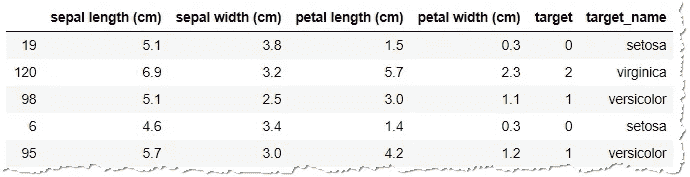

熊猫虹膜数据集样本

## 当 KFold 交叉验证遇到问题时

在 [github](https://github.com/vaasha/Machine-leaning-in-examples/blob/master/sklearn/cross-validation/Cross%20Validation.ipynb) 笔记本中，我只使用一个折叠进行了测试，在训练集和测试集上分别达到了 95%和 100%的准确率。当三重分割的结果正好是 0%的准确度时，我感到很惊讶。你读得很好，我的模型没有选择一朵花是正确的。

```
i = 1
for train_index, test_index in kf3.split(iris_df):
    X_train = iris_df.iloc[train_index].loc[:, features]
    X_test = iris_df.iloc[test_index][features]
    y_train = iris_df.iloc[train_index].loc[:,'target']
    y_test = iris_df.loc[test_index]['target']

    #Train the model
    model.fit(X_train, y_train) #Training the model
    print(f"Accuracy for the fold no. {i} on the test set: {accuracy_score(y_test, model.predict(X_test))}")
    i += 1
```

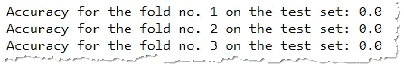

机器学习模型的准确率在每次折叠时为 0%。为什么？

还记得 unshuffled KFold 按顺序挑选数据吗？我们的数据集包含 150 个观察值，前 50 个属于一个物种，51-100 个属于另一个物种，剩下的属于第三个物种。我们的 3 折模型非常不幸，总是选择两个虹膜的尺寸，而测试集只包含模型从未见过的花。

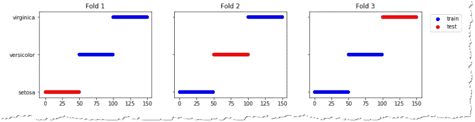

First fold 未能识别测试集中的鸢尾，因为它在 virginica 和 versicolor 上进行了训练，所以从未见过该测试集。

## shuffled KFold 是理想的吗？

为了解决这个问题，我们可以改变`shuffled=True`参数并随机选择样本。但这也遇到了问题。

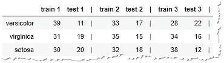

这些组是不均衡的，有时我们在测试很多版本的时候会在很多场景下训练

各组仍然不平衡。在测试不同类型的样本时，您通常会对一种类型的大量样本进行训练。让我们看看我们能做些什么。

## 分层折叠

在许多情况下，在训练集和测试集中保持相同的样本分布是很重要的。这是通过分层折叠来实现的，分层折叠可以再次洗牌或不洗牌。

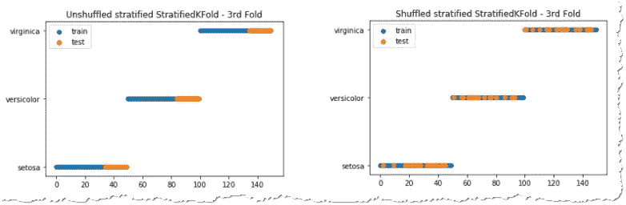

样本在第三次洗牌和未洗牌的 StratfiedKFold 中的分布

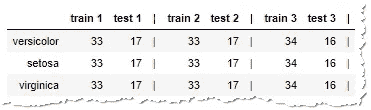

每个折叠中的训练集和测试集的大小—分层平衡分布

你可以看到 KFold 把数据分成了几组，每一组都保持了相应的比率。StratifiedKFold 反映了目标变量的分布，即使某些值在数据集中出现得更频繁。但是，它不评估输入测量值的分布。我们将在最后详细讨论这个问题。

## 我需要每次都拆分我的数据吗？

要享受交叉验证的好处，您不必手动分割数据。Sklearn 提供了两种使用交叉验证的快速评估方法。`cross-val-score`返回模型分数列表，`cross-validate`也报告训练次数。

```
# cross_validate also allows to specify metrics which you want to see
for i, score in enumerate(cross_validate(model, X,y, cv=3)["test_score"]):
    print(f"Accuracy for the fold no. {i} on the test set: {score}")
```

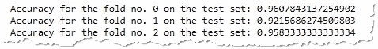

交叉验证函数的结果

## 其他 sklearn 拆分选项

除了上面提到的功能之外，sklearn 还提供了一系列其他方法来帮助您解决特定的需求。

**重复的 Kfold** 将创建多种组合的训练测试分割。

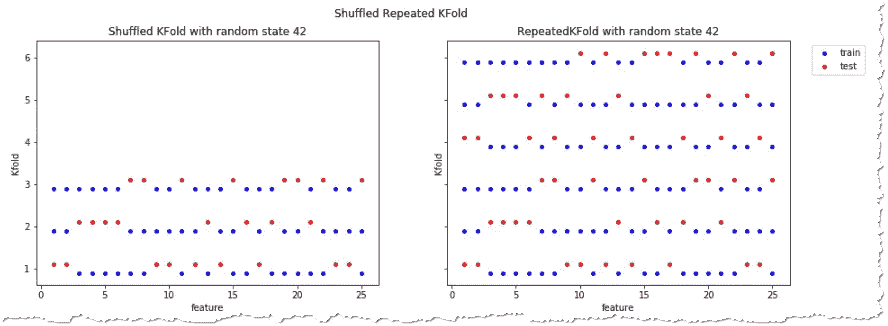

常规折叠和重复折叠的比较

虽然常规的交叉验证可以确保您在测试集中看到每个数据点一次，但是 **ShuffleSplit** 允许您指定在每个折叠中选择多少个特征进行测试。

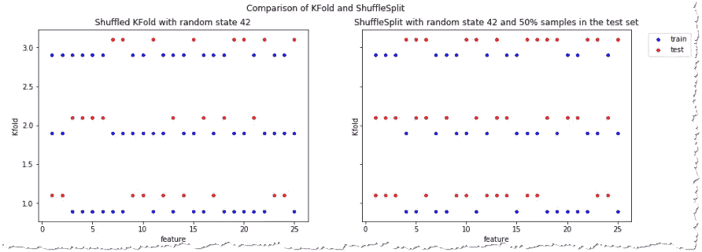

Kfold 将每个数据点放入测试集中一次，而使用 ShuffleSplit，您可以设置%的数据进行测试。这里设置为 50%。

LeaveOneOut 和 LeavePOut 解决了其他特殊情况下的需要。第一种方法总是只在测试集中留下一个样本。

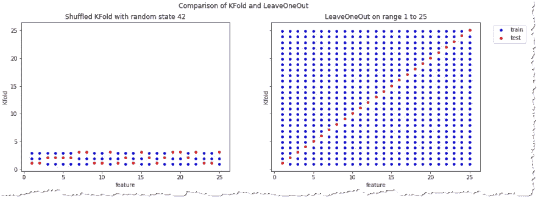

LeaveOneOut 在每个文件夹中只将单个值放入测试集。

> 一般来说，大多数作者和经验证据表明，5 倍或 10 倍交叉验证比 LOO 更可取。— [sklearn 文档](https://scikit-learn.org/stable/modules/cross_validation.html#leave-one-out-loo)

**集团 Kfolds**

当您从同一个主题获取多个数据样本时，GroupKFold 就有了用武之地。例如来自同一个人的不止一次测量。来自同一组的数据很可能表现相似，如果你在一个测量上训练，在另一个上测试，你会得到一个好的分数，但这并不能证明你的模型概括得很好。GroupKFold 确保整个组要么去训练，要么去测试集。在 [sklearn 文档中阅读更多关于组](http://cross-validation-iterators-for-grouped-data)的信息。

## 时序数据

涉及时间序列的问题对数据点的顺序也很敏感。根据现有知识猜测过去通常比预测未来容易得多。因此，在预测较新的数据时，总是向时间序列模型提供较旧的数据是有意义的。Sklearn 的 [TimeSeriesSplit](https://scikit-learn.org/stable/modules/cross_validation.html#time-series-split) 正是这么做的。

# 分层是否考虑输入特征？

还有最后一件事需要强调。你可能认为分层分裂会解决你所有的机器学习问题，但这不是真的。StratifiedKFold 确保在训练集和测试集中保持相同的目标比率。在我们的例子中，每种类型的虹膜有 33%。

为了证明这一点，在一个不平衡的数据集上，我们将看看流行的 [Kaggle 泰坦尼克号竞赛](https://www.kaggle.com/c/titanic)。你的目标是训练一个人工智能模型，预测泰坦尼克号沉没时乘客是死是活。让我们看看 StratiffiedKFold 如何在每个折叠中划分数据集中的幸存者和受害者。

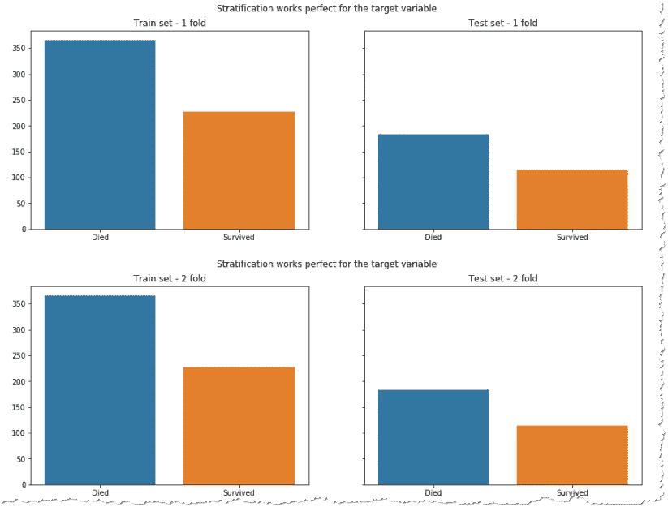

训练集和测试集中的目标变量比率相同

看起来不错，不是吗？但是，您的数据仍可能被不正确地拆分。如果您查看关键特征的分布(我特意选择这种分布来证明我的观点，因为通常只需对数据进行洗牌就可以获得更加平衡的分布)，您会发现您通常会尝试基于不同于测试集的训练数据来预测结果。例如，如果你观察训练集和测试集中的性别分布。

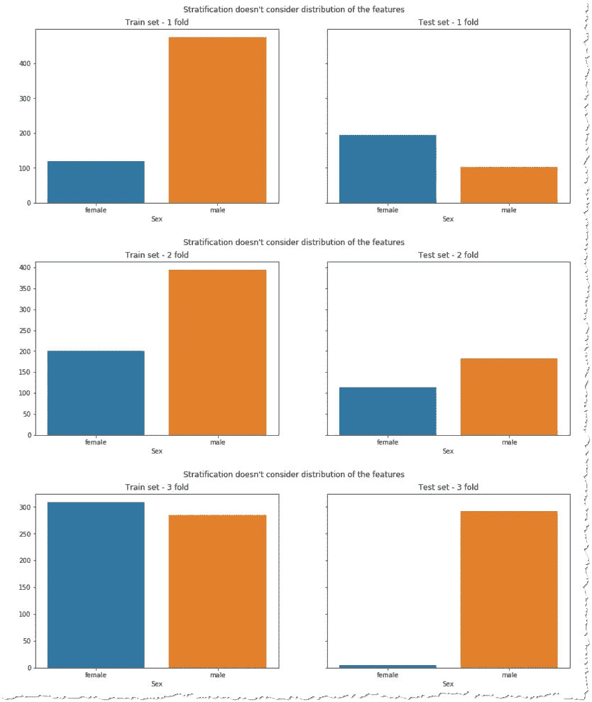

女性更有可能从船上的悲剧中幸存下来。当第一个折叠学习一些雌性并试图预测许多的存活时，第三个折叠做相反的事情。

交叉验证至少有助于你认识到这个问题，以防模型的分数对于每个折叠有显著的不同。想象一下，你是如此不幸，只使用了一个完全符合你的测试数据的分割，但是在现实世界中却灾难性地失败了。

平衡数据是一项非常复杂的任务，这样就可以根据理想分布进行训练和测试。许多人认为这是不必要的，因为模型应该足够好地概括未知数据。

尽管如此，我还是鼓励你考虑一下特性的分布。想象一下，你有一家商店，顾客大多是男性，你试图使用针对女性的营销活动的数据来预测销售额。这对你的店来说不是最好的模式。

**结论**

训练-测试分离是许多机器学习任务中的一个基本概念，但如果你有足够的资源，可以考虑对你的问题应用交叉验证。这不仅有助于你使用更少的数据，而且不同文件夹上不一致的分数表明你已经错过了数据中的一些重要关系。

Sklearn 库包含一堆方法来拆分数据，以适应您的人工智能练习。你可以创建基本的 KFold，打乱数据，或者根据目标变量对它们进行分层。您可以使用额外的方法，或者只使用`cross-validate`或`cross-val-score`测试您的模型，而不需要手动拆分数据。在任何情况下，你的结果分数应该显示一个稳定的模式，因为你不希望你的模型依赖于“幸运”的数据分割来表现良好。

所有数据、图表和 python 处理都总结在 [github](https://github.com/vaasha/Machine-leaning-in-examples/blob/master/sklearn/cross-validation/Cross%20Validation.ipynb) 上的笔记本中。

[](/visualization-with-plotly-express-comprehensive-guide-eb5ee4b50b57) [## 用 Plotly 可视化。快递:综合指南

### 一个数据集和 70 多个图表。交互性和动画通常只需一行代码。

towardsdatascience.com](/visualization-with-plotly-express-comprehensive-guide-eb5ee4b50b57) 

```
# did you like the tutorial, check also* [Pandas alternatives - Vaex, Dash, PySpark and Julia - and when to use them](/is-something-better-than-pandas-when-the-dataset-fits-the-memory-7e8e983c4fe5)
* [Persist pandas in other formats than CSV](/stop-persisting-pandas-data-frames-in-csvs-f369a6440af5)
* [Read CSV in Julia, an alternative to python](/read-csv-to-data-frame-in-julia-programming-lang-77f3d0081c14)
* [How to turn list of addresses or regions into a map](/pythons-geocoding-convert-a-list-of-addresses-into-a-map-f522ef513fd6)
* [Various application of anomaly detection](https://medium.com/@vdekanovsky/machine-learning-saving-machines-cbb715de70b7)
* [How to deal with extra whitespaces in CSV using Pandas](/dealing-with-extra-white-spaces-while-reading-csv-in-pandas-67b0c2b71e6a)
```