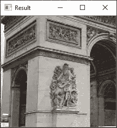

# OpenCV 中的完整图像增强

> 原文：<https://towardsdatascience.com/complete-image-augmentation-in-opencv-31a6b02694f5?source=collection_archive---------10----------------------->

## 这是一篇详尽的文章，通过使用 Python 中的 OpenCV 的自定义数据生成器，涵盖了所有的图像增强功能。


[斯蒂夫·约翰森](https://unsplash.com/@steve_j?utm_source=medium&utm_medium=referral)在 [Unsplash](https://unsplash.com?utm_source=medium&utm_medium=referral) 上拍照

答几天前，我在写一篇关于使用不同色彩空间作为 CNN 输入的文章[，为此，我不得不使用一个定制的数据生成器。这意味着我不能使用 Tensorflow 的内置图像数据生成器进行图像放大。我在网上搜索并找到了一些文章，但找不到任何全面涵盖这个主题的内容，所以我决定写一篇。](/different-colorspaces-as-inputs-to-cnns-406ae62d1bd6?source=friends_link&sk=92a03aaf5c423b0c61558b87febfdb3d)

# 目录

*   水平移动
*   垂直移位
*   聪明
*   一款云视频会议软件
*   频道转换
*   水平翻转
*   垂直翻转
*   旋转
*   填充模式

如果你想知道这些是如何工作的，你可以看看这篇文章。为了形象化，我将使用下面的凯旋门图片。


测试图像

# 水平移动

水平移动或平移是根据定义最大移动量的比率向左或向右移动图像。默认情况下，Keras 使用一种叫做“最近”的填充模式来将图像的尺寸调整回原始尺寸。


填充模式“最近”的结果

我觉得这会使那部分图像变得无用，因此我会简单地将它们调整到原来的大小。因此，要做到这一点，我们需要生成一个随机数，然后使用索引向左或向右移动图像。

```
import cv2
import randomimg = cv2.imread('arc_de_triomphe.jpg')def fill(img, h, w):
    img = cv2.resize(img, (h, w), cv2.INTER_CUBIC)
    return img

def horizontal_shift(img, ratio=0.0):
    if ratio > 1 or ratio < 0:
        print('Value should be less than 1 and greater than 0')
        return img
    ratio = random.uniform(-ratio, ratio)
    h, w = img.shape[:2]
    to_shift = w*ratio
    if ratio > 0:
        img = img[:, :int(w-to_shift), :]
    if ratio < 0:
        img = img[:, int(-1*to_shift):, :]
    img = fill(img, h, w)
    return imgimg = horizontal_shift(img, 0.7)
cv2.imshow('Result', img)
cv2.waitKey(0)
cv2.destroyAllWindows()
```


水平移动

# 垂直移位

在我们知道如何实现水平移动之后，实现垂直移动就相当容易了。

```
import cv2
import randomimg = cv2.imread('arc_de_triomphe.jpg')def fill(img, h, w):
    img = cv2.resize(img, (h, w), cv2.INTER_CUBIC)
    return imgdef vertical_shift(img, ratio=0.0):
    if ratio > 1 or ratio < 0:
        print('Value should be less than 1 and greater than 0')
        return img
    ratio = random.uniform(-ratio, ratio)
    h, w = img.shape[:2]
    to_shift = h*ratio
    if ratio > 0:
        img = img[:int(h-to_shift), :, :]
    if ratio < 0:
        img = img[int(-1*to_shift):, :, :]
    img = fill(img, h, w)
    return imgimg = vertical_shift(img, 0.7)
cv2.imshow('Result', img)
cv2.waitKey(0)
cv2.destroyAllWindows()
```


垂直移位

# 聪明

这很容易，因为我已经写了一篇关于创建不同的图像过滤器漫画，夏天，冬天等，它已经包括亮度功能。

[](https://medium.com/dataseries/designing-image-filters-using-opencv-like-abode-photoshop-express-part-1-8765e3f4495b) [## 使用 OpenCV 设计图像滤镜(第 1 部分)

### 我们都编辑过我们的图像，也许是为了改善白平衡，增加温暖，使用不同的滤镜，甚至…

medium.com](https://medium.com/dataseries/designing-image-filters-using-opencv-like-abode-photoshop-express-part-1-8765e3f4495b) 

我们利用 HSV 色彩空间来完成这项任务。饱和度和值矩阵的值越多，亮度就越大。因此，要增加亮度，请将它们乘以一个大于 1 的值，要降低亮度，请乘以一个小于 1 的值。在 Tensorflow 中，指定了一个范围，并在其中选择了一个随机值，所以这就是我们如何创建它。

```
import cv2
import random
import numpy as npimg = cv2.imread('arc_de_triomphe.jpg')def brightness(img, low, high):
    value = random.uniform(low, high)
    hsv = cv2.cvtColor(img, cv2.COLOR_BGR2HSV)
    hsv = np.array(hsv, dtype = np.float64)
    hsv[:,:,1] = hsv[:,:,1]*value
    hsv[:,:,1][hsv[:,:,1]>255]  = 255
    hsv[:,:,2] = hsv[:,:,2]*value 
    hsv[:,:,2][hsv[:,:,2]>255]  = 255
    hsv = np.array(hsv, dtype = np.uint8)
    img = cv2.cvtColor(hsv, cv2.COLOR_HSV2BGR)
    return imgimg = brightness(img, 0.5, 3)
cv2.imshow('Result', img)
cv2.waitKey(0)
cv2.destroyAllWindows()
```


聪明

# 一款云视频会议软件

在 Tensorflow 中，缩放函数采用一个范围，并在该范围之间使用随机值。如果这些值小于 1，它会放大图像，如果值大于 1，它会缩小图像并“最近”填充图像。然而，当我们调整图像的尺寸时，我们只取小于 1 的值。例如:值为 0.6 意味着取整个图像的 60%，然后我们将把它调整回原始大小。

```
import cv2
import randomimg = cv2.imread('arc_de_triomphe.jpg')def fill(img, h, w):
    img = cv2.resize(img, (h, w), cv2.INTER_CUBIC)
    return imgdef zoom(img, value):
    if value > 1 or value < 0:
        print('Value for zoom should be less than 1 and greater than 0')
        return img
    value = random.uniform(value, 1)
    h, w = img.shape[:2]
    h_taken = int(value*h)
    w_taken = int(value*w)
    h_start = random.randint(0, h-h_taken)
    w_start = random.randint(0, w-w_taken)
    img = img[h_start:h_start+h_taken, w_start:w_start+w_taken, :]
    img = fill(img, h, w)
    return imgimg = zoom(img, 0.5)
cv2.imshow('Result', img)
cv2.waitKey(0)
cv2.destroyAllWindows()
```



一款云视频会议软件

# 频道转换

在通道偏移中，随机数量的值被添加到从指定范围中选择的图像的所有通道中。它的结果有点像亮度函数。

```
import cv2
import random
import numpy as npimg = cv2.imread('arc_de_triomphe.jpg')def channel_shift(img, value):
    value = int(random.uniform(-value, value))
    img = img + value
    img[:,:,:][img[:,:,:]>255]  = 255
    img[:,:,:][img[:,:,:]<0]  = 0
    img = img.astype(np.uint8)
    return imgimg = channel_shift(img, 60)
cv2.imshow('Result', img)
cv2.waitKey(0)
cv2.destroyAllWindows()
```


频道转换

# 水平翻转

我认为这不需要任何解释。它采用一个布尔变量来定义是否要执行水平翻转。OpenCV `cv2.flip`中有一个内置函数就是用来执行这个操作的。

```
import cv2img = cv2.imread('arc_de_triomphe.jpg')
def horizontal_flip(img, flag):
    if flag:
        return cv2.flip(img, 1)
    else:
        return imgimg = horizontal_flip(img, True)
cv2.imshow('Result', img)
cv2.waitKey(0)
cv2.destroyAllWindows()
```


水平翻转

# 垂直翻转

像水平翻转一样，使用`cv2.flip`来执行，但是它的第二个参数应该是 0。

```
import cv2img = cv2.imread('arc_de_triomphe.jpg')
def vertical_flip(img, flag):
    if flag:
        return cv2.flip(img, 0)
    else:
        return imgimg = vertical_flip(img, True)
cv2.imshow('Result', img)
cv2.waitKey(0)
cv2.destroyAllWindows()
```


垂直翻转

# 旋转

要在 OpenCV 中执行旋转，我们需要创建一个旋转矩阵，然后对其应用仿射变换。

```
import cv2img = cv2.imread('arc_de_triomphe.jpg')
def rotation(img, angle):
    angle = int(random.uniform(-angle, angle))
    h, w = img.shape[:2]
    M = cv2.getRotationMatrix2D((int(w/2), int(h/2)), angle, 1)
    img = cv2.warpAffine(img, M, (w, h))
    return imgimg = rotation(img, 30)    
cv2.imshow('Result', img)
cv2.waitKey(0)
cv2.destroyAllWindows()
```


旋转

# 填充模式

上面我提到了“最近的”填充模式，我说过我不会使用它，而是调整图像的大小。我决定向你展示如何在 OpenCV 中创建填充模式，因为我试图创建一个完整的列表，所以如果你想执行一个，你不会有任何问题。来自 Tensorflow 的[文档](https://www.tensorflow.org/api_docs/python/tf/keras/preprocessing/image/ImageDataGenerator):

> `**fill_mode**`:为{“常数”、“最近”、“反射”或“换行”之一。默认值为“最近”。根据给定模式填充输入边界外的点:
> 
> ' constant ':kkkkkkkkk | ABCD | kkkkkkkk(cval = k)
> 
> ' nearest ':aaaaaaaa | ABCD | dddddddd
> 
> ' reflect ':abcddcba | ABCD | dcbaabcd
> 
> ' wrap': abcdabcd|abcd|abcdabcd

我会让它们水平移动。`cv2.copyMakeBorder`可用于灌装。它接受图像、顶部、底部、左侧、右侧和模式等参数。上、下、左、右是边框的大小。

```
import cv2
from matplotlib import pyplot as pltimg = cv2.imread('arc_de_triomphe.jpg')
img = cv2.cvtColor(img, cv2.COLOR_BGR2RGB)def fill_mode(img, left, right):
    nearest = cv2.copyMakeBorder(img, 0, 0, left, right, cv2.BORDER_REPLICATE)
    reflect = cv2.copyMakeBorder(img, 0, 0, left, right, cv2.BORDER_REFLECT)
    wrap = cv2.copyMakeBorder(img, 0, 0, left, right, cv2.BORDER_WRAP)
    constant= cv2.copyMakeBorder(img, 0, 0, left, right, cv2.BORDER_CONSTANT,value=(255, 0, 0))

    plt.subplot(221),plt.imshow(nearest,'gray'),plt.title('NEAREST'),plt.axis('off')
    plt.subplot(222),plt.imshow(reflect,'gray'),plt.title('REFLECT'),plt.axis('off')
    plt.subplot(223),plt.imshow(wrap,'gray'),plt.title('WRAP'),plt.axis('off')
    plt.subplot(224),plt.imshow(constant,'gray'),plt.title('CONSTANT'),plt.axis('off')def horizontal_shift_mode(img, ratio):
    if ratio > 1 or ratio < 0:
        print('Value for horizontal shift should be less than 1 and greater than 0')
        return img
    ratio = random.uniform(-ratio, ratio)
    h, w = img.shape[:2]
    to_shift = int(w*ratio)
    if ratio > 0:
        img = img[:, :w-to_shift, :]
        fill_mode(img, to_shift, 0)
    if ratio < 0:
        img = img[:, -1*to_shift:, :]
        fill_mode(img, 0, -1*to_shift)horizontal_shift_mode(img, 0.8)
```


填充模式

这就是这篇文章的全部内容。如果你想知道如何创建一个自定义的数据生成器，那么你可以看看我下面的文章。

[](/different-colorspaces-as-inputs-to-cnns-406ae62d1bd6) [## 不同的色彩空间作为 CNN 的输入

### 找出通过自定义数据生成器在 CNN 中使用不同的色彩空间是否会导致更好的结果…

towardsdatascience.com](/different-colorspaces-as-inputs-to-cnns-406ae62d1bd6) 

## 编辑

莱昂纳多·米兰达让我注意到了两个很棒的图像增强库，分别叫做 [imagaug](https://github.com/aleju/imgaug) 和[albuminations](https://github.com/albumentations-team/albumentations)。它们可用于 pip 和 conda 安装。它们提供了从基础到非常高级的大量图像增强。我发现关于它们最好的部分是甚至对于分割和边界框也有增强。我鼓励每个人去看看他们的自述，他们太棒了。