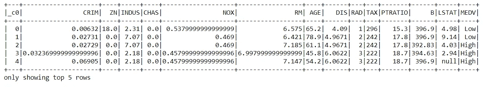
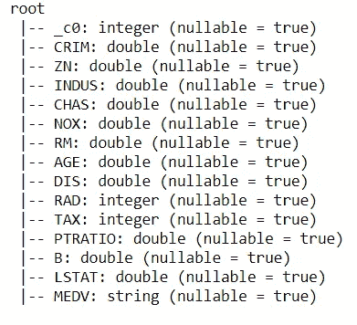
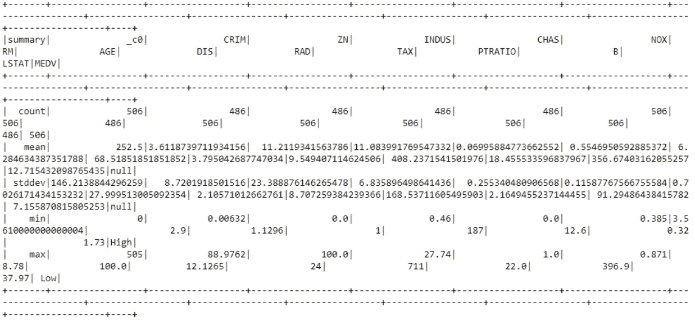
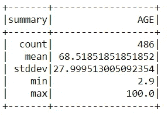
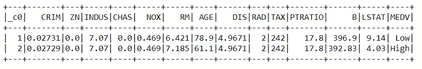
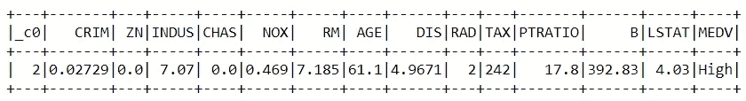
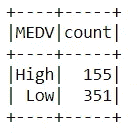
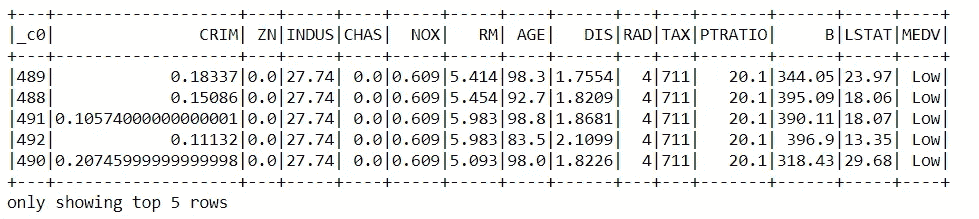
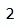
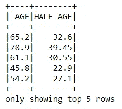

# PySpark 完整介绍-第 2 部分

> 原文：<https://towardsdatascience.com/complete-introduction-to-pyspark-part-2-135d2f2c13e2?source=collection_archive---------39----------------------->

## 使用 PySpark 进行探索性数据分析


马库斯·斯皮斯克在 [Unsplash](https://unsplash.com?utm_source=medium&utm_medium=referral) 上的照片

# 探索性数据分析

探索性数据分析是最关键的部分，无论我们何时处理数据集，都要从它开始。它允许我们分析数据，并让我们探索数据的初始发现，如有多少行和列，不同的列是什么，等等。EDA 是一种方法，在这种方法中，我们使用不同的方法主要是可视化来总结数据的主要特征。

让我们使用 PySpark 启动 EDA，在此之前，如果您还没有安装 PySpark，请访问下面的链接并在您的本地机器上配置它。

[](https://medium.com/python-in-plain-english/complete-introduction-to-pyspark-part-1-7d16d7c62cc9) [## PySpark 完整介绍

### 第 1 部分:从头开始在 Windows 上安装 PySpark

medium.com](https://medium.com/python-in-plain-english/complete-introduction-to-pyspark-part-1-7d16d7c62cc9) 

# 导入所需的库和数据集

一旦我们在机器上配置了 PySpark，我们就可以使用 Jupyter Notebook 开始探索它。在本文中，我们将使用 PySpark 执行 EDA 操作，为此我们将使用可以从 Kaggle 下载的波士顿数据集。让我们从导入所需的库和加载数据集开始。

```
#importing Required Libraries
import findspark
findspark.init()import pyspark # only run after findspark.init()
from pyspark.sql import SparkSession
from pyspark.sql import SQLContext#Creating a pyspark session
spark = SparkSession.builder.getOrCreate()#Importing Dataset
df = spark.read.csv('Boston.csv', inferSchema=True, header=True)
df.show(5)
```



波士顿数据集(来源:作者)

# 启动 EDA

pyspark 定义了不同的函数，我们可以使用它们进行探索性的数据分析，让我们探索其中的一些函数，看看它们有多有用。

1.  **Schema** Schema 类似熊猫 dataframe 的 Info()函数。它向我们显示了数据集中所有列的信息。

```
df.printSchema()
```



模式(来源:作者)

**2。**Describe
Describe 函数用于显示数据集中所有列的统计属性。它向我们展示了平均值、中间值等数值。对于所有的列。在 PySpark 中，每次我们需要显示信息时，我们都需要调用 show()函数，它的工作方式就像 python 的 head()函数一样。

```
df.describe().show()
```



统计属性(来源:作者)

类似地，我们也可以按列使用 describe 函数。

```
df.describe('AGE').show()
```



按列描述(来源:作者)

**3。filter** filter 函数用于使用不同的自定义条件过滤数据。让我们看看如何相应地使用它。

```
#Filtering data with Indus=7.07
df.filter(df.INDUS==7.07).show()
```



过滤器 1(来源:作者)

类似地，我们可以在一行代码中使用多个过滤器。

```
df.filter((df.INDUS==7.07) & (df.MEDV=='High')).show()
```



过滤器 2(来源:作者)

**4。分组和排序** PySpark 内置函数可以根据用户需求对数据进行分组，也可以根据需要对数据进行排序。

```
df.groupBy('MEDV').count().show()
```



GroupBy(来源:作者)

```
df.sort((df.TAX).desc()).show(5)
```



排序(来源:作者)

**5。select&Distinct** select 函数用于选择不同的列，Distinct 函数可用于选择该列的不同值。

```
df.select('MEDV').distinct().count()
```



选择和区分(来源:作者)

**6。with column
T5【with column】函数用于通过为新列提供一定的条件并定义新列的名称来创建新列。**

```
#Creating New column with values from Age column divided by 2
df.withColumn('HALF_AGE', df.AGE/2.0). select('AGE','HALF_AGE') .show(5)
```



WithColumn(来源:作者)

在本文中，我们介绍了 PySpark 下定义的一些主要函数，我们可以使用这些函数进行探索性的数据分析，并理解我们正在处理的数据。

继续，用不同的数据集尝试这些函数，如果您遇到任何问题，请在响应部分告诉我。

# 在你走之前

***感谢*** *的阅读！如果您想与我取得联系，请随时通过 hmix13@gmail.com 或我的* [***LinkedIn 个人资料***](http://www.linkedin.com/in/himanshusharmads) *联系我。可以查看我的*[***Github***](https://github.com/hmix13)**简介针对不同的数据科学项目和包教程。还有，随意探索* [***我的简介***](https://medium.com/@hmix13) *，阅读我写过的与数据科学相关的不同文章。**