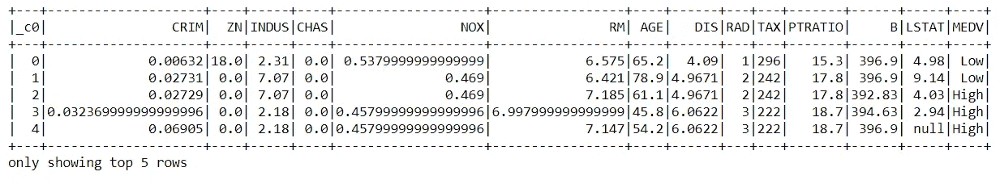
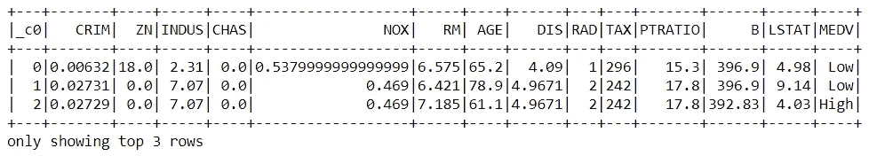
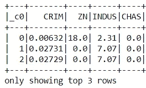
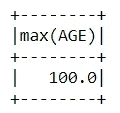
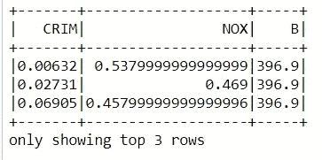
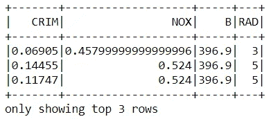
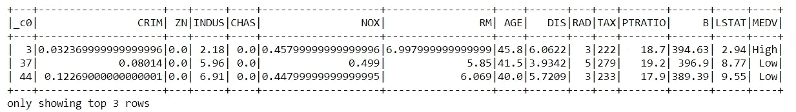

# PySpark 完整介绍-第 3 部分

> 原文：<https://towardsdatascience.com/complete-introduction-to-pyspark-part-3-9c06e2c5e13d?source=collection_archive---------57----------------------->

## 使用 PySpark 对数据集执行 SQL 操作


弗兰基·查马基在 [Unsplash](https://unsplash.com?utm_source=medium&utm_medium=referral) 上拍摄的照片

# 什么是 SQL(结构化查询语言)？

SQL 是一种用于对数据执行不同操作的语言，如存储、操作和检索。它在关系数据库上工作，在关系数据库中数据以行和列的形式存储。

根据属性，SQL 命令可以分为三种类型:

1.  **DDL(数据定义语言)**

顾名思义，DDL 命令用于定义数据。DDL 中包含的命令有创建、插入、截断、删除等。

**2。DML(数据操作语言)**

数据操作命令用于根据用户要求改变和更新数据。DDL 下定义的一些命令是 ALTER、UPDATE、DELETE 等。

**3。数据控制语言**

在这种情况下，定义的命令用于控制对定义的数据库的访问。其中定义的一些命令有 GRANT、REVOKE 等。

# 将 PySpark 用于 SQL 操作

为了使用 PySpark 执行 SQL 操作，我们需要在本地机器上安装 PySpark。如果你已经安装了它，我们就可以开始了，或者通过下面的链接来安装 PySpark，并使用 PySpark 在 DataFrame 上执行一些基本操作。

[](https://medium.com/python-in-plain-english/complete-introduction-to-pyspark-part-1-7d16d7c62cc9) [## PySpark 完整介绍

### 第 1 部分:从头开始在 Windows 上安装 PySpark

medium.com](https://medium.com/python-in-plain-english/complete-introduction-to-pyspark-part-1-7d16d7c62cc9) [](/complete-introduction-to-pyspark-part-2-135d2f2c13e2) [## PySpark 完整介绍-第 2 部分

### 使用 PySpark 进行探索性数据分析

towardsdatascience.com](/complete-introduction-to-pyspark-part-2-135d2f2c13e2) 

# 加载所需的库

在我们的机器上安装了 pyspark 并对其进行配置之后，我们将打开一个 jupyter 笔记本来启动 SQL 操作。我们将从导入所需的库和创建 PySpark 会话开始。

```
import findspark
findspark.init()import pyspark # only run after findspark.init()
from pyspark.sql import SparkSession
from pyspark.sql import SQLContext
spark = SparkSession.builder.getOrCreate()
```

# 加载数据集

为了执行 SQL 操作，我们需要一个数据集。在本文中，我们将使用波士顿数据集，它可以使用 Kaggle 轻松下载，并将使用 PySpark 加载它。

```
df = spark.read.csv('Boston.csv', inferSchema=True, header=True)
df.show(5)
```



数据集(来源:作者)

现在，让我们开始对数据集执行 SQL 操作，我们将首先创建一个表和一个 SQLContext 对象，它将用于在该表上运行查询。

## **1。正在创建表格**

为了创建一个表，我们需要使用 PySpark 的 register 函数。类似地，我们还将创建一个 SQLContext 对象，用于在表上运行查询。

```
df.registerTempTable('BostonTable')
sqlContext = SQLContext(spark)
```

## 2.选择查询

选择查询用于根据用户需求选择数据。我们可以使用“*”选择整个表，或者我们可以传递用“，”分隔的列的名称，这是我们想要看到的。

```
#Select Whole Table(only three records because we used show(3))
sqlContext.sql('select * from BostonTable').show(3)
```



选择表格(来源:作者)

```
#Select column using column names
sqlContext.sql('select _c0, CRIM, ZN, INDUS, CHAS from BostonTable').show(3)
```



选择列(来源:按作者)

## 3.聚合函数

SQL 中定义了一些预定义的聚合函数，可用于根据用户需求选择数据。这些功能是:

a.min()
b . max()
c . count()
d . sum()
e . var()
等。

下面给出了下列函数的语法。

```
#Using max functions
sqlContext.sql('select max(AGE) from BostonTable').show()
```



max 函数(来源:作者)

同样，我们可以根据用户需求使用其他函数来显示输出。

## 4.条件查询

通过使用条件查询，我们可以生成符合用户传递的特定条件的输出。使用最多的条件表达式是“where”。

```
sqlContext.sql('select CRIM, NOX, B from BostonTable where B = 396.9').show(3)
```



条件数据(来源:作者)

我们可以在条件查询中使用不同的支持函数，这有助于更具体地了解输出，并有助于在单个查询中运行多个条件。这些功能是:

a.具有
b .和
c .或
d .然后
e .(用于范围)
等。

```
sqlContext.sql('select CRIM, NOX, B, RAD from BostonTable where RAD > 2 and B = 396.9').show(3)
```



条件表达式(来源:作者)

类似地，我们可以使用上面给出的相同语法来使用不同的函数。

## 5.嵌套查询

我们可以在同一行代码中运行多个查询，这通常称为嵌套查询。这是一种复杂的查询形式，我们根据用户需求传递不同的条件来生成输出。下面给出了一个嵌套查询的例子。

```
sqlContext.sql('select * from BostonTable where AGE between 40 and 50 and TAX not in (311,307)').show(3)
```



嵌套查询(来源:作者)

同样，您可以根据需要的输出尝试不同的嵌套查询。

本文为您提供了关于使用 PySpark 进行 SQL 查询的基本信息。继续尝试这些，如果你遇到任何困难，请在回复部分告诉我。

# 在你走之前

***感谢*** *阅读！如果你想与我取得联系，请随时在 hmix13@gmail.com 上联系我或我的* [***LinkedIn 个人资料***](http://www.linkedin.com/in/himanshusharmads) *。可以查看我的*[***Github***](https://github.com/hmix13)**简介针对不同的数据科学项目和包教程。还有，随意探索* [***我的简介***](https://medium.com/@hmix13) *阅读我写过的与数据科学相关的不同文章。**