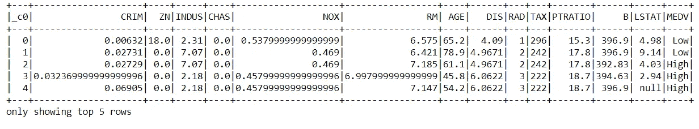
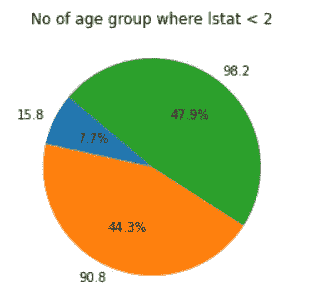
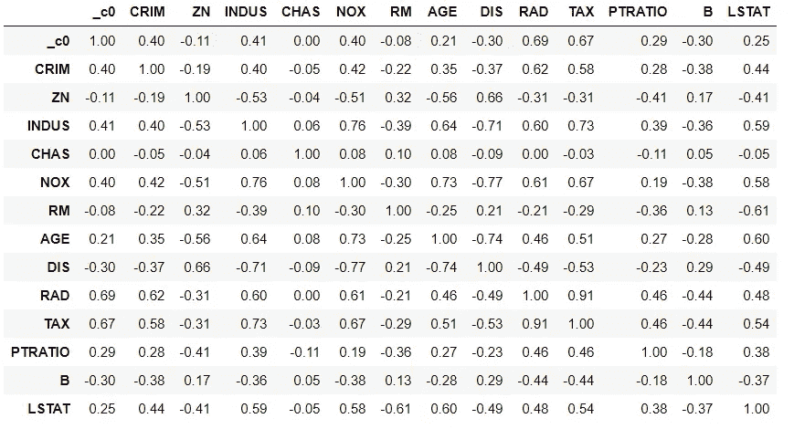
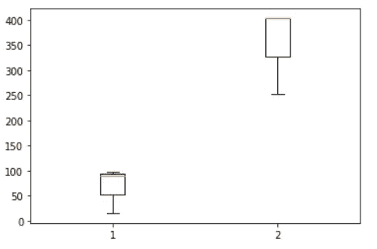
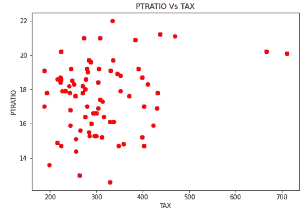
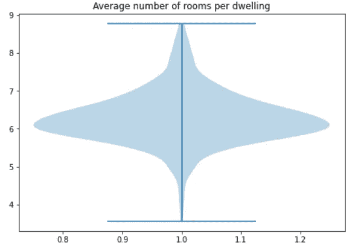
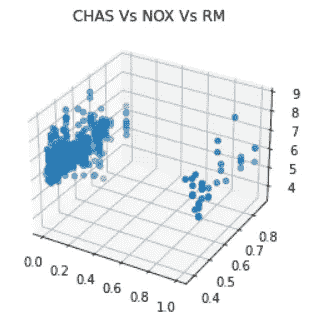

# PySpark 完整介绍-第 4 部分

> 原文：<https://towardsdatascience.com/complete-introduction-to-pyspark-part-4-62a99ce3552a?source=collection_archive---------14----------------------->

## 使用 PySpark 执行数据可视化


威廉·艾文在 [Unsplash](https://unsplash.com?utm_source=medium&utm_medium=referral) 上的照片

# 数据可视化

数据可视化在数据分析中起着重要的作用，因为只要人眼看到一些图表或图形，他们就会试图在该图形中找到模式。

数据可视化是使用不同的图/图形/图表直观地表示数据，以找出模式、异常值以及数据集不同属性之间的关系。它是数据的图形表示。

# 使用 PySpark 实现数据可视化

我们可以使用 PySpark 执行数据可视化，但在此之前，我们需要在本地机器上设置它。为了在您的本地机器上安装 PySpark 并对 PySpark 的工作原理有一个基本的了解，您可以浏览下面的文章。

[](https://medium.com/python-in-plain-english/complete-introduction-to-pyspark-part-1-7d16d7c62cc9) [## PySpark 完整介绍

### 第 1 部分:从头开始在 Windows 上安装 PySpark

medium.com](https://medium.com/python-in-plain-english/complete-introduction-to-pyspark-part-1-7d16d7c62cc9) [](/complete-introduction-to-pyspark-part-2-135d2f2c13e2) [## PySpark 完整介绍-第 2 部分

### 使用 PySpark 进行探索性数据分析

towardsdatascience.com](/complete-introduction-to-pyspark-part-2-135d2f2c13e2) 

安装 PySpark 之后，让我们从打开 jupyter 笔记本并加载所需的库开始。

# 加载所需的库

我们将从加载所有需要的库和创建 PySpark 会话开始。

```
import findspark
findspark.init()import pyspark # only run after findspark.init()
from pyspark.sql import SparkSession
from pyspark.sql import SQLContextimport seaborn as sns
import matplotlib.pyplot as pltspark = SparkSession.builder.getOrCreate()
```

# 加载数据集

在本文中，我们将使用 PySpark 执行数据可视化，为此我们将使用波士顿数据集，该数据集可从 Kaggle 下载。让我们加载数据并开始可视化。

```
df = spark.read.csv('Boston.csv', inferSchema=True, header=True)
df.show(5)
```



数据集(来源:作者)

## 创建饼图

在创建可视化之前，我们需要使用 SQL 创建一个数据集的表，以便了解更多关于使用 PySpark 的 SQL 操作。

使用 SQL 创建一个表，并运行所需的查询来相应地生成一个饼图。

```
#Creating Table
df.registerTempTable('BostonTable')
sqlContext = SQLContext(spark)#Running Query
df1 = sqlContext.sql("SELECT * from BostonTable").toPandas()
df2 = sqlContext.sql("SELECT AGE, TAX from BostonTable where LSTAT < 2").toPandas()#Creating Visualization
fig = plt.pie(df2['AGE'], autopct='%1.1f%%', startangle=140,labels=df2['AGE'])
plt.title('No of age group where lstat < 2')
plt.show()
```



饼状图(来源:作者)

类似地，我们可以对不同的输出运行不同的查询，因此我们可以改变饼图的可视化。

## 相关矩阵

相关矩阵用于分析和可视化数据集不同列之间的关系。让我们看看如何使用 PySpark 创建一个相关矩阵。

```
df1.corr().style.background_gradient(cmap='coolwarm').set_precision(2)
```



相关性(来源:作者)

类似地，我们可以创建不同类型的可视化，如盒状图、小提琴图、条形图等。下面给出了这些图的一些例子。

```
#box plot
plt.boxplot(df2)
plt.show()
```



方框图(来源:作者)

```
#Scatter Plot
df3 = sqlContext.sql("SELECT PTRATIO, TAX from BostonTable").toPandas()
fig=plt.figure()
ax=fig.add_axes([0,0,1,1])
ax.scatter(df3['TAX'],df3['PTRATIO'], color='r')
ax.set_xlabel('TAX')
ax.set_ylabel('PTRATIO')
ax.set_title('scatter plot')
plt.title('PTRATIO Vs TAX')
plt.show()
```



散布(来源:作者)

```
#Violoin Plot
df5 = sqlContext.sql("SELECT RM from BostonTable").toPandas()
fig = plt.figure()
ax = fig.add_axes([0,0,1,1])
bp = ax.violinplot(df5['RM'])
plt.title('Average number of rooms per dwelling')
plt.show()
```



小提琴情节(来源:作者)

```
#3d Scatter Plot
df6 = sqlContext.sql("SELECT CHAS, NOX, RM from BostonTable").toPandas()
fig = plt.figure()
ax = plt.axes(projection='3d')
ax.scatter(df6['CHAS'], df6['NOX'], df6['RM'])
ax.set_title('CHAS Vs NOX Vs RM')
plt.show()
```



3D 绘图(来源:作者)

本文为您提供了关于使用 PySpark 进行数据可视化的基本信息。继续尝试这些，如果你遇到任何困难，请在回复部分告诉我。

# 在你走之前

***感谢*** *的阅读！如果你想与我取得联系，请随时通过 hmix13@gmail.com 联系我或我的* [***LinkedIn 个人资料***](http://www.linkedin.com/in/himanshusharmads) *。可以查看我的*[***Github***](https://github.com/hmix13)**简介针对不同的数据科学项目和包教程。还有，随意探索* [***我的简介***](https://medium.com/@hmix13) *，阅读我写过的与数据科学相关的不同文章。**