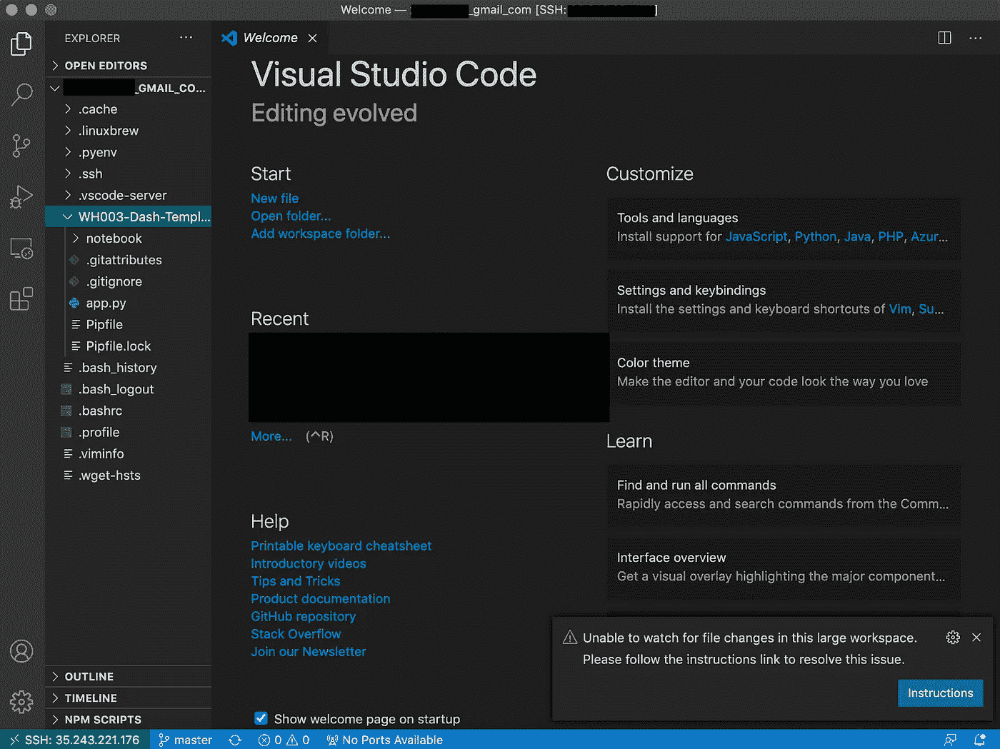

# 使用 Github 完成将您的 SDE 连接到 GCP 的演练

> 原文：<https://towardsdatascience.com/complete-walkthrough-to-connect-your-sde-to-gcp-with-github-bc39eec0db9e?source=collection_archive---------38----------------------->

## 使用云实例增强您的工作流程！


伊恩·巴塔格利亚在 [Unsplash](https://unsplash.com/s/photos/server?utm_source=unsplash&utm_medium=referral&utm_content=creditCopyText) 上拍摄的照片

在数据科学家的日常工作中，当处理不断增长的数据集和更复杂的模型架构时，处理和计算是一个持续关注的问题。然而，我没有考虑到这样一个事实，即您获得了预算来更新具有更好的内存、CPU 和 GPU 的最新硬件。数据科学家似乎不可避免地会寻找这些问题的解决方案。一个比升级硬件更便宜的解决方案是通过云虚拟机。

虚拟机是云服务，允许根据需要对计算能力类型进行定制配置。简单来说，它是一台云电脑，当你需要更多的计算能力和内存来完成重型任务时，你可以升级它。然而，通常 VMs 不像我们的本地操作系统那样提供易用性，如果你想在 Linux 系统中走自己的路，还有一点学习曲线。因此，本教程将提供一个解决方案，将您的虚拟机连接到您的本地 SDE，如 VSCode，同时设置 Github 到您的虚拟机，以允许可视化管理。事不宜迟，我们开始吧！

# 步骤 1:在云上设置一个实例(GCP)

在本教程中，我将使用的云服务是谷歌云平台(GCP)，我很喜欢它的免费信用。

1.  在 [GCP](https://cloud.google.com/) 获得一个账号，登录控制台。
2.  启用[计算引擎 API](https://console.cloud.google.com/marketplace/product/google/compute.googleapis.com?q=search&referrer=search&project=logical-flame-291721) ，默认应该是启用的。
3.  在控制台中导航到**计算引擎**，并单击虚拟机实例下的创建。


计算引擎(图片由作者提供)

4.选择**实例名称**、**区域、**和**机器配置**。也可以在侧边栏中查看您的选择的价格。我选择最便宜的，因为我只想演示它是如何工作的。


5.为实例设置启动盘。我使用的是 ubuntu 16.04 LTS，但你可以选择各种可用的公共图像。对于防火墙，启用 HTTP/HTTPS 流量。


# 步骤 2:从 VSCode 连接虚拟机

这一步有两个关键部分:创建一个 SSH 密钥文件，并使用 VSCode 中的远程 SSH 扩展将您连接到 VM。为此，我们需要使用本[指南](https://cloud.google.com/compute/docs/instances/connecting-advanced#thirdpartytools)中概述的第三方连接方法。我还将介绍用 VSCode 设置它的过程。

**1。安装 gcloud**

要安装 gcloud，可以在终端上使用以下命令。或者参考[官方指南](https://cloud.google.com/sdk/docs/install)。

**2。使用 gcloud 认证登录**

设置完成后，在 VSCode 中使用新的终端窗口登录

```
gcloud auth login
```

它将引导您进入登录页面。登录并允许 SDK 访问，您可能会在终端中看到登录消息。如果显示项目信息缺失，用`gcloud config set project <Project_ID>`配置项目 id。项目 id 可以在您的控制台中找到。


红框中的项目 ID

**3。在 gcloud 中启用操作系统登录**

要启用操作系统登录，基本上就是在项目或您正在使用的 VM 实例中添加元数据。查看此[页面](https://cloud.google.com/compute/docs/instances/managing-instance-access#enable_oslogin)了解更多信息。但是由于我们已经用终端登录，使用下面的命令来快速设置。

```
gcloud compute project-info add-metadata --metadata enable-oslogin=TRUE
```

**4。在终端中创建一个 SSH 密钥对**

有许多方法可以生成密钥对。对于 Mac/Linux，在终端中使用以下命令:

```
ssh-keygen -t rsa
```

您将看到如下所示的内容。密码是可选的。


**5。通过 gcloud** 将 SSH 密钥对添加到用户帐户

现在我们已经生成了 SSH 密钥对，我们需要[将密钥添加到用户帐户](https://cloud.google.com/compute/docs/instances/managing-instance-access#add_oslogin_keys)。在您的终端中使用以下命令和 gcloud:

```
gcloud compute os-login ssh-keys add \
    --key-file <key-file-path> \
    --ttl <expire-time>
```

`<key-file-path>`是你的公钥文件以`.pub`结尾。

`<expire-time>`可能是以下任何一种。确保在它之前有数字，例如`10d`的过期时间设置为 10 天。

*   `s`为秒
*   `m`持续分钟
*   `h`数小时
*   `d`一连几天
*   将值设置为`0`表示没有到期时间。

该命令的输出将类似于以下内容。这里的关键信息是你的用户名。将它保存在记事本中的某个地方，稍后您将使用它进行连接。


**6。使用密钥对**连接到主机

在从 VSCode 直接连接到您的实例之前，建议在终端中使用`ssh`命令测试连接。

```
ssh -i <PATH_TO_PRIVATE_KEY> <USERNAME>@<EXTERNAL_IP>
```

*   `<PATH_TO_PRIVATE_KEY>`:我们已经在前面的步骤中生成了这个文件，文件路径看起来像`/user/.ssh/id_rsa`
*   `<USERNAME>`:这是我们在输出中获得的用户名。
*   `<EXTERNAL_IP>`:在控制台找到这个信息。


一旦连接成功，您将看到 VM 终端如下所示:


此时，我们可以继续连接 VSCode。使用`exit`离开远程机器。

**7。使用远程 SSH 连接虚拟机**

Remote-SSH 是 VSCode 的一个扩展，用于使用 VSCode 连接到远程机器。您可以很容易地在扩展标签中搜索和安装它。


远程 SSH

单击窗口左下角的绿色图标(或按 F1 键并搜索 Remote-ssh)。选择**连接到主机。**


并且**添加一个新的 SSH 主机**


现在粘贴用于测试连接的确切的`ssh`命令，然后按回车键。


VSCode 将打开一个远程连接的新窗口。您将 VSCode 连接到 GCP 实例。


连接到虚拟机的虚拟代码

# 步骤 3:设置与 Github 的 SSH 连接

现在你已经在 VSCode 中支持了 VM，我们可以开始在 Github 中的一些项目上工作了。为了将工作流与 Github 无缝集成，我们可以设置一个到 Github 的 SSH 连接来启用所有 git 命令。Github 正在提供一个全面的[指南](https://docs.github.com/en/free-pro-team@latest/github/authenticating-to-github/connecting-to-github-with-ssh)关于如何设置它。但是，我仍然会在本教程中介绍这个过程。

正如我们之前提到的，我们还需要一个 Github 密钥对。在 VSCode 中打开一个新的终端，使用如下命令生成一个 SSH 密钥对。但是用你在 Github 注册的邮件来代替。

```
ssh-keygen -t id_rsa -C "*your_email@example.com*"
```

现在我们有了一个`ssh`密钥文件，我们需要将它添加到 SSH-Agent 中。要在后台启动它，请使用以下命令:

```
eval "$(ssh-agent -s)"
>> Agent pid 59566
```

现在将私钥添加到代理中:

```
ssh-add ~/.ssh/id_rsa
```

我们还需要在 GitHub 中添加密钥。用你的账号登录 [Github](https://github.com/) ，在设置下找到 **S *SH 键和【GPG】T7 键。点击 ***新建 SSH 密钥*** 如快照所示。***


在终端中，找到公钥文件并复制它。

```
vi ~/.ssh/id_rsa.pub
```

现在粘贴并创建 SSH 密钥。


测试终端中的 GitHub 连接。粘贴以下命令:

```
ssh -T git@github.com
```

第一次连接会看到这样的东西。继续设置就好了。

```
> The authenticity of host 'github.com (IP ADDRESS)' can't be established.
> RSA key fingerprint is SHA256:xxxxx.
> Are you sure you want to continue connecting (yes/no)?
```

现在你已经有了一个与 Github 的 SSH 连接。使用`git clone`你在 Github 中的 repo 到 VM。使用`code .`，你将有一个新的工作空间为你的回购开放。


现在你有了完全相同的体验，就好像你在本地计算机上工作一样！



# 对您的实例有用的资源

这里有一些有用的资源，可以安装到用 VSCode 安装的 Linux 实例中

*   [自制](https://stackoverflow.com/questions/33353618/can-i-use-homebrew-on-ubuntu)
*   [Pyenv](https://www.liquidweb.com/kb/how-to-install-pyenv-on-ubuntu-18-04/)
*   [Github CLI](https://cli.github.com/)

感谢您的关注！享受🥳