# Python NumPy 中数组生成函数全集

> 原文：<https://towardsdatascience.com/complete-works-of-array-generating-functions-in-python-numpy-67c7eb244fdf?source=collection_archive---------34----------------------->


[_Alicja_](https://pixabay.com/users/_Alicja_-5975425/) 在 [Pixabay](https://pixabay.com/photos/counting-education-toy-wooden-3116201/) 上的照片

## 从等差数列到几何数列及定制生成函数

如果你用过 Python，我相信你一定用过 NumPy 库，所以我想我不必介绍这个库。

因为 NumPy 就是这样一个为数值和维度数组计算而创建的库，所以它的一个典型使用场景就是根据定义的规则生成维度数组。

在本文中，我将介绍 NumPy 中所有优秀的内置函数，让我们可以按照一定的规则生成 n 维数组。请注意，随机数组可以是一个单独的主题，因此它们不会包含在本文中。我确信您一定知道我将在后面的章节中介绍的一些甚至大部分功能，但是强烈建议您浏览一下这篇文章。我敢肯定，你可能会发现一些你不知道的功能，但可能非常有用。

# NumPy 为什么这么快？


照片由[神果](https://pixabay.com/users/jingoba-24598/)在 [Pixabay](https://pixabay.com/photos/road-speed-highway-moving-street-259815/) 上拍摄

在介绍函数之前，我想提一下 NumPy 为什么这么快。简单的回答是，因为它不是 Python。

你可能会惊讶为什么 NumPy 不是 Python。事实上，NumPy 是用 C 编程语言实现的，在大多数情况下，它在性能方面胜过 Python。所以，我们写 Python 代码用 NumPy，但是引擎盖下是 c。

我们可以做一个简单的实验来比较性能。假设`[1,2,3]`这样的“list”是一个纯 Python 对象，我们可以用 list 和 NumPy 数组做同样的事情来比较运行时间。

当然，我们需要在一切之前导入 NumPy 库。

```
import numpy as np
```

然后，让我们生成一个包含 100 万个整数的 Python 列表，然后计算列表中每个数字的平方。

```
ls = list(range(1000000))
ls_square = [i**2 for i in ls]
```

同样，让我们使用 NumPy 做同样的事情。

```
arr = np.arange(1000000)
arr_square = arr ** 2
```

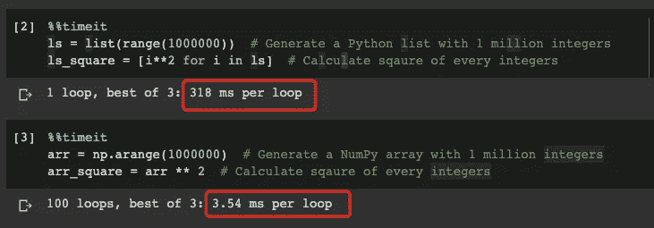

可以看出 NumPy 比 Python 列表快了差不多 100 倍。这也是为什么大多数其他用于数据分析(如 SciPy、Pandas)、机器学习(如 Sci-kit Learn)和数据可视化(如 Matplotlib)的库通常依赖于 NumPy。

# 在范围内生成数组


由 [SparrowsHome](https://pixabay.com/users/SparrowsHome-4168069/) 在 [Pixabay](https://pixabay.com/photos/dominoes-colorful-patterns-4020617/) 上拍摄的照片

让我们开始生成一定范围内的 NumPy 数组。

## np.arange()

第一个，当然是`np.arange()`，我相信你可能已经知道了。

要生成一个数组，从一个数字开始，以一定的步长在一个数字处停止，我们可以很容易地做到如下。请注意不包括停车号码。

```
np.arange(start=1, stop=10, step=1)
```

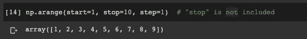

有时，如果我们希望数组从零开始，我们不需要指定起始数，因为它默认为零。此外，默认步长为 1。所以，如果我们想生成一个数组，从 0 开始，在 10 处停止(需要指定)，步长等于 1，下面的代码就可以了。

```
np.arange(10)
```

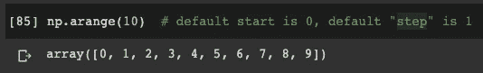

大概值得一提的是，step 也可以是 float 类型。这是与 Python 内置函数`range()`的比较，因为后者不支持浮点数作为步长。

```
np.arange(start=1, stop=5, step=0.5)
```

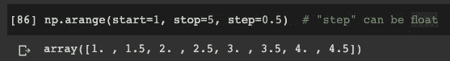

尽管可能不常用，但步长也可以是负数。因此，数组将按降序排列，其中起始数大于终止数。

```
np.arange(start=10, stop=1, step=-2)
```

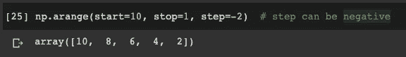

如果要生成某种类型的数组，可以显式指定。

```
arr = np.arange(10, dtype=float)
```

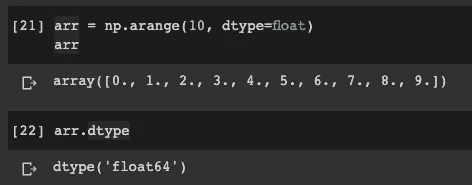

## np.linspace()

这个功能比`np.arange()`更强大一点。它的名字“linspace”代表“线性空间”。因此，它用于生成数字具有线性关系的数组。

主要区别在于`linspace()`不依赖于步长。相反，我们需要指定在起始号码和终止号码之间有多少个号码。

```
np.linspace(start=1, stop=10, num=10)
```

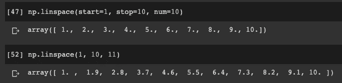

在上面的两个例子中，开始和结束数字是相同的，但是生成的数组是不同的，因为我们要求第二个数组多一个数字。因此，该函数生成一个严格意义上的算术序列数组。

您可能还会注意到，这一次停止编号是包含性的，但是我们可以显式地将其排除。

```
np.linspace(1, 10, 11, endpoint=False)
```

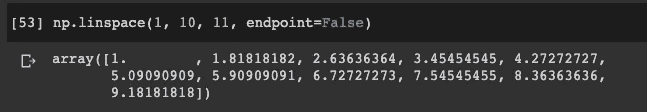

我们还可以显式地指定数组所需的数据类型。然而，在将整数指定为数据类型时要小心，因为数字将被**floor**而不是 **rounded** 。

```
np.linspace(1, 10, 11, dtype=int)
```

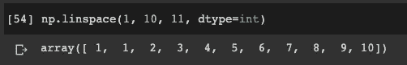

## np.logspace()

你可能会好奇，我们有“线性空间”，但还有其他的“空间”吗？是的，我们也有“日志空间”，它不是线性的。我相信这个函数并不为大多数开发者所知，但它是一种非常优雅的生成几何序列数组的方式。

```
np.logspace(start=1, stop=10, num=4, base=2)
```

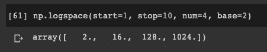

看这个例子，同样，我们有起始号和终止号。第三个参数“num”是我们希望数组中有多少个数字。最后一个参数“base”是我们想要的基数。

事实上，该函数生成了以下 4 个数字:


它们也是严格的几何序列，如下所示:

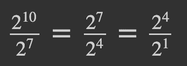

需要提到的是，默认情况下“基数”是 10。因此，如果我们希望“基数”等于 10，我们不需要明确指定它。

```
np.logspace(1, 5, 3)
```

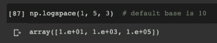

# 生成具有特定值和形状的数组


由 [saulhm](https://pixabay.com/users/saulhm-31267/) 在 [Pixabay](https://pixabay.com/photos/measure-measures-rule-metro-106354/) 上拍摄的照片

因为 NumPy 在计算多维数组(矩阵)方面很强大，所以我们也需要生成多维数组。

## 全 0 或全 1 生成

很常见的情况是，我们需要生成一个所有值都为零的特定维数的数组。例如，图像以 1024 * 768 * 3 的阵列表示，其中轴 3 表示 RGB 通道。如果我们想过滤只有一个颜色通道的图像，我们需要其他两个通道的值都为零。在这样的用例中，`np.zeros()`函数非常有用。

如果我们想生成一个 2(行)乘 3(列)的 2D 数组，下面的代码就可以了。

```
np.zeros((2,3))
```

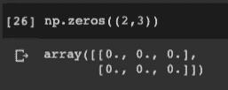

不仅仅是 0，我们也可以生成 1 的数组。

```
np.ones((2,3))
```

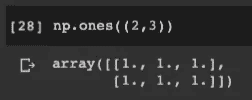

需要注意的是，我们使用`np.zeros()`和`np.ones()`生成的数组是浮点型的，从点`0\. (float)`可以看出它不是`0 (int)`。如果我们需要它们是 int，这有时不太方便。幸运的是，我们可以显式地指定数据类型。

```
np.zeros((2,3), dtype=int)
```

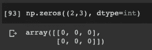

## 用定制的数字生成

如果我们既不想要 0 也不想要 1，而是想要其他数字呢？在这样的场景中，我们可以使用`np.full()`。例如，如果我们想要生成一个具有特定维度的数组，并且它的所有值都应该是 255，只需执行以下操作。

```
np.full((2,3), 255)
```

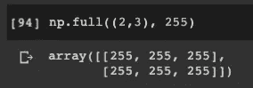

另外值得一提的是`np.full()`不仅可以用来生成数值数组，还可以生成字符串等其他数据类型。

```
np.full((2,3), 'abc')
```

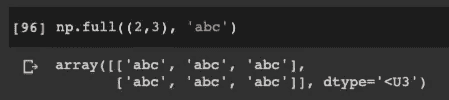

## 基于其他数组生成

为了方便起见，NumPy 还允许我们从其他数组生成数组。也就是说，复制另一个数组的形状及其数据类型。

例如，让我们显式地创建一个样本数组。

```
sample_arr = np.array([
    [1,2,3],
    [4,5,6]
])
```

该示例数组的维数为 2 * 3，数据类型为整数。

如果我们想要生成一个具有相同维度和数据类型的数组，但是值都是零，我们可以使用`np.zeros_like()`。

```
np.zeros_like(sample_arr)
```

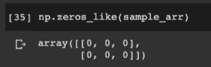

同样，我们也可以生成所有的 1。

```
np.ones_like(sample_arr)
```

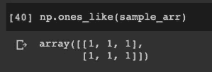

和定制号码。

```
np.full_like(sample_arr, 255)
```

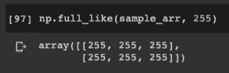

当然，如果你愿意，你可以使用`np.zeros()`来实现同样的事情，但是不要忘记，默认情况下它会创建一个 float 类型的数组。所以我们需要明确指定我们想要整数。

```
np.zeros_like(sample_arr)# is equivalent to np.zeros(sample_arr.shape, dtype=sample_arr.dtype)
```

如果我们不知道样本数组的类型呢？例如，这是在另一个函数的循环中。然后，我们不得不在那些情况下使用`np.zero_like()`。

# 生成单位矩阵和对角矩阵


图片由 [YouComMedia](https://pixabay.com/users/YouComMedia-907282/) 在 [Pixabay](https://pixabay.com/photos/strawberries-fruit-diagonal-berry-706650/) 上拍摄

在某些场景下，我们还需要生成一些特殊的数组，比如单位矩阵和对角矩阵。

为了生成单位矩阵，我们使用`np.eye()`，只需指定矩阵所需的行数/列数。

```
np.eye(5)
```

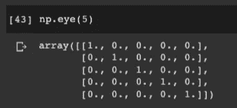

当我们想生成对角矩阵时，可以使用`np.diag()`。我们需要传入一个值应该在对角线上的列表。

```
np.diag([1,2,3,4,5])
```

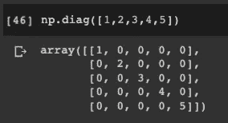

# 从定制功能生成


照片由[在](https://pixabay.com/users/Free-Photos-242387/) [Pixabay](https://pixabay.com/photos/tools-workshop-equipment-690038/) 上的免费照片拍摄

最后但并非最不重要的，我想介绍如何生成一个自定义函数的多维数组。

函数`np.fromfunction()`有两个必需的参数:

*   用户定义的函数，接受一个元组，该元组包含所有维度轴的索引
*   数组的维数

让我们看一个例子。假设我们想生成一个 6 乘 5 的矩阵。每个数字的行号为十位，列号为一位。我们可以把这个函数定义如下。

```
def gen(row, col):
    return (row+1)*10 + (col+1)
```

然后，我们可以将函数传入`np.fromfunction()`来生成我们想要的数组。

```
A = np.fromfunction(gen, (6,5))
```

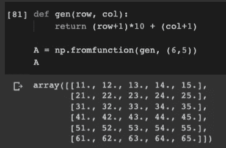

# 摘要


照片由 [stevepb](https://pixabay.com/users/stevepb-282134/) 在 [Pixabay](https://pixabay.com/photos/calculator-calculation-insurance-385506/) 上拍摄

在这篇文章中，我已经介绍了为什么 NumPy 是首选，为什么它这么快。然后，我们重点讨论了如何使用 NumPy 生成多维数组。我相信这些都是你需要知道的函数，以便于你在 Python 中进行数据分析、数据挖掘、机器学习和数据可视化工作。希望有帮助。

本文使用的所有代码都可以在我的 Google Colab 笔记本中找到。

 [## 主 Numpy 数组生成

### 所有多维数组生成函数

colab.research.google.com](https://colab.research.google.com/drive/1Eo-m4kKQLR8ymdtaQHOBwKkwdygY9Qkp?usp=sharing) 

人生苦短，用 Python！

[](https://medium.com/@qiuyujx/membership) [## 通过我的推荐链接加入 Medium 克里斯托弗·陶

### 作为一个媒体会员，你的会员费的一部分会给你阅读的作家，你可以完全接触到每一个故事…

medium.com](https://medium.com/@qiuyujx/membership) 

如果你觉得我的文章有帮助，请考虑加入 Medium 会员来支持我和成千上万的其他作者！(点击上面的链接)