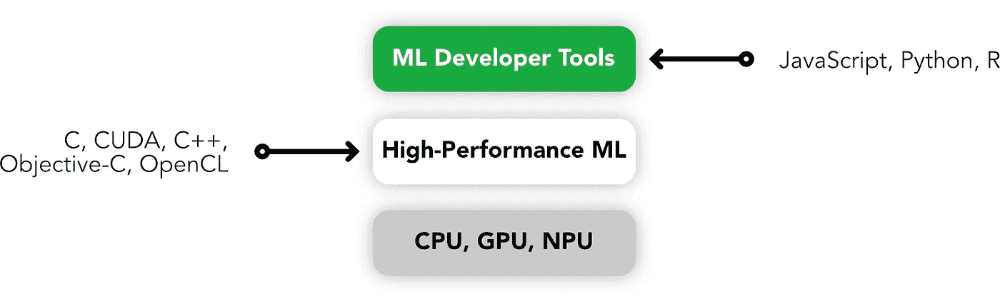
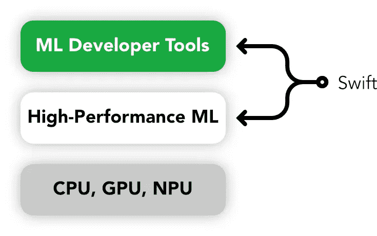
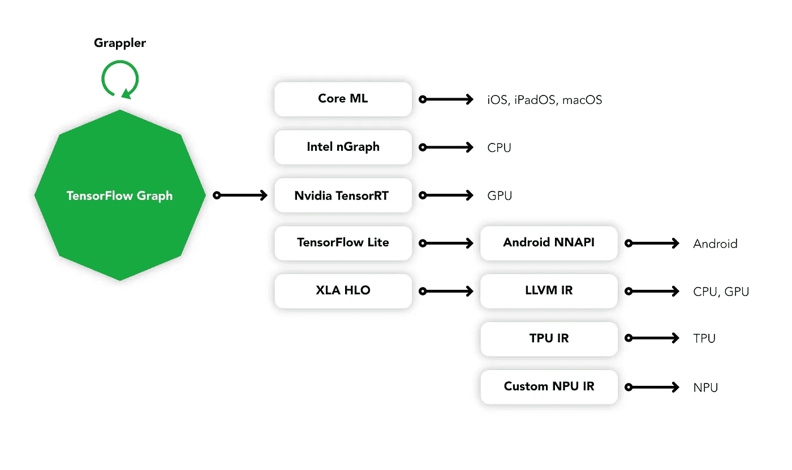
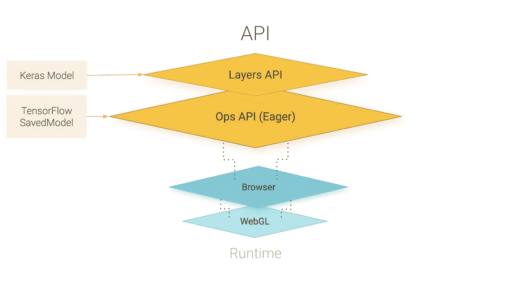
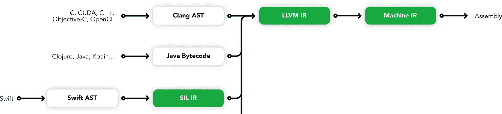
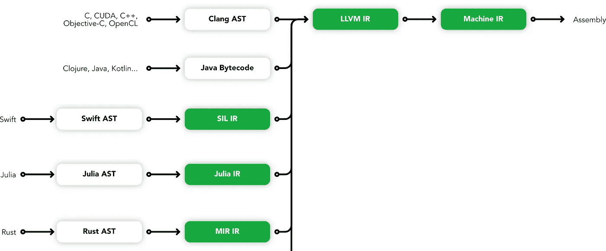
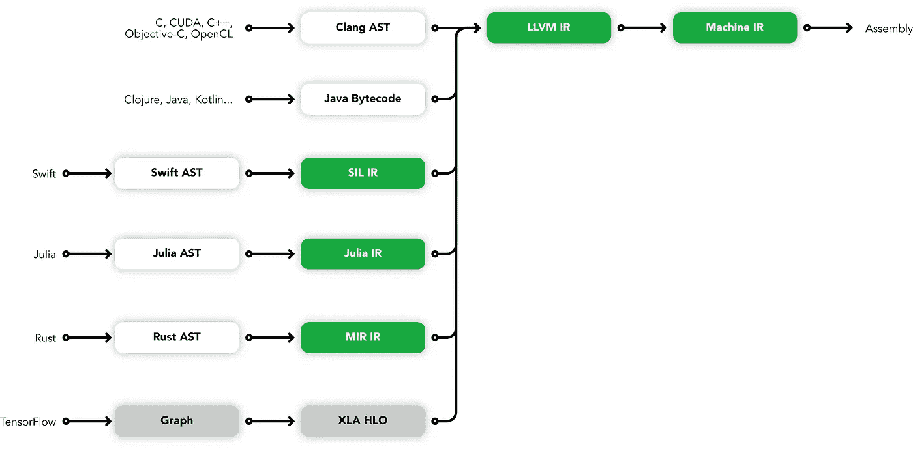

# 人工智能的复杂网络

> 原文：<https://towardsdatascience.com/complex-web-of-ai-b6dd86156722?source=collection_archive---------25----------------------->

作为之前关于 [Swift for TensorFlow (S4TF)](https://medium.com/@siilime/swift-for-tensorflow-820a651e4b14) 和[the hardware powering modern AI](/the-strong-arm-of-mobile-ml-5d44713072f4)的起源的文章的后续，本文是专注于机器学习和网络的两篇文章的第一部分。第二部分将关注作为数据平台的 Web，本文将关注人工智能的新兴工具，以及 Web 将如何成为以一种前所未有的方式连接智能的一流平台


# 介绍

虽然人工智能工具在网络上的发展并不是最近的事情，但我们将在 2019 年 9 月开始，在日本福冈的一家酒店举办一场研讨会，作为[万维网联盟技术全体会议/咨询委员会(W3C TPAC)](https://www.w3.org/2019/09/TPAC/) 会议的一部分。在这次会议上，一群行业专家对新兴技术有着独特的观点，这些技术有可能将 Web 和 AI 结合在一起，为智能解决方案创建一个无与伦比的开发平台。

在这次会议中，坐着微软 Edge 团队的一名成员，在他右边坐着苹果 Safari 开发团队的一名成员，然后是来自英特尔的一名工程师(也是 Web / WebNN W3C group 的[机器学习的创始人)，以及来自谷歌的两个人，包括](https://webmachinelearning.github.io) [TensorFlow.js](https://www.tensorflow.org/js) 的一名主要专家。

里面的对话涵盖了广泛的主题，包括 [WebAssembly](https://webassembly.org) 、硬件设计和编译工具链，还包括几个关于相关技术的演示，这些技术将不可避免地有助于*面向 Web 的机器学习*规范。

许多材料之前已经共享过，是主要浏览器供应商和更广泛的领域专家社区之间日益丰富的数据共享的一部分，它显示了网络作为一流人工智能平台的发展正在进行的承诺。

# 找到与开发者的和谐

支撑这场运动的技术并不完全集中在网络上，也不应该完全集中在网络上。至关重要的是，在创建一套跨平台的通用且无处不在的机器学习工具的过程中，经验和发展也是非常重要的，这使得 Web 易于开发。

同样，TensorFlow 针对特定介质有多种排列( [TensorFlow](https://www.tensorflow.org) 、 [TensorFlow Lite](https://www.tensorflow.org/lite) 、 [TensorFlow.js](https://www.tensorflow.org/js) 等)。)高级机器学习工具通常需要在缩小到特定问题领域之前呈现更广泛的需求视图，在方法上具有兼容性和通用性，以简化开发人员的入口点。考虑典型的编程范例，如函数式编程(FP)或面向对象编程(OOP):这两种编程范例都在各种语言中使用，以确保易于被开发人员采用，并有一套熟悉的解决问题的方法。



简化低级到高级 ML 工具分离

这种机器学习方法的简化对于向所有开发者开放可访问性是必不可少的。由于苹果( [Core ML](https://developer.apple.com/documentation/coreml) 和谷歌( [ML Kit)](https://developers.google.com/ml-kit/) 的专有工具，移动工具变得更加丰富，这两个工具都支持使用 Python 编写的解决方案，以及像 TensorFlow 这样的机器学习库，可以毫不费力地移植到分别用 [Swift](https://swift.org) 和 [Kotlin](https://kotlinlang.org) 编写的产品上。

2017 年 4 月，谷歌的 DeepMind 团队一直在开发 TensorFlow 的高级抽象，[宣布了这个名为 Sonnet 的项目的开源，旨在让其他开发者更容易从通用开发模型中受益，同时仍然使用 TensorFlow 生态系统中固有的高度调整和强大的功能。](https://sonnet.dev)

当然，这些开发人员工具中的大多数仍然是基于 Python 的，但 Python 几乎不是编写机器学习模型的最佳工具。它缺乏静态类型、对定制操作的支持、一流的并发性，并且不能很好地扩展:它本质上仍然是一种解释型的单 CPU 语言，这对于仍然大量使用 C++的科学研究案例来说不是很好。事实上，机器学习中的 Python 一般只是对 C++中执行的计算操作的抽象，需要移植到每个平台，同时还要考虑沿途的硬件架构。随着我们在边缘设备(如智能手机)上构建越来越多的解决方案，以及向 ML 库中添加新的操作(由于语言的性质，这对于 Python 来说并不直接)，这变得越来越复杂。目前 TensorFlow 的运营每年增长约 15-20 %,并且已经支持了数千个项目:使这个生态系统可用于网络的任务不可避免地非常复杂。

# 推动模型的发展

这就是 Swift for TensorFlow 最初出现的地方。谷歌的工程师们对 Swift 作为未来一流 ML 语言的能力深信不疑，他们为编译工具链做出了贡献，在基于 [LLVM](https://llvm.org) 的堆栈中添加了[自动微分](https://en.wikipedia.org/wiki/Automatic_differentiation)等功能，目标是让 Swift 执行安全、并发和编译的模型，为开发人员提供熟悉和直观的体验，以及模型开发期间的编译时检查和调试。



简化实现目标性能和工具的 Swift 方法

然而，用 Python 编写的看似无限的库不会很快迁移到 Swift，更重要的是，专注于 C++和 Python 的学术论文和教学材料不会迁移到 Swift。重要的是 [Swift 支持导入 Python 模块](https://www.tensorflow.org/swift/tutorials/python_interoperability)和类型互操作性(见下面的 Swift 片段),但是，尽管如此，在未来一段时间内，大多数研究将使用 Python。

```
import Pythonlet np = Python.import("numpy")
print(np)
let zeros = np.ones([2, 3])
print(zeros)
```

Python 中缺乏性能就是为什么 2017 年 3 月[谷歌宣布了 XLA(加速线性代数)](https://developers.googleblog.com/2017/03/xla-tensorflow-compiled.html)，这是一个针对 TensorFlow 的编译器，允许每个操作针对目标架构进行[优化，使用 JIT 编译，用于 CPU、GPU，当然还有谷歌的 TPU。XLA 是 TensorFlow 核心的一部分，因此它可用于用 Python 开发的每个模型。为了支持额外的架构(例如，边缘设备上不断增长的 npu ), XLA 通过使用 LLVM IR 支持新后端](https://blog.tensorflow.org/2018/11/pushing-limits-of-gpu-performance-with-xla.html)的[添加。](https://www.tensorflow.org/xla/developing_new_backend)



TensorFlow 编译器生态系统

事实上，XLA 是 TensorFlow 的一部分，并由 LLVM 提供支持，这意味着它也可用于其他基于 TensorFlow 的工具，特别是可以与用于 TensorFlow 的*Swift*一起使用。然而，对于像 Python 这样的解释语言来说，基于 JIT 的模型编译更多的是一种权宜之计，而不是一种现代机器学习语言的方法。如果我们真的想提高高级现代语言中机器学习的性能，那么编译工具链需要将模型视为代码。

# 作为代码的模型

用于 TensorFlow 的 [*Swift 令人兴奋的发展之一是来自 LLVM 的支持，以支持将模型作为代码进行 Swift 编译(以及通过 *Jupyter* 等工具调试模型的 LLDB)。*](https://en.wikipedia.org/wiki/Automatic_differentiation)

编译期间优化代码是通过中间表示(IR)实现的。由于 Swift SIL，Swift 拥有了这种能力，这使它成为一种速度惊人的语言，当与类型安全和并发性相结合时，它使开发生产就绪代码变得快速而简单，占用空间最小。 *Swift for TensorFlow* 致力于将编写程序时可用的相同类型的现代和高性能开发引入机器学习，并使每个开发人员都可以使用机器学习，无论解决方案需要多深或多浅。

Swift 通过对[自动区分(AD)](https://en.wikipedia.org/wiki/Automatic_differentiation) 的一流语言支持实现了这一目标。下面是一个常见的例子，展示了如何导入一个 C 函数并使其在 Swift 中可区分(是的，Swift 可以导入 C 库以及 Python)。

```
import Glibc

func sillyExp(_ x: Float) -> Float {
    let 𝑒 = Float(M_E)
    print("Taking 𝑒(\(𝑒)) to the power of \(x)!")
    return pow(𝑒, x)
}

@differentiating(sillyExp)
func sillyDerivative(_ x: Float) -> (value: Float, pullback: (Float) -> Float) {
    let y = sillyExp(x)
    return (value: y, pullback: { v in v * y })
}

print("exp(3) =", sillyExp(3))
print("𝛁exp(3) =", gradient(of: sillyExp)(3))
```

这将我们带到一个世界，在这个世界中，编译工具链不仅仅是在转换为可执行程序的过程中优化人类可读的指令，而是完全支持将机器学习操作优化为目标平台的模型，安全且具有高级别的抽象。

然而，这篇文章不是关于 Swift 的状态，而是关于网络人工智能的状态，所以让我们回到我们目前所处的位置，以及 Python 社区是如何解决性能缺陷的。

说到广告，Python 社区已经开发了各种工具，最著名的是现在已经不存在的哈佛大学开发的[亲笔签名。同样，这更多的是对 Python 缺陷的修补，而不是重大的飞跃，但它是令人印象深刻的 Python 优化工具生态系统的一部分，当您试图最大限度地利用您的模型时，它变得必不可少。](https://github.com/hips/autograd)

当核心开发人员在 2017 年开始为 [JAX](https://github.com/google/jax) 做出贡献时，亲笔签名就变得过时了，这是一个亲笔签名的基于 XLA 的工具，用于进一步提高基于 Python 的机器学习模型的性能。虽然经常有局外人的观点认为 JAX 正在与 *Swift 争夺 TensorFlow* ，但现实是两者都可能仍然是高性能机器学习的强有力选择，并将继续愉快地共存，这要归功于它们的共同点。

# 让我们来点诗意的吧

在本文的前面，我提到了对高级抽象的需求，以简化新开发人员的入门。Sonnet 非常适合 TensorFlow 抽象，但从那时起，DeepMind 已经用前面提到的 JAX 增加了 TensorFlow 的使用，以获得它带来的性能优势，因此 Sonnet 不再与它们的使用相关。

俳句是 DeepMind 的项目，用于在 JAX 之上提供类似 OOP 的概念，本质上取代了 Sonnet 作为一个高级 API。它简化了 JAX 的使用，提供了一种熟悉的编程方法，并且可以访问 JAX 库的纯性能功能。

现在，如果你试图开发具有轻松*和*性能的模型，那么结合俳句和 JAX 是一个强有力的方法，并受益于现有 Python 生态系统的成熟。

俳句仍然被认为是 alpha 版本，但是与 Swift 的当前状态相比，它可以被认为是足够成熟的，可以在今天使用，只是需要一些温和的谨慎。

到目前为止，我已经从性能工具和开发人员体验(DX)的角度介绍了人工智能开发的现状，但是这些与 Web 有什么关系呢？

# 陷入网中

2018 年[谷歌公布 tensor flow . js](https://blog.tensorflow.org/2018/03/introducing-tensorflowjs-machine-learning-javascript.html)；流行的 JavaScript 和 Web 机器学习库。当时，这是一种学习机器学习的好方法，特别是如果你是一名网络开发人员，但不是一种推动机器学习或人工智能研究边界的伟大工具。

例如，TensorFlow.js 缺乏对许多操作的支持、隐式浏览器支持以及固有的硬件支持。这是一个很好的业余爱好工具，但严肃的数据科学家不会用它来替代云提供的机器学习工具。

从那时起，TensorFlow.js 发展迅速，实验也在不断增加，但与用于移动机型的 *Core ML* 和 *ML Kit* ，或用于 edge 设备的 *TensorFlow Lite* 相比，TensorFlow.js 甚至还不够。在发布过程中，我从来没有想到会是这样，直到我加入了 Web 组的[机器学习。](https://webmachinelearning.github.io)

让我们首先讨论 TensorFlow.js 的位置，因为有很多夸张的说法，主要是 web 开发人员，认为这将使 JavaScript(和 Web)成为开发和交付模型的最佳场所。这与事实相差甚远:TensorFlow.js 更接近 TensorFlow Lite 和 Core ML，旨在解决相同的问题。

如果你想让你的移动或边缘解决方案更智能、更主动或更个性化，你不必求助于将每一点数据发送到你的云 ML 服务，然后返回指令。您在目标设备上开发模型，并利用提供的硬件(如 GPU 或神经处理单元(npu))和操作系统嵌入式工具向最终用户提供计算机视觉、语音识别或个性化功能。网络没有对等物。这是一个没有生产就绪的 ML 生态系统的平台。

TensorFlow.js 旨在将移动和边缘开发者正在开发的相同工具带到 Web 上，以便最终用户体验可以以几乎相同的方式得到增强。这本质上为最终用户带来了额外的好处，如隐私优先的解决方案(不再过分热情地将用户数据发送到云服务)，并为开发人员开发具有完全离线功能的渐进式 web 应用程序(pwa)提供了更多激励。

然而，我们还没有实现 TensorFlow.js，这并不是因为存在不可避免的障碍，这些障碍将不可避免地影响任何让机器学习在网络上与移动和边缘设备平等的尝试。

# 编织复杂的网络

我们先来讨论一下 TensorFlow.js 的实际工作原理。首先，它必须实现与其他 TensorFlow 库相同的操作。这意味着支持数以千计的操作，每年以难以跟上的速度呈指数级增长。而且 TensorFlow.js 不仅仅是将 Python 和 C++中的模型翻译成 JavaScript(因为那样会很简单，对吧？)，但是它需要来自硬件的操作支持，通过每个浏览器。

目前，它通过使用 WebGL 来访问设备的 GPU 加速来运行指令，这种工作方式相当粗糙。没错，通常用于执行 3D 转换的 Web GPU 语言正被用于运行机器学习操作。这是有道理的:GPU 长期以来一直在较低层次上这样做，但通过浏览器看到这种情况发生令人兴奋。



TensorFlow.js 架构(由 TensorFlow.js 社区提供)

那为什么这看起来如此不合理呢？世界已经变了。通过编译工具(例如通过 LLVM 的 XLA)和神经处理单元形式的定制硬件(包括运行在所有最新 Android 和 iOS 设备上的[谷歌的 TPU](https://cloud.google.com/tpu/) 和各种定制的[ARM npu](https://www.arm.com/products/silicon-ip-cpu/machine-learning/ethos-n77))推动 GPU 进行 ML 算术为优化让路。应该没有必要再利用 WebGL hacks 了。

再来看工装。早些时候，我们谈到了 [XLA](https://www.tensorflow.org/xla/) 和 [LLVM](https://llvm.org) 如何通过操作和交付针对目标平台(硬件和软件)优化的编译后的机器代码，为 Python 和 Swift 模型提供优化。对于 Swift，这是通过 Swift SIL 实现的，它是 Swift 程序的中间表示(IR ),使程序能够在构建过程中重新解释。Python 没有相应的功能，因此它依赖于实时(JIT)优化——它们是 Python 模型的优秀助推器，但工作量很大，仍然达不到静态类型编译语言的要求，因为无法保证操作树的哪个分支将执行。



Swift 编译器基础设施

XLA 可能会在 Python 模型上提供 15%的改进，而 TensorFlow 的 Swift 可以快 400%。

就其松散的类型和解释而言，JavaScript 看起来更接近 Python 而不是 Swift，因此 XLA 路线看起来像是基于浏览器的 ML 的逻辑方式。除了 XLA 创建机器码，TensorFlow.js 的很多好处是它可以在浏览器中运行。

如何将 JavaScript 编译成浏览器可以理解的优化的机器指令？ [WebAssembly](https://en.wikipedia.org/wiki/WebAssembly) 对吧？其实不是，简单来说，WebAssembly 在自己的内存空间中运行，无法与你的模型交互。毫无疑问，它将为使用 ML 的各种复杂终端解决方案提供性能改进——事实上 [TensorFlow.js 有一个 WASM 后端](https://github.com/tensorflow/tfjs/tree/master/tfjs-backend-wasm)，其他项目如 [ONNX 有自己的 WASM 项目](https://github.com/Microsoft/onnxjs)——但这些都是通过 CPU 或 WebGL 间接操作的。一般来说，它们比纯 JavaScript 更快，所以每次开发模型时都应该使用它们，但是要将 IR 优化的潜力与本机硬件支持相匹配，它们还有很长的路要走。

这就是[网络神经网络 API (WebNN)](https://webmachinelearning.github.io/webnn) 讨论的由来。要让 TensorFlow.js 等于 *TensorFlow Lite* 、 *Core ML* 和 *ML Kit* ，就意味着浏览器厂商需要入局。在模型执行上，考虑它们与 *Android* 或 *iOS* 处于同一操作层面。这需要标准化(从来不会很快)和合作(即使有最好的意图也可能很复杂)。

让我们记住，大多数机器学习开发是用一种低效的语言(Python)完成的，然后通过像 *Core ML* 和 *TensorFlow Lite* 这样的工具转换到每个目标平台，这意味着如果他们想充分利用机器学习，每个开发人员都必须知道 Python，不管他们开发什么。尽管现代设备内置了对机器学习操作的隐式支持，但像 Swift 和 Kotlin 这样的语言无法直接访问，但情况仍然如此。

# 把它扯下来

XLA 优化工具目前能够优化由 JAX、[茱莉亚](https://julialang.org)和[皮托奇](https://pytorch.org)构建的模型。它通过另一个称为 [HLO(或高级优化器)](https://www.tensorflow.org/xla/architecture)的 IR 组件来实现这一点。这通过一个可扩展的框架来支持各种架构的各种后端，LLVM IR 能够针对各种 CPU 和 GPU 进行优化。本质上，XLA·HLO 是基于 IR 的优化的另一个抽象。

退一步讲，很明显，Swift SIL、XLA 和 LLVM IR 都面临着同样的问题。Rust 还有 [MIR](https://rust-lang.github.io/rustc-guide/mir/index.html) 和 [HIR](https://rust-lang.github.io/rustc-guide/hir.html) ，利用 LLVM IR，连同 Go。如果我们能够在现代语言中结合 XLA 和 LLVM IR 的方法，我们将能够轻松、安全地开发具有 C++性能的模型。*tensor flow 的 Swift*承诺了这一点，但是其他语言呢？



LLVM IR 支持的各种编译器基础设施

如果我们试图开发一个支持编程语言和机器学习模型的统一编译器工具链，我们很快就会陷入困境。对硬件发展的依赖以及数字抽象和 ML 开发之间的差异意味着这两个问题的规模完全不一致。抽象成 ML 建模的中间表示对于这种工作是至关重要的。

这就是 MLIR(多层次中间代表制)的用武之地。MLIR 是 Google 基于 LLVM IR 创建一个可扩展工具链的尝试，以允许模型的优化编译。目前 MLIR 支持各种方言，包括 TensorFlow IR、TensorFlow Lite、XLA HLO 和 LLVM IR，但它为将来添加更多方言提供了基础。Google [向 LLVM](https://mlir.llvm.org) 捐赠了 MLIR，因此它可以从 LLVM 社区在开发强大的指令优化基础设施方面的丰富经验中受益。



将 XLA·HLO 加入 LLVM IR

到那时，一种能够为浏览器优化一组通用指令的方言可能并不遥远。WebNN 一直在[寻找用例来进一步实现这一点，以及实现这一点所需的基本操作](https://webmachinelearning.github.io/webnn/)，在此阶段不要过多关注 MLIR。

这需要超越 CPU 和 GPU。在未来，各种设备拥有不同的 npu 来完成特定任务并不是不可行的，比如语音识别或计算机视觉。操作系统已经做出了将特定指令输送到哪里的智能决策，但网络仍然对 CPU 和 GPU 只有天真的理解。

浏览器供应商已经通过允许为一组指令指定优选的处理器架构来解决这一问题，如果不可用，将选择后备。这将使 npu 能够在浏览器中使用，并与 MLIR 的优化操作相结合，这可能意味着直接来自 web 应用程序的机器学习模型的接近本机的性能，最终使 web 应用程序获得与移动设备一直受益的 ML 工具相同的访问级别。

我们离这还有很长的路要走，因为网络事实上不是一个平台。这是一个生态系统。更容易将浏览器描述为平台(即 Chrome / Chromium、Firefox / Servo、Safari / WebKit 等。)对于 web 应用程序，但是这些标准的互操作性依赖于合作，对于机器学习，它需要仔细考虑编译器技术和硬件路线图的非常不同的现实。

这是一个正在进行的讨论，可能是一段时间以来网络上最大的变化。它将为 ML 驱动的 web 解决方案带来隐私承诺，并开创一个 web 应用程序和便携式产品的新时代，这些应用程序和产品刚刚进入现代移动设备。

由于图路线的可能排列，使用解释的 IR 优化模型的当前方式是低效的。机器学习已经是耗电大户，因此降低执行模型所需的能耗是任何未来 ML 工具的一个基本基准。这可以通过转移到 C++来实现，或者通过将大多数 ML 开发转移到可以提供类似性能的语言来实现，这些语言具有更容易的入口点，允许每个人访问能够实现高效模型训练和执行的工具。后者将是更可取的。

MLIR 和 WebNN 将改善性能、工具和网络内外的机器学习选项，但已经有了高级机器学习工具，尚未被大多数开发人员利用。通常采用的方法是将性能问题归咎于算法，而大多数流行的库已经支持针对特定架构的优化。使用像 XLA(和 JAX)这样的功能已经可以在培训和模型执行的可靠生产性能方面产生影响。尽可能使用 WebAssembly 也将在 Web 上提供优势。

MLIR 和 WebNN 正在发展，但是开发人员不仅要学习他们正在使用的库的层和算法 API，还要学习如何从提供的各种工具中获得性能增益。这意味着了解目标硬件以及如何打开它。

虽然本文的大部分内容都集中在 TensorFlow 上，但是对所提到的工具所做的部分努力是关于跨高级工具的统一性和通用性，以简化研究和开发收益。这意味着像 *PyTorch* 和 *ONNX* 这样的项目正朝着同一个方向前进，并且有一定程度的互操作性和兼容性，这将使开发人员更容易选择工具。