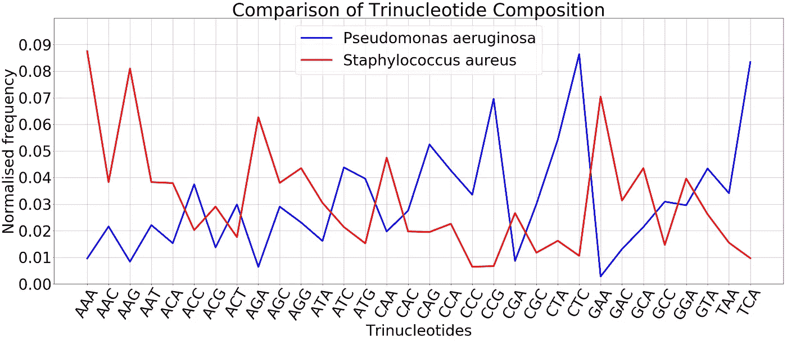
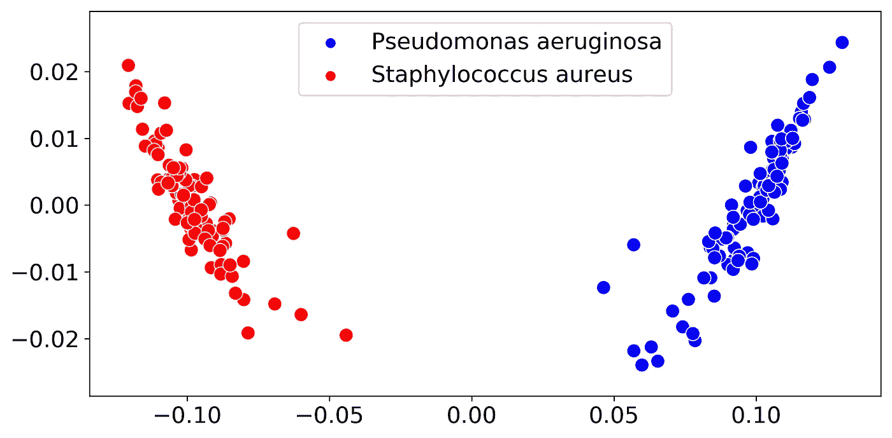
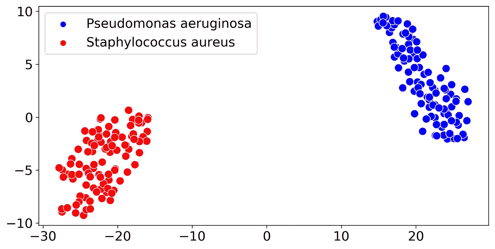
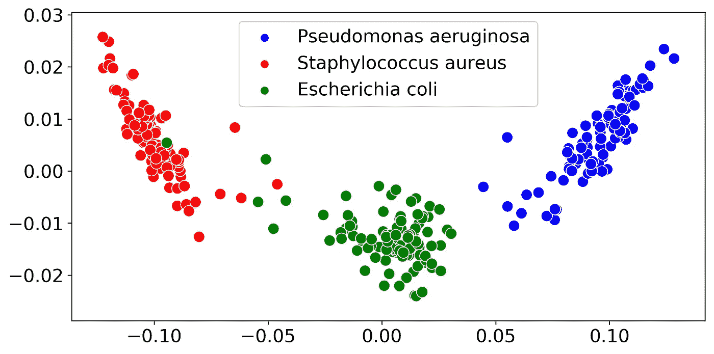
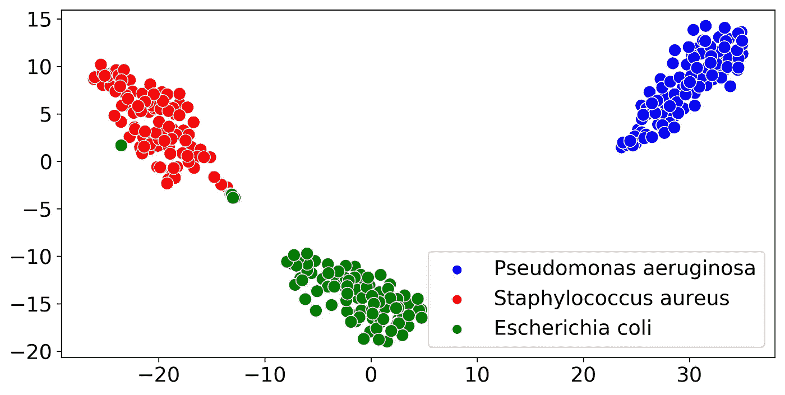
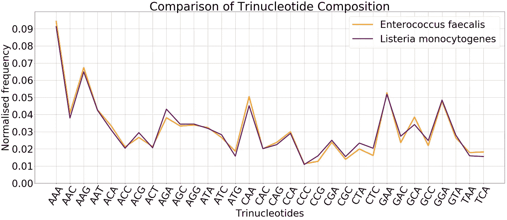
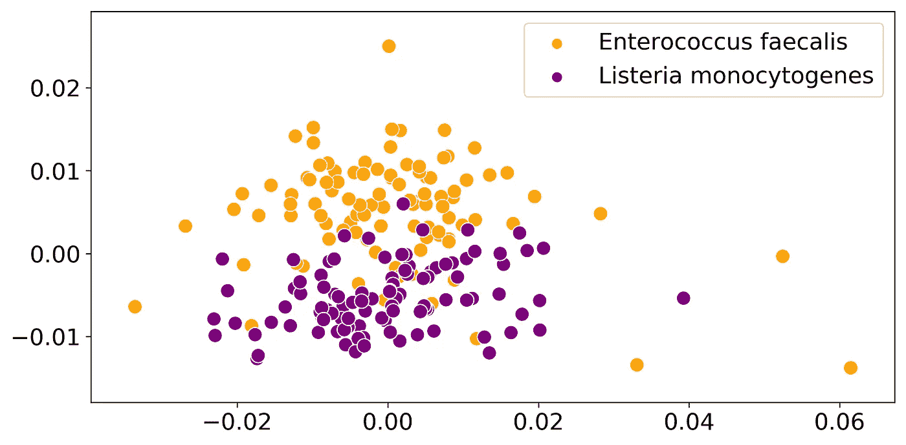
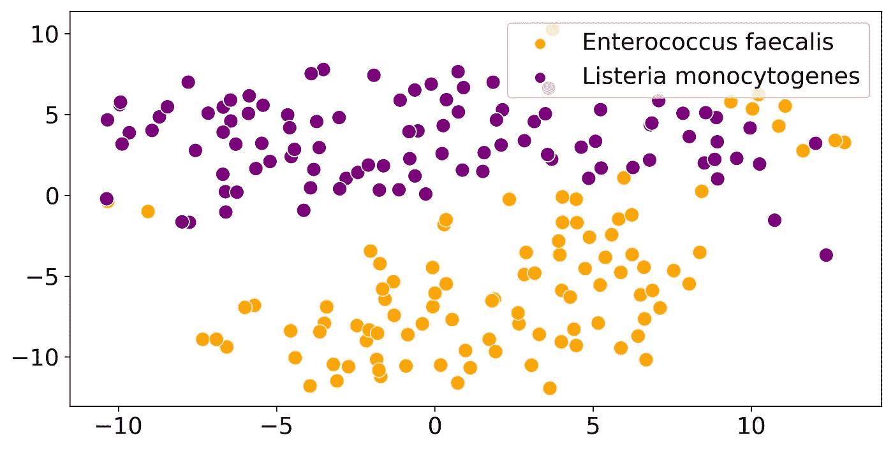

# 基于组成的宏基因组序列聚类

> 原文：<https://towardsdatascience.com/composition-based-clustering-of-metagenomic-sequences-4e0b7e01c463?source=collection_archive---------40----------------------->

## 基于寡核苷酸组成的宏基因组序列聚类

**聚类**是将数据点分组的任务，将相似的点聚在一起，不同的点则相距较远。聚类应用于序列分析，尤其是在**宏基因组学**领域(你可以从我之前的文章[这里](/metagenomics-who-is-there-and-what-are-they-doing-9f204342eed9)阅读更多关于宏基因组学的内容)。宏基因组样本可能包含来自数千种物种的序列，我们必须将这些代表不同分类学水平的序列分组，以支持下游分析。这个分组过程被称为宁滨宏基因组学。在这篇文章中，我将解释我们如何根据寡核苷酸组成来结合宏基因组序列。

# 寡核苷酸组成

**寡核苷酸**被认为是少量核苷酸的连续串。在计算术语中，我们将寡核苷酸定义为 ***k-mers*** (大小为 ***k*** 的单词)。寡核苷酸组成被认为在微生物物种中是保守的，并且在物种之间是变化的[1][2]。这通常适用于大小在 2 ( **二核苷酸/二聚体**)到 8 ( **八核苷酸/八聚体**)之间的寡核苷酸[2]。特定大小的寡核苷酸在序列中的出现频率为我们提供了该特定序列的**基因组特征**。这些**基因组特征**可能因物种而异，这是由于以下因素的影响，

1.  DNA 结构
2.  复制和修复过程
3.  进化的压力

在这个比较中，我考虑了**三聚体**(也称 ***三聚体*** 或 ***三核苷酸*** )及其组成(**三核苷酸组成**)。当我们合并反向称赞时，有 32 (4 /2)个不同的**三聚体**。我们通过计算三核苷酸出现的次数并除以三核苷酸的总数来获得每种不同三核苷酸的标准化频率。我们通常在分析中使用寡核苷酸 的 ***归一化频率，以避免由于序列长度不同而导致的任何不均匀性。***

```
Normalised freqeuncy of kᵢ
= Number of occurrences of kᵢ / total number of k-mers
(where kᵢ is the iᵗʰ k-mer)
```

你可以从题为[DNA 序列矢量化](https://medium.com/computational-biology/vectorization-of-dna-sequences-2acac972b2ee)的文章中了解更多关于如何获得这些 *k-mer* 频率向量的信息。

[](https://medium.com/computational-biology/vectorization-of-dna-sequences-2acac972b2ee) [## DNA 序列的矢量化

### ACGT 序列到 k-mer 频率向量的有效转换

medium.com](https://medium.com/computational-biology/vectorization-of-dna-sequences-2acac972b2ee) 

# 两个基因组在一起

我在下面的例子中使用的参考基因组是从 [**发酵生物学微生物群落标准**](https://academic.oup.com/gigascience/article/8/5/giz043/5486468) 的 [**纳米孔 GridION 和 PromethION 模拟微生物群落数据群落发布**](https://github.com/LomanLab/mockcommunity) 中获得的。

## **两个基因组的基因组签名**

让我们考虑一个简单的例子，我们有两个基因组*铜绿假单胞菌*和*金黄色葡萄球菌*。我们可以获得每个基因组的标准化三核苷酸频率向量。我使用了文章[DNA 序列的矢量化](https://medium.com/computational-biology/vectorization-of-dna-sequences-2acac972b2ee)中介绍的方法。你可以看看，甚至尝试不同的 ***k*** 值。我在本文中使用了 ***k=3*** 。

如果我们绘制这两个基因组的标准化三核苷酸频率，它将如图 1 所示。



图一。*铜绿假单胞菌*和*金黄色葡萄球菌*的标准化三核苷酸频率

我们可以看到在两个基因组的三核苷酸组成谱之间有明显的分离。我们可以使用这个特性来分离序列。

## 对来自两个基因组的混合序列进行聚类

让我们考虑一下我使用 100 个长度为 10，000bp 的读数模拟的样本数据集，这些读数来自每一种物种*铜绿假单胞菌*和*金黄色葡萄球菌*。我使用名为 [SimLoRD](https://bitbucket.org/genomeinformatics/simlord/src/master/) 的工具来模拟读取。下面是我使用的示例命令。

```
simlord --read-reference <REFERENCE_GENOME_FILE> --fixed-readlength 10000 --num-reads 100 <OUTPUT_PREFIX>
```

一旦我们获得了所有读数的标准化三核苷酸频率向量，我们可以获得如下的 PCA 图(图 2)和 TSNE 图(图 3)。



图二。来自每一物种*铜绿假单胞菌*和*金黄色葡萄球菌*的长度为 10，000bp 的 100 个读数的标准化三核苷酸频率向量的 PCA 图



图三。每个物种*铜绿假单胞菌*和*金黄色葡萄球菌*的 100 个长度为 10，000bp 的读数的标准化三核苷酸频率向量的 TSNE 图

我们可以看到这两个物种的序列有明显的区别。

# 对来自三个基因组的混合序列进行聚类

另一个我们可以考虑的简单例子是有三个基因组*绿脓杆菌*、*金黄色葡萄球菌*和*大肠杆菌*。这三个基因组也有不同的基因组特征。如果我们绘制从这三个基因组模拟的读数的标准化三核苷酸频率向量，该图将如下所示。



图 4。每个物种*铜绿假单胞菌、金黄色葡萄球菌和大肠杆菌*的 100 个长度为 10，000bp 的读数的标准化三核苷酸频率向量的 PCA 图



图五。每个物种*铜绿假单胞菌、金黄色葡萄球菌和大肠杆菌*的 100 个长度为 10，000bp 的读数的标准化三核苷酸频率向量的 TSNE 图

与前面的图一样，这里我们也可以看到三个物种的序列之间有明显的区别。因此，我们可以应用许多聚类和机器学习技术来分离这些序列。

# 示例工具

*   [**MaxBin**](https://microbiomejournal.biomedcentral.com/articles/10.1186/2049-2618-2-26) 使用四核苷酸频率以及期望最大化算法和概率方法来结合重叠群。
*   [**MrGBP**](https://www.nature.com/articles/s41598-018-38197-9) 使用寡核苷酸成分(可能具有稍微不同的表示)与 DBSCAN 结合重叠群。
*   [**LikelyBin**](https://bmcbioinformatics.biomedcentral.com/articles/10.1186/1471-2105-10-316) 通过马尔可夫链蒙特卡罗方法使用五核苷酸频率。

# 如果基因组有相似的组成会发生什么？

可能存在这样的情况，即使我们有两个不同的物种，它们可能具有相同的寡核苷酸组成模式。比如考虑两个基因组*粪肠球菌*和*单核细胞增生李斯特菌*。如果我们绘制这两个基因组的标准化三核苷酸频率，它将如图 6 所示。



图六。*粪肠球菌*和*单核细胞增生李斯特菌*的标准化三核苷酸频率

如果我们绘制从这两个基因组模拟的读数的标准化三核苷酸频率向量，该图将如下所示。



图 7。来自各物种*粪肠球菌*和*单核细胞增生李斯特菌*的长度为 10，000bp 的 100 个读数的标准化三核苷酸频率向量的 PCA 图



图 8。从每个物种*粪肠球菌*和*单核细胞增生利斯特氏菌*中读取 100 个长度为 10，000bp 的标准化三核苷酸频率向量的 TSNE 图

从这些图中，我们可以看出这两个物种之间很难找到明显的区别。因此，在这种情况下，我们必须使用额外的信息，如物种丰富度来聚类序列。

# 最后的想法

我希望你对我们如何使用基于组成的宁滨方法聚类宏基因组序列有了一个基本的概念。我希望这将有助于你的研究，并在你的研究项目中自由使用这些信息和技术。我附上了包含代码的笔记本，这样你就可以研究更多的基因组。

你也可以从下面列出的我以前的文章中读到更多关于宏基因组学和相关分析的内容。

[](/metagenomics-who-is-there-and-what-are-they-doing-9f204342eed9) [## 宏基因组学——谁在那里，他们在做什么？

### 深入了解微生物群落的数据

towardsdatascience.com](/metagenomics-who-is-there-and-what-are-they-doing-9f204342eed9) [](/how-similar-is-covid-19-to-previously-discovered-coronaviruses-c3d9f25840f7) [## 新冠肺炎与之前发现的冠状病毒有多相似

### 不同冠状病毒基因组组成谱的简单比较

towardsdatascience.com](/how-similar-is-covid-19-to-previously-discovered-coronaviruses-c3d9f25840f7) 

感谢您的阅读！

干杯！

# 参考

[1]卡林，S. *等*。细菌基因组的组成偏差和进化含义。*细菌学杂志*，179(12)，3899–3913(1997)。

[2] Dick，G. J. *等*微生物基因组序列签名的社区范围分析。*基因组生物学*，10(8)，R85 (2009)。