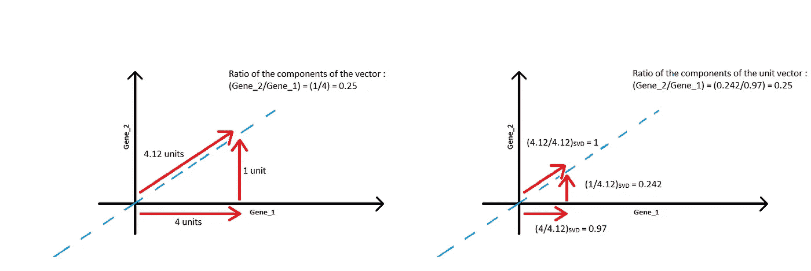
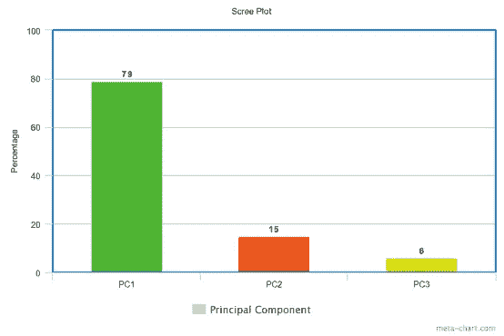

# 理解主成分分析

> 原文：<https://towardsdatascience.com/comprehending-principal-component-analysis-9e820094ed44?source=collection_archive---------34----------------------->

## 通过识别关键组件及其影响，简化预测模型的开发

马德琳·拉格斯代尔在 [Unsplash](https://unsplash.com?utm_source=medium&utm_medium=referral) 上的照片

复杂数据的分析通常涉及多维数据集的处理。大多数时候，数据中有很多噪声，人们必须在这些噪声中寻找有用的信息或信号。此外，可视化倾向于超出三维空间的数据是一项艰巨的任务。

主成分分析(PCA)是一种降低数据集维度的技术，同时保留数据中有意义的变化。这种方法确保在不损害从数据中提取的信息的情况下降低数据的复杂性。这就是所谓的“T6”降维。

# **方法背后的动机**

通常，差异很大的要素往往包含有意义的信息。预测算法试图学习这些变化，从而能够识别数据中的模式。因此，具有高方差的特征是建立精确预测模型的基本要求。PCA 可以捕捉数据中的这些变化，并可以促进预测算法提供良好的结果。

PCA 还能够生成彼此独立的特征。这对于识别不相关的数据尤其重要。构建预测模型时，建议选择相互独立的要素以避免多重共线性。

当数据集中的要素相互关联时，就会出现多重共线性。选择特征时的想法是拥有一组独立特征，通过这些独立特征可以预测从属特征或目标变量的值。如果我们有相关的特征，一个特征的微小变化可能会影响其他特征，从而导致模型精度的降低。

使用 PCA 的另一个原因是减少我们为预测模型选择的特征数量。我们选择的特征数量越多，我们的模型就越复杂，模型就越会过度拟合数据。过度拟合会导致在我们的训练集上有极好的模型性能，但在我们的测试集上有相当差的性能。使用 PCA 背后的想法是保留数据集中的信息，同时降低模型的复杂性。

# 逐步理解 PCA 的方法

为了理解主成分分析，让我们以小鼠和基因数据集为例。

小鼠基因数据集

让我们考虑仅从数据集中选取一个要素来绘制图表。我们把这个特征称为“基因 1”。考虑到我们只有一个特征，我们的图中只有一个维度。

一维数据表示

现在，让我们用两个特征来绘制我们的图，即‘基因 _ 1’和‘基因 _ 2’。在这种情况下，我们将处理二维空间。

二维数据表示

继续相同的趋势，现在让我们考虑三个特征，“基因 _1”、“基因 _2”和“基因 _3”。现在，我们将有一个三维图。

三维数据表示

**注意:**值较大的“基因 _3”数据样本的大小较小，因为它们将位于远离原点的位置，而值较小的样本将更靠近原点。

现在，如果我们想画一个有第四个特征的图，需要一个四维图，这是不可能画出来的。

# PCA 来拯救

主成分分析(PCA)可以获取这些四维或多维数据，并将其压缩到二维图中，这使我们更容易进行分析。

压缩成 2D 空间的多维空间

让我们试着理解这是如何可能的…

让我们回到之前的二维图，以获得背后的直觉。

“X”代表数据中心的数据分布

中间标有“ **X** 的点代表数据的**中心。一旦我们知道了中心，我们就试着移动图形，使中心与轴的原点重合。**

将数据以原点为中心

然后，我们通过原点传递一条线，并将数据点投影到这条线上。

将数据投影到直线上

为了使穿过原点的线成为数据上的最佳拟合线，我们需要**将数据投影到线** *(黑色细线)*上的长度最小化。这也可以通过**最大化数据投影点与原点** *(红线)*的距离来实现。

为了理解这个最小化和最大化的概念，让我们建立一个直觉。

穿过数据的最佳拟合线

当我们试图得到一条更适合我们数据的线时，投影线*(细黑线)*的长度逐渐减小，而投影点离原点的距离长度(*红线*)逐渐增加。

## 为了从数学上理解这一点

假设我们在 x-y 平面上有一个数据点。投影线的长度用' **b** 表示，投影点到原点的距离用' **c** 表示，最后数据点到原点的距离用' **a** 表示。

应用毕达哥拉斯定理

我们很清楚，当把一个点投影到一条线上时，投影线垂直于这条线。

因为这个性质是真的，所以我们有一个直角三角形，并且这里可以应用'**毕达哥拉斯定理**'。

因此，我们可以观察到 **a** 的值将保持不变，即使我们试图改变蓝线的方向。这里我们仅有的变量是 **b** 和 **c** 的值。

我们还可以观察到，当我们试图用蓝线来拟合我们的数据时，' **b** '的值会减小。因此，' **b** 的值也减小。

根据'**毕达哥拉斯定理**'如果' **b** '减少，而' **a** '保持不变，我们保持等式的唯一方法是增加' **c** '的值。

直觉上，需要最小化的是' **b** ，但实际上更容易计算的是' **c** '。

因此，PCA 试图最大化' **c** '的值。

现在我们已经清楚了这一点，我们将尝试把这一方法应用于我们手中的数据。

计算距离平方和(SS)

PCA 执行以下步骤

1.  它将点投影到要拟合的线上。
2.  它测量投影点到原点的距离。在这种情况下， **dₓ** ，其中“ **x** ”代表数据点。
3.  然后计算距离的平方，去掉负号。
4.  最后，它总结了所有的平方距离。

于是我们看到了这个: **d₁ +d₂ +d₃ +d₄**

这个量被称为**距离平方和**。我们将用' **SS** '来表示它。

我们现在将蓝线旋转一个小角度，同时计算平方距离的总和( **SS** )，试图找到数据的最佳拟合线。重复该过程，直到我们达到 **SS** 的最大值。

主成分 1(简称 PC1)

我们最终获得了上图中数据的最佳拟合线。对于这条线，我们有最大值的 **SS** 。这条最佳拟合线也被称为“**主成分 1** 或“ **PC1** ”。

假设对于这种数据分布，PC1 斜率为“0.25”。

这意味着，我们在“X 轴”方向上每移动 4 个点，就在“Y 轴”方向上移动 1 个点。因此，我们可以理解，PC1 在“基因 _1”轴上分布更广，在“基因 _2”轴上分布相对较少。

这类似于食物食谱。为了生成 PC1，我们将首先添加 4 部分“基因 _1”和 1 部分“基因 _2”。这告诉我们，对于 PC1 来说，相对而言，‘基因 _ 1’比‘基因 _ 2’更重要。

这种使 PC1 的不同特征的组合叫做**‘线性组合’**。

因此，对于 PC1，我们有一个线性组合:-

*   基因 1 的 4 个部分
*   基因 2 的 1 部分

通过遵循变量的“**线性组合**，我们得到 PC1 的向量解释。

利用毕达哥拉斯定理，我们可以测量矢量 PC1 的大小。

**奇异值分解**用于将 PC1 向量缩放为单位向量。当我们将 PCA 与 SVD 一起应用时，我们得到了以下结果。

对数据应用奇异值分解(SVD)

我们可以观察到，尽管 PC1 单位向量的**线性组合**的值已经改变，但是对于各个分量，比率保持不变。

PC1 的这个单位向量被称为'**特征向量**或'**奇异向量**。Gene_1 和 Gene_2 各自的比例称为**“加载分数”**。**加载分数**有助于告诉我们哪个特征更重要，例如就投射到 PC1 上的数据而言，**加载分数**可以告诉我们 Gene_1 比 Gene_1 重要 4 倍。

PC1 的**加载分数**为:-

*   基因 1 0.97 份
*   基因 2 0.242 份

PCA 将最佳拟合线的距离平方的总和或距离平方的总和**称为 PC1 的“**特征值**”，将**特征值**的平方根称为 PC1 的“**奇异值**”。**

# 主成分 2

主分量 2 或 PC2 就是一条穿过原点并垂直于 PC1 的直线。

这是根据**正交性**的原理完成的。如果两个向量互相垂直，则认为它们是正交的。因此，数据在一个轴上的任何变化或移位或一个向量的移动不会在正交轴或正交向量上产生任何相应的变化或移位。这两个向量本质上是相互独立的。

数据以类似于 PC1 的方式投射到 PC2 上。

由于 PC2 与 PC1 正交，因此 PC2 的配方为:-

*   -1 部分基因 _1
*   4 部分基因 _2

通过 SVD 缩放后，PC2 的**加载分数**为:-

*   -0.242 份基因 _1
*   基因 2 0.97 份

然后旋转 PC1 和 PC2，使 PC1 保持水平。然后，我们使用主成分上的投影点来绘制新维度平面中的数据点。

我们现在有了一个全新的框架来分析我们的数据。原来的轴心对我们毫无用处，可以被淘汰。

我们观察到大多数数据点倾向于位于 PC1 上。这给我们带来了一个重要的观察结果。与 PC2 相比，PC1 上存在大量的数据变化，事实上，与任何其他主成分相比，PC1 表现出最大量的数据变化，因此是我们数据分析中的一个重要特征。

这是因为机器学习算法试图学习的是数据的变化，以便在未来做出预测。

# **记住特征值**

*   SS(PC1 的距离)= PC1 的特征值
*   SS(PC2 的距离)= PC2 的特征值

特征值用于计算每个主成分变化的贡献。

*   SS(PC1 的距离)/n-1 = PC1 的变化
*   SS(PC2 的距离)/n-1 = PC2 的变化

其中' **n** '代表样本大小，或者简单地说，数据点的数量。

假设:

*   PC1 的变化= 15
*   PC2 = 3 的变化

因此，总变差= 18

*   PC1 占 PCs 总变化的(15/18) = 0.83 = 83%
*   PC2 占 PCs 总变化的(3/18) = 0.17 = 17%

# 三轴数据

PCA 的概念基本保持不变。

1.  找到数据的中心。
2.  穿过原点绘制一条最佳拟合线。
3.  最佳拟合线称为 PC1。
4.  画一条与 PC1 正交的线，称为 PC2。
5.  同样，画一条与 PC1 和 PC2 都正交的第三条线，称为 PC3。

因此，所有的 PC 都是相互垂直的。

**注:**理论上，每个变量或特征有一个主成分分析轴，但实际上，主成分分析轴的数量要么是变量的数量，要么是样本的数量，以较小者为准。

一旦我们画出所有的 PC，我们可以使用**特征值**即 **SS 距离**来确定每个 PC 所占的变化比例。

所以，让我们假设在这种情况下，

*   PC1 占 79%
*   PC2 占 15%
*   PC3 占 6%

我们可以画出这个 PCA 的**碎石图**。

我们可以观察到 PC1 和 PC2 占了 94%的数据。因此，我们可以在分析中忽略 PC3，只使用 PC1 和 PC2。

这就是'**降维**'发挥作用的方式。我们有效地将数据依赖的维度数量从三个减少到两个。

然而，有时我们确实会遇到这样的情况。

在这种情况下，每个主成分的贡献几乎相等，只考虑几个主成分不足以解释所有的变化。然而，即使有噪声的主成分分析也有助于数据的聚类。

# 结论

在我们的数据分析中采用主成分分析有其合理的好处。然而，在使用这种方法时，我们确实面临一些缺点。

一旦我们通过 PCA 运行我们的特征，它就有效地创建了一组新的特征，这些新的特征保存了原始特征中存在的信息。如此创建的这组新特征是主要组件。如果没有领域专业知识，我们真的无法判断这些主要组件代表什么。因此，我们普遍丧失了可解释性。

然而，这并不是我们预测模型的重大挫折。如果我们能够从我们的数据中提取重要的信息，那么这种方法仍然是一种有用的技术，我们可以使用它而不用担心模型过度拟合数据。

感谢您阅读这篇博客。我希望听到你对此的想法。

# 参考

1.  Josh Starmer， *StatQuest:主成分分析(PCA)，循序渐进。https://www.youtube.com/watch?v=FgakZw6K1QQ*
2.  饶彤彤，*了解 PCA(主成分分析)*。[https://towards data science . com/understanding-PCA-fae3e 243731d](/understanding-pca-fae3e243731d)