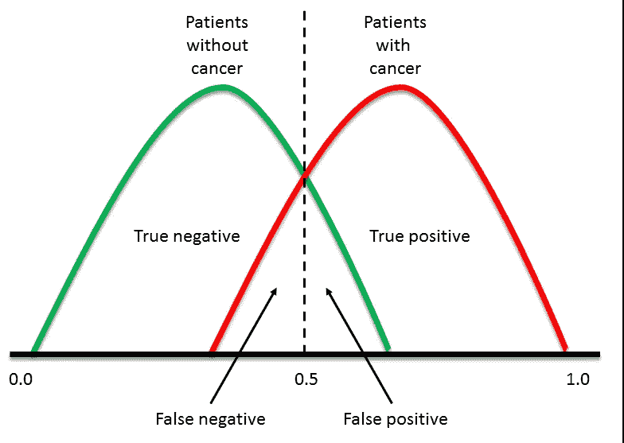
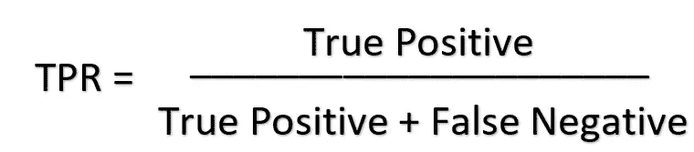
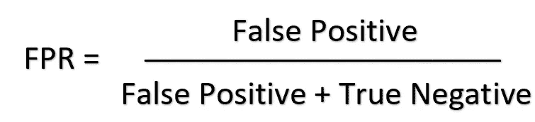
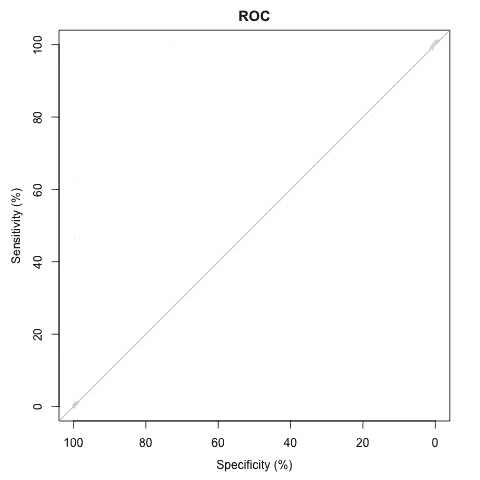
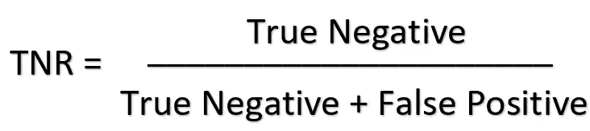
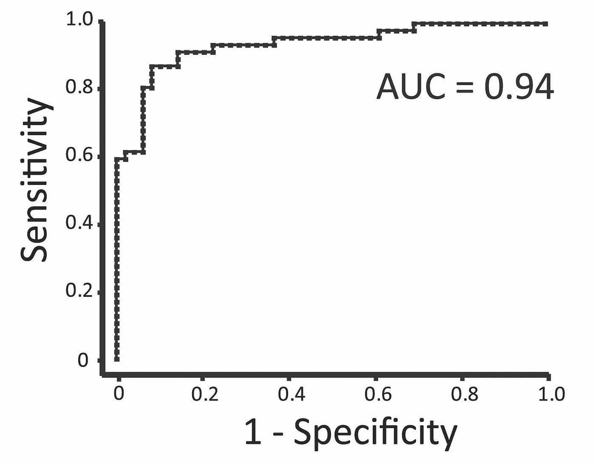

# 理解 AUC-ROC 曲线

> 原文：<https://towardsdatascience.com/comprehension-of-the-auc-roc-curve-e876191280f9?source=collection_archive---------18----------------------->

## 深入了解 AUC-ROC…

> 预测建模是指在我们没有答案的情况下，利用历史数据开发一个模型，对新数据进行预测。— [杰森·布朗利](https://machinelearningmastery.com/classification-versus-regression-in-machine-learning/)

图 1:51 区限制标志——来源:【https://www.atlasobscura.com/places/area-51 

当我们进行监督学习时，我们经常试图为一些特定的度量优化我们的算法。在分类任务中，我们模型的输出是一个离散的标签，受试者操作特征曲线下的面积——或 AUC-ROC 曲线——可能是一个我们试图根据我们试图解决的问题进行优化的指标。

不幸的是，51 区与 AUC 无关(或者说是吗？嗯)我对此没有什么见解，所以我们可以忽略*图 1*——但这是一张很酷的照片，然而在这篇文章中，我的目的是分解 AUC-ROC 指标。在这篇文章结束时，你会知道:

1.  **什么是 ROC 曲线。**
2.  **如何创建 ROC 曲线。**
3.  **推导绘制 ROC 曲线时使用的指标的公式。**
4.  **如何解读 ROC 曲线？**
5.  **曲线下的面积是多少。**

如果你以前没有遇到过什么是困惑矩阵，我建议你打开另一个窗口，熟悉一下我关于这个主题的最后一篇文章。当你对混淆矩阵感到舒服时，理解 ROC 曲线将是轻而易举的事。

 [## 混淆矩阵“未混淆”

### 打破混乱矩阵

towardsdatascience.com](/confusion-matrix-un-confused-1ba98dee0d7f) 

**什么是 ROC？**

ROC 曲线是一个图表。其目的是说明我们的分类模型在不同阈值下区分类别的能力。让我们深入探讨一下这个问题…

我们将从简要概述混淆矩阵开始。混淆矩阵将我们的预测分为两类错误和正确预测，如图*图 2* 所示。第一类错误被称为假警报，因为当它实际上是负的时候我们说是正的，而当真正的标签是正的时候我们的分类模型预测是负的时候，第二类错误是 a，因此留给我们的只有真正的正标签和真正的负标签。

图 2:模型区分 0-1 范围内不同阈值的能力图。来源:[https://stack overflow . com/questions/57280577/sensitivity-specificity-plot-python](https://stackoverflow.com/questions/57280577/sensitivity-specificity-plot-python)

*图 2* 上的垂直虚线表示当前模型的阈值。我们可以通过沿该轴向右或向左移动该线来改变模型的阈值，但是，这将导致灵敏度或特异性的折衷，具体取决于我们移动它的方式。如果您还不理解这两个术语，请不要担心，看看如果我们将它向左或向右移动，模型会做出不同的权衡。

**如何创建 ROC 曲线**

现在，我们可以通过在 0-1 之间的各种阈值设置下绘制真阳性率(TPR)与假阳性率(FPR ),来推断模型在各种阈值下区分类别的能力，这正是 ROC 曲线。我知道你在想什么…我们如何得出这些指标？问得好。

真实阳性率(也称为敏感度或召回率)是从我们的模型预测中正确识别的实际阳性数量的度量。这一点很重要，因为当分类器进行预测时，我们作为数据科学家应该想知道我们的数据中所有实际正确标签(以及有错误的标签和原因)的正确预测比例，因为在理想世界中，我们希望我们所有的预测都是正确的。

然而，由于我们并不是生活在一个理想的世界中(或者你可以在 twitter 上分享为什么你认为我们是这样做的)，甚至我们人类，可能是地球上最聪明的生命，也可能难以区分阶级，例如，细胞是否是恶性的。我们分类的假警报数量被称为假阳性率。

**导出指标的公式**

要获得真正的阳性率，我们必须从我们的模型中识别所有真正的阳性预测(正确预测的阳性预测)，并将其除以真正的阳性和我们的模型分类为阴性的阳性标签(假阴性-第二类错误)。

图 3:敏感度公式(真阳性率)。

另一方面，为了从我们的模型预测中得出假阳性率，我们必须识别来自我们的模型的假阳性预测——假警报——并将其除以假阳性和我们的模型归类为阴性的阴性标签(真阴性——正确剔除)。

图 4:假阳性率的公式(1-特异性)。

回顾一下，到目前为止，我们已经了解到 ROC 曲线是一个图形图，它说明了我们的分类模型在不同阈值下区分类别的能力。此外，我们现在知道该图是通过将真阳性率作为假阳性率的函数来绘制的，并且我们知道如何导出这些指标。太棒了。我们知道这些信息就足够了，但是它意味着什么，我们能从中推断出什么来推动商业价值呢？

**如何解读 ROC 曲线**

> 我们现在知道这个图是通过将真阳性率作为假阳性率的函数来绘制的。

如果我们沿着 x 轴绘制假阳性率，值的范围从 0 到 1，代表不同的概率阈值，沿着 y 轴绘制真阳性率，从 0 到 1，代表概率阈值，当 x = y(当假阳性率概率阈值等于真阳性率概率阈值时)时，该图明确表示，随着我们增加假警报数量的阈值，真阳性率也会增加。

当我们的模型做出更多积极的预测时，它会增加我们的真阳性率和假阳性率，从而降低我们的真阴性率。简而言之，我们正在用更积极的预测来取代消极的预测。

因此，当 x=y 时，我们的模型就像随机猜测一样好，因为模型的真实阳性率随着我们做出的更积极的预测而增加——用雷曼的话说，它正在努力区分不同的类别。在一些教科书中，您可能会看到假阳性率被称为 1 特异性，因为通过增加假阳性率，我们抵消了真阴性率(正确剔除)，因为我们沿着 x 轴移动时会做出更多的阳性预测。

图 5:显示随机猜测模型的 ROC 曲线

**注意:**特异性(也称为选择性和真阴性率)是通过我们的模型预测(正确拒绝率)正确识别的实际阴性标记的量的量度。

图 6:特异性公式(真阴性率)。

如果不参考*图 5* 并尝试理解图表中发生的事情，你现在可能已经开始理解 ROC 曲线的要点了。然而，如果您对 ROC 曲线有更深的直觉，您可能会意识到，能够很好地区分类别的模型具有较低的假阳性率和较高的真阳性率——从视觉上看，这意味着这些图将紧挨着图表的左上角(*参见图 7* )。这就把我们带到了这篇文章的最后一部分。

作为数据科学家，我们的任务是能够理解我们试图解决的问题类型。这有助于我们了解在不同的设置中优化什么。例如，在我们试图预测恶性肿瘤的情况下，我们可能希望设置我们的阈值来优化灵敏度，以便我们谨慎地不要说患者实际上患有恶性肿瘤，而在垃圾邮件检测设置中，我们不想将重要邮件归类为垃圾邮件，因此我们优化特异性。

**什么是 AUC？**

如果我们想量化我们的模型区分类别的能力(ROC ),我们使用 AUC，它代表曲线下面积。“下方面积”是 ROC 曲线下方图的百分比。

图 7: ROC 曲线显示了一个模型，该模型可以很好地区分具有高 AUC 的类别。来源:[https://stats . stack exchange . com/questions/260845/什么是测试中更重要的-敏感性-特异性-或-roc-auc](https://stats.stackexchange.com/questions/260845/what-is-more-important-in-a-test-set-sensitivity-specificity-or-roc-auc)

你现在知道什么是 AUC-ROC，如何创建图，如何推导 TPR 和 FPR，如何解释 ROC 曲线，以及什么是 AUC 曲线。这篇文章到此结束，尽管您可能希望扩展您已经获得的知识基础，以了解 AUC-ROC 如何扩展到多类分类任务，其中我们的分类器旨在将我们的实例分类到三个或更多类中的一个，或者您可能还想知道 AUC-ROC 如何处理不平衡数据。下面，我给你参考了一些好的资料来源，让你扩展知识面！

**参考文献:**

数据学校。(2014 年 11 月 20 日)。 *ROC 曲线和曲线下面积(AUC)解释。*[https://www.youtube.com/watch?v=OAl6eAyP-yo](https://www.youtube.com/watch?v=OAl6eAyP-yo)

USMLE 生物统计学。(2016 年 4 月 29 日)。*敏感性与特异性:权衡。*[https://www.youtube.com/watch?v=yax-n3ROboE](https://www.youtube.com/watch?v=yax-n3ROboE)

Scikit 学习文档。*接收机工作特性(ROC)。*[https://scikit-learn . org/stable/auto _ examples/model _ selection/plot _ roc . html](https://scikit-learn.org/stable/auto_examples/model_selection/plot_roc.html)

维基百科。*多类分类。*[https://en.wikipedia.org/wiki/Multiclass_classification](https://en.wikipedia.org/wiki/Multiclass_classification)