# Python 中的理解和生成器表达式

> 原文：<https://towardsdatascience.com/comprehensions-and-generator-expression-in-python-2ae01c48fc50?source=collection_archive---------23----------------------->

## Python 理解能力的综合指南。

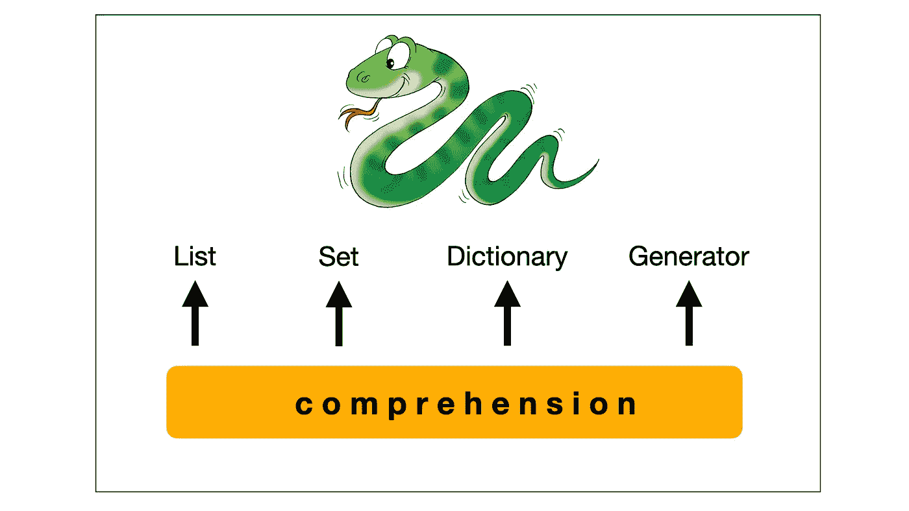

作者图片

要理解 Python 的理解能力，首先理解理解的概念很重要。编程中的理解只不过是以简洁明了的方式编写(现有的)代码，通常只有一行。它正在通过缩短现有序列来构建新序列。擅长理解代码是一项相当重要的技能。你需要理解实现来应用编程的理解能力。Python-3 支持理解，


Python 3: Image by author 支持的理解类型

在本文中，我们将深入探讨这一点。让我们首先修改一下用 Python 创建列表的方法。

## 在 Python 中定义列表的不同方法

1.  直接列出元素，
    一个列表可以通过枚举/列出方括号中的所有元素来直接定义，用逗号分隔。

```
Output:
-------
num_cube[] = [8, 64, 216, 512, 1000]
```

*f " num _ cube[]= { num _ cube } "*print()*中使用的*是 Python 3.6 中引入的[字符串插值](/python-string-interpolation-829e14e1fc75)的 *f-string* 格式样式。

2.使用 *for* 循环，
定义一个空列表，并使用内置方法 *append()* 在 *for* 循环中添加元素。在这里，我们创建了一个从 1 到 10 的偶数立方体列表。我们已经为循环定义了一个空列表 *num_cube_floop* 和一个*来迭代*范围(1，11)* 。条件 *n%2==0* 将确保输出表达式 *n**3* 只计算偶数。*

```
Output:
-------
num_cube_floop[] = [8, 64, 216, 512, 1000]
```

3.使用' *+=* '运算符，
类似于上面的例子我们已经定义了一个空列表 *num_cube_op* 和*，因为*循环正在迭代输入文件 *list_input.txt* 。在使用操作符 *'+='* 将输入数据添加到列表之前，我们使用 *split( )* 分离输入数据。

```
Output:
-------
num_cube_op[] = ['8', '64', '216', '512', '1000']
```

4.使用 *map()* ，
在这里，我们使用 *map()* 从现有的列表*中创建一个列表。*对于刚接触 *map()* 和 *lambda 表达式的人来说，*

*map(function_to_apply，iterable)——*它将*‘function’*应用于一个*‘iterable’的所有元素。*

*lambda 参数:输出表达式* —匿名函数，它是在没有名称的情况下定义的，并且不遵循正常的 python 函数约定。

在下面的代码中， *map( )* 将 *lambda 表达式(*计算数字的立方)应用于现有列表*数字*，并在将结果分配给新列表 *num_cube_maps 之前使用 *list( )* 转换输出。*

```
Output:
-------
num_cube_map[] = [8, 64, 216, 512, 1000]
```

还有另一种方法可以使用 Python 的理解能力来创建列表。它让我们用一行代码创建一个列表。一开始可能看起来有点难以理解，因为语法可能令人生畏，但在这里我们将分解它以获得更简单的理解。

## **列表理解**

List Comprehension 的一般语法类似于 [*集合生成器符号*](https://en.wikipedia.org/wiki/Set-builder_notation) 。在集合论中，*“集合构造符号是一种数学符号，它通过列出集合的所有元素或描述所有集合元素必须满足的性质来定义集合。”*

这个定义的第二部分。***根据集合的性质定义集合*** 在集合论中也叫集合理解。

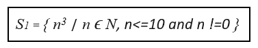

作者图片

“|”的左边是一个输出表达式，右边是一个集合中所有元素都必须满足的规则。

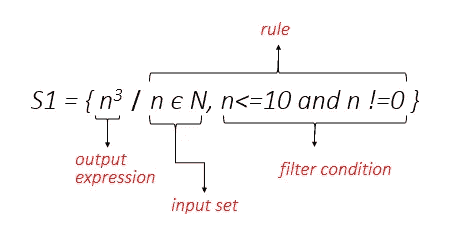

集合论中的集合生成器符号:作者的图像

这里，输出表达式(n3)定义了集合的元素，规则由输入集合( *n ϵ N* )和过滤条件(n < =10 和 n！=0).上面的集合定义基本上映射了集合 N (0，1，2，…)中的所有自然数。)并用 n < =10 和 n 限制输入！=0.结果集是，

S1={8，64，216，512，1000}
S1 = { *n3 ∣ n ϵ N，n < =10 和 n！=0}*

类似地，列表理解的最基本语法是，

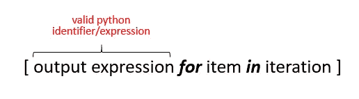

作者图片

让我们直接进入例子，

*   **同 for 循环**

```
Output:
-------
name_ltr[] = ['P', 'y', 't', 'h', 'o', 'n', ' ', 'P', 'r', 'o', 'g', 'r', 'a', 'm', 'm', 'i', 'n', 'g']With List-Comprehension = ['P', 'y', 't', 'h', 'o', 'n', ' ', 'P', 'r', 'o', 'g', 'r', 'a', 'm', 'm', 'i', 'n', 'g']
```

在上面的例子中，我们需要创建一个字符串的所有字符的列表。实现这一点的通常方法是定义一个空列表，并在一个 *for* 循环中使用 *append( )* 方法将元素添加到我们的列表中。这里 *for* 循环正在迭代字符串文字 *name* 并且 *append( )* 将字符串文字的所有单个字符添加到列表 *name_ltr* 中。使用列表理解可以获得相同的结果，甚至不用担心定义列表或使用 *append()。*

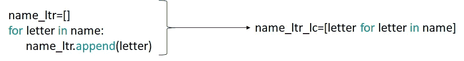

作者图片

如果我们检查语法，列表理解只不过是对循环的*和输出表达式的重新排列。我们把输出表达式放在理解语法的开头，后面跟着循环。这很简单。*

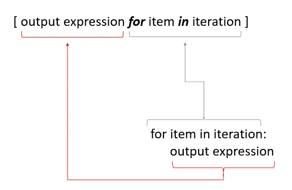

作者图片

*   **用 if 语句**

让我们进一步向它添加一个条件语句。在文章的开始，我们看到了创建偶数立方列表的四种不同方法，一种是使用*进行*循环。

```
Output:
-------
num_cube_floop[] = [8, 64, 216, 512, 1000]With List-Comprehension = [8, 64, 216, 512, 1000]
```

正如我们在代码块中看到的，使用 List Comprehension 时，四行代码减少到了一行。

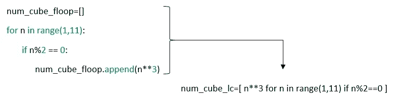

作者图片

语法类似于我们在上一节中讨论的基本格式，条件性的【T2 if】-语句被添加到末尾，如下图所示。

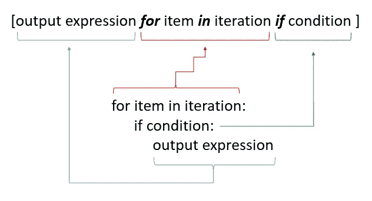

作者图片

让我们再举一个例子，从一个给定的字符串中的一个特定字母开始创建一个单词列表。

```
Output:
-------
words[] = ['Python', 'Programming']With List-Comprehension = ['Python', 'Programming']
```

在这里， *statement.split( )* 分隔(默认分隔符是空格)字符串文字中的所有单词，并且循环的*将遍历它以过滤从字母*‘P’*开始的所有单词，结果将使用 *words.append(w)* 添加到列表中。使用 List Comprehension 时，输出表达式(总是放在开头) *w* 放在最前面， *for* 循环迭代字符串文字，后面是 *if-* 条件。*

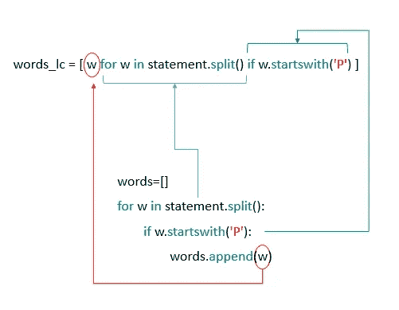

作者图片

*   **带 if-else 语句**

if-else 语句的位置与之前讨论的列表理解场景不同。当使用 *if-else* 条件块时，它被放置在输出表达式之后，如下图所示。

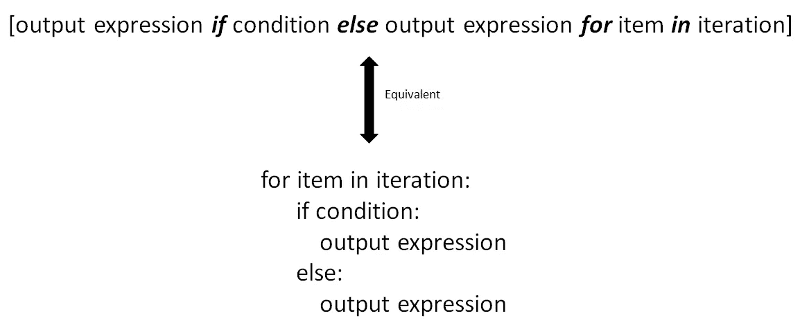

作者图片

让我们创建一个数字列表<10 where we have to calculate square for even numbers and cube for the odd.

```
Output:
-------
square_cube[] = [0, 1, 4, 27, 16, 125, 36, 343, 64, 729]With List-Conprehension = [0, 1, 4, 27, 16, 125, 36, 343, 64, 729]
```

The above code block filters the numbers based on condition *num%2==0* ，并相应地执行*square _ cube . append(num * * 2)*或 *square_cube.append(num**3)。*使用时，列出与*相关联的理解输出表达式，如果*-语句放在前面，其他条件后面跟有 *else* 关键字。

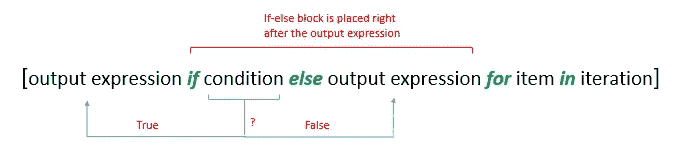

作者图片

如何将常见的 *for* 循环转换成列表理解，这完全取决于我们。在另一个奇数/偶数的例子中，我在一个列表*数字*中创建了两个列表，代码块是不言自明的。

```
Output:
-------
numbers[] = [([0, 4, 16, 36, 64], [1, 27, 125, 343, 729])]With List-Conprehension = [[0, 4, 16, 36, 64], [1, 27, 125, 343, 729]]
```

区别在于如何使用理解来构造列表，为了在一个列表中创建两个列表，定义了两个单独的表达式。

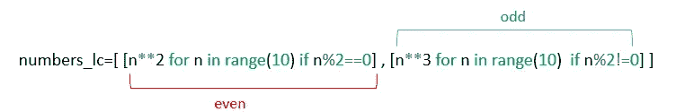

作者图片

*   **带有嵌套循环**

在总结清单理解之前，让我们再举一个例子。它非常包容，大多数时候可以灵活地用于嵌套循环。我们需要创建两个现有列表 *char_list* 和 *int_list 的[笛卡尔积](https://en.wikipedia.org/wiki/Cartesian_product)的列表。*用于循环的一个*在 *char_list* 上迭代，另一个在 *int_list 上迭代。*使用 *cartesian.append((x，y))* 将两个列表中的元素作为元组添加到结果列表 *cartesian* 中。*

```
Output:
-------
cartesian[] = 
 [('a', 0), ('a', 1), ('a', 2), ('a', 3), ('b', 0), ('b', 1), ('b', 2), ('b', 3), ('c', 0), ('c', 1), ('c', 2), ('c', 3)]With List-Conprehension = 
 [('a', 0), ('a', 1), ('a', 2), ('a', 3), ('b', 0), ('b', 1), ('b', 2), ('b', 3), ('c', 0), ('c', 1), ('c', 2), ('c', 3)]
```

输出表达式是一个元组，因此要加上括号。在列表理解中，嵌套的 *for* 循环按照预期的执行顺序放置。

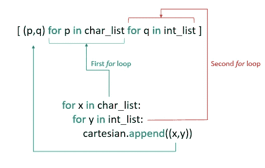

作者图片

在下面的代码块中， *person* 是由两个字典组成的列表。他们每个人都有两把*钥匙，名字*和*语言。*现在我们必须创建一个与*键语言相关的*值*列表。*第一个 *for* 循环是遍历一个列表 *person* 的长度，第二个 *for* 循环被设置为获取给定索引处的*键、语言*的值。

```
Output:
-------
person[] = ['Python', 'Java', 'C++', 'C#']With List-Conprehension = ['Python', 'Java', 'C++', 'C#']
```

通过在一行中重新排列循环的*，使用列表理解可以获得相同的结果。*

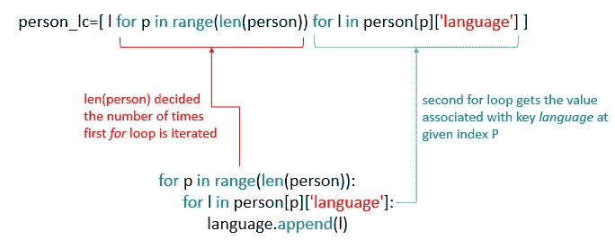

作者图片

## 集合理解

集合理解的功能与列表理解的功能相同，只是它返回一个集合，并且使用花括号{ }代替方括号[ ]。当它返回一个集合时，它将具有唯一的元素(Set 属性)。

考虑我们之前讨论过的同一个例子，一个由三个字典条目组成的列表 *person* 。如果我们在代码块中对比 List 和 Set Comprehension 的语法，区别只是方括号和花括号。虽然输出不同，但与列表理解不同，集合理解返回唯一的值。

```
Output:
-------
With List-Conprehension = ['Python', 'Java', 'C++', 'Python', 'Python']With Set-Conprehension = {'Python', 'C++', 'Java'}
```

## 词典理解

与列表和集合理解不同，当数据预期为*键值*配对格式时，使用字典理解。让我们继续我们的数字立方体例子的遗产。

```
Output:
-------

cubes = {1: 1, 2: 8, 3: 27, 4: 64, 5: 125, 6: 216, 7: 343, 8: 512, 9: 729, 10: 1000} 
With Dictionary-Comprehension = {1: 1, 2: 8, 3: 27, 4: 64, 5: 125, 6: 216, 7: 343, 8: 512, 9: 729, 10: 1000}
```

使用我们前面讨论过的列表理解创建了两个列表。

```
numbers=[num for num in range(1,11)]  
#numbers=[1,2,3,4,5,6,7,8,9,10] num_cube=[n**3 for n in numbers]
#num_cube=[1,8,27,64,125,216,343,512,729,1000]
```

我们需要创建一个字典，其中一个*键*的值是来自列表*数字*的数字，而*值*来自第二个列表 *num_cubes。for* 循环在 *zip(numbers，num_cube)* 上迭代，以获取元组形式的键和值(key，value)。

*zip(iterables)* —映射多个容器的相似索引，并返回一个迭代器，该迭代器是一系列元组，包含参数中传递的每个 iterable 的元素。

```
print(list(zip(numbers,num_cube)))Output:
-------
[(1, 1), (2, 8), (3, 27), (4, 64), (5, 125), (6, 216), (7, 343), (8, 512), (9, 729), (10, 1000)]
```

输出表达式 *key:value，*映射从 *zip(numbers，num_cube)* 返回的值，如下图所示。

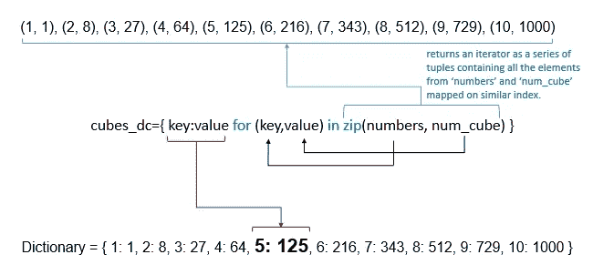

作者图片

## 生成器表达式

生成器表达式的语法类似于列表理解，只是它使用括号( )而不是方括号[ ]。生成器是 Python 中的特殊迭代器，它返回生成器对象。使用它的目的是生成一个项目序列，而不必将它们存储在内存中，这就是为什么你只能使用一次生成器。

这里，我们使用列表理解创建了一个列表 *num_cube_lc* ，生成器表达式定义为 *num_cube_generator* 。

```
Output:
-------
List Comprehension = [8, 64, 216, 512, 1000]Generator Comprehension = <generator object <genexpr> at 0x00000238925E7848>Sum = 1800
```

生成器表达式的输出不像列表理解的输出；但是，当与 *sum( )* 一起使用时，它会传递从表达式中生成的值。

# 结论

一般来说，理解肯定是减少代码行的有效方法。代码大部分时间更容易阅读和理解；然而，如果你的程序逻辑中有多个嵌套循环，使用理解会牺牲可读性。尽管有些人认为理解是一种更 pythonic 化的编码方式，但真正决定使用或避免它的最佳情况还是由您自己来决定。该主题的一些有用资源是，

*   [集合论中的集合生成器符号](https://en.wikipedia.org/wiki/Set-builder_notation#cite_note-2)
*   [5.1.3 列表理解](https://docs.python.org/3/tutorial/datastructures.html)
*   [生成器表达和理解](https://docs.python.org/3/howto/functional.html?highlight=generator%20compression)

本文使用的代码可以从我的 [GitHub 库](https://github.com/PhoenixIM/Pure_Python/blob/master/comprehensions.ipynb)中获得。