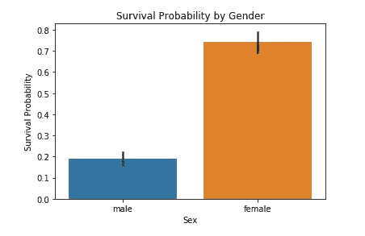
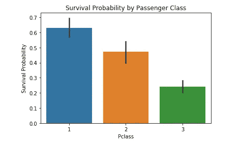
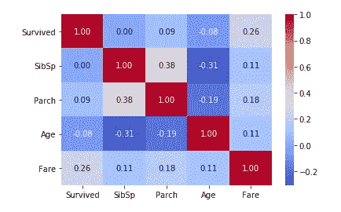
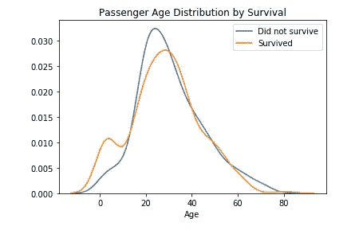
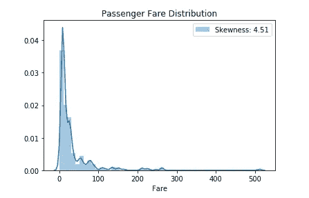
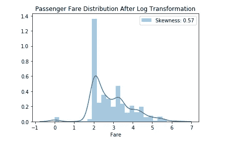
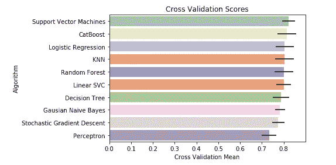

# Kaggle &泰坦尼克号生存预测竞赛综合初学者指南

> 原文：<https://towardsdatascience.com/comprehensive-beginners-guide-to-kaggle-titanic-survival-prediction-competition-solution-21c5be2cec2c?source=collection_archive---------23----------------------->

## *我对 Kaggle 上泰坦尼克号生存预测比赛的解答与分析*

由[安妮·斯普拉特](https://unsplash.com/@anniespratt?utm_source=medium&utm_medium=referral)在 [Unsplash](https://unsplash.com?utm_source=medium&utm_medium=referral) 上拍摄

如果你认识我，我是 Kaggle 的超级粉丝。天知道我在之前的文章中在 Medium 上提到过 Kaggle 多少次。

但是我在卡格尔的旅程并不总是充满玫瑰和阳光，尤其是在开始的时候。由于缺乏经验，我最初很难理解机器学习项目背后的工作流程以及所使用的不同术语。

经过几个月的网上资源筛选，包括许多技术文章、文档和教程视频，我才慢慢开始学习标签编码、交叉验证和超参数调整等概念。

我当时希望有一个一站式商店，在那里我不仅可以学习机器学习项目背后的步骤，更重要的是学习这些步骤背后的原理。所以我想，为什么不利用我在过去几个月里积累的知识来创建一个一站式商店，以帮助那些可能和我经历同样事情的人呢？

在本文中，我将解释什么是机器学习问题，以及端到端机器学习项目背后的步骤，从导入和读取数据集到参考 Kaggle 上最受欢迎的初学者比赛之一，即泰坦尼克号生存预测比赛，建立预测模型。

这个项目将我引入了机器学习的世界，也是我在 Kaggle 上的第一次比赛。

# 什么是机器学习？

实际上，在我们进入机器学习之前，我认为重要的是，我们首先要理解建立模型背后的目的。

> 什么是模型，为什么它很重要？

模型是对现实世界的模拟和简化。

无论你是建造摩天大楼的工程师，还是挑选股票的对冲基金分析师，甚至是正在竞选的政治家，我们都要应对这个世界的不确定性。一个模型可以让我们最小化这种不确定性，做出更明智的决策。

现在，一个模型并不完美，它不会帮助我们持续预测一个特定事件的实际结果，但我们肯定可以非常接近它。有了大量的数据，再加上人工智能的力量，人类已经越来越擅长使用模型进行高质量、准确的预测。

这就是机器学习的用武之地。

机器学习是指计算机学会推导数据中存在的趋势和模式。机器学习模型是使用历史数据“训练”的。一旦模型被建立和测试，我们就可以用它来预测其他数据点的未来。

机器学习模型不同于统计模型，因为它们需要最少的人力，但更重要的是，机器学习模型比统计模型需要更少的假设。统计模型是数学密集型的，并且基于系数估计。它要求建模者理解不同变量之间的关系，然后才能将它们包含在模型中。

由于上述原因，机器学习模型不仅做出更准确的预测，而且做出更稳健的预测，远远超过任何普通模型的能力。

# 监督与非监督学习

为了让这篇文章对初学者尽可能全面，我还想强调机器学习的两个主要分支，即监督学习和非监督学习。理解这两个分支之间的区别将有助于我们更仔细地思考我们试图使用机器学习来解决的问题类型。

> 监督学习是使用标记数据训练模型。换句话说，我们明确地告诉我们的模型我们预测的样本结果。

监督学习可以进一步分为分类和回归。分类问题是当我们的预测的结果是离散的和绝对的。另一方面，回归具有连续分布的预测。

为了说明分类问题，假设您正在构建一个垃圾邮件分类器，帮助您将电子邮件分类为垃圾邮件或非垃圾邮件。你要做的是准备一个训练集，其中包含你的电子邮件的不同特征，如字数，特定单词和标点符号的使用，最重要的是它们的标签，垃圾邮件或非垃圾邮件。然后，您可以使用该训练集训练机器学习模型，该模型将开始学习特征及其标签之间的关系。一旦模型建立到你想要的精度，你可以使用这个分类器来分类你的其他邮件。

回归与分类的不同之处在于，回归问题的结果是连续的，而不是有一个离散的目标变量，如垃圾邮件或非垃圾邮件。回归的一个完美例子是预测房价。在这里，房价是一个连续变量。同样，我们需要准备一个训练集，其中包含房屋观察以及它们的特征，如卧室数量、离城市的距离、客厅面积，当然还有它们的销售价格。然后，模型将了解不同的房屋特征如何与最终销售价格相关联。随后，我们可以使用这个模型对其他房屋进行预测。

现在，让我们转到无监督学习。

正如我们在垃圾邮件分类器和房价预测示例中看到的那样，我们将样本结果(垃圾邮件与非垃圾邮件以及最终销售价格)作为训练集的一部分，以训练我们的机器学习模型。

> 在无监督学习中，我们不包括任何样本结果，而是简单地让模型导出数据中存在的任何潜在模式，并相应地对它们进行分组。

由于大多数 Kaggle 比赛都使用监督学习，所以我不会在本文中过多详细地讨论无监督学习。

# 本次比赛的目的

这个比赛的目的是建立一个机器学习模型，帮助我们预测泰坦尼克号上乘客的生存结果。

这是监督学习中二元分类问题的一个例子，因为我们将乘客的结果分为两类，泰坦尼克号幸存者或幸存者。

更具体地说，我们想调查不同的乘客特征，如他们的年龄、性别、机票等级等如何影响他们的生存结果。

这个竞争的评估标准是测试集中被我们的分类器正确预测的乘客的百分比。

# 笔记本漫游

在这一节中，我将简要讨论我分析竞争的步骤和结果。你可以在我的 GitHub 上找到这个项目的完整代码。

## 数据集

Kaggle 竞赛中有三种类型的数据集。在更高级的比赛中，您通常会发现更多也更复杂的数据集，但一般来说，它们属于三类数据集之一。

1.  **训练集:**这是我们将执行大部分数据操作和分析的数据集。关于泰坦尼克号生存预测比赛，我们希望分析和/或创造能够帮助我们预测乘客生存结果的特征。此外，顾名思义，这是我们将用来训练我们的机器学习模型的数据集。
2.  **测试集:**一旦我们的分类器建立起来，我们希望确保它不仅适合我们的训练数据，更重要的是能够对样本外数据进行预测。回想一下，建模的主要目的是预测未用于训练我们的模型的真实世界数据。如果模型仅在训练数据上表现良好，而无法对新数据进行预测，则该模型本质上是无用的。Kaggle 将使用测试集来评估我们模型的准确性，即我们的分类器在对我们的分类器以前没有见过的乘客数据进行分类时有多准确。测试集比训练集少一列，训练集是响应(目标)变量，在我们的例子中，是幸存的一列。
3.  **样本提交:**这是我们向 Kaggle 提交最终解决方案的格式。我们最终的数据框架需要与样本提交数据框架具有相同的形状(相同的行数和列数)以及相同的列标题。

## 数据描述

在这里，我将概述 dataset 中列的定义。您可以在竞赛页面的数据选项卡下找到这些信息。

*   **幸存:** 0 =没有幸存，1 =幸存
*   **Pclass:** 客票等级，其中 1 =头等，2 =二等，3 =三等
*   性别:男或女
*   **年龄:**以年为单位的年龄
*   泰坦尼克号上兄弟姐妹或配偶的数量
*   **Parch:** 泰坦尼克号上父母或子女的数量
*   **车票:**旅客车票号码
*   **票价:**客运票价
*   **客舱:**客舱号
*   登船:登船地点，C =瑟堡，Q =皇后镇，S =南安普敦

## 探索性数据分析

探索性数据分析是可视化和分析数据以获取洞察力的过程。我们将主要使用熊猫图书馆来完成这项任务。我有大量关于熊猫的教程，你可以在这里查阅。

在这一部分，我将讨论我的 EDA 的关键结果。同样，你可以在我的笔记本上找到完整的分析。

我首先将数据集中的所有特征分为分类变量和数字变量，并对它们进行单独分析，以了解它们与存活率之间的关系。

执行特征分析时，区分分类变量和数值变量非常重要，因为这有助于我们更恰当地构建分析。例如，我们不能计算性别等分类变量的平均值，因为平均值只能应用于具有连续值分布的数值变量。

训练集中的分类变量是性别、p 类别和上船。另一方面，数字变量包括 SibSp、Parch、Age 和 Fare。

以下是我从 EDA 过程中收集的一些见解:

*   女乘客生还的可能性远远大于男乘客。如果我没记错的话，在泰坦尼克号的疏散过程中，妇女和儿童是优先考虑的，所以女性比男性有更高的生还机会是有道理的。

女性乘客比男性乘客更有可能生还

*   头等舱乘客比二等舱乘客更有可能生还，二等舱乘客比三等舱乘客更有可能生还。头等舱乘客是社会地位、影响力和财富都很高的个人。如果他们在疏散过程中比其他乘客优先，我不会感到惊讶。

头等舱乘客的生存概率最高；三等舱的乘客生还概率最低

*   费用是与存活率最(正)相关的数字特征。乘客支付的机票越多，他/她生还的可能性就越大。有道理！参考上面关于头等舱乘客的圆点点。

在 0.26 处，费用与存活率最相关

*   年龄较小的乘客，尤其是儿童，比其他乘客有更高的生存概率。再次强调，疏散时“妇女和儿童优先”。

年龄较小的乘客尤其是儿童更有可能幸存

## 数据预处理

数据预处理是为模型训练准备好训练集的过程。在这里，我们处理缺失值，应用数据转换，进行特征工程以及标签编码。

我现在将简要地介绍一下这些步骤，但我强烈建议您参考我的笔记本，以便更好地理解这里正在讨论的内容。

*   **缺失值:**有两种处理缺失值的方法，丢弃或者填充。用替代值填充缺失值有时称为插补。每种方法在方便性和准确性之间都有自己的权衡。具体地说，从我们的数据框架中删除缺失值是处理缺失数据的最简单和最方便的方法。然而，这通常是以丢失数据集中潜在的有用信息为代价的。另一方面，插补需要更多的时间和考虑才能有效执行。因此，您应该考虑数据集中缺失数据的状态，以便决定最合适的处理方法。根据经验，如果某个列或特性严重缺失，我们可以安全地将其从数据集中删除。关于泰坦尼克号的比赛，我决定去掉客舱特性，而填充上船、票价和年龄特性。
*   **数据转换:**该步骤特定于数据集中的 Fare 列。票价分布具有很高的正偏度，即分布向左侧倾斜。偏斜是指数值集中在分布的一端。这可能会对我们的模型做出准确预测的能力产生不利影响。因此，通过数据转换来解决这个问题至关重要。更具体地说，我对 Fare 列应用了一个对数变换，这导致偏斜度从 4.51 急剧下降到 0.57。

对数转换前的乘客票价

对数转换后的客运票价

*   **特征工程:**特征工程是从现有特征中创建新特征的过程，以更好地向预测模型表示潜在问题。这可以说是机器学习中最重要的艺术。之所以称之为艺术，是因为特征工程通常伴随着经验和领域专业知识，即特定问题或行业的知识。在我的笔记本上，我创建了三个新的功能，它们是标题，孤独和年龄。
*   **标签编码:**机器学习模型要求所有的输入输出变量都是数值。因此，我们需要在将分类数据拟合到我们的模型之前，对它们进行编码。

## 模特培训

比赛最精彩的部分来了，模特！

如果你正在用 Python 语言编码，Scikit-learn 是最流行的机器学习库之一。他们也有一个关于工具的全面的[文档](https://scikit-learn.org/stable/index.html)，这些工具包含在用于数据预处理、建模、模型评估和超参数调整的库中。

在我们可以将训练集拟合到我们的模型之前，我们需要首先将训练集分成预测变量和响应变量。

我已经选择将训练集适合于十个不同的分类器，它们是:

1.  逻辑回归
2.  支持向量分类器
3.  k-最近邻
4.  高斯朴素贝叶斯
5.  感知器
6.  线性随机向量分类器
7.  随机梯度下降
8.  决策图表
9.  随机森林
10.  CatBoost

在 Scikit-learn 中建模需要三个简单的步骤。首先，我们需要实例化我们的模型，也就是简单地声明一个模型并将它赋给一个变量。接下来，我们需要使模型符合我们的训练集，包括预测变量和响应变量。最后，我们可以使用这个模型对测试集进行预测。

## 模型评估

模型评估中的一个重要概念是交叉验证。回想一下，一个只适合训练数据，但无法对新数据进行预测的模型基本上是没有用的。交叉验证为我们测试模型预测新数据的准确性提供了一种方法。

交叉验证是这样一个过程:我们只使用训练集的一个子集来重复训练我们的模型，剩余的数据留待以后测试。保留的数据有时称为维持集。

交叉验证提供了比仅仅训练准确性更准确的模型准确性评估。这是因为训练精度忽略了过拟合的问题。过度拟合是指我们的模型学习数据中的噪声而不是信号。坚持集背后的想法是，我们的模型可以根据它对未经训练的数据进行预测的能力进行评估。

在我的笔记本中，我选择了其他模型中的支持向量分类器，因为它具有最高的交叉验证均值。

支持向量分类器具有最高的交叉验证均值

## 超参数调谐

超参数调整是调整模型参数的过程。使用 GridSearchCV，我设法调整了我的支持向量分类器的参数，并看到模型精度略有提高。

## 决赛成绩

使用我新调好的支持向量分类器，我对测试集进行了预测，并在提交给 Kaggle 时获得了 0.77511 的提交分数。换句话说，我成功预测了测试集中 77.5%的乘客数据。

# 提高模型准确性的可能扩展

我几个月前做了这个项目，我还没有机会修改它，提高我的模型精度。然而，这里我有几个可能的扩展，您可以潜在地添加到您的项目中，使它比我的更好:

*   分析机票和客舱列，而不是删除它们
*   在功能工程中提出比我现有的功能更好的替代功能
*   删除不太重要的特征以减少过度拟合
*   尝试集成建模，它结合了各种机器学习分类器的结果

# 结论

泰坦尼克号生存预测比赛是机器学习中分类问题的一个例子。

在这个项目中，我们分析了泰坦尼克号上乘客的不同特征，并随后建立了一个机器学习模型，可以将这些乘客的结果分为幸存或未幸存。

在将十个不同的分类器拟合到我的训练数据之后，支持向量分类器显示出最有希望和最准确的预测结果。因此，我选择了这个分类器作为我的选择模型，并获得了 0.77511 的提交分数，也就是说，我正确预测了测试集中 77.5%的乘客数据。

我希望这篇文章和我的笔记本可以帮助你绕过我刚开始学习机器学习时的最初驼峰，更重要的是，激励你在未来参加更多的 Kaggle 比赛。

你可以在我的 GitHub [这里](https://github.com/chongjason914/kaggle-titanic)找到完整的笔记本。如果你有任何问题，请随时联系我。

快乐学习！

# 视频教程

如果你喜欢通过视频学习，我的 YouTube 频道上有两个视频，详细介绍了这个项目。如果你感兴趣，一定要去看看！

第 1 部分:探索性数据分析

第 2 部分:数据预处理和建模