# 全面的流失预测和分析

> 原文：<https://towardsdatascience.com/comprehensive-churn-prediction-and-analysis-d552e0e56162?source=collection_archive---------26----------------------->

## 我们的模型能准确检测客户流失以帮助留住这些客户吗？


照片由[安德烈·亨特](https://unsplash.com/@dre0316?utm_source=unsplash&utm_medium=referral&utm_content=creditCopyText)在 [Unsplash](https://unsplash.com/s/photos/unhappy?utm_source=unsplash&utm_medium=referral&utm_content=creditCopyText) 上拍摄

客户流失，也称为流失，发生在客户停止与公司做生意的时候。理解和发现客户流失是留住这些客户和改进公司产品的第一步。

# 电信数据集

我们将在[电信公司-客户-流失数据集](https://github.com/IBM/telco-customer-churn-on-icp4d/tree/master/data)上训练我们的流失模型，以预测客户离开虚拟电信公司 Telco 的可能性。这个合成数据集是由 IBM 整理的，包括一个标签，指示客户是否在上个月离开。

**目标:**根据人口统计和服务信息预测客户是否会流失。

# 数据探索

探索和建模将使用 Jupyter 笔记本进行。我们首先加载所需的库，并将数据作为 DataFrame 导入。

索引第一行向我们展示了数据集中的列和一个样本记录。

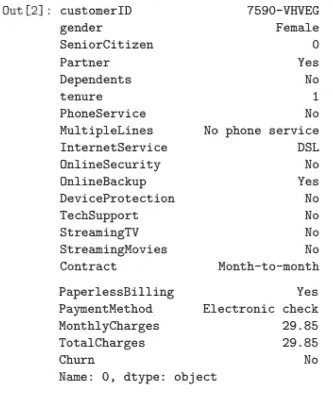

## 检查数据集

这个数据集相当干净，没有遗漏条目。总共有 7043 个观察值。大约有 27%的客户表示不满(这对电信公司来说不是一个好兆头)。

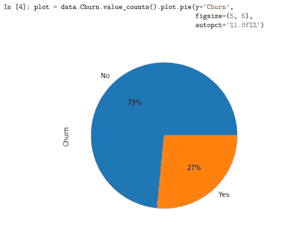

我们可以使用 pandas 的`info(), describe()`方法快速查看数据完整性。数据集没有任何缺失值。虽然熊猫把`SeniorCitizen`解读为连续变量，但实际上是一个二元指标。

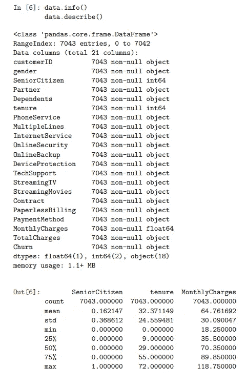

## 连续变量

我们可以使用 seaborn 库来进一步可视化和检查数据集。让我们先来考察连续变量`tenure, MonthlyCharges`。由于`TotalCharges`可以近似为这两个变量的函数，我们将把它从图中排除。

Seaborn 的 *pairplot* 功能绘制数据中的成对关系。

**解释配对图:**

*   对角线轴是特定变量的直方图，y 轴测量出现的次数
*   除了轴被翻转之外，图的左下方三角形和右上方三角形捕捉相同的信息

直方图告诉我们，流失客户的任期分布是右偏的，而流失客户的任期分布更加均匀。它还显示，拥有更高`MonthlyCharges`的客户会看到更高的流失率。

其他两个图表捕捉到非常相似的信息，橙色的“流失”和蓝色的“未流失”之间有明显的区别。

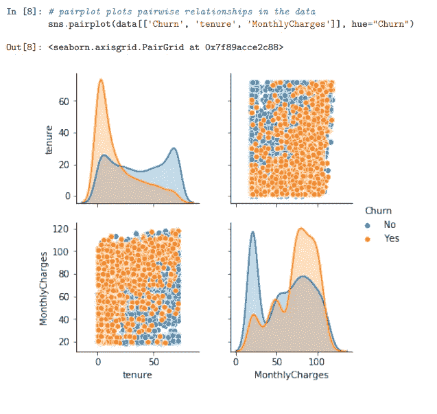

接下来，我们使用箱线图来说明流失客户和未流失客户之间的分位数差异。

第一个方框图比较了两组之间的任期分位数。流失客户的平均任期比未流失客户短得多。75%最终离开电信公司的客户都是在头 30 个月内离开的。在电信公司工作了 70 个月后，出现了一些异常情况。

第二个方框图比较了月度费用和流失率。流失客户的月平均费用明显高于没有流失的客户。这表明折扣和促销可能是吸引顾客留下来的一个原因。

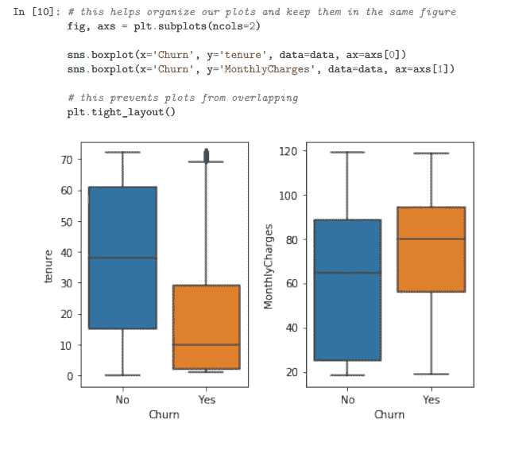

## 人口统计变量

接下来，我们可以检查分类变量，从人口统计变量开始:性别、老年人、伴侣和家属。

*   左上图统计了性别和流失之间的交集。男性和女性客户之间的流失率差异很小。
*   在`SeniorCitizen`(右上图)、没有`Partners`(左下图)和没有`dependents`(右下图)的客户中，流失率较高。

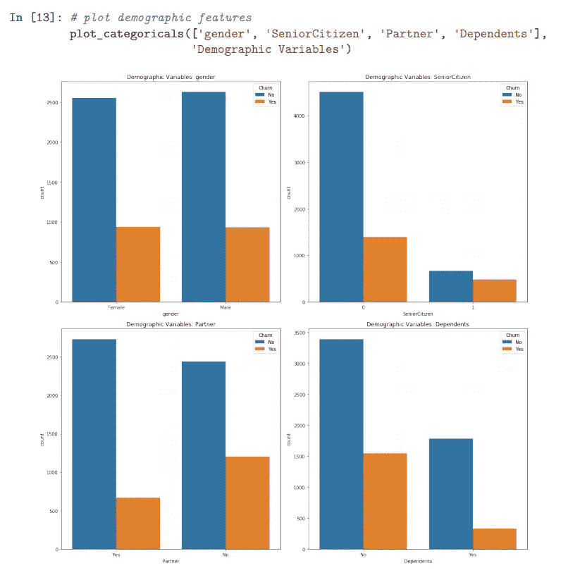

第二个发现可能会引起业务涉众的兴趣。没有伴侣和家属的非老年人描述了一个特殊的顾客群体。*与其他指标不同的是，这一人群中较低的人员流动频率对他们的终身价值有积极意义。*

## 其他分类变量

其他分类变量可以在服务和计费信息之间划分。

这些图表捕获了服务变量。没有在线安全、在线备份、设备保护和技术支持的客户流失比例更高。基于我对电信服务相当有限的了解，我认为大多数人不会经常为这些服务付费。这表明那些对电信服务越来越信赖的人，或者那些需要他们的设备用于特殊用途的人，倾向于减少流失。

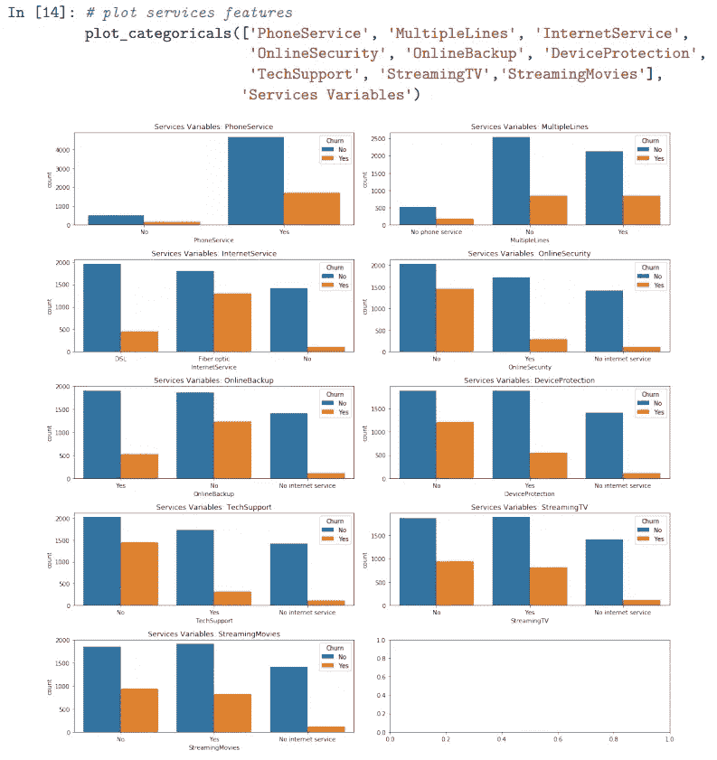

接下来，我们研究计费方法和客户流失之间的交集。左上方的图表比较了不同合同类型的客户流失情况。不足为奇的是，那些计划越短(逐月)的人流失率越高。那些有长期计划的人在提前取消时会面临额外的障碍。

令人惊讶的是，那些选择不使用纸质账单的人和那些使用电子支票支付的人一样更频繁地流失。其中一些行为可能会与其他变量混淆(例如，老年客户可能更喜欢纸质账单)。

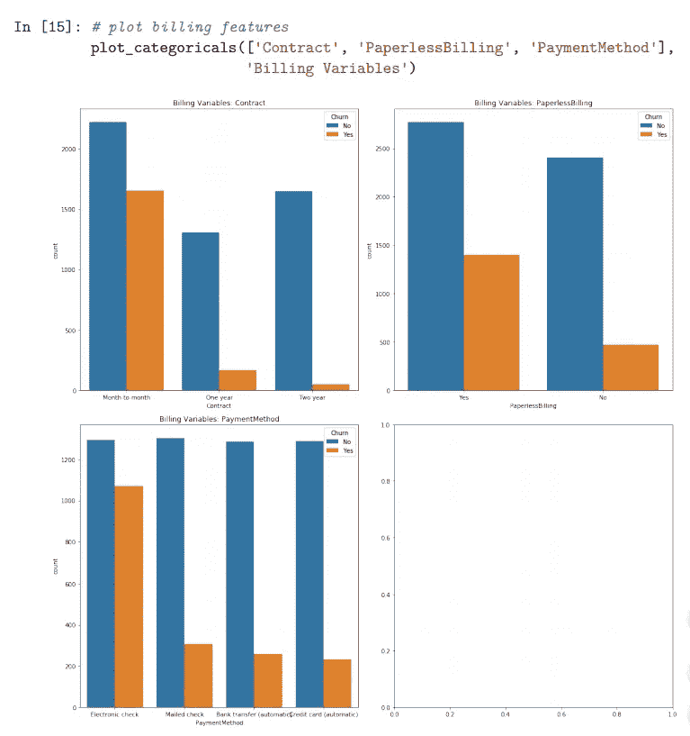

# 训练预测模型

这里是我们将要用来构建模型的库。我正在使用一个新的笔记本，所以我将再次加载数据。

在`TotalCharges`列中，11 条记录是一个空字符串。所有这些记录都有一个有效的`MonthlyCharges`值，但是期限为 0。我们可以用 0 来估算这些值。

## 为建模准备数据

首先，我们对分类变量进行热编码，并在训练和测试之间随机划分数据。在划分数据集之后，除了评估目的，我们不接触测试集。

## 特征选择

先前的探索已经给出了许多关于哪些特性是重要的信息。我们可以结合卡方检验来做出更明智的决定。

**注意:**卡方检验只能用于评估分类变量。

我们需要理解 p 值来解释卡方输出。

*如果零假设为真，并且我们多次重复相同的实验，P 值表示更多“极端”观察的百分比。这里的零假设是该特征对目标没有影响(即，我们不应该将其用作预测器)。低 p 值表明我们应该拒绝我们的零假设——换句话说，拒绝特征没有效果的说法。*

大多数要素的 p 值都非常低。只有`gender, MultipleLines, PhoneService`的 p 值>为 0.05，这意味着我们没有足够的证据来否定这些特征没有影响的说法。这与图表中的故事非常吻合。

为了更直观，让我们用 p 值> 0.05 来绘制所有分类变量。

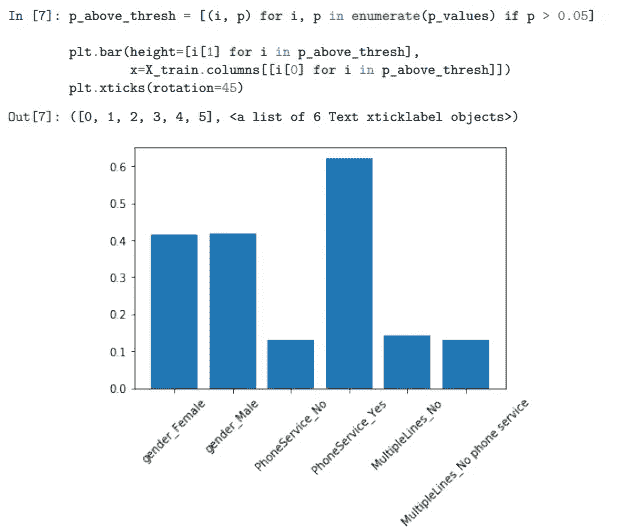

我们还将删除`TotalCharges`，因为同样的信息被`MonthlyCharges, Tenure`捕获，以进一步减少维度(其他两列似乎比这一列更可靠，这一列有数据问题)。

## 模特培训

我们将使用逻辑回归模型来预测流失。这可能不一定是性能最好的算法或分离数据最好的算法(找出答案的唯一方法是尝试)，但让我们假设它对于简化来说足够好。逻辑回归的另一个优点是易于解释。

我们可以利用 Sklearn 的`GridSearchCV`函数进行超参数调谐。。由于我们不想在最后才触及我们的测试集，我们将进一步把我们的训练集划分为训练和验证。

我们将使用网格搜索来确定这些超参数的最佳值:—我们是否应该使用 L1 或 L2 罚值—C 值—我们是否应该拟合截距类权重(我们是否应该更加强调流失类而不是非流失类)。

在幕后，GridSearchCV 将根据验证集训练和评估众多模型，以确定哪些超参数产生最佳性能。

**注意:**虽然我在这里没有这么做，但是`GridSearchCV`可以用来测试候选算法。

我们可以使用`grid.best_params_`找到最佳超参数值，在本例中为:

```
{'C': 1, 'fit_intercept': False, 'penalty': 'l1'}
```

有了这些信息，我们就可以正式训练我们的模型了。我们将在训练集和验证集上训练模型。

## 评估模型

让我们用我们的测试集来测试这个模型。分类报告给出了精度、召回率和 f1 值(支持是每一类中的观察数量)。微观 f1 分数为 0.81，而宏观 f1 分数为 0.74。

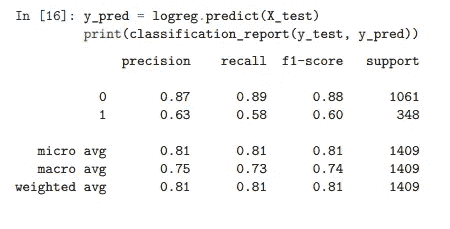

我们可以用混淆矩阵来形象化这个结果。

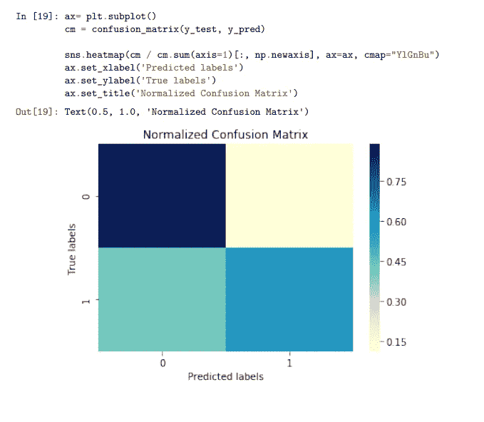

对于一个初始模型来说还不错。这个合成数据集非常简单:真实世界的电信公司可能会有超过 7000 个数据点。其他变量，如客户与支持人员的互动，可能有助于预测流失。

然而，这个数据集令人难以置信地干净，并带有一个我们在现实世界中经常找不到的良好的流失指示器。

# 感谢您的阅读！

如果你喜欢这篇文章，可以看看我关于数据科学、数学和编程的其他文章。[通过 Medium](https://medium.com/@mandygu) 关注我的最新动态。😃

作为一个业余爱好项目，我还在[www.dscrashcourse.com](http://www.dscrashcourse.com/)建立了一套全面的**免费**数据科学课程和练习题。

如果你想支持我的写作，下次你报名参加 Coursera 课程时，可以考虑使用我的[会员链接](https://click.linksynergy.com/fs-bin/click?id=J2RDo*Rlzkk&offerid=759505.198&type=3&subid=0)。完全公开—我从每一次注册中获得佣金，但不会对您产生额外费用。

再次感谢您的阅读！📕