# 使用 Matplotlib 实现全面的数据可视化

> 原文：<https://towardsdatascience.com/comprehensive-data-explorations-with-matplotlib-a388be12a355?source=collection_archive---------21----------------------->

## 深入研究电影镜头数据集


照片由[弗兰基·查马基](https://unsplash.com/@franki?utm_source=medium&utm_medium=referral)在 [Unsplash](https://unsplash.com?utm_source=medium&utm_medium=referral) 上拍摄

## 介绍

数据可视化是数据科学家工具包中的基本技能之一。有了正确的数据，拥有讲述令人信服的数据故事的能力可以为任何组织打开一个机会的金矿，为他们服务的任何人创造价值——别忘了让员工更有效率。

过去，我写过一些实现[有效数据可视化](/effective-data-visualization-ef30ae560961)的技巧，然而，在那篇文章中，我没有使用单一数据集来探索所有被分享的想法。因此，在这篇文章中，我们将使用我分享的技巧进行一些可视化，并深入研究 MovieLens 数据集。

[](/effective-data-visualization-ef30ae560961) [## 有效的数据可视化

### 编辑描述

towardsdatascience.com](/effective-data-visualization-ef30ae560961) 

要获得这篇文章中使用的全部代码，请访问我的 [Github](https://github.com/kurtispykes/recommender_system/blob/master/notebooks/01_kpy_explorations.ipynb) 库。

[](https://github.com/kurtispykes/recommender_system/blob/master/notebooks/01_kpy_explorations.ipynb) [## kurtispykes/推荐系统

### permalink dissolve GitHub 是超过 5000 万开发人员的家园，他们一起工作来托管和审查代码，管理…

github.com](https://github.com/kurtispykes/recommender_system/blob/master/notebooks/01_kpy_explorations.ipynb) 

## 数据

如前所述，我们将使用 MovieLens 数据集。具体来说，我们将使用 MovieLens 100K 电影评级数据集，该数据集由 1700 部电影的 1000 名用户组成。这些数据是通过 MovieLens 网站在 1997 年 9 月 19 日至 1998 年 4 月 22 日的 7 个月期间收集的。该数据已被清理—评分少于 20 或没有完整人口统计信息的用户已从该数据集中删除。

[](https://grouplens.org/datasets/movielens/100k/) [## MovieLens 100K 数据集

### MovieLens 100K 电影分级。稳定的基准数据集。1000 个用户对 1700 部电影的 100，000 次评分。已发布…

grouplens.org](https://grouplens.org/datasets/movielens/100k/) 

为了有效地执行我们的可视化，我们关注收集的 3 个特定数据集:

*   `u.data` —包含完整的数据集，943 名用户对 1682 个项目的 100000 个评分。
*   `u.item` —项目信息(电影)
*   `u.user` —用户的人口统计信息

在这个项目中，我使用了流行的数据科学库，如 Pandas 用于数据操作，Matplotlib 用于数据可视化，NumPy 用于处理数组。此外，我将 Python 的 datetime 模块用于一般的日历相关函数，将 IPython 用于交互式计算。

我们首先简单地导入框架并使用 Pandas `read_csv`加载数据——参见[文档](https://pandas.pydata.org/pandas-docs/stable/reference/api/pandas.read_csv.html)。

```
**import** numpy as np
**import** pandas as pd
**import** matplotlib.pyplot as plt 

**from** datetime **import** datetime
**from** IPython.display **import** IFrame

**import** warnings 
warnings.filterwarnings("ignore")# read data
rating_df= pd.read_csv("../data/u.data", sep="\t", names=["user_id", "item_id", "rating", "timestamp"])

item_df = pd.read_csv("../data/u.item", sep="|",encoding="latin-1", 
                      names=["movie_id", "movie_title", "release_date", "video_release_date",
                             "imbd_url", "unknown", "action", "adventure", "animation",
                             "childrens", "comedy", "crime", "documentary", "drama", "fantasy", 
                             "film_noir", "horror", "musical", "mystery", "romance", 
                             "sci-fi", "thriller", "war", "western"])

user_df = pd.read_csv("../data/u.user", sep="|", encoding="latin-1", names=["user_id", "age", "gender",
                                                                            "occupation", "zip_code"])
```

取提供给我们的 3 个数据帧:`u.data`、`u.item`和`u.user`，我们将它们转换成熊猫数据帧并存储在变量中，如下所示:

*   `rating_df` —保存用户给出的所有评级的完整 u 数据集
*   `item_df` —物品信息(电影)
*   `user_df` —关于用户的人口统计信息

## 交叉核对数据

我袖手旁观的一般经验法则是总是检查我被告知我被给予的正是已经被提供的。Pandas 通过`df.info()`和`df.head()`(或`df.tail()`)函数使识别这些事情变得容易，这些函数给我们提供了关于数据帧的更多信息，并允许我们看到数据的预览。

首先，我先看一下`rating_df`,我们预计会有 943 位用户对 1682 件商品给出 100000 个评价。

```
# peak at ratings_df
**print**(rating_df.info())
rating_df.head()<class 'pandas.core.frame.DataFrame'>
RangeIndex: 100000 entries, 0 to 99999
Data columns (total 4 columns):
 #   Column     Non-Null Count   Dtype
---  ------     --------------   -----
 0   user_id    100000 non-null  int64
 1   item_id    100000 non-null  int64
 2   rating     100000 non-null  int64
 3   timestamp  100000 non-null  int64
dtypes: int64(4)
memory usage: 3.1 MB
None
```


我们可以看到我们有 100000 个评级，但我们希望确保有 943 个用户和 1682 个项目。

```
# checking unique users
**print**(f"# of Unique Users: {rating_df['user_id'].nunique()}")# checking number of items
**print**(f"# of items: {rating_df['item_id'].nunique()}")# of Unique Users: 943
# of items: 1682
```

很好。我们可以确认`rating_df`确实拥有它所说的东西。然而，经过进一步检查，我注意到我们有一个时间戳变量，但它目前显示为一个`int64`数据类型。从自述文件中，我发现这个数据帧的时间戳列是从 1970 年 1 月 1 日开始的 unix 秒。因此，我们使用`Datetime`(一个 Python 内置的)将`timestamp`列的 Dtype 转换为`datetime64`。

```
# convert timestamp column to time stamp 
rating_df["timestamp"] = rating_df.timestamp.apply(lambda x: datetime.fromtimestamp(x / 1e3))

# check if change has been applied 
**print**(rating_df.info())
rating_df.head()<class 'pandas.core.frame.DataFrame'>
RangeIndex: 100000 entries, 0 to 99999
Data columns (total 4 columns):
 #   Column     Non-Null Count   Dtype         
---  ------     --------------   -----         
 0   user_id    100000 non-null  int64         
 1   item_id    100000 non-null  int64         
 2   rating     100000 non-null  int64         
 3   timestamp  100000 non-null  datetime64[ns]
dtypes: datetime64[ns](1), int64(3)
memory usage: 3.1 MB
None
```

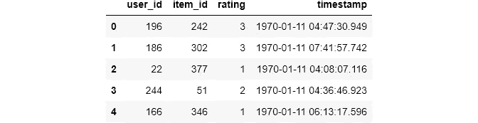

您现在可以在终端打印输出中看到`timestamp`列现在是数据类型`datetime64[ns]`。

现在我对`rating_df`已经很舒服了，我可以继续探索`item_df`了，我们希望它能给我们更多关于这部电影的信息。

```
# peak at items_df 
**print**(item_df.info())
item_df.head()<class 'pandas.core.frame.DataFrame'>
RangeIndex: 1682 entries, 0 to 1681
Data columns (total 24 columns):
 #   Column              Non-Null Count  Dtype  
---  ------              --------------  -----  
 0   movie_id            1682 non-null   int64  
 1   movie_title         1682 non-null   object 
 2   release_date        1681 non-null   object 
 3   video_release_date  0 non-null      float64
 4   imbd_url            1679 non-null   object 
 5   unknown             1682 non-null   int64  
 6   action              1682 non-null   int64  
 7   adventure           1682 non-null   int64  
 8   animation           1682 non-null   int64  
 9   childrens           1682 non-null   int64  
 10  comedy              1682 non-null   int64  
 11  crime               1682 non-null   int64  
 12  documentary         1682 non-null   int64  
 13  drama               1682 non-null   int64  
 14  fantasy             1682 non-null   int64  
 15  film_noir           1682 non-null   int64  
 16  horror              1682 non-null   int64  
 17  musical             1682 non-null   int64  
 18  mystery             1682 non-null   int64  
 19  romance             1682 non-null   int64  
 20  sci-fi              1682 non-null   int64  
 21  thriller            1682 non-null   int64  
 22  war                 1682 non-null   int64  
 23  western             1682 non-null   int64  
dtypes: float64(1), int64(20), object(3)
memory usage: 315.5+ KB
None
```


我们已经知道从`rating_df`开始我们的数据中有 1682 个唯一的条目，所以看到`movie_id`和`movie_title`列中有 1682 个非空条目让我不寒而栗。然而，`video_release_date`是完全空的，这意味着它没有为我们提供任何关于电影的信息，这意味着我们可以删除这个专栏。

我注意到`release_date`和`imbd_url`也丢失了一些值，但不足以让我们删除该列——如果最坏的情况发生，我们可以通过访问 IMBD 网站并使用电影标题找到`imbd_url`和`release_date`来手动估算这些值。

我的另一个所谓的“习惯”是，当我在读取数据时，考虑什么样的数据类型是期望的。我期望`release_date`是`datetime64`的数据类型，但是经过检查，它的数据类型是 object，所以我按照必要的处理步骤将一个对象转换为 datetime。

```
# drop empty column 
item_df.drop("video_release_date", axis=1, inplace= True)

# convert non-null values to datetime in release_date
item_df["release_date"] = item_df[item_df.release_date.notna()]["release_date"].apply(lambda x: datetime.strptime(x, "%d-%b-%Y"))

# check if change is applied
print(item_df.info(), item_df.shape)
item_df.head()<class 'pandas.core.frame.DataFrame'>
RangeIndex: 1682 entries, 0 to 1681
Data columns (total 23 columns):
 #   Column        Non-Null Count  Dtype         
---  ------        --------------  -----         
 0   movie_id      1682 non-null   int64         
 1   movie_title   1682 non-null   object        
 2   release_date  1681 non-null   datetime64[ns]
 3   imbd_url      1679 non-null   object        
 4   unknown       1682 non-null   int64         
 5   action        1682 non-null   int64         
 6   adventure     1682 non-null   int64         
 7   animation     1682 non-null   int64         
 8   childrens     1682 non-null   int64         
 9   comedy        1682 non-null   int64         
 10  crime         1682 non-null   int64         
 11  documentary   1682 non-null   int64         
 12  drama         1682 non-null   int64         
 13  fantasy       1682 non-null   int64         
 14  film_noir     1682 non-null   int64         
 15  horror        1682 non-null   int64         
 16  musical       1682 non-null   int64         
 17  mystery       1682 non-null   int64         
 18  romance       1682 non-null   int64         
 19  sci-fi        1682 non-null   int64         
 20  thriller      1682 non-null   int64         
 21  war           1682 non-null   int64         
 22  western       1682 non-null   int64         
dtypes: datetime64[ns](1), int64(20), object(2)
memory usage: 302.4+ KB
None (1682, 23)
```

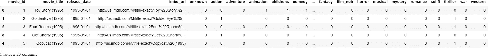

在我们的处理步骤之后，我们可以看到不再有`video_release_date`列，并且`release_date`现在显示为`datetime64`数据类型。

因为我们被提供了一些 URL，我认为利用这一点并使用来自`Ipython`库的`IFrame`查看`imbd_url`中的一些 URL 可能会很酷。

> **注意**:在`imbd_url`列中的 URL 可能会永久移动到一个新地址，或者在实施时关闭。此外，当我手动输入电影的 url 时，我无法连接到 IMBD 网页(即，我在 IFrame 中手动输入 copycat (1995) url，它返回拒绝连接-我还没有找到解决方法，但一旦找到，我会更新笔记本。与此同时，我只是简单地使用了 IMBD 主页的 url 来说明它是如何工作的——本质上，我们可以从笔记本上完全访问该网页。

```
# viewing random imbd_urls
IFrame("https://www.imdb.com", width=800, height=400)
```

[](https://www.imdb.com) [## IMDb:收视率，评论，以及在哪里看最好的电影和电视节目

### IMDb 是世界上最受欢迎和最权威的电影、电视和名人内容来源。查找评分和评论…

www.imdb.com](https://www.imdb.com) 

最后但同样重要的是，我们有`user_df`。如果您没记错的话，这是关于用户的人口统计信息，因此我预计会有 943 行，因为(特别是在`user_id`列中)我们已经确认数据中有 943 个唯一用户。

```
# peak at user data
print(user_df.info())
user_df.head()<class 'pandas.core.frame.DataFrame'>
RangeIndex: 943 entries, 0 to 942
Data columns (total 5 columns):
 #   Column      Non-Null Count  Dtype 
---  ------      --------------  ----- 
 0   user_id     943 non-null    int64 
 1   age         943 non-null    int64 
 2   gender      943 non-null    object
 3   occupation  943 non-null    object
 4   zip_code    943 non-null    object
dtypes: int64(2), object(3)
memory usage: 37.0+ KB
None
```


很好，我们可以确认我们有 943 个用户:总之，我们有 943 个用户对 1682 部电影的 10 万个评分。为了使笔记本中不同点的数据可视化简单，我决定将我们拥有的数据帧组合在一起——我将在 [PyTrix 系列](https://towardsdatascience.com/tagged/pytrix-series)中讨论如何在[组合数据](/pandas-combining-data-b190d793b626)中更好地实现这一点。

[](/pandas-combining-data-b190d793b626) [## 熊猫:组合数据

### 编辑描述

towardsdatascience.com](/pandas-combining-data-b190d793b626) 

```
# store full dataframe 
full_df = pd.merge(user_df, rating_df, how="left", on="user_id")
full_df = pd.merge(full_df, item_df, how="left", right_on="movie_id", left_on="item_id")
full_df.head()
```

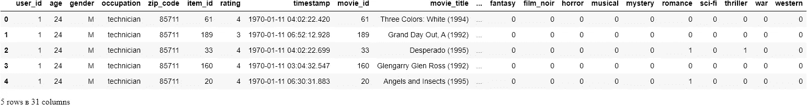

太棒了。我们已经成功地确认了预期的数据正是我们所拥有的。这些信息足以让我们更深入地研究数据并获得更好的理解。

## 提问，用数据回答

遵循[有效数据可视化](/effective-data-visualization-ef30ae560961)的协议，我的下一步是思考一些问题，让我更深入地了解手头的数据，然后确定可视化问题答案的最佳方法——最佳方法可以定义为表达问题答案的最简单明了的方式。

> 注:在这一部分，当我查询数据时，我的想法通常会跳跃。因此，在浏览数据时，我更喜欢使用 Jupyter 笔记本。

**收视率最高的 10 部电影有哪些？**

```
# return number of rows associated to each title
top_ten_movies = full_df.groupby("movie_title").size().sort_values(ascending=False)[:10]

# plot the counts
plt.figure(figsize=(12, 5))
plt.barh(y= top_ten_movies.index,
         width= top_ten_movies.values)
plt.title("10 Most Rated Movies in the Data", fontsize=16)
plt.ylabel("Moive", fontsize=14)
plt.xlabel("Count", fontsize=14)
plt.show()
```

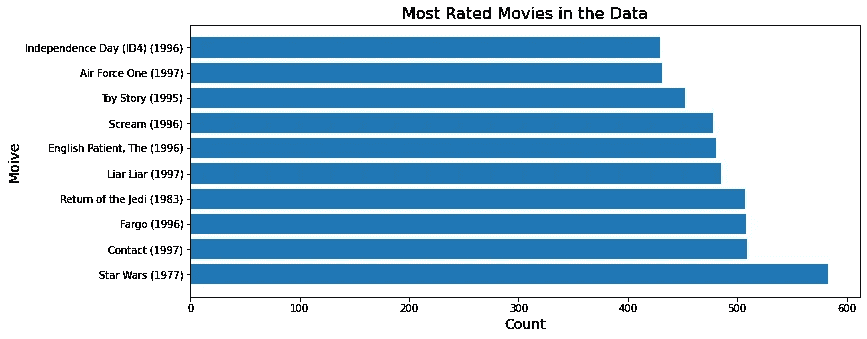

在我们的数据集中，*星球大战(1977)* 是评分最高的电影。这些信息非常有价值，因为我们可以决定使用我们数据集中评级最高的电影来推荐给新用户，以克服 [*冷启动问题*](https://en.wikipedia.org/wiki/Cold_start_(recommender_systems)#:~:text=Cold%20start%20is%20a%20potential,not%20yet%20gathered%20sufficient%20information.) *。*我们可以从这个问题中进一步研究我们的数据，并开始思考哪些类型的电影与评分最高的电影相关联——在这种情况下，我们只查看了与《星球大战》相关联的类型。

```
genres= ["unknown", "action", "adventure", "animation", "childrens", "comedy", "crime", "documentary", "drama", "fantasy", "film_noir", "horror", "musical", "mystery", "romance", "sci-fi", "thriller", "war", "western"]

full_df[full_df.movie_title == "Star Wars (1977)"][genres].iloc[0].sort_values(ascending=False)action         1
sci-fi         1
romance        1
adventure      1
war            1
western        0
documentary    0
animation      0
childrens      0
comedy         0
crime          0
fantasy        0
drama          0
film_noir      0
horror         0
musical        0
mystery        0
thriller       0
unknown        0
Name: 204, dtype: int64
```

我不是《星球大战》的主要粉丝，尽管我已经看过很多部，但我提到这一点只是为了确认将动作、科幻、冒险、战争和浪漫等类型联系起来对这部电影来说是正确的。

这个问题完全忽略了评分最低的电影，但是如果我们正在构建一个推荐系统，我们不能忽略评分较低的电影，因为可能有许多原因导致电影没有得到很多评分。让我们来看看数据集中评分最低的几部电影。

```
# the least rated movies 
least_10_movies = full_df.groupby("movie_title").size().sort_values(ascending=False)[-10:]
least_10_moviesmovie_title
Coldblooded (1995)                            1
MURDER and murder (1996)                      1
Big Bang Theory, The (1994)                   1
Mad Dog Time (1996)                           1
Mamma Roma (1962)                             1
Man from Down Under, The (1943)               1
Marlene Dietrich: Shadow and Light (1996)     1
Mat' i syn (1997)                             1
Mille bolle blu (1993)                        1
Á köldum klaka (Cold Fever) (1994)            1
dtype: int64
```

《生活大爆炸》对我来说是一个惊喜，除了我不熟悉其他电影——反正我不是一个电影人，所以这并不意味着什么。

**一个用户评价电影的最大/最小数量是多少？**

从数据集提供的自述文件中，我们被告知单个用户评级的电影的最小数量是 20，但是我们不知道单个用户评级的电影的最大数量。

```
movies_rated = rating_df.groupby("user_id").size().sort_values(ascending=False)
print(f"Max movies rated by one user: {max(movies_rated)}\nMin movies rated by one user: {min(movies_rated)}")Max movies rated by one user: 737
Min movies rated by one user: 20rating_df.user_id.value_counts().plot.box(figsize=(12, 5))
plt.title("Number of Movies rated by a Single user", fontsize=16)
plt.show()
```

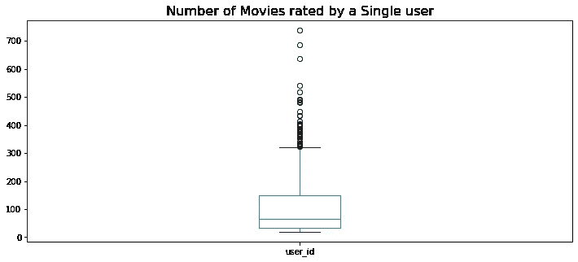

在数据集中，单个用户评级的电影的最大数量是 737 部——不管是谁，都是非常忠诚的电影观众和评级者——而某人评级的电影的中间数量是 70 部。有很多离群值已经评级超过 320 部电影，这是我从上面的情节中近似得出的极值。

每年发行多少部电影？

```
# create the year column from Movie title 
full_df["year"] = full_df["movie_title"].str.extract("\((\d{4})\)", expand=True)

# return number of rows by the year 
year_counts = full_df[["movie_title", "year"]].groupby("year").size()

fig, ax = plt.subplots(figsize=(12, 5)) 
ax.plot(year_counts.index, year_counts.values)
ax.xaxis.set_major_locator(plt.MaxNLocator(9)) # changes the number of xticks we see
plt.title("Number of movies per Annum", fontsize=16)
plt.xlabel("Year", fontsize= 14)
plt.ylabel("# of Movies Released", fontsize=14)
plt.show()
```

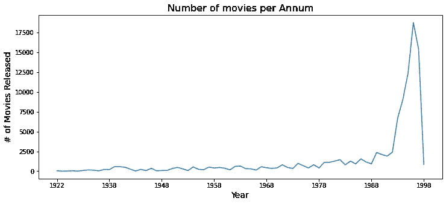

很难忽略 1988-1998 年间的大幅上涨和下跌。值得做一些研究，并向领域专家提问，以确定在此期间可能会发生什么。

**有多少男人/女人评价的电影？**

```
# count the number of male and female raters
gender_counts = user_df.gender.value_counts()

# plot the counts 
plt.figure(figsize=(12, 5))
plt.bar(x= gender_counts.index[0], height=gender_counts.values[0], color="blue")
plt.bar(x= gender_counts.index[1], height=gender_counts.values[1], color="orange")
plt.title("Number of Male and Female Participants", fontsize=16)
plt.xlabel("Gender", fontsize=14)
plt.ylabel("Counts", fontsize=14)
plt.show()
```

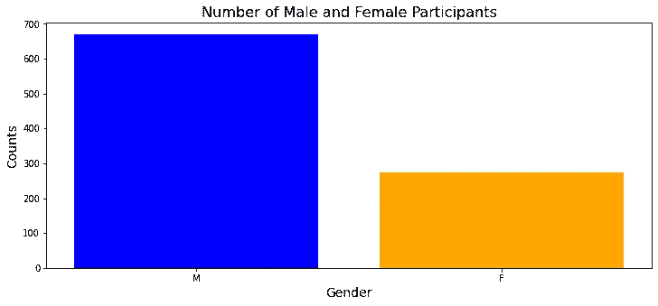

在这个样本中，男性明显比女性多得多，这可能会对所看电影的类型产生重大影响。

**最受男性和女性欢迎的电影类型是什么？**

```
full_df[genres+["gender"]].groupby("gender").sum().T.plot(kind="barh", figsize=(12,5), color=["orange", "blue"])
plt.xlabel("Counts",fontsize=14)
plt.ylabel("Genre", fontsize=14)
plt.title("Popular Genres Among Genders", fontsize=16)
plt.show()
```

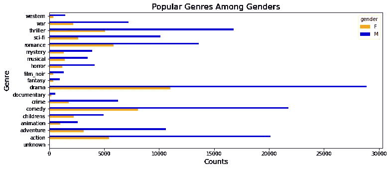

令我惊讶的是，男性和女性确实喜欢相似的类型。男女最受欢迎的类型是戏剧，其次是喜剧。当然，我们考虑到在这个数据集中男性比女性多，当我们考虑建立我们的推荐系统时，我们也必须考虑到这一点。

需要知道的是，当我们对评分者的年龄加以限制时，兴趣是否会发生变化。

**按性别划分，最受孩子欢迎的电影类型有哪些？**

> **注:**根据英国标准，成年人可以定义为> = 18 岁的人，因此儿童应该是< 18 岁。

```
full_df[full_df["age"] < 18][genres + ["gender"]].groupby("gender").sum().T.plot(kind="barh", figsize=(12, 5), color=["orange", "blue"])
plt.xlabel("Counts",fontsize=14)
plt.ylabel("Genre", fontsize=14)
plt.title("Popular Genres Among Children by Gender", fontsize=16)
plt.show()
```

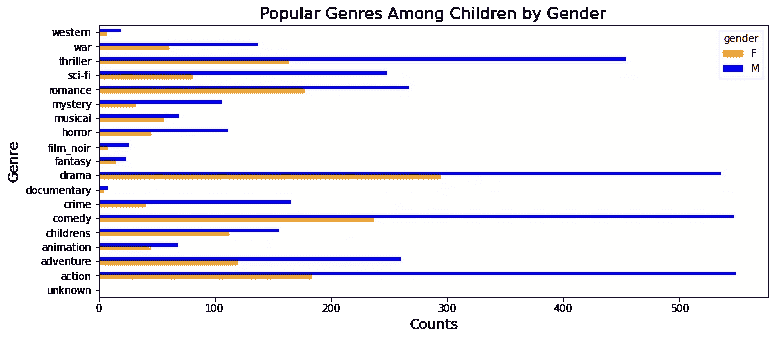

戏剧仍然很受 18 岁以下男性的欢迎，但更多 18 岁以下的男性更喜欢喜剧和动作片。另一方面，18 岁以下的女性几乎没有改变，仍然是戏剧和喜剧。

这些数字很有趣，但我想知道戏剧和喜剧在男性和女性中的流行是因为这些类型的电影通常被认为是最好的电影类型(因此它们获得了最多的观看和评级)，还是因为这些标签与最多的电影相关联。

**什么类型的电影最受欢迎？**

> **注**:一部电影可以有多种类型(例如，一部电影可以是动画、儿童和喜剧)

```
# get the genre names in the dataframe and their counts
label= item_df.loc[:, "unknown":].sum().index
label_counts= item_df.loc[:, "unknown":].sum().values# plot a bar chart
plt.figure(figsize=(12, 5))
plt.barh(y= label, width= label_counts)
plt.title("Genre Popularity", fontsize=16)
plt.ylabel("Genres", fontsize=14)
plt.xlabel("Counts", fontsize=14)plt.show()
```

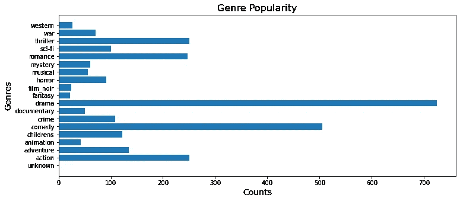

正如我所想，戏剧和喜剧标签与样本中的大多数电影相关联。也许电影制作人意识到我们需要笑声和一些戏剧，因此他们利用了这一点——这是我们可以研究的。

接下来，我们观察每个流派的平均收视率…

**各流派的收视率分布如何？**

> **注**:密度图用于观察数据集中变量的分布。

```
# https://github.com/HarilalOP/movielens-data-exploration/blob/master/src/main/code/exploratory_analysis.ipynb
df_temp = full_df[['movie_id','rating']].groupby('movie_id').mean()# Histogram of all ratings
df_temp.hist(bins=25, grid=False, edgecolor='b', density=True, label ='Overall', figsize=(15,8))# KDE plot per genre
for genre in genres:
    df_temp = full_df[full_df[genre]==True][['movie_id','rating']].groupby('movie_id').mean()
    df_temp.rating.plot(grid=True, alpha=0.9, kind='kde', label=genre)
plt.legend()
plt.xlim(0,5)
plt.xlabel('Rating')
plt.title('Rating Density plot')
plt.show()
```

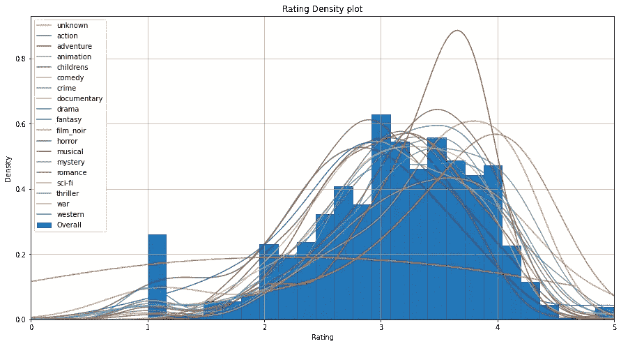

对于大多数类型来说，情节主要是向左倾斜的——这可能是因为用户更愿意评价他们喜欢的电影，因为如果他们不喜欢电影，人们不会真的看电影。我们必须进行一些研究，看看我们的情况是否如此。

好吧，最后一个情节比较复杂。我们可以通过更具体地观察用户来再次简化事情。

**按性别划分的年龄分布是怎样的？**

```
# creating new variable for ages of all males and females
female_age_dist = user_df[user_df["gender"] == "F"]["age"]
male_age_dist = user_df[user_df["gender"] == "M"]["age"]

# plotting boxplots 
plt.figure(figsize=(12,5))
plt.boxplot([female_age_dist, male_age_dist])
plt.xticks([1, 2], ["Female", "Male"], fontsize=14)
plt.title("Age Distribution by Gender", fontsize=16)

plt.show()
```

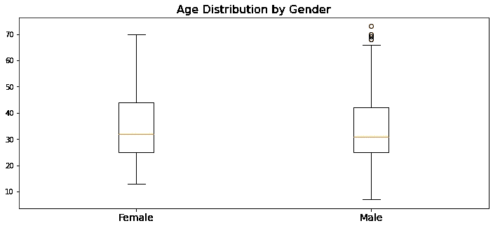

男性年龄分布有一些异常值，女性年龄中位数略高于男性。此外，女性年龄分布框比男性年龄分布框长，这意味着女性年龄分布比男性年龄分布更分散。

**用户中最常见的职业是什么？**

```
# creating the index and values variables for occupation
occ_label= user_df.occupation.value_counts().index
occ_label_counts = user_df.occupation.value_counts().values

# plot horizontal bar chart
plt.figure(figsize=(12,5))
plt.barh(y=occ_label, width=occ_label_counts)
plt.title("Most common User Occupations", fontsize=16)
plt.show()
```

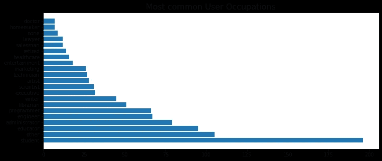

不足为奇的是，数据集中的大多数人是学生。我们来看看各职业给出的平均评分。

**给定职业的平均评分是多少？**

```
# creating a empty df to store data
df_temp = pd.DataFrame(columns=["occupation", "avg_rating"])

# loop through all the occupations 
for idx, occ in enumerate(occ_label):
    df_temp.loc[idx, "occupation"] = occ 
    df_temp.loc[idx, "avg_rating"] = round(full_df[full_df["occupation"] == occ]["rating"].mean(), 2)

# sort from highest to lowest
df_temp = df_temp.sort_values("avg_rating", ascending=False).reset_index(drop=True)
df_temp
```

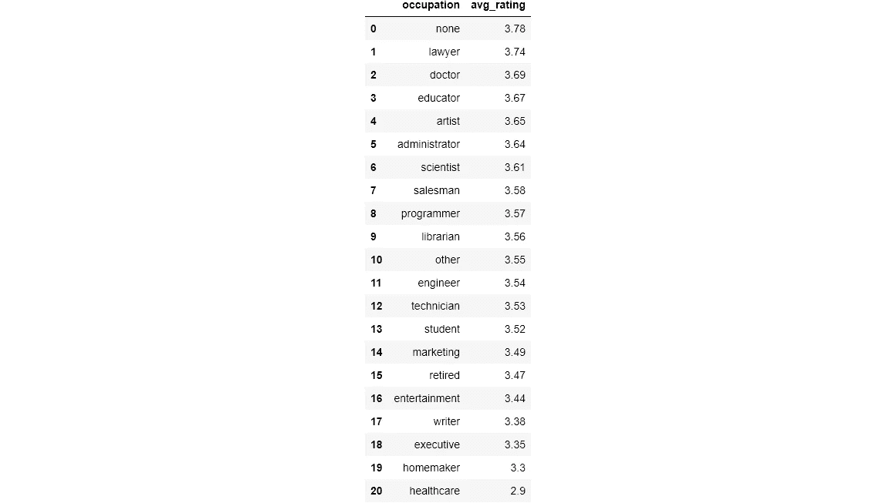

## 包裹

在这一点上停下来是困难的，因为我们可以从这些数据中提取更多的见解。我个人认为数据可视化并没有真正的尽头，所以应该由做可视化的人来决定何时停止。一个好的指标可能是当我们相信我们已经对数据有了足够的了解，可以开始建立一个有效的基线模型(如果我们还没有的话)。在构建模型时，我们可以随时返回并迭代我们的可视化，以基于我们的模型预测从我们的数据中获得更多的洞察力。

本文使用`jupyter_to_medium`制作。

[](/publishing-to-medium-from-jupyter-notebooks-53978dd21fac) [## 从 Jupyter 笔记本发布到媒体

### 在媒体上创建技术职位的更有效方法

towardsdatascience.com](/publishing-to-medium-from-jupyter-notebooks-53978dd21fac) 

让我们继续 LinkedIn 上的对话…

[](https://www.linkedin.com/in/kurtispykes/) [## Kurtis Pykes -人工智能作家-走向数据科学| LinkedIn

### 在世界上最大的职业社区 LinkedIn 上查看 Kurtis Pykes 的个人资料。Kurtis 有两个工作列在他们的…

www.linkedin.com](https://www.linkedin.com/in/kurtispykes/)