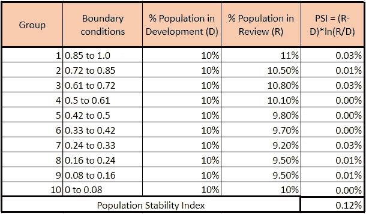
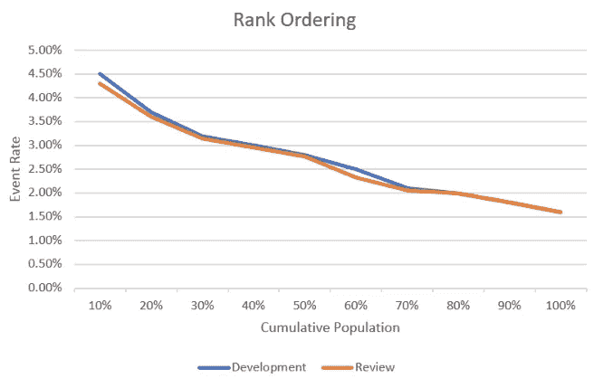

# 监控二元类最大似然预测模型

> 原文：<https://towardsdatascience.com/comprehensive-guide-for-ml-model-monitoring-4ab4f66faf70?source=collection_archive---------27----------------------->

## 回顾 ML 模型的稳定性和性能

克里斯·利维拉尼在 [Unsplash](https://unsplash.com/s/photos/monitoring?utm_source=unsplash&utm_medium=referral&utm_content=creditCopyText) 上的照片

# **简介:**

随着技术和技能的进步，越来越多的公司开始对机器学习(ML)模型表现出信心。这反过来意味着越来越多的组织已经开始在他们的各种业务功能中使用 ML 模型。它在 ML 管道中开辟了另一条工作线，叫做“模型监控和模型评审”。ML 渠道中的这一系列工作对于具有高*再培训*周转时间的模型变得极其重要，银行领域的 ML 模型就是一个例子。在这种情况下，模型被训练一次，并被用于定期预测，例如，被训练一次的信用卡使用模型可以被营销团队用于每周/每月预测一组新的观察值。那么问题来了，我们如何知道 6 个月前训练好的模型仍然足够好？这种模式有多“稳健”？在本文中，我将尝试为二元类预测模型回答这些问题。

在本文中，我们将以贷款占用预测模型为例。该模型预测每个客户为 1 或 0。

> 1:客户将在未来 30 天内接受贷款，
> 
> 0:客户在未来 30 天内不会接受贷款

## **车型回顾:**

该模型评审框架不知道用于构建该模型的 ML 技术。

总的来说，模型评审框架可以分为两组指标，“稳定性指标”和“性能指标”。

1.  **稳定性指标:**

*答:人口稳定指数*

*b .特征稳定性指数(CSI)*

**2。绩效指标:**

*a .基尼系数和基尼系数——统计数据*

*b .增益矩阵:增益图，等级排序*

## **数据集:**

对于审查过程，我们需要两个数据集:

**A .开发数据集:**构建模型的原始数据集。该数据集中需要的字段有:

*i .唯一观察标识符，如果模型是为客户建立的，它可以是客户 ID*

*二。实际因变量标志(实际 0 和 1)表示客户是否将在未来 30 天内贷款*

*三世。模型开发期间的预测概率值*

**B .查看数据集:**要查看模型的数据集。例如，我们假设贷款占用模型是基于 2019 年 1 月的一些数据和一组变量构建的，您希望检查 2019 年 6 月的模型有多稳健，那么在这种情况下，审查数据集将具有模型对 6 月做出的预测。该数据集需要的字段有:

*一、唯一标识符*

*二世。实际因变量标志(实际 0 和 1)表示客户是否将在未来 30 天内贷款*

*三。预测概率值*

## **指标:**

为了检查模型性能有多好，我们将跨开发和审查数据集计算以下指标。

## **稳定性指标:**

稳定性度量测量模型相对于时间的稳定性。这些指标主要评估预测概率的分布在多个预测中是否具有可比性。

## **1。PSI:**

PSI 代表人口稳定指数。它基本上将回顾数据集中的预测概率分布与开发数据集中的预测概率分布进行比较。这里的想法基本上是检查，“评审概率如何与开发数据集的概率相比较”。

> *PSI = [(基于审查数据集(R)中预测概率的记录百分比)–*
> 
> *(基于开发数据集(D)中预测概率的记录百分比)】* ln(R/D)*

**计算 PSI 的步骤:**

1.  按照预测概率降序排列开发数据集
2.  将数据集分成 10 或 20 组(十分位数)
3.  计算每组观察值的百分比(D)
4.  对于步骤(2)中形成的每个组，找到概率值的最小值和最大值，基本上计算开发数据集中每个组的边界值
5.  用这些概率边界值在审查数据集中形成 10 组，计算每组审查数据集中的观察值百分比(R)
6.  计算步骤(5)和步骤(3)之间的差值，即(R-D)
7.  取步骤(v)/步骤(iii)的自然对数，即 ln(R/D)
8.  将步骤(6)和(7)相乘
9.  对步骤(8)中得到的所有行的值求和，求和值为 PSI

***从 PSI 推断:***

*   *如果****PSI<0.1****则没有变化，模型是健壮的，可以继续使用现有的模型*
*   *如果****PSI>= 0.1****和< 0.2，则需要对型号*稍加改动
*   *如果****PSI>= 0.2****那么你应该重新训练该型号*

十分位数人口稳定指数表。

## **2。老何:**

CSI 代表特征稳定性指数。如果 PSI 超出可接受的值范围，CSI 可以帮助我们了解哪些变量导致了审查数据集中概率分布的变化。CSI 的计算方法与 PSI 完全相同。我们不再考虑模型预测的概率，而是一次取一个独立变量，以完全相同的方式计算 CSI。

## **性能指标:**

## **1。基尼系数和基尼系数——统计:**

**基尼:**基尼系数或基尼指数衡量一个变量的值之间的不平等。指数值越高，数据越分散。因此，根据预测概率计算的基尼系数给出了基尼系数的离散程度。可以计算发展和审查数据集的基尼系数。两个基尼值之间的差异应该尽可能小。基尼系数的详细解释和计算方法在[这里](/gini-coefficient-and-lorenz-curve-f19bb8f46d66)有解释。预测概率的基尼系数可以通过为两个十进制舍入概率值(即 0.00、0.01、0.02、0.03)创建 101 个相等的观察组来计算，然后遵循这里提到的步骤。

**KS 统计:** KS 统计代表 Kolmogorov Smirnov 统计。这是一种衡量积极因素(事件或 1)与消极因素(非事件或 0)的区分程度。如果 KS 值为 100%(或 1)，这意味着模型能够将群体分成两组，其中一组包含所有阳性，另一组包含所有阴性。在这个模型评审框架中，为开发和评审数据集计算 KS 统计。KS 值的差异应该尽可能小。详细的分步计算可以在[这里](https://www.analyticsvidhya.com/blog/2019/08/11-important-model-evaluation-error-metrics/)找到。

***从基尼和 KS 推断:***

*开发和评审数据集之间的 Gini 和 KS 之差应小于 10%。如果该值大于 10%，我们需要重新训练模型。*

## **2。增益矩阵:**

增益和提升图是众所周知且易于使用的模型评估框架。它们衡量的是，与没有模型的情况相比，使用预测模型的情况会好到什么程度。创建收益矩阵的步骤计算如下(遵循开发和审查数据的步骤，一次一个)

1.  按照贷款吸收预测概率值的降序对数据集进行排序
2.  将数据集分成 10 等份
3.  计算每十分位数的观察次数
4.  计算每十分位数中实际阳性的数量(事件或 1)
5.  计算每十分位数中实际阳性的累积
6.  计算每十分位数中实际事件的百分比，获得分数
7.  计算事件发生率，即每十分位数/观察总数中的累积事件

你可以在这里找到详细的步骤和 Python 代码来计算同样的[。](/how-to-determine-the-best-model-6b9c584d0db4)

**执行上述开发和审查数据集的步骤。**

***a .增益分数*** *:* 开发和评审数据集的绘图增益分数与累积人口百分比。这两种趋势应该是相似的，相互接近的。

***b .等级排序*** *:* 地块事件发生率与累计人口百分比，再次为开发和评审数据集，且趋势应相互接近。

***从增益矩阵推断:***

*增益得分和等级排序图在开发和审查数据集中应具有相同的趋势。我们得出的每组 10 个十分位数之间的差值应该在 5%的范围内。如果这些值相差超过 5%，则需要再次训练该模型。*

# **结论:**

PSI、基尼系数、KS 统计和增益矩阵给出了如何在不同的预测概率得分值之间分布观察值的概念。如果评审数据集中的这些度量反映了它们在开发数据集中的值，那么模型就像预期的那样执行。或者，如果评审数据集中的这些度量与开发数据集中的不同，您需要重新训练您的模型。

# 参考资料:

1.  [https://www . LinkedIn . com/pulse/credit-risk-score card-monitoring-tracking-shailendra](https://www.linkedin.com/pulse/credit-risk-scorecard-monitoring-tracking-shailendra)
2.  [https://towards data science . com/Gini-coefficient-and-Lorenz-curve-f 19 bb 8 f 46d 66](/gini-coefficient-and-lorenz-curve-f19bb8f46d66)
3.  [https://www . analyticsvidhya . com/blog/2019/08/11-重要-模型-评估-错误-度量/](https://www.analyticsvidhya.com/blog/2019/08/11-important-model-evaluation-error-metrics/)
4.  [https://towards data science . com/how-to-determine-the-best-model-6b 9 c 584d 0 db 4](/how-to-determine-the-best-model-6b9c584d0db4)
5.  [https://unsplash.com/photos/dBI_My696Rk](https://unsplash.com/photos/dBI_My696Rk)