# 基于项目的协同过滤综合指南

> 原文：<https://towardsdatascience.com/comprehensive-guide-on-item-based-recommendation-systems-d67e40e2b75d?source=collection_archive---------1----------------------->

## 关于基于项目的推荐系统如何工作以及如何在实际工作环境中实现它的详细指南。

推荐系统已经存在很长时间了。Youtube、脸书、亚马逊和许多其他网站向他们的用户提供某种推荐。这不仅有助于他们向用户展示相关产品，还能让他们在竞争对手面前脱颖而出。

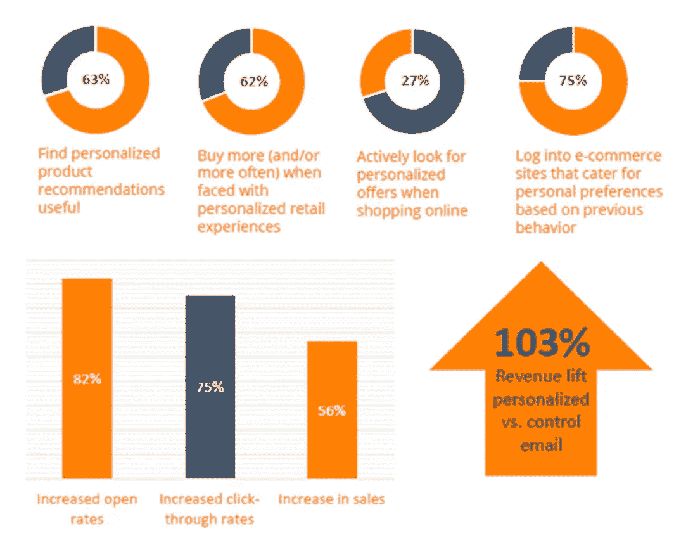

个性化体验对业务 KPI 的影响(来源 [bluevenn](https://www.bluevenn.com/blog/personalized-marketing-works)

一种向用户推荐项目的技术是基于项目的推荐系统，也称为项目-项目协同过滤或 IBCF。在本指南中，我们将介绍该算法的所有细节，其背后的实际数学将在 R 中实现，首先不使用任何库，这将有助于理解该算法如何适应数据集，然后使用 recommenderlab(一个 R 包)实现该算法，以展示在真实环境中如何工作。

*如果你也对评估推荐系统的性能感兴趣，看看* [*这篇文章解释了如何评估推荐系统的性能*](/an-exhaustive-list-of-methods-to-evaluate-recommender-systems-a70c05e121de) *。*

# 项目—项目协同过滤

项目-项目协同过滤是一种基于用户已经喜欢或积极互动的项目寻找相似项目的推荐方法。它是亚马逊在 1998 年开发的，对亚马逊的成功起了很大的作用。

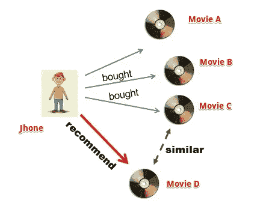

Sidharth 在 [spatnaik77](https://spatnaik77.wordpress.com/2013/07/17/recommendation-engine/) 上拍摄的照片

IBCF 的工作原理是，它根据用户以前消费过的商品来推荐商品。它查找用户已经消费过的商品，然后找到与消费过的商品相似的其他商品并相应地推荐。

我们用一个例子来理解这个。假设我们的用户 Jhone 想要购买一部电影 DVD。我们的工作是根据他过去的喜好给他推荐一部电影。我们会先搜索 Jhone 看过或者喜欢过的电影，我们姑且把那些电影称为‘A’、‘B’、‘C’。接下来，我们将搜索与三部电影相似的其他电影。假设我们发现电影“D”与“C”高度相似，因此，约翰很有可能也会喜欢电影“D ”,因为它与约翰已经喜欢过的电影相似。因此，我们将向约翰推荐电影《D》。

因此，IBCF 的核心就是寻找与用户已经喜欢的商品相似的商品。但是如何找到相似的物品呢？如果有多个相似的项目，那么应该先推荐哪个项目呢？为了理解这一点，让我们首先理解过程背后的直觉，这将帮助我们理解 IBCF 推荐过滤背后的数学原理。

*如果你想更深入地了解基于项目的过滤，我建议从* [***这个课程开始***](https://bit.ly/35YPdOj) *。导师不仅解释了算法的所有细节，还用真实世界的例子解释了它的应用，这对任何想在推荐系统领域进步的人都是有价值的。*

## 查找项目之间的相似性

假设我们有一个用户和他们对电影的评分表([链接](https://docs.google.com/spreadsheets/d/1ylQyvq7slR0Vjj9hX4VkpFAnidaPRhnv/edit#gid=1064688900)):

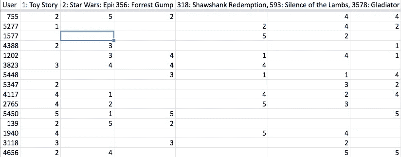

评级数据集(由 Muffaddal 提供)

让我们挑选两部电影(Id 1:玩具总动员和 Id 2:星球大战),我们必须计算它们的相似度，即这两部电影在用户相似度方面有多少可比性。为了计算这一点，我们将:

首先将两部电影的多个评分互相比较，然后将结果相加。让我们称这个值为' **A'** 。

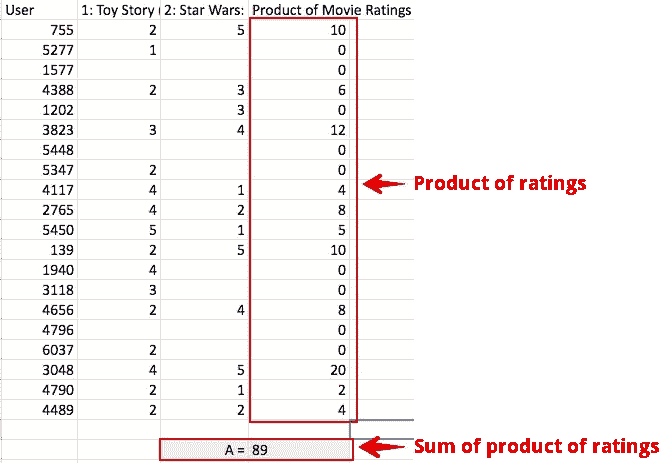

两个用户评级的乘积(由 Muffaddal)

其次，我们将对电影评分的平方求和，然后求它们的平方根。因此，平方所有电影 1 的评级，将它们相加，然后取平方根得到最终值(对电影 2 做同样的操作)。这样做将得到两个值，即电影 1 和电影 2 的平方根值。将两个值相乘。我们称这个最终值为' **B'**

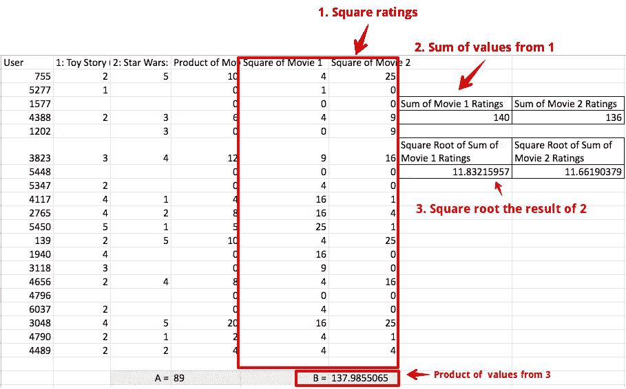

等级平方和的平方根(由 Muffaddal)

第三，将 A 和 B 分开，这将得到一个分数，表明电影 1 和电影 2 彼此有多接近([链接](https://docs.google.com/spreadsheets/d/1ylQyvq7slR0Vjj9hX4VkpFAnidaPRhnv/edit#gid=602195593))。

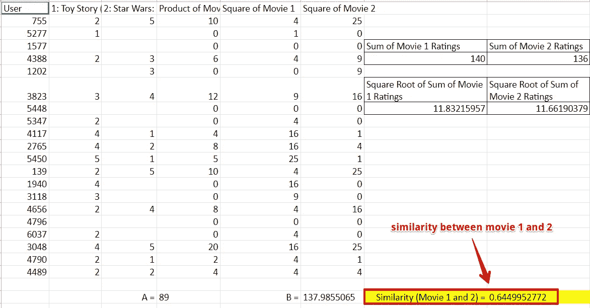

电影 1 和 2 的相似之处(穆法达尔)

对所有电影重复上述过程将产生一个表格，其中包含每部电影之间的相似之处(通常我们称之为项目)。

下面是如何用数学形式描述上述过程的。

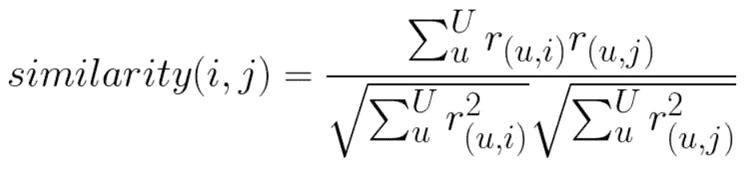

相似性方程(Muffaddal)

不要被这个公式看起来有多疯狂所压倒。这真的很简单，也正是我们在上面的 excel 练习中所做的。让我们一点一点的分解，来理解这些怪异的符号是什么意思。

在字母上加一些标签将有助于理解等式的每一部分。

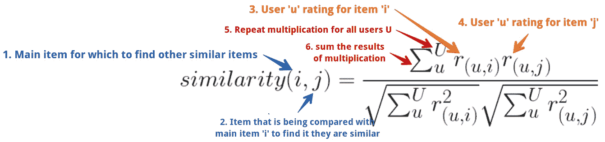

余弦相似方程(Muffaddal)

从标签 1(左边的蓝色)开始，上面说明了为了计算项目“I”和项目“j”之间的相似性(将“I”和“j”视为电影 id 1 和 2)，将用户“u”给出的项目“I”和“j”的所有评级相乘并求和。将结果除以用户“u”给出的各个项目的评分平方和的平方根乘积。

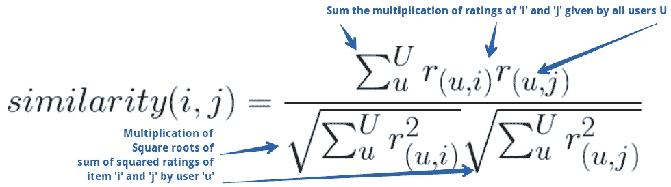

余弦相似方程(Muffaddal)

这正是我们在上面的 excel 练习中所做的。对以上所有项目进行迭代将产生一个值列表，该列表将指示其他项目与我们的主项目“I”的接近程度。这种方法也被称为余弦相似度。它有助于计算两个向量之间的距离。

余弦相似性是可行的，但是它没有考虑用户的乐观行为。不同的用户可以根据他们的乐观程度对相同的项目做出不同的评价。在 5 的尺度上，一个人可以给一个项目评分 5，而另一个人可以给 3，即使他们都非常喜欢这个项目。为了说明这一点，我们必须对我们的相似性公式做一个小小的改变。它看起来是这样的:

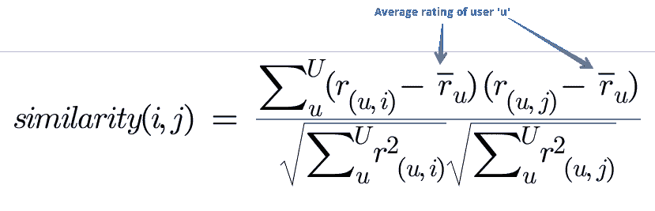

调整后的余弦相似性方程(Muffaddal)

用用户的平均评分减去给定项目的用户评分，将评分标准化到相同的等级，并有助于克服乐观主义问题。我们称之为调整余弦相似度。

还有一种类似的方法，不是减去用户的平均评分，而是减去项目的平均评分。这有助于了解给定用户评分与平均项目评分的偏差。这种技术被称为皮尔逊相似度。余弦和皮尔逊都是广泛使用的计算相似性的方法。

将调整后的余弦相似性方程应用于项目评级将生成一个表格或矩阵，显示一个项目与另一个项目的相似程度。它应该是这样的:

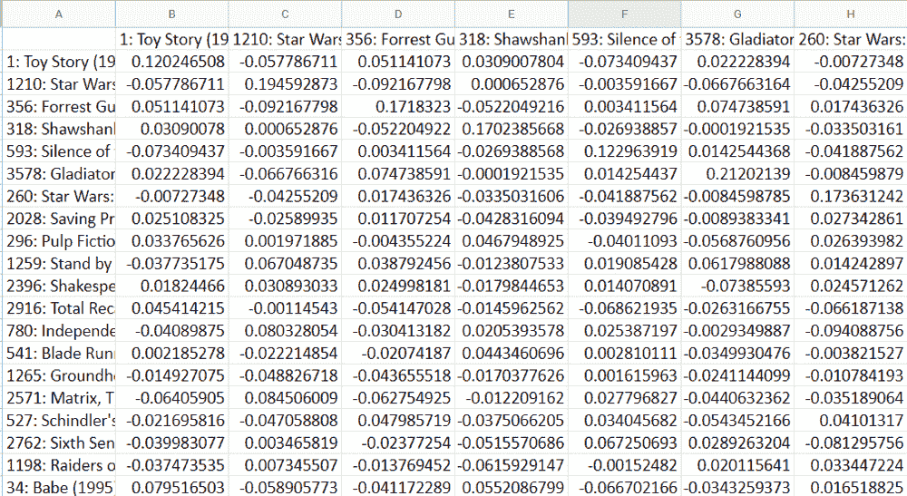

调整后的相似性矩阵(由 Muffaddal)

## 计算推荐得分

一张相似物品的桌子已经完成了一半的工作。我们知道哪些项目是可比较的，但我们还没有解决从相似项目列表中向用户推荐哪些项目的问题。为此，必须将我们的相似度矩阵与用户过去的评分项目历史结合起来，以生成一个推荐。这很容易通过应用 IBCF 方程来实现。

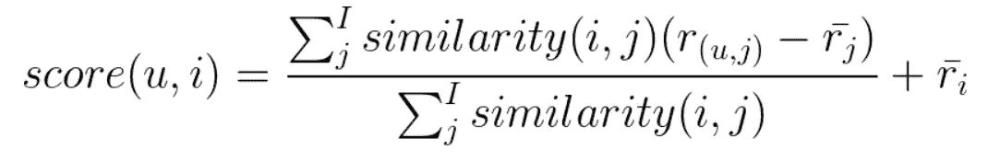

基于项目的推荐系统方程(Muffaddal)

> u =我们正在为其生成推荐的用户
> i =考虑中的项目，即该项目是否应该被推荐
> score(u，i) =生成一个分数，该分数将指示项目‘I’对我们的用户‘u’的推荐有多强。
> j =与主要项目 I 相似的项目

上面的等式得出，为了计算用户“u”的项目“I”的推荐分数，将项目“I”和“j”的相似性与用户“u”对项目“j”给出的评级和项目“j”的平均评级之差的乘积求和。将结果除以项目“I”和“j”的相似度之和，将输出与用户“u”的平均评分相加。

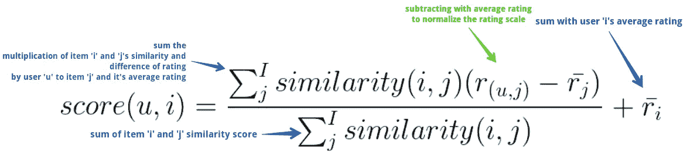

基于项目的推荐系统方程(Muffaddal)

这样做将为用户和可用项目生成一个得分矩阵。可以向用户推荐得分最高的项目。

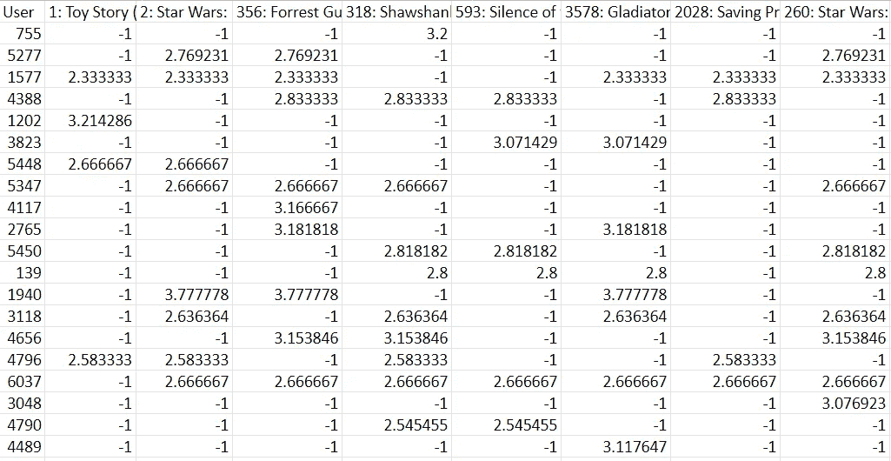

用户方程的推荐分数矩阵(Muffaddal)

# 使用 R 实现 IBCF

让我们看看上面使用 R ( [代码链接](https://github.com/muffaddal52/Item-Based-Collaborative-Recommendation-System/blob/master/Item-Item%20Collaborative%20Filters.R))的操作。这将使我们进一步了解 IBCF。

注意:我们将使用循环和数据帧来实现 IBCF，因为我们知道 R 在循环中相当慢，而矩阵的行/列乘法比数据帧快。原因是这个练习的主要目的是帮助理解 IBCF 是如何使用编程实现的，我们对编写健壮的代码不感兴趣。将在本文的第三部分展示一种更快的替代方法。

说到这里，让我们开始加载所需的库和[电影分级数据集](https://docs.google.com/spreadsheets/d/1ylQyvq7slR0Vjj9hX4VkpFAnidaPRhnv/edit#gid=1064688900)。

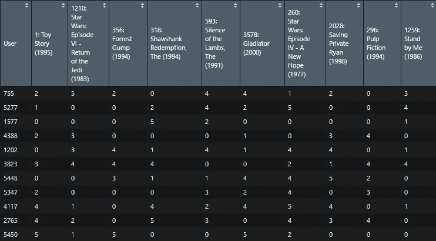

R 中的评级数据集(由 Muffaddal)

为了根据电影评分计算 IBCF，首先，我们将通过用用户的平均评分减去项目评分来计算标准化评分。这将使评级标准化到相同的等级。

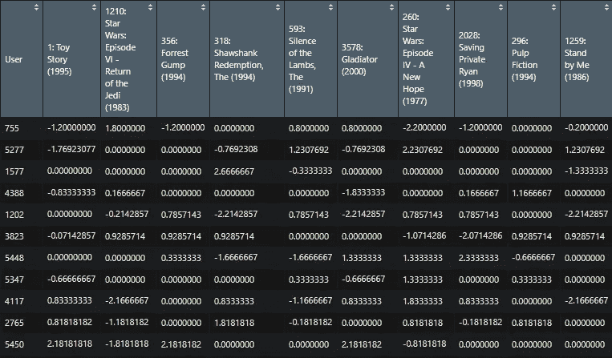

R 中的归一化评级矩阵(由 Muffaddal)

接下来，我们将通过将实际评分和标准化评分传递给我们的“calCosine”函数来计算每个项目的相似度。

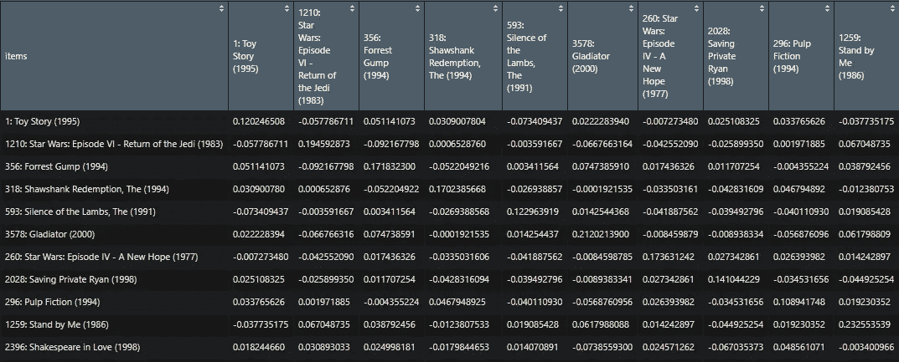

R 中调整的相似矩阵(由 Muffaddal)

现在是时候通过迭代每个用户和项目来计算每个用户的推荐分数了。在每次迭代中，首先，我们将计算用户的平均评分，这将用于计算分数，其次，我们检查项目是否由用户评级，如果评级，那么我们存储-1，因为我们只对推荐用户没有评级或不喜欢的项目感兴趣。

如果该项目没有评级，然后我们抓住前 10 个项目类似于我们的给定项目使用相似性矩阵，我们计算以上。然后，我们获取用户对这些相似项目的评分。我们还将计算类似项目的平均评级，以便将其与项目的评级相减。

最后，我们将传递一个类似的项目列表，类似项目的用户评级历史列表，以及类似项目的平均评级到我们的' calScore '分数函数。结果将添加到用户的平均评分中。这样做将产生分数，该分数将指示向哪个用户推荐哪个项目。分数越高，用户购买该商品的可能性越大。

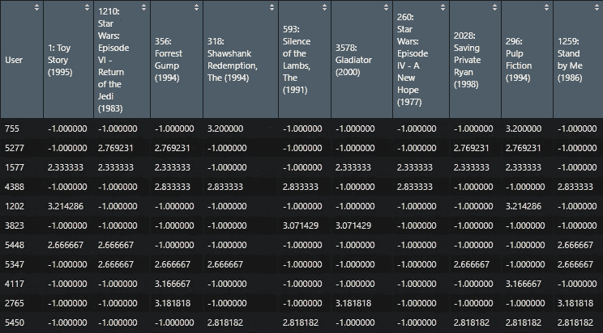

R 中的推荐分数(由 Muffaddal 提供)

预测推荐分数有助于理解和建议项目，但我们可以通过用项目名称替换分数来进一步改善结果的显示方式。下面是怎么做的。

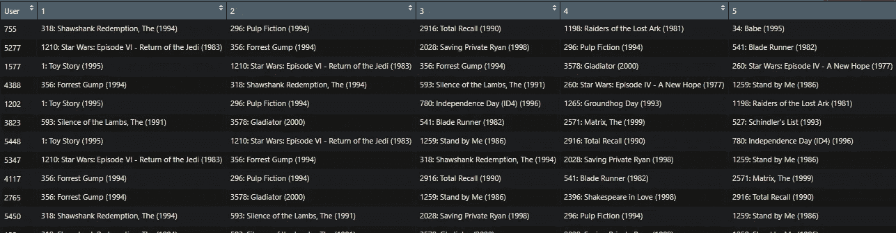

R 中的推荐项目(Muffaddal)

实现以上内容将增强我们对推荐系统如何工作的理解。但是上面的代码效率不高，而且相当慢。有许多 R 包，使用它们我们可以毫无困难地实现推荐过滤。一个这样的包是[推荐者实验室](https://cran.r-project.org/web/packages/recommenderlab/recommenderlab.pdf)。

# 利用推荐实验室实现 IBCF

现在，让我们使用推荐者实验室来实现 IBCF。

recommenderLab 在“真实评级矩阵”数据集上工作，因此我们必须首先将我们的数据框架转换成它。

接下来，我们将数据集分为训练集和测试集。我们将使用训练集来为 IBCF 建立模型，并在测试集上评估其结果。

是时候使用 recommenderLab 实现项目-项目推荐系统了

就是这样。这一行代码计算了我们用自己的 R 代码实现的所有内容。

当我们提供训练数据时，这是我们的模型所预测的

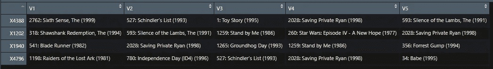

使用 recommenderLab 推荐的项目(Muffaddal)

# 结论

项目-项目协同过滤是一种推荐系统，它基于使用用户给项目的评级计算的项目之间的相似性。它有助于解决基于用户的协作过滤器所遇到的问题，例如当系统有许多项目而评价的项目较少时。IBCF 的计算强度也不如 UBCF。实现 IBCF 有助于构建一个强大的推荐系统，可以用来向用户推荐商品。

## 相似读取

 [## 评估推荐系统的详尽方法列表

### 本文解释了一些评估推荐系统性能的技术。

towardsdatascience.com](/an-exhaustive-list-of-methods-to-evaluate-recommender-systems-a70c05e121de)  [## 使用 BigQuery ML 进行 RFM 分析

### 使用 BigQuery ML 中的 RFM 分析和 Data Studio 中的可视化进行用户细分。

towardsdatascience.com](/rfm-analysis-using-bigquery-ml-bfaa51b83086) 

## 参考

[1]评级数据:

 [## IBCF -电影评分. xlsx

### 收视率用户，1:玩具总动员(1995)，2:星球大战:第六集-绝地归来(1983)，356:阿甘正传(1994)，318…

docs.google.com](https://docs.google.com/spreadsheets/d/1ylQyvq7slR0Vjj9hX4VkpFAnidaPRhnv/edit#gid=602195593) 

[2]代码链接:

 [## muffaddal 52/基于项目的协同推荐系统

### R. Contribute 中基于项目的协作系统代码 muffaddal 52/基于项目的协作推荐系统…

github.com](https://github.com/muffaddal52/Item-Based-Collaborative-Recommendation-System/blob/master/Item-Item%20Collaborative%20Filters.R)