# 近似最近邻算法综合指南

> 原文：<https://towardsdatascience.com/comprehensive-guide-to-approximate-nearest-neighbors-algorithms-8b94f057d6b6?source=collection_archive---------2----------------------->

# 实践中的搜索-近似最近邻

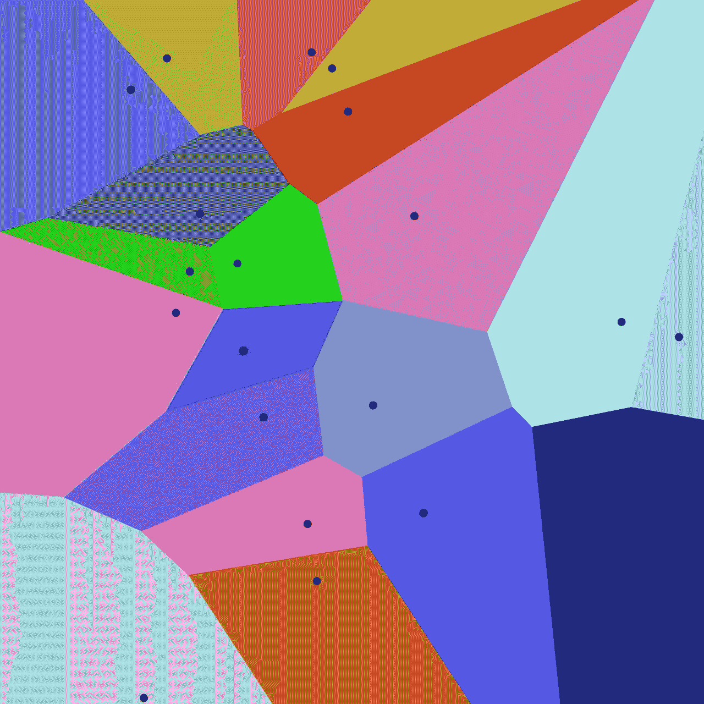

来源:[https://en . Wikipedia . org/wiki/Proximity _ analysis #/media/File:Euclidean _ Voronoi _ diagram . SVG](https://en.wikipedia.org/wiki/Proximity_analysis#/media/File:Euclidean_Voronoi_diagram.svg)

# 最近邻动机

如今，随着用户在短时间内从互联网上获取越来越多的信息，对高效的搜索方式的需求也越来越大。**这也是为什么“最近邻居”成为一个热门的研究课题，以增加用户在合理的时间内找到所要找信息的机会。**

“最近邻”的用例是无穷无尽的，它在许多计算机科学领域都有使用，比如图像识别、机器学习和计算语言学( [1](/finding-similar-images-using-deep-learning-and-locality-sensitive-hashing-9528afee02f5) 、 [2](/semantic-code-search-3cd6d244a39c) 等等)**。**


在无止境的使用案例中，有网飞的推荐、Spotify 的推荐、Pinterest 的视觉搜索，以及更多令人惊叹的产品。亚历山大·沙托夫在 [Unsplash](https://unsplash.com/s/photos/netflix-spotify?utm_source=unsplash&utm_medium=referral&utm_content=creditCopyText) 上拍摄的照片

为了计算精确的最近邻，存在以下技术:

*   **穷举搜索-** 将每个点与每隔个点的*进行比较，这将需要线性查询时间(数据集的大小)。*
*   **网格技巧-** 将空间细分成网格，这将需要指数空间/时间(在数据集的维度上)。
    **因为我们在谈论高维数据集，这是不切实际的。**

# 穷举搜索用法

我将向**展示如何找到相似的向量，并将使用**[**movie lens**](https://grouplens.org/datasets/movielens/100k/)**数据集来完成**(包含 100k 行)，方法是使用数据集的[丰富版本](https://github.com/eyaltrabelsi/my-notebooks/blob/master/search_in_practice-approximate_nearest_neighbors/movies.pickle)(已经包含电影标签及其语义表示)。本文的全部代码可以在 Jupyter 笔记本[这里](https://github.com/eyaltrabelsi/my-notebooks/blob/master/search_in_practice-approximate_nearest_neighbors/Product%20Quantization.ipynb)找到。

首先，我们将加载我们的数据集，它已经由电影标签和它们的语义表示组成，在这里[计算](https://github.com/eyaltrabelsi/my-notebooks/blob/master/search_in_practice-approximate_nearest_neighbors/Create%20movie%20dataset.ipynb)。

```
import pickle
import faissdef load_data():
    with open('movies.pickle', 'rb') as f:
        data = pickle.load(f)
    return datadata = load_data()
data
```

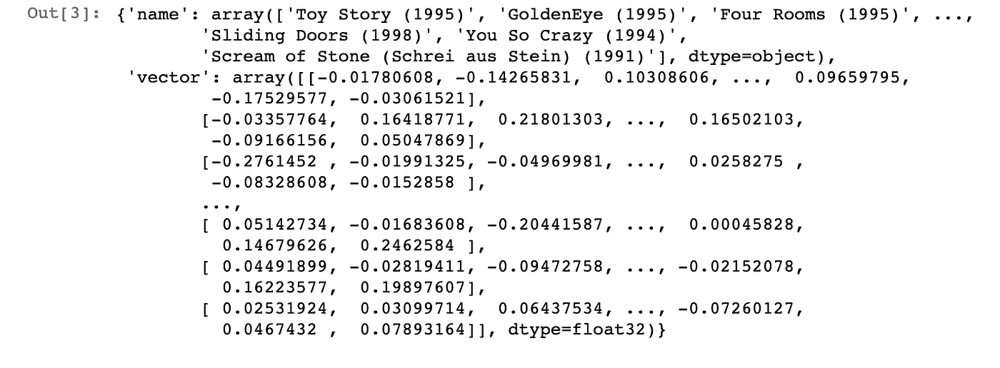

正如我们所看到的，数据实际上是一个字典，name 列由电影的名称组成，vector 列由电影的向量表示组成。

**我将展示如何使用**[**faiss**](https://github.com/spotify/annoy)**进行彻底的搜索。**我们首先要创建索引类。

```
class ExactIndex():
    def __init__(self, vectors, labels):
        self.dimension = vectors.shape[1]
        self.vectors = vectors.astype('float32')
        self.labels = labels    

     def build(self):
        self.index = faiss.IndexFlatL2(self.dimension,)
        self.index.add(self.vectors)

    def query(self, vectors, k=10):
        distances, indices = self.index.search(vectors, k) 
        # I expect only query on one vector thus the slice
        return [self.labels[i] for i in indices[0]]
```

在定义了 index 类之后，我可以使用下面的代码片段用我的数据集构建索引。

```
index = ExactIndex(data["vector"], data["name"])
index.build()
```

现在很容易搜索，假设我想搜索与“玩具总动员”最相似的电影(它位于索引号 0 中)，我可以编写以下代码:

```
index.query(data['vector'][0])
```

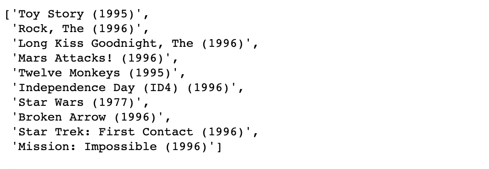

就这样，我们已经做了精确的搜索，我们现在可以去午睡了:)。


[Lidya Nada](https://unsplash.com/@lidyanada?utm_source=unsplash&utm_medium=referral&utm_content=creditCopyText) 在 [Unsplash](https://unsplash.com/s/photos/happy?utm_source=unsplash&utm_medium=referral&utm_content=creditCopyText) 上拍摄的照片

# 但不全是彩虹和独角兽:

不幸的是，大多数现代应用程序都有大量高维(数百或数千)数据集，因此线性扫描需要一段时间。如果这还不够，通常还会有额外的限制，比如合理的内存消耗和/或低延迟。

值得注意的是，尽管最近在这个主题上取得了很多进展，但是保证检索精确最近邻居的唯一可用方法是穷举搜索(由于维度的 T2 诅咒)。)

**这使得精确最近邻变得不切实际，甚至允许** [**【近似最近邻】**](https://en.wikipedia.org/wiki/Nearest_neighbor_search) **(安)进入游戏。如果我们愿意牺牲一些准确性，相似性搜索可以快几个数量级。**


照片由 [Niklas Kickl](https://unsplash.com/@niklas_kickl?utm_source=unsplash&utm_medium=referral&utm_content=creditCopyText) 在 [Unsplash](https://unsplash.com/s/photos/sad-smiley?utm_source=unsplash&utm_medium=referral&utm_content=creditCopyText) 上拍摄

# 近似最近邻游戏攻略

为了给出为什么近似最近邻可能足够好的小直觉，我将给出两个例子:

*   **视觉搜索:**作为一个用户，如果我寻找一张蜜蜂图片，我不介意从这三张图片中得到哪一张。
*   **推荐:**作为一个用户，我并不真的介意最近邻的顺序或者即使我只有十个最佳候选中的八个。

近似最近邻技术通过将数据预处理成有效的索引来加速搜索，并且通常使用以下阶段来解决:

*   **向量变换** —在向量被索引之前应用于向量，其中包括维度缩减和向量旋转。为了这篇文章结构良好又有几分简洁，我就不讨论这个了。
*   **矢量编码** —应用于矢量，以构建实际的搜索索引，其中包括基于数据结构的技术，如树、LSH 和量化，这是一种将矢量编码为更紧凑形式的技术。
*   **无穷举搜索组件** —应用于矢量以避免穷举搜索，在这些技术中有倒排文件和邻域图。

# 使用树的矢量编码

## 介绍和直觉

当谈到人工神经网络时，基于树的算法是最常见的策略之一。他们通过将数据集分成子集来构建森林(树的集合)作为他们的数据结构。

**最突出的解决方案之一是**[](https://github.com/spotify/annoy)**，它使用树木(更准确地说是森林)来实现 Spotify 的音乐推荐。既然有[综合解释](https://erikbern.com/2015/10/01/nearest-neighbors-and-vector-models-part-2-how-to-search-in-high-dimensional-spaces.html)我这里只提供背后的直觉，应该怎么用，利弊。**

**在这种情况下，为了构造索引，我们创建了一个森林(也称为许多树),每棵树都是以如下方式构造的，我们随机选取两个点，并通过它们的超平面将空间一分为二，我们不断递归地分裂成子空间，直到与一个节点相关的点足够小。**

******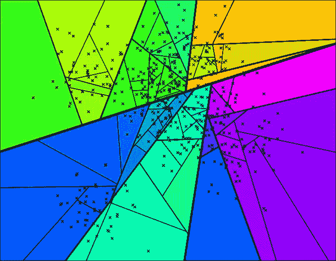**

**来源:[https://Erik Bern . com/2015/10/01/nearest-neighbors-and-vector-models-part-2-how-to-search-in-high-dimensional-spaces . html](https://erikbern.com/2015/10/01/nearest-neighbors-and-vector-models-part-2-how-to-search-in-high-dimensional-spaces.html)**

**为了搜索构建的索引，遍历森林以获得一组候选点，从这些候选点返回最接近查询点的点。**

## **讨厌的用法**

**我们将像以前一样创建一个索引类。我们要用[惹恼库](https://github.com/spotify/annoy)。可以想象，大多数逻辑都在构建方法(索引创建)中，其中准确性-性能的权衡由以下因素控制:**

*   ****number_of_trees** —我们构建的二叉树的数量，一个较大的值会给出更准确的结果，但是索引也更大。**
*   ****search_k** —我们对每个点搜索的二叉树的个数，值越大会给出更准确的结果，但返回的时间会更长。**

```
**class** Annoy**Index**():
    **def** __init__(self, vectors, labels):
        self.dimension = vectors.shape[1]
        self.vectors = vectors.astype('float32')
        self.labels = labels    

    **def** build(self, number_of_trees=5):
        self.index = annoy.AnnoyIndex(self.dimension)
        **for** i, vec **in** enumerate(self.vectors):
            self.index.add_item(i, vec.tolist())
        self.index.build(number_of_trees)

    **def** query(self, vector, k=10):
        indices = self.index.get_nns_by_vector(
              vector.tolist(), 
              k, 
              search_k=search_in_x_trees)                                           
        **return** [self.labels[i] **for** i **in** indices]
```

**在我定义了烦人的索引类之后，我可以使用下面的代码片段用我的数据集构建索引。**

```
index = AnnoyIndex(data["vector"], data["name"])
index.build()
```

**现在搜索相当容易，假设我想搜索与“玩具总动员”最相似的电影(它位于索引号 0)。**

```
index.query(data['vector'][0])
```

**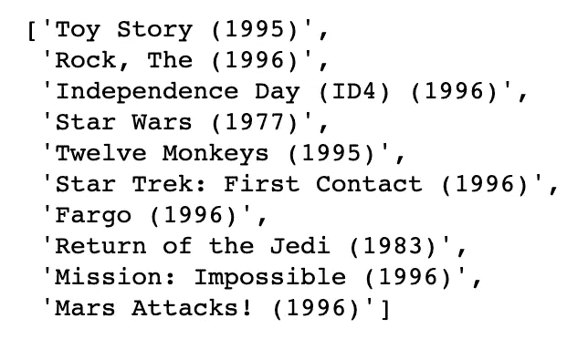**

**就是这样，我们已经有效地搜索了类似“玩具总动员”的电影，并得到了近似的结果。**

**值得注意的是，我将针对每种实现而不是每种技术来说明利弊。**

****惹恼专业人士****

*   **将索引创建与加载分离开来，这样就可以将索引作为文件传递，并快速将它们映射到内存中。**
*   **我们可以调整参数来改变精度/速度的折衷。**
*   **它有能力使用静态文件作为索引，这意味着你可以跨进程共享索引。**

****惹怒弊****

*   **精确的最近邻可能跨越边界到达相邻单元之一。**
*   **不支持 GPU 处理。**
*   **不支持批处理，所以为了增加吞吐量“需要进一步的黑客攻击”。**
*   **不能逐渐增加点数([烦恼 2](https://github.com/Houzz/annoy2) 试图解决这个问题)。**

# **使用 LSH 的矢量编码**

## **介绍和直觉**

**就人工神经网络而言，基于 LSH 的算法是最常见的策略之一。它们通过将附近的点映射到同一个桶中来构建哈希表作为它们的数据结构。**

****最突出的实现之一是 facebook 的**[**【Faiss】**](https://github.com/facebookresearch/faiss)。由于有大量的 LSH 解释，我在这里只提供其背后的直觉，应该如何使用，利弊。**

**在 LSH 中，为了构造索引，我们应用多个哈希函数将数据点映射到桶中，使得彼此靠近的数据点以高概率位于相同的桶中，而彼此远离的数据点很可能落入不同的桶中。**

**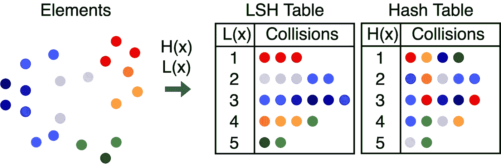**

**来源:[https://brc7.github.io/2019/09/19/Visual-LSH.html](https://brc7.github.io/2019/09/19/Visual-LSH.html)**

**为了搜索所构建的索引，查询点被散列以获得最接近的桶(一组候选点),从该桶返回最接近查询点的桶。**

**重要的是要注意，有一些改进我还没有检查，如[飞行算法](https://github.com/dataplayer12/Fly-LSH)和[GPU 上的 LSH](https://github.com/RUSH-LAB/Flash)。**

## **LSH 用法**

**我将展示如何使用 [faiss](https://github.com/spotify/annoy) ，来“使用 LSH 近似最近邻”。
我们将创建 index 类，正如您所见，大多数逻辑都在 build 方法中(索引创建)，您可以在其中控制:**

*   ****num_bits** —较大的值将给出更准确的结果，但索引也更大。**

```
class LSHIndex():
    def __init__(self, vectors, labels):
        self.dimension = vectors.shape[1]
        self.vectors = vectors.astype('float32')
        self.labels = labels    

     def build(self, num_bits=8):
        self.index = faiss.IndexLSH(self.dimension, num_bits)
        self.index.add(self.vectors)

    def query(self, vectors, k=10):
        distances, indices = self.index.search(vectors, k) 
        # I expect only query on one vector thus the slice
        return [self.labels[i] for i in indices[0]]
```

**在定义了 LSH 索引类之后，我可以使用下面的代码片段用我的数据集构建索引。**

```
index = LSHIndex(data["vector"], data["name"])
index.build()
```

**现在搜索相当容易，假设我想搜索与“玩具总动员”最相似的电影(它位于索引号 0)。**

```
index.query(data['vector'][0])
```

**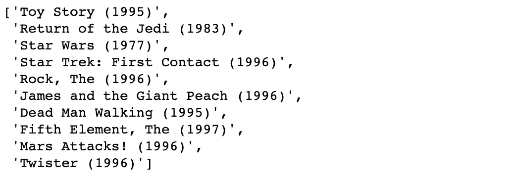**

**就是这样，我们已经有效地搜索了类似“玩具总动员”的电影，并得到了近似的结果。**

**像以前一样，我将声明每个实现的优点和缺点，而不是每个技术。**

****LSH 的优点****

*   **生成这些随机散列函数不需要诸如数据分布之类的数据特征。**
*   **可以调整近似搜索的准确性，而无需重建数据结构。**
*   **良好的亚线性查询时间的理论保证。**

****LSH 弊****

*   **实际上，该算法可能比线性扫描运行得慢。**
*   **不支持 GPU 处理。**
*   **需要大量内存。**

# **使用量化的矢量编码**

## **量化动机**

**尽管我们通过构建索引来提高查询性能，但是我们没有考虑额外的约束。**

**像许多工程师一样，我们认为线性存储“不成问题”(由于像 [S3](https://aws.amazon.com/s3/) 这样的系统)。**然而在实践中，线性存储可能会变得非常昂贵非常快**，一些算法需要将它们加载到 RAM 中，并且许多系统没有分离存储/计算，这一事实肯定不会改善这种情况。**

**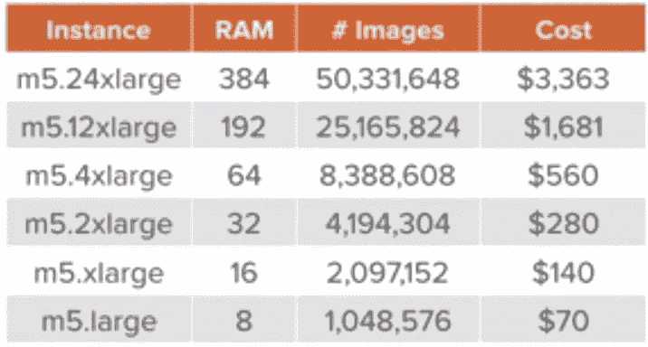**

**这张图片显示了支持 X 张图片所需的价格来源:[https://www.youtube.com/watch?v=AQau4-VF64w](https://www.youtube.com/watch?v=AQau4-VF64w)**

**这就是为什么当谈到人工神经网络时，基于量化的算法是最常见的策略之一。**

****量化**是一种通过**定义一个函数**(量化器)将我们的数据编码成一个紧凑的近似表示来**减少数据集大小**(从线性的)的技术。**

**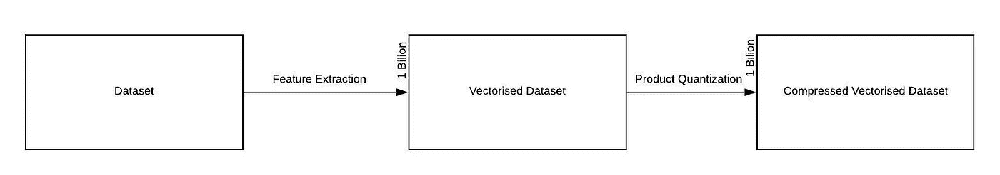**

**给定一个数据集，构造表示我们的数据集的数字向量，然后将向量压缩为近似表示来源:[https://medium . com/code-heroku/building-a-movie-recommendation-engine-in-python-using-sci kit-learn-c 7489d 7 CB 145](https://medium.com/code-heroku/building-a-movie-recommendation-engine-in-python-using-scikit-learn-c7489d7cb145)**

## **量子直觉**

**这种方法的直觉如下，**我们可以通过在编码阶段用矢量的更精简的近似表示法**替换每个矢量来减小数据集的大小。**

**实现更精简的近似表示的一种方式是给相同的表示提供相似的向量。这可以通过聚类相似的向量并以相同的方式表示每个向量来实现(质心表示)，最流行的方法是使用 [k-means](https://en.wikipedia.org/wiki/K-means_clustering) 。**

****

**一个演示 k-means 内部工作原理的动画**

**由于 [k-means](https://en.wikipedia.org/wiki/K-means_clustering) 将空间中的向量分成 k 个簇，所以每个向量可以表示为这 k 个质心中的一个(最相似的一个)。**

**这将允许我们以更有效的方式来表示每个向量，每个向量 log(k)比特，因为每个向量可以用质心的标签来表示。**

**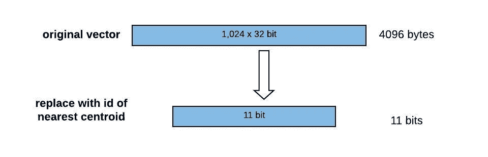**

**在我们的例子中，每个向量由一个质心表示。因为我们有 2042 个质心，所以我们可以用 11 位来表示每个向量，而不是 4096 ( 1024*32)。**

**但是，这种惊人的压缩带来了巨大的成本，**我们失去了准确性，因为我们现在不能从质心分离原始向量**。**

## **产品量化直觉**

**我们看到，使用像 [k-means](https://en.wikipedia.org/wiki/K-means_clustering) 这样的量化器是有代价的，为了提高矢量的精度**我们需要大幅增加质心的数量，这使得量化阶段在实践中不可行**。**

**这就是乘积量化的起源，我们可以通过将每个矢量分成许多矢量来大幅增加质心的数量，并对所有这些矢量运行量化器，从而提高精度。**

**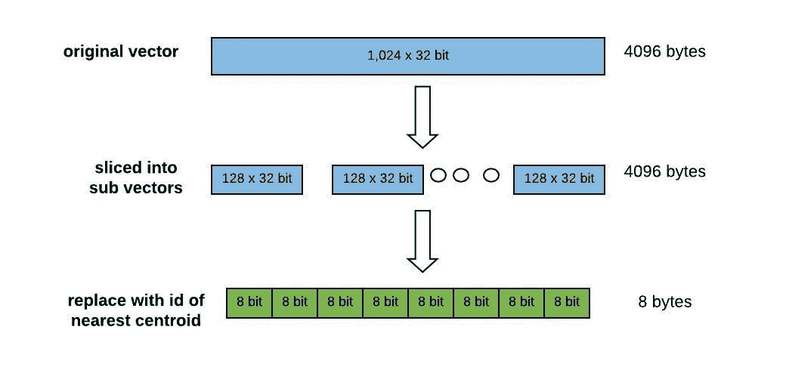**

**在我们的例子中，每个向量由 8 个子向量表示，这 8 个子向量可以由质心之一表示。由于我们有 256 个质心，我们可以用 1 个字节表示每个矩阵，与 4096 ( 1024*32)相比，向量表示只有 8 个字节。**

**虽然与常规量化器相比，它增加了一点向量的大小，但它仍然是 O(log(k))，允许我们大幅提高精度，并且在实践中仍然有效。**

**不幸的是，在搜索方面，尽管我们可以使用查表和一些加法更有效地计算距离。我们仍将进行彻底的搜索。**

**使用以下算法完成搜索:**

*   **用计算出的每个子向量和该子向量的每个质心之间的距离构建一个表。**
*   **计算数据集中每个向量的近似距离值时，我们只需使用这些质心 id 在表中查找部分距离，并将它们相加！**

**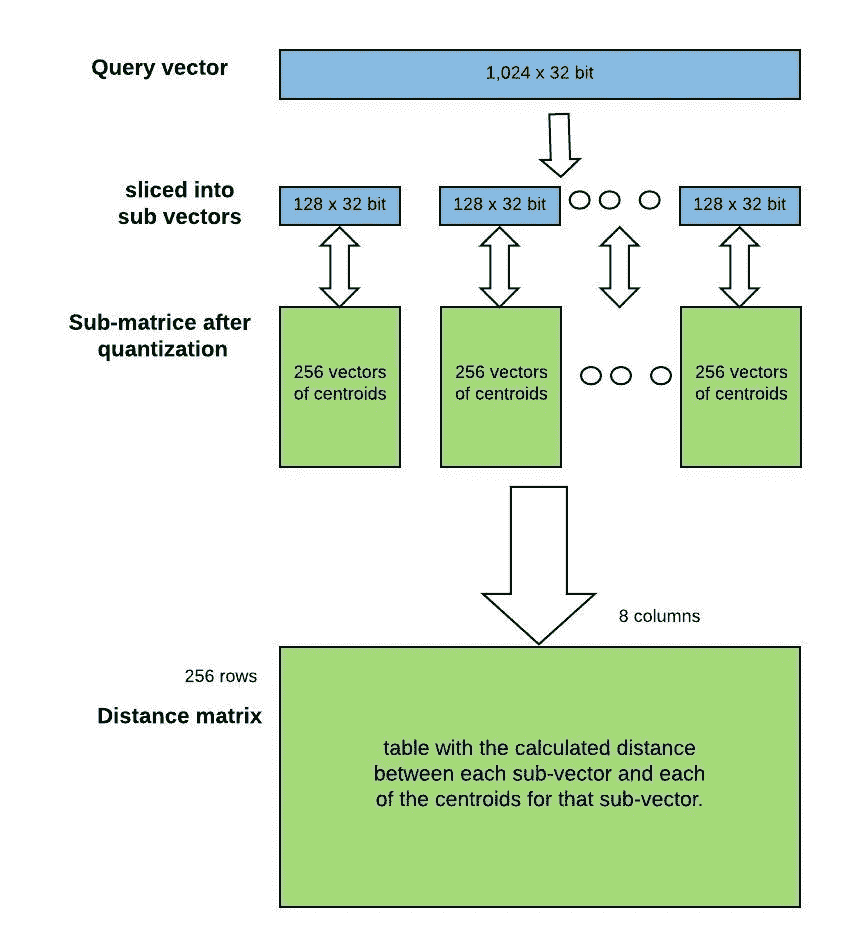**

**在我们的例子中，这意味着构建一个具有 256 行(每个质心一行)和 8 列(每个子向量一列)的子向量距离表。记住，每个数据库向量现在只是 8 个质心 id 的序列。**

*   **精确的最近邻可能跨越边界到达相邻单元之一。**

# **倒排文件索引直觉**

**该算法的直觉是，如果我们**以这样一种方式分割我们的数据集**，我们可以**避免穷举搜索**，即在搜索时，**我们只查询相关的分区**(也称为 Voronoi 单元)。这在实践中效果很好的原因是因为许多数据集实际上是多模态的。**

**然而，**以这种方式划分数据集再次降低了准确性**，因为如果查询向量落在最近的聚类的外围，那么它的最近邻居很可能位于多个附近的聚类中。**

**这个问题的解决方案很简单，就是**搜索多个分区**(这也称为探测)，搜索多个附近的分区显然需要更多的时间，但它给了我们更好的准确性。**

**因此，正如我们现在看到的**这完全是关于折衷，**可以调整分区的数量和要搜索的分区的数量，以找到时间/精度折衷的最佳点。**

**值得注意的是，除了量化之外，倒排文件索引是一种可以与其他编码策略一起使用的技术。**

## **编码残差直觉**

**算法的直觉是，我们希望**相同数量的质心给出更精确的表示**。如果矢量没有以前那么明显，这是可以实现的。**

**为了做到这一点，对于每个数据库向量，不是使用 PQ 来编码原始数据库向量，而是编码向量相对于其分区质心的偏移。**

**然而，**用它们的偏移量替换向量将** **再次增加搜索时间，**因为我们将需要为我们探测的每个分区计算单独的距离表，因为每个分区的查询向量是不同的。**

**显然，这种权衡是值得的，因为 IVFPQ 在实践中运行得相当好。**

# **具有倒排文件索引的产品量化**

**算法如下，我们用 k-means 聚类提前对数据集进行分区，以产生大量的数据集分区(倒排索引)。然后，对于每个分区，我们运行常规乘积量化。**

**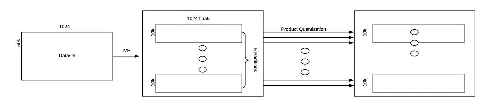**

**然后，对于每个分区，我们将把它的每个向量分解成 D/M 个子向量，这将把我们的 N×D 矩阵转换成 N×M 的 D/M 矩阵。**

**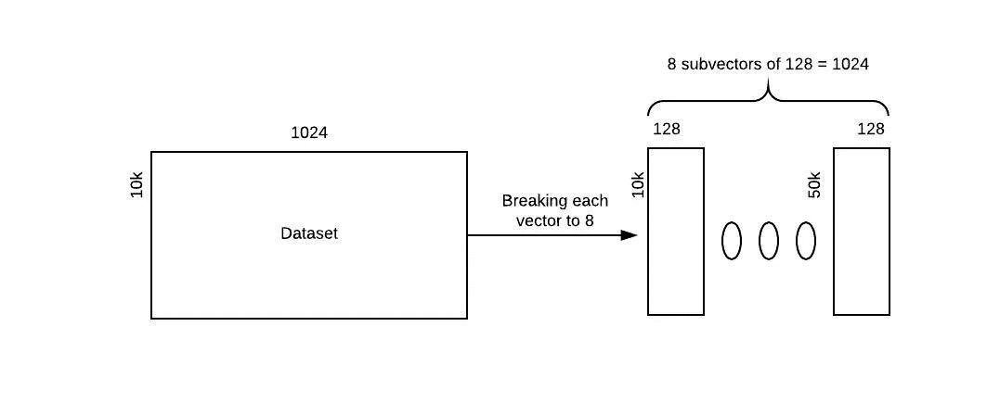**

**在我们的示例中，我们将把每个 1024 个向量分成 8 个 128 个向量，因此我们将数据集视为大小为 10k x 128 的 8 个矩阵。**

**然后我们将在每个子矩阵上运行 k-means 算法，这样每个子向量(行)将连接到 k 个质心之一。**

**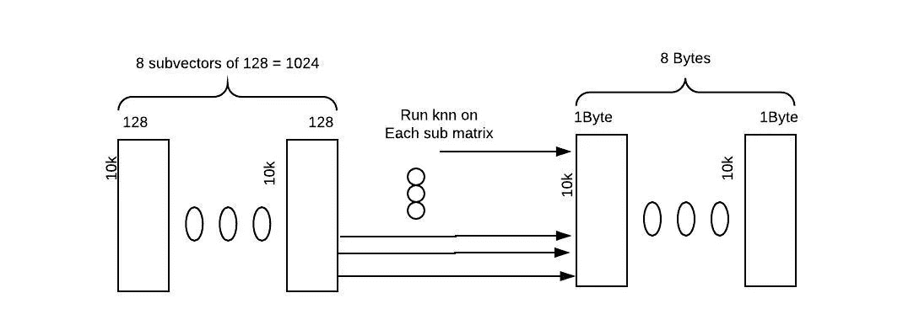**

**在我们的例子中，我们将在 k=256 的 8 个矩阵上运行 k 均值。这意味着，我们的每一行都连接到每个矩阵上的这 256 个行中的一个(原始矩阵中的每一行都连接到 8 个质心)。**

**我们将用最接近的匹配质心的 id 替换每个子向量。这就是我们所期待的，因为在前面的部分之后我们已经重复了元素，我们现在可以用一个非常小的标签来表示它们中的每一个，并且只保留一次实际值。**

**如果你想得到更多的理论，你可以看这个令人惊奇的视频。**

## **使用倒排索引的乘积量化**

**我们将创建 index 类，正如您可以看到的，大多数逻辑都在 build 方法(索引创建)中，您可以在其中控制:**

*   ****子向量大小** —子向量的目标大小(产品量化阶段)。**
*   ****number_of_partitions** —用来划分数据集的分区数量(反向文件索引阶段)。**
*   ****search_in_x_partitions** —要搜索的分区数量(反向文件索引阶段)。**

```
class IVPQIndex():
    def __init__(self, vectors, labels):
        self.dimension = vectors.shape[1]
        self.vectors = vectors.astype('float32')
        self.labels = labels    def build(self, 
              number_of_partition=8, 
              search_in_x_partitions=2, 
              subvector_size=8):
        quantizer = faiss.IndexFlatL2(self.dimension)
        self.index = faiss.IndexIVFPQ(quantizer, 
                                      self.dimension, 
                                      number_of_partition, 
                                      search_in_x_partitions, 
                                      subvector_size)
        self.index.train(self.vectors)
        self.index.add(self.vectors)

    def query(self, vectors, k=10):
        distances, indices = self.index.search(vectors, k) 
        # I expect only query on one vector thus the slice
        return [self.labels[i] for i in indices[0]]
```

**在定义了 IVPQIndex 类之后，我可以使用下面的代码片段用我的数据集构建索引。**

```
index = IVPQIndex(data["vector"], data["name"])
index.build()
```

**现在很容易搜索，假设我想搜索与“玩具总动员”最相似的电影(它位于 0 索引中)。**

```
index.query(data['vector'][0:1])
```

**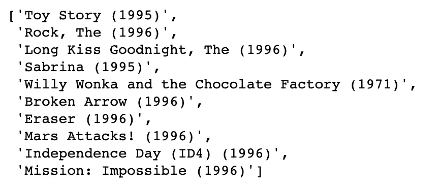**

**就这样，我们使用 IVPQ 有效地搜索了类似“玩具总动员”的电影，并得到了近似的结果。**

****带倒排文件优点的产品量化****

*   **具有子线性空间、大压缩比(每个向量 log(k)比特)的唯一方法。**
*   **我们可以调整参数来改变精度/速度的折衷。**
*   **我们可以调整参数来改变空间/精度的权衡。**
*   **支持批量查询。**

****带反向文件 Cons 的产品量化****

*   **精确的最近邻可能跨越边界到达相邻单元之一。**
*   **不能逐渐增加点数。**
*   **精确的最近邻可能跨越边界到达相邻单元之一。**

# **分层可导航小世界图**

**这种方法的直觉如下，为了减少图上的搜索时间，我们希望我们的图有一个平均路径。**

**这与著名的*“六个握手规则”*的说法紧密相连。**

> **"你和地球上的任何人之间最多有 6 度的距离."— [弗里吉斯·卡琳蒂](https://en.wikipedia.org/wiki/Frigyes_Karinthy)**

**平均而言，许多真实世界的图是高度聚集的，并且倾向于具有彼此靠近的节点，这在形式上被称为小世界图:**

*   **高度可传递性(社区结构)通常是分等级的。**
*   **小平均距离~log(N)。**

**为了进行搜索，我们从某个入口点开始，迭代遍历图。在遍历的每一步，该算法检查从查询到当前基节点的邻居的距离，然后选择距离最小的相邻节点作为下一个基节点，同时不断跟踪最佳发现的邻居。当满足某个停止条件时，搜索终止。**

## **分层可导航小世界图用法**

**我将展示如何使用 [nmslib](https://github.com/nmslib/nmslib) ，来“使用 HNSW 近似最近邻”。**

**我们将创建 index 类，正如您所看到的，大多数逻辑都在 build 方法中(索引创建)。**

```
class NMSLIBIndex():
    def __init__(self, vectors, labels):
        self.dimention = vectors.shape[1]
        self.vectors = vectors.astype('float32')
        self.labels = labelsdef build(self):
        self.index = nmslib.init(method='hnsw', space='cosinesimil')
        self.index.addDataPointBatch(self.vectors)
        self.index.createIndex({'post': 2})

    def query(self, vector, k=10):
        indices = self.index.knnQuery(vector, k=k)
        return [self.labels[i] for i in indices[0]]
```

**在定义了 NMSLIB 索引类之后，我可以使用下面的代码片段用我的数据集构建索引。**

```
index = NMSLIBIndex(data["vector"], data["name"])
index.build()
```

**现在搜索相当容易，假设我想搜索与“玩具总动员”最相似的电影(它位于索引号 0)。**

```
index.query(data['vector'][0])
```

**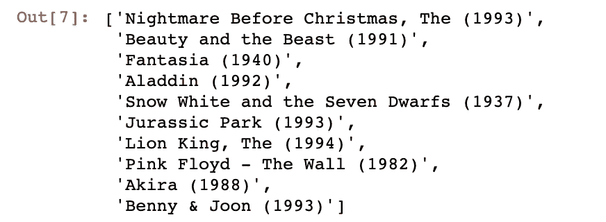**

**就是这样，我们已经有效地搜索了类似“玩具总动员”的电影，并得到了近似的结果。**

**像以前一样，我将声明每个实现的优点和缺点，而不是每个技术。**

## **分层可导航小世界图优点**

*   **我们可以调整参数来改变精度/速度的折衷。**
*   **支持批量查询。**
*   **NSW 算法具有多对数时间复杂度，并且在许多真实数据集上可以优于竞争对手的算法。**

## **分层可导航小世界图 Cons**

*   **精确的最近邻可能跨越边界到达相邻单元之一。**
*   **不能逐渐增加点数。**
*   **需要相当多的内存。**

# **选择正确的近似最近邻算法**

## **什么会影响我们的决定**

**评估应该使用哪些算法以及何时使用取决于用例，并且会受到以下指标的影响:**

*   ****速度-** 指标创建和指标构建。**
*   ****硬件和资源-** 磁盘大小，RAM 大小，以及我们是否有 GPU。**
*   ****精度要求。****
*   ****访问模式—** 查询的数量，是否批处理，以及我们是否应该更新索引。**

**重要的是要注意，没有完美的算法，所有的都是关于权衡，这就是为什么这个主题如此有趣。**

## **我们如何挑选**

**我创建了一个有点天真的流程图，以便允许人们选择应该为他的用例以及我们上面定义的度量选择哪种技术和实现。**

**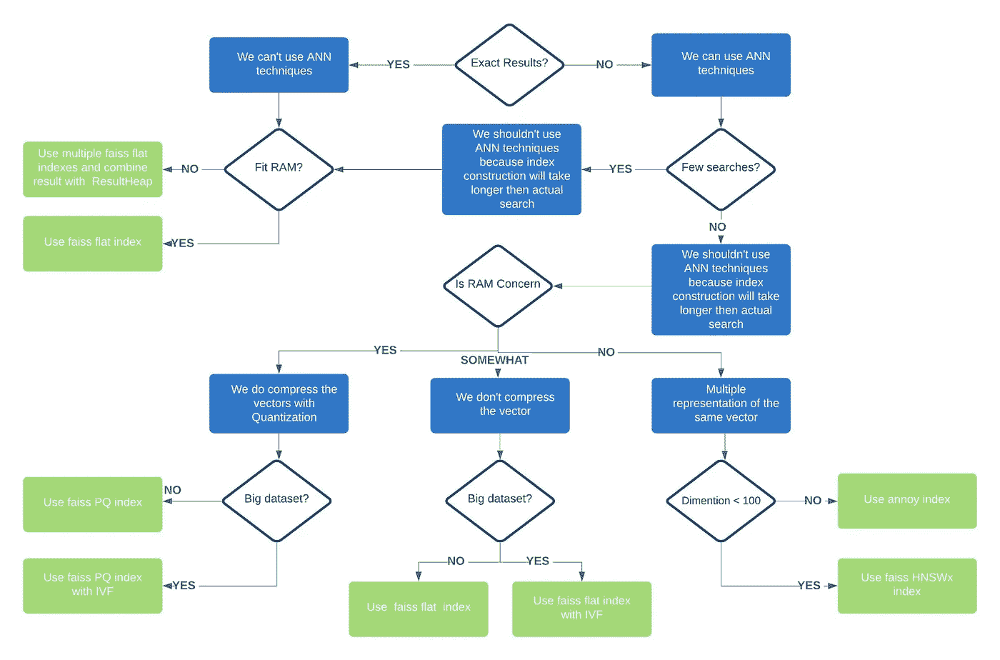**

**每种实现都有自己的参数，这些参数会影响精度/速度权衡或空间/精度权衡。**

# **遗言**

**本文一开始，我们展示了最近邻算法提供的价值，然后我列出了在现代应用中使用这些算法的问题，这些问题导致了“近似最近邻技术的诞生”。**

**然后，我解释了领先技术背后的直觉以及如何在实践中使用它们，这些技术允许我们在存储/准确性和速度/准确性之间进行权衡。**

**由于主题的范围，有许多事情我没有涉及，比如某些算法对 GPU 的使用。**

**我希望我能够分享我对这个迷人的话题的热情，并且你会发现它是有用的，并且我一如既往地欢迎任何建设性的反馈。**