# 哈伯曼生存数据集探索性数据分析综合指南

> 原文：<https://towardsdatascience.com/comprehensive-guide-to-exploratory-data-analysis-of-habermans-survival-data-set-b33f0373c83a?source=collection_archive---------18----------------------->

## 探索性数据分析

## 一个详尽和广泛的方法，处理探索性数据分析的每个方面。


图片提供:[https://pixabay.com/users/geralt-9301/](https://pixabay.com/users/geralt-9301/)(来自 Pixabay 的 Gerd Altmann)

## **探索性数据分析**

**探索性数据分析(EDA)**是一个数据分析过程，主要目的是使用统计工具、绘图工具、线性代数和其他技术来挖掘隐藏在数据集中的信息。它有助于更好地理解数据，并突出其主要特征，这可能有助于做出对未来有影响的预测和预报。

理解数据是数据科学的核心。因此，EDA 对于生成精确的机器学习模型是必不可少的。考虑 Haberman 的生存数据集使用 Python 对其执行各种 EDA 过程。该数据集包含 1958 年至 1970 年间在芝加哥大学比林斯医院进行的一项关于乳腺癌手术患者存活率的研究。

数据集的各种属性是:

1.  手术时患者的年龄(数字)
2.  患者手术年份(1958 年至 1970 年之间的年份，数字)
3.  检测到的阳性腋窝淋巴结数(数字)
4.  生存状态(类属性)表示为:

*   1 —如果患者存活了 5 年或更长时间
*   2 —如果患者在 5 年内死亡

正如患者的医疗诊断在患者的治疗生命周期中起着关键作用一样，EDA 在数据评估和创建精确模型中也起着至关重要的作用。

# 导入必备的 Python 库

选择 Python 是因为它最好的 AI 包和机器学习库。在这里，我们导入执行数据分析和绘图所需的库:

*   **熊猫(Python 数据分析库)**
*   **Numpy(用于科学计算的 Python 包)**
*   **Matplotlib(Python 绘图库)**
*   **Seaborn(Python 统计数据可视化库)**

```
import pandas as pd
import numpy as np
import matplotlib.pyplot as plt
import seaborn as sns
```

# 加载数据集

哈伯曼的生存数据集是一个逗号分隔值(csv)文件。 **Pandas** 的 **read_csv()** 函数用于将 csv 文件(haberman.csv)读入名为 haberman 的**数据帧**中。Dataframe 是一个大小可变的二维结构，具有潜在的异构表格数据。

```
haberman = pd.read_csv('haberman.csv', header=0, names=['Age of Patient', 'Year of Operation', \                                                                          'Positive Axillary Nodes', 'Survival Status'])
```

# 一瞥数据集

让我们通过做一些初步的数据分析来熟悉数据集。首先，我们来看看数据集是什么样子的。在下面的代码片段中，iterrows()用于遍历 DataFrame 的每一行。

```
for i,j in haberman.iterrows():
    print(j)
    print()
```

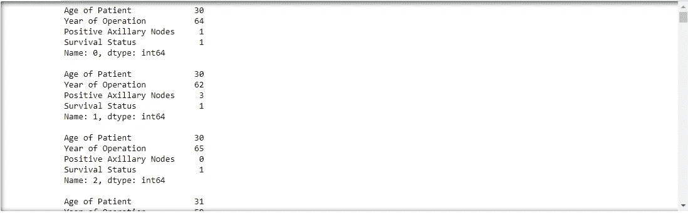

图片提供:iambipin

数据集的所有属性都是不言自明的。患者的年龄意味着患者的年龄。操作年份指执行操作的年份。阳性腋窝淋巴结表示患者中阳性腋窝淋巴结(淋巴结)的数量(存在或不存在)。阳性腋窝淋巴结是受癌细胞影响的淋巴结。最后，生存状态提供了关于患者 5 年或更长时间生存的信息。

**观察:**

1.  csv 文件包含 **306 行和 4 列**，这意味着数据集包含关于 **306 名接受乳腺癌手术的患者**的信息。考虑到数据量，数据集很小。
2.  患者的诊断是基于患者表现出的症状。由于除了**阳性腋窝淋巴结**之外，没有其他数据集属性属于症状类别，我们可以假设阳性腋窝淋巴结的存在是乳腺癌的主要催化剂(原因)。根据 BreastCancer.org 的说法，为了去除浸润性乳腺癌，医生(在手术前或手术中)切除一个或多个腋下淋巴结，以便在显微镜下检查癌细胞。癌细胞的存在被称为**淋巴结受累**。
3.  在数据集中出现另一个症状会造成混乱，不知道在数据分析中应该优先考虑什么变量。因此在初步分析中，阳性腋窝淋巴结似乎是最重要的变量。

head()函数可以看到数据集的前五行。

```
haberman.head()
```

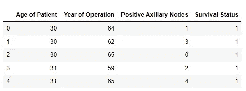

图片提供:iambipin

现在让我们通过使用熊猫形状属性来查找数据点的总数和数据集的特征(属性)。数据点是属性或特征的集合。因此这是一个完整的记录。在给定的数据集中，数据点由涉及四个属性的数据组成(数据帧的行)。shape 属性返回表示数据帧维度的元组(数据帧将行数和列数存储为元组)。

```
print(haberman.shape)Output:
(306, 4)
```

数据集有 306 个数据点(行)和 4 个属性(列)。通过熊猫的列属性可以知道数据集的属性。

```
print(haberman.columns)Output:
Index(['Age of Patient', 'Year of Operation', 'Positive Axillary Nodes', 'Survival Status'],
      dtype='object')
```

这里的 dtype 指的是熊猫的数据类型。Pandas 中的对象数据类型相当于 Python 中的字符串数据类型。

生存状态属性(因变量)包含非分类类型的**整数数据类型**。因此需要转换成**分类类型**。

```
haberman['Survival Status'] = haberman['Survival Status'].apply(
    lambda x: 'Survived' if x == 1 else 'Died')
```

让我们验证转换是否已经发生。

```
print(haberman.head(10))
```

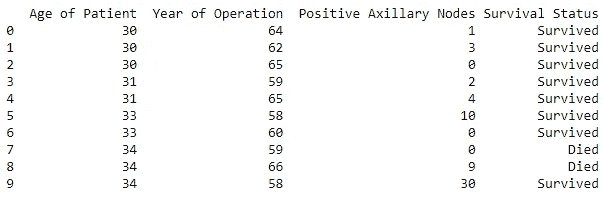

我们现在可以看到，存活状态有标记为存活或死亡的字段。

info 方法可以显示数据集的简明摘要。这个方法打印关于数据帧的信息，包括索引数据类型和列数据类型、非空值和内存使用情况。

```
print(haberman.info())Output:
<class 'pandas.core.frame.DataFrame'>
RangeIndex: 306 entries, 0 to 305
Data columns (total 4 columns):
Age of Patient             306 non-null int64
Year of Operation          306 non-null int64
Positive Axillary Nodes    306 non-null int64
Survival Status            306 non-null object
dtypes: int64(3), object(1)
memory usage: 9.7+ KB
None
```

**观察:**

1.  前三列即患者年龄、手术年份和腋窝淋巴结阳性的数据类型是整数。生存状态有一个对象数据类型。数据集有四个数据列。
2.  数据集没有空值。
3.  数据集使用的内存约为 9.7 KB

**Pandas description**方法生成描述性统计数据，其中包括汇总数据集分布的集中趋势、分散性和形状的信息，但不包括 NaN 值。它分析数字和对象序列，以及混合数据类型的 DataFrame 列集。根据所提供的内容，输出会有所不同。

```
print(haberman.describe(include='all'))Output:
Age of Patient  Year of Operation  Positive Axillary Nodes \
count       306.000000         306.000000               306.000000   
unique             NaN                NaN                      NaN   
top                NaN                NaN                      NaN   
freq               NaN                NaN                      NaN   
mean         52.457516          62.852941                 4.026144   
std          10.803452           3.249405                 7.189654   
min          30.000000          58.000000                 0.000000   
25%          44.000000          60.000000                 0.000000   
50%          52.000000          63.000000                 1.000000   
75%          60.750000          65.750000                 4.000000   
max          83.000000          69.000000                52.000000Survival Status  
count              306  
unique               2  
top           Survived  
freq               225  
mean               NaN  
std                NaN  
min                NaN  
25%                NaN  
50%                NaN  
75%                NaN  
max                NaN
```

**观察:**

1.  该方法给出每个属性的总计数
2.  对于数字数据(如患者年龄、手术年份、阳性腋窝淋巴结等变量)，该方法提供了关于**标准差(std)、平均值、百分位数(25%、50%和 75%)、最小值和最大值**的有价值信息。第 50 百分位(50%)是中位数**。因此，获得了集中趋势(平均值和中值)和分散(标准偏差)的汇总。**
3.  使用最小值和最大值，可以得出以下推论:

*   患者的最大年龄**为 83 岁，最小年龄**为 30 岁。****
*   经营年份从 **58(1958)到 69(1969)** 开始。
*   一名或多名患者有 **52 个阳性腋窝淋巴结**，一名或多名患者有**零个阳性腋窝淋巴结**。

4.对于对象数据类型(生存状态)，结果将包括 **unique，top 和 freq(频率)**。数值数据类型的变量将在相应的字段中被赋予 NaN。生存状态有两个唯一值(存活和死亡)。顶部是最常见的值。因此**幸存**是最常见的生存状态。freq 是最常见的值的频率，这里的值是 225。所以**存活下来的患者总数是 225** 。

我们可以通过 value_counts()方法确定存活的患者总数。

```
print(haberman['Survival Status'].value_counts())Output:
Survived    225
Died         81
Name: Survival Status, dtype: int64
```

因此，我们可以得出这样的结论:从乳腺癌中幸存下来的患者**比死于乳腺癌的患者**多**(81)。因此，数据集是不平衡的**。****

# **目标**

**EDA 的主要目的是根据患者的年龄、手术年份和阳性腋窝淋巴结来确定患者是否能存活 5 年或更长时间。**

# **不同层次的分析**

**现在让我们更深入地研究数据集。为此，必须考虑现有的不同层次的分析。它们是:**

*   ****单变量分析****
*   ****双变量分析****
*   ****多元分析****

**数据分析技术的选择最终取决于变量的数量、数据类型和统计调查的重点。**

# **单变量分析**

**单变量分析是只处理一个变量的最简单的数据分析技术。作为一个单一的变量过程，它并没有给出因果关系的见解。单变量分析的主要目的是简单地描述数据，找出数据中的模式。正在考虑的单变量分析方法有:**

1.  **一维散点图**
2.  **概率密度函数**
3.  **累积分布函数**
4.  **箱形图**
5.  **小提琴情节**

# **双变量分析**

**双变量分析是建立两个变量之间相关性的过程。双变量分析比单变量分析更具分析性。如果数据似乎符合一条直线或曲线，那么这两个变量之间存在关系或相关性。正在考虑的双变量分析方法有:**

1.  **二维散点图**
2.  **配对图**

# **多变量分析**

**多元分析是一种更复杂的统计分析。它是涉及三个或更多变量的分析，在需要了解它们之间关系的场景中实施。正在考虑的多变量分析方法是:**

1.  **等值线图表**

# **作案手法**

**分析将从双变量分析开始。将首先绘制二维散点图，并对其进行观察。然后我们将转到配对图，看看单个变量的分布和两个变量之间的关系。之后，将进行单变量和多变量分析。**

# **二维散点图**

**二维散点图有助于使用笛卡尔坐标可视化两个变量之间的相关性。一个变量的值将沿 x 轴绘制，另一个变量的值将沿 y 轴绘制。数据将作为有序对(x，y)绘制在结果象限中，其中 x 与 x 轴上的值相关，y 与 y 轴上的值相关。**

```
sns.set_style('whitegrid')
sns.FacetGrid(haberman, hue ='Survival Status', size = 8) \
.map(plt.scatter, 'Age of Patient', 'Positive Axillary Nodes') \
.add_legend()
plt.show()
```

**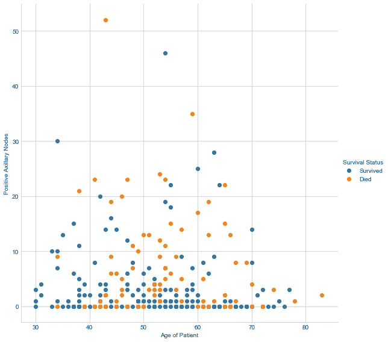**

**图片提供:iambipin**

**FacetGrid 是一个多绘图网格，用于绘制条件关系。FacetGrid 对象将一个 **DataFrame** 作为输入，并将形成网格的行、列或色调维度的变量的名称作为输入。变量应该是分类的，变量的每个级别的数据将用于沿该轴的一个方面。map()方法负责在网格的每个空间上重复相同的绘图。它对每个方面的数据子集应用绘图功能。add_legend()方法创建绘图的图例。**

****观察:****

1.  **30-40 岁年龄组的大多数患者已经从乳腺癌中存活下来，因为这里很少有橙色点。**
2.  ****非常罕见**患者的**阳性腋窝淋巴结超过 25 个(或者说 30 个)****
3.  **当**没有阳性腋窝淋巴结**时，几乎**年龄组**50-60 的所有患者**都存活了**。我们可以假设在 50 和 60 之间没有橙色的点。**
4.  ****所有 80 岁以上的患者都在手术后五年内死亡**，因为这里没有蓝点。**
5.  **少数具有**较高数量的阳性腋窝淋巴结(大于 10)** 的患者也存活于乳腺癌(沿着阳性腋窝淋巴结出现蓝点> 10)。**

****确定观察值:**
我们可以通过在 haberman 数据帧上执行以下操作来确定 1 号**观察值**。**

```
df_3040 = haberman.loc[(haberman['Age of Patient']<=40) & (haberman['Age of Patient']>=30)]
#print(df_3040)df_3040_survived = df_3040.loc[df_3040['Survival Status']=='Survived']
print('No. of patients in the age group 30-40 survived: {0}' .format(len(df_3040_survived)))df_3040_died = df_3040.loc[df_3040['Survival Status']=='Died']
print('No. of patients in the age group 30-40 died: {0}' .format(len(df_3040_died)))Output:
No. of patients in the age group 30-40 survived: 39
No. of patients in the age group 30-40 died: 4
```

****该输出验证了 1 号观察结果**。**

**我们可以通过以下方式确定 2 号观察值**中提到的值 25(由 20 和 30 中点的蓝点表示):****

```
ax_node = haberman['Positive Axillary Nodes'].unique() #unique values of axillary node
ax_node.sort() #sorted the list
print(ax_node)Output:
[ 0  1  2  3  4  5  6  7  8  9 10 11 12 13 14 15 16 17 18 19 20 21 22 23 24 25 28 30 35 46 52]
```

**该列表的值为 25。所以我们可以安全地假设蓝点的值是 25。**

**我们可以通过以下操作确定**4 号观察值**:**

```
age = haberman['Age of Patient']
count = 0
print(len(age))
for i in age:
    if(i >= 80):
        count += 1
print('No. of patients whose age is greater than or equal to 80: {0}' .format(count))Output:
306
No. of patients whose age is greater than or equal to 80: 1
```

**因此，只有一名患者的年龄大于或等于 80 岁。80 后的橙色圆点一定代表这个病人。**

# **配对图**

**配对图绘制数据集中的成对关系。它将创建一个轴网格，这样数据中的每个数值变量将在 y 轴的一行中共享，在 x 轴的一列中共享。对角线轴不同于轴网格的其余部分，它们显示该列中变量数据的单变量分布。**

```
sns.set_style('whitegrid')
sns.pairplot(haberman, hue = 'Survival Status', size = 4)
plt.show()
```

**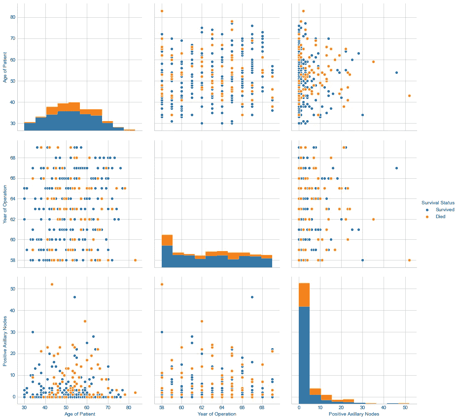**

**图片提供:iambipin**

**在数据集中，有 3 个定量变量(患者年龄、手术年份、阳性腋窝淋巴结)和 1 个分类变量(生存状态)。只有数值(整数或浮点)连续值才会绘制在配对图中。因此，在上面显示的配对图中，我们有 **3C2 图**(即 3 个独特的图)。对角线两边有相等数量的图，它们是彼此的镜像。**对角线图(图 1、图 5 和图 9)** 展示了展示单个变量分布的**直方图**。**

****观察:****

1.  **任何图中都没有线性分离**
2.  **每个图中的数据有相当多的重叠。**
3.  **在**图 2** 中，x 轴表示手术年份，y 轴表示患者年龄。有**大量的重叠**，很难根据剧情进行分类。观察到的一个有趣的事实是，在 1961 年和 1968 年期间接受手术的**大多数患者**已经存活了 5 年或更长时间(由于与其他年份相比橙色点非常少)。我们甚至可以把它重新表述为 1961 年和 1968 年接受乳腺癌手术的患者死亡人数最少**
4.  **在**图 3** 中，x 轴为阳性腋窝淋巴结，y 轴为患者年龄。即使有重叠的点，也有**可区分的模式**使我们能够做出推论。图 3(和图 7)似乎比其余的图更好(**我们已经在二维散点图**中深入分析了相同的图)。因此，阳性腋窝淋巴结和患者年龄是识别患者生存状态最有用的特征。**
5.  **在**图 6** 中，x 轴为阳性腋窝淋巴结，y 轴为手术年份。该图有**个重叠最多的**点。因此，它不会导致任何有意义的结论或分类。**
6.  ****地块 4** 是**地块 2** 的**镜像**。**图 7** 是**图 3** 的镜像。**图 8** 是**图 6** 的镜像**
7.  **最后，**地块 7 和地块 3 是数据分析考虑的最佳地块**。**

****确定观测值:**
我们可以通过对哈伯曼数据帧进行以下操作来确定地块 2 的**3 号观测值**:**

```
df_1961 = haberman.loc[haberman['Year of Operation']==61]
df_1968 = haberman.loc[haberman['Year of Operation']==68]
#print(df_1961)df_1961_survived = df_1961.loc[df_1961['Survival Status']=='Survived']
print('No. of patients survived during 1961: {0}' .format(len(df_1961_survived)))df_1961_died = df_1961.loc[df_1961['Survival Status']=='Died']
print('No. of patients died during 1961: {0}' .format(len(df_1961_died)))aster = '*'
print(aster*45)df_1968_survived = df_1968.loc[df_1968['Survival Status']=='Survived']
print('No. of patients survived during 1968: {0}' .format(len(df_1968_survived)))df_1968_died = df_1968.loc[df_1968['Survival Status']=='Died']
print('No. of patients died during 1968: {0}' .format(len(df_1968_died)))Output:
No. of patients survived during 1961: 23
No. of patients died during 1961: 3
*********************************************
No. of patients survived during 1968: 10
No. of patients died during 1968: 3
```

# **一维散点图**

**使用单个变量进行推断的散点图是一维散点图。此处变量将位于 x 轴上，y 轴上的值为零(因为没有两个轴就无法绘图)。很明显，是单变量分析。**

```
df_survived = haberman.loc[haberman['Survival Status'] == 'Survived'] 
df_died = haberman.loc[haberman['Survival Status'] == 'Died']
plt.plot(df_survived['Positive Axillary Nodes'], np.zeros_like(df_survived['Positive Axillary Nodes']), 'o')
plt.plot(df_died['Positive Axillary Nodes'], np.zeros_like(df_died['Positive Axillary Nodes']), 'o')
plt.show()
```

**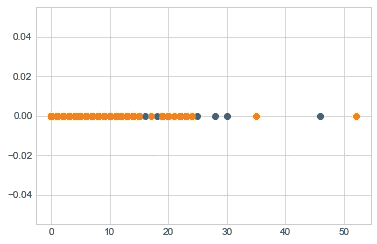**

**图片提供:iambipin**

**在上面的代码中， **haberman.loc[ ]** 用于从 haberman 数据帧中挑选与特定索引相关联的数据点，这些数据点又存储在另一个数据帧中。 **np.zeros_like()** 方法将创建一个零数组。“O”是字母 O 的小写字母，用于使图中的点更大且可见。**

****观察:****

1.  **基于一个特征(阳性腋窝淋巴结)的一维散点图**
2.  **数据有很大的重叠，这妨碍了进行任何有意义的观察。**

# **柱状图**

**直方图是由**卡尔·皮尔逊**首先介绍的**数字数据分布**的精确表示。它给出了连续变量概率分布的估计。直方图是单变量分析，因为它只涉及一个变量。**

**构建直方图的第一步是**“bin”(或桶)**值的范围。“入库”意味着将整个值范围分成一系列区间，然后计算属于每个区间的值的数量。箱通常是变量的连续的、不重叠的区间。箱子必须相邻且大小相等(不要求)。除了最后一个箱子(最右边)外，所有箱子都是半开的。**

**对于相同大小的箱，在箱上方竖立一个矩形，其高度与每个箱中的病例数(频率或计数)成比例。**

**Matplotlib 用于绘制直方图，Numpy 用于计算计数和面元边缘。**

```
import matplotlib.pyplot as plt
import numpy as npdf_axnodes = haberman['Positive Axillary Nodes'] #DataFrame of Positive Axillary Nodes
count, bin_edges = np.histogram(df_axnodes, bins=25)print('Bin Edges: ', bin_edges)
print('Counts per Bin: ', count)
plt.hist(df_axnodes, bins=25, color='skyblue', alpha=0.7) 
plt.xlabel('Positive Axillary Nodes', fontsize=15)
plt.ylabel('Frequency', fontsize=15)Output:
Bin Edges:  [ 0\.    2.08  4.16  6.24  8.32 10.4  12.48 14.56 16.64 18.72 20.8  22.88 24.96 27.04 29.12 31.2  33.28 35.36 37.44 39.52 41.6  43.68 45.76 47.84 49.92 52\.  ]
Counts per Bin:  [197  33  13  14   9   6   9   4   2   5   4   4   1   1   1   0   1   0   0   0   0   0   1   0   1]Text(0,0.5,'Frequency')
```

**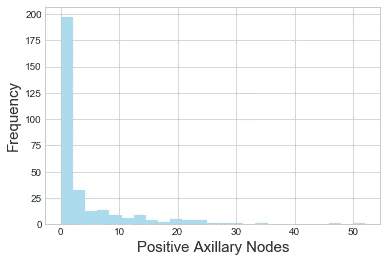**

**图片提供:iambipin**

**Matplotlib 使用 plt.hist()绘制直方图，该函数将 DataFrame 作为输入。bin_edges 给出容器边缘(第一个容器的左边缘和最后一个容器的右边缘)。color 参数设置条形的颜色，alpha 参数设置条形的透明度。plt.xlabel 和 plt.y-label 分别用于设置 x 轴和 y 轴的标签。**

****观察结果****

*   **306 名患者中的 197 名患者具有小于 2.08 的阳性腋窝淋巴结。因此大多数(64.37%)患者有少量阳性腋窝淋巴结。**

# **概率密度函数**

**PDF 用于指定随机变量落在特定值范围内的概率。它是用来描述连续概率分布的概率函数。PDF 用于处理具有连续结果的随机变量的概率。从人群中任意选择一个人的身高就是一个典型的例子。**

**PDF 是直方图的平滑版本。直方图的平滑是使用核密度估计(KDE)来完成的。PDF(曲线)下的面积总和始终为 1。PDF 是单变量分析。**

**下面显示的代码片段将绘制 PDF。**

****基于患者年龄的 PDF****

```
sns.set_style('whitegrid')
sns.FacetGrid(haberman, hue='Survival Status', size=8) \
    .map(sns.distplot, 'Age of Patient') \
    .add_legend()
plt.show()
```

**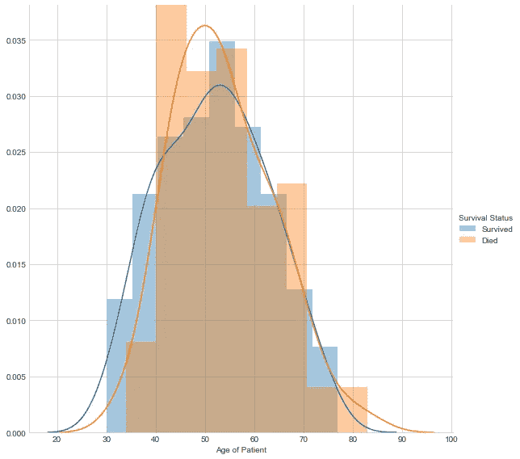**

**图片提供:iambipin**

**条形(橙色和蓝色)是直方图，曲线代表 PDF。**

****观察:****

1.  **数据有很大的重叠，相当于模糊不清**
2.  **30-40 岁年龄段的患者比其他年龄段的患者有更多的生存机会。**
3.  **40-60 岁年龄组的患者存活的可能性更小。**
4.  **40-45 岁年龄组的死亡人数最多(存活的可能性最小)。**
5.  **我们不能根据“患者年龄”这一属性对患者的生存机会做出最终结论。**

****基于运营年份的 PDF****

```
sns.set_style('whitegrid')
sns.FacetGrid(haberman, hue='Survival Status', size=8) \
    .map(sns.distplot, 'Year of Operation') \
    .add_legend()
plt.show()
```

**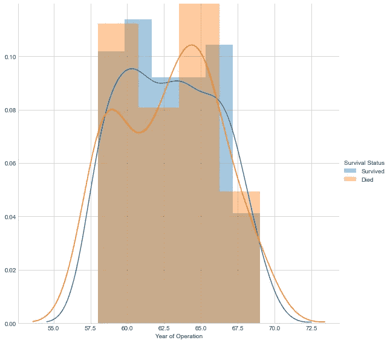**

**图片提供:iambipin**

****观察:****

1.  **可以观察到大量重叠。**
2.  **该图提供了关于成功手术(患者存活)和不成功手术的数量的信息。一次行动的成功**不能以一年作为一个因素**。**
3.  **大多数不成功的手术都是在 1965 年进行的，然后是 1960 年。**
4.  **最成功的手术是在 1961 年进行的。**

****基于阳性腋窝淋巴结的 PDF****

```
sns.set_style('whitegrid')
sns.FacetGrid(haberman, hue='Survival Status', size=8) \
    .map(sns.distplot, 'Positive Axillary Nodes') \
    .add_legend()
plt.show()
```

**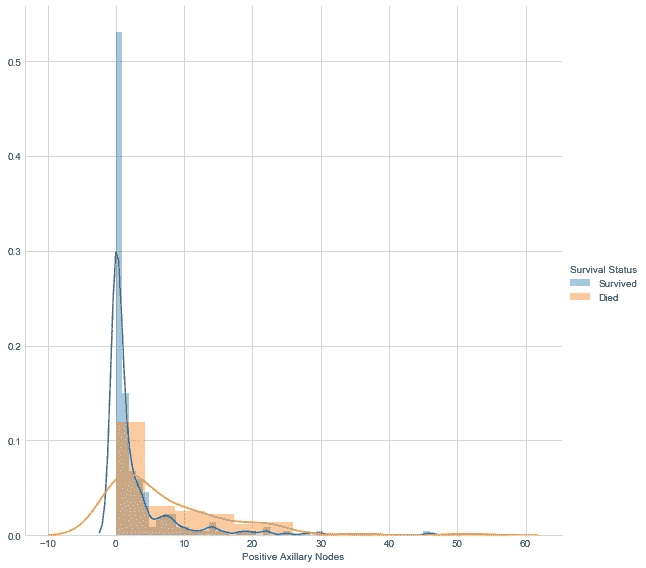**

**图片提供:iambipin**

****观察:****

1.  **阳性腋窝淋巴结(淋巴结受累)的存在可以是乳腺癌的明显表现。BreastCancer.org 在其网站上将它列为一个重要症状。因此，正腋淋巴结比其他属性更重要。**
2.  ****腋窝淋巴结阴性的患者比腋窝淋巴结阳性的患者有更高的存活几率**。**
3.  ****单个腋窝淋巴结阳性的患者也有很好的生存机会**。**
4.  ****乳腺癌**存活的可能性**随着阳性腋窝淋巴结**数量的增加而降低。**
5.  **只有一小部分患者腋窝淋巴结阳性超过 25 个。**
6.  ****阳性腋窝淋巴结**是做数据分析的首选属性。**

****确定观察值:**
我们可以通过对哈伯曼数据帧执行以下操作来确定观察值:**

```
df_one = haberman.loc[haberman['Positive Axillary Nodes']<=1]
df_less = haberman.loc[(haberman['Positive Axillary Nodes']<=25) & (haberman['Positive Axillary Nodes']>1)]
df_more = haberman.loc[haberman['Positive Axillary Nodes']>25]df_one_survived = df_one.loc[df_one['Survival Status']=='Survived']
print('No. of patients survived(with one or no positive nodes): {0}' .format(len(df_one_survived)))df_one_died = df_one.loc[df_one['Survival Status']=='Died']
print('No. of patients died(with one or no positive nodes): {0}' .format(len(df_one_died)))aster = '*'
print(aster*65)df_less_survived = df_less.loc[df_less['Survival Status']=='Survived']
print('No. of patients survived(1<positive nodes<=25): {0}' .format(len(df_less_survived)))df_less_died = df_less.loc[df_less['Survival Status']=='Died']
print('No. of patients died(1<positive nodes<=25): {0}' .format(len(df_less_died)))print(aster*65)df_more_survived = df_more.loc[df_more['Survival Status']=='Survived']
print('No. of patients survived(25<positive nodes<=52): {0}' .format(len(df_more_survived)))df_more_died = df_more.loc[df_more['Survival Status']=='Died']
print('No. of patients died(25<positive nodes<=52): {0}' .format(len(df_more_died)))Output:
No. of patients survived(with one or no positive nodes): 150
No. of patients died(with one or no positive nodes): 27
*****************************************************************
No. of patients survived(1<positive nodes<=25): 72
No. of patients died(1<positive nodes<=25): 52
*****************************************************************
No. of patients survived(25<positive nodes<=52): 3
No. of patients died(25<positive nodes<=52): 2
```

**输出已经确定了观察值。我们可以得出以下结论:**

1.  ****有**个或零个腋窝淋巴结阳性的患者中，有 85%**乳腺癌存活。****
2.  ****腋窝淋巴结阳性小于 25 且大于 1 的患者中有 58%存活了 5 年或更长时间****
3.  ******腋窝淋巴结阳性大于 25 的患者，有 60%的乳腺癌存活。******
4.  ******这些统计数据证明，如果阳性腋窝淋巴结的数目是 1 或 0，患者的存活机会是相当高的。如果这个数字大于 1，那么存活几率在 58%到 60%之间。******

# ******累积分布函数******

******实值随机变量 X 的累积分布函数(CDF)是该变量取值小于或等于 X 的概率。
**F(x) = P(X < = x)**
其中右手边代表随机变量 X 取值小于或等于 X 的概率。X 位于半闭区间(a，b)的概率，其中 a < b 因此:
**P(a < X <********

****概率密度函数的积分给出了 CDF。CDF 也是单变量分析。****

****使用选择的变量“阳性腋窝淋巴结”绘制 CDF。****

```
**df_axnodes_survived = haberman.loc[haberman['Survival Status']=='Survived']
counts1, bin_edges1 = np.histogram(df_axnodes_survived['Positive Axillary Nodes'], bins=10, density=True)
pdf1 = counts1/(sum(counts1))
print('PDF of patients survived 5 years or longer:', pdf1)
print('Bin Edges: ', bin_edges1)
cdf1 = np.cumsum(pdf1)aster = '*'
print(aster * 60)df_axnodes_died = haberman.loc[haberman['Survival Status']=='Died']
counts2, bin_edges2 = np.histogram(df_axnodes_died['Positive Axillary Nodes'], bins=10, density=True)
pdf2 = counts2/(sum(counts2))
print('PDF of patients died within 5 years:', pdf2)
print('Bin Edges: ', bin_edges2)
cdf2 = np.cumsum(pdf2)print(aster * 60)line1, = plt.plot(bin_edges1[1:], pdf1, label='PDF_Survived')
line2, = plt.plot(bin_edges1[1:], cdf1, label='CDF_Survived')
line3, = plt.plot(bin_edges2[1:], pdf2, label='PDF_Died')
line4, = plt.plot(bin_edges2[1:], cdf2, label='CDF_Died')
plt.legend(handles=[line1, line2, line3, line4])plt.xlabel('Positive Axillary Nodes', fontsize=15)
plt.show()Output:
PDF of patients survived 5 years or longer: [0.83555556 0.08       0.02222222 0.02666667 0.01777778 0.00444444 0.00888889 0\.         0\.         0.00444444]
Bin Edges:  [ 0\.   4.6  9.2 13.8 18.4 23\.  27.6 32.2 36.8 41.4 46\. ]
************************************************************
PDF of patients died within 5 years: [0.56790123 0.14814815 0.13580247 0.04938272 0.07407407 0\. 0.01234568 0\.         0\.         0.01234568]
Bin Edges:  [ 0\.   5.2 10.4 15.6 20.8 26\.  31.2 36.4 41.6 46.8 52\. ]
**************************************************************
```

****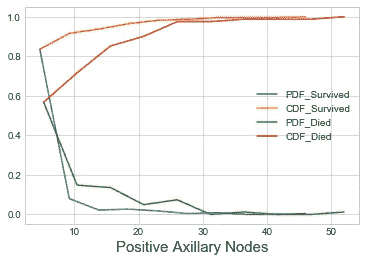****

****图片提供:iambipin****

****Matplotlib 用于绘制直方图，Numpy 用于计算计数和 bin 边缘。Matplotlib 使用 plt.hist()绘制直方图，该函数将 DataFrame 作为输入。bin_edges 给出容器边缘(第一个容器的左边缘和最后一个容器的右边缘)。np.cumsum()是一个计算累积和的 numpy 方法。plt.legend()是一个 Matplotlib 方法，用于生成图形的图例。plt.xlabel()是另一个标记 x 轴的 Matplotlib 方法****

******观察:******

1.  ****甚至有更多阳性腋窝淋巴结的患者也能从乳腺癌中存活下来。与此相反，没有阳性腋窝淋巴结的患者在接受手术后死亡。****
2.  ******癌症存活患者腋窝淋巴结阳性的最大数量为 46 个******
3.  ******83.55%** 癌症存活患者腋窝淋巴结在**0 ~ 4.6**范围内阳性。****
4.  ******死亡患者中有 56.79%** 的腋窝淋巴结在**0 ~ 5.2**范围内。****

******确定观察值:**
我们可以通过对哈伯曼数据帧执行以下操作来确定 1 号观察值:****

```
**df_axnodes_died = haberman.loc[haberman['Survival Status']=='Died']
df_no_axnodes_died = df_axnodes_died.loc[df_axnodes_died['Positive Axillary Nodes']==0]
print('No. of patients died with zero Positive Axillary Node: ', len(df_no_axnodes_died))df_axnodes_survived = haberman.loc[haberman['Survival Status']=='Survived']
df_high_axnodes_survived = df_axnodes_survived.loc[df_axnodes_survived['Positive Axillary Nodes']>=20]
print('No. of patients survived with high Positive Axillary Nodes(>=20): ', len(df_high_axnodes_survived))Output:
No. of patients died with zero Positive Axillary Node:  19
No. of patients survived with high Positive Axillary Nodes(>=20):  7
     Age of Patient  Year of Operation  Positive Axillary Nodes  \
7                34                 59                        0   
34               39                 66                        0   
44               41                 64                        0   
45               41                 67                        0   
54               42                 59                        0   
64               43                 64                        0   
65               43                 64                        0   
81               45                 66                        0   
97               47                 62                        0   
98               47                 65                        0   
114              49                 63                        0   
125              50                 64                        0   
224              60                 65                        0   
230              61                 65                        0   
239              62                 58                        0   
258              65                 58                        0   
268              66                 58                        0   
285              70                 58                        0   
293              72                 63                        0Survival Status  
7              Died  
34             Died  
44             Died  
45             Died  
54             Died  
64             Died  
65             Died  
81             Died  
97             Died  
98             Died  
114            Died  
125            Died  
224            Died  
230            Died  
239            Died  
258            Died  
268            Died  
285            Died  
293            Died  
     Age of Patient  Year of Operation  Positive Axillary Nodes  \
9                34                 58                       30   
59               42                 62                       20   
174              54                 67                       46   
188              55                 69                       22   
227              60                 61                       25   
252              63                 61                       28   
254              64                 65                       22Survival Status  
9          Survived  
59         Survived  
174        Survived  
188        Survived  
227        Survived  
252        Survived  
254        Survived**
```

# ****箱形图****

****箱线图是基于五个数字汇总的数据分布的直观表示。这五个数字是**最小或最小的数字、第一个四分位数(Q1)或第 25 个百分位数、中间值(Q2)或第 50 个百分位数、第三个四分位数(Q3)或第 75 个百分位数以及最大或最大的数字**。Q1 是最小值和中间值之间的中间数。Q3 是中间值和最大值之间的中间值。四分位数间距(IQR)是第一个四分位数和第三个四分位数之间的差值。
**IQR = Q3 — Q2**
方框图的高度代表 IQR。方框的顶线和底线分别代表第一个四分位数和第三个四分位数。盒子顶线和底线之间的线代表中间值。从方框平行延伸的线被称为“胡须”，用于指示上下四分位数之外的可变性。异常值有时被绘制成与须状物成直线的单个点。异常值是与其他观察值显著不同的数据点。它不属于总的分配模式。****

****盒须图是数学家约翰·图基在 1969 年首次提出的。箱线图可以垂直或水平绘制。虽然与直方图或密度图相比，箱线图可能看起来很原始，但它们具有占用空间少的优点，这在比较许多组或数据集之间的分布时很有用。****

****Python 统计数据可视化库 **Seaborn** 用于绘制**箱线图**。****

```
**sns.boxplot(x='Survival Status', y='Positive Axillary Nodes', data=haberman)
plt.show()**
```

****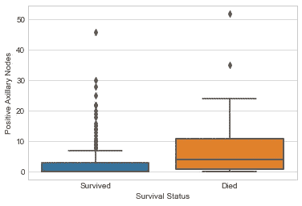****

****图片提供:iambipin****

# ****小提琴情节****

****小提琴图用于可视化数据的分布及其概率密度。它是箱形图与两侧的旋转核密度图的组合，用于显示数据的分布形状。中间的**白点**是中间值，中间粗黑条代表四分位数范围。从它延伸出来的黑色细线代表数据中的最大值和最小值。小提琴图类似于箱线图，只是它们也显示不同值的数据的概率密度，通常由核密度估计器平滑。结合两个世界最好的**(直方图和 PDF，方框图)**给出了**小提琴图**。小提琴剧情是**单变量分析**。****

```
**sns.violinplot(x='Survival Status', y='Positive Axillary Nodes', data=haberman, size=8)
plt.show()**
```

****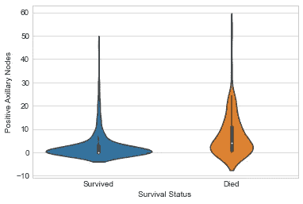****

****图片提供:iambipin****

******观察:******

1.  ****IQR 是衡量谎言价值的标准。因此，幸存于的**患者的阳性腋窝淋巴结**少于 3 个**。同样，**死亡**的患者，腋窝**淋巴结阳性大于 2 个**。******
2.  **晶须外点的存在表明异常值的存在**。存活类别(存活 5 年或更长时间的患者)中异常值的数量大大高于死亡类别(5 年内死亡的患者)。****
3.  **幸存类别的 Q1 和中位数几乎相同。死亡类别的中位数和幸存类别的 Q3 显然在同一条线上。因此存在**重叠**，这可能导致至少 **15%到 20%** 的误差。因此，很难设定一个阈值来区分患者的生存机会。**
4.  **大多数没有阳性腋窝淋巴结的患者在乳腺癌中存活。类似地，大多数有大量阳性腋窝淋巴结的患者死亡。**
5.  **每条规则都有例外。它也适用于这里。因为具有大量阳性腋窝淋巴结的患者很少存活，并且没有阳性腋窝淋巴结的患者很少死亡。**

# **等值线图表**

**等值线图是一种多变量分析。等高线图不是一种标准化技术，而是一种通过绘制二维格式的称为等高线的**常量 z 切片来表示三维表面的图形技术。Seaborn 习惯于绘制等高线图。****

```
sns.jointplot(x='Age of Patient', y='Positive Axillary Nodes', data=haberman, kind='kde')
plt.show()
```

**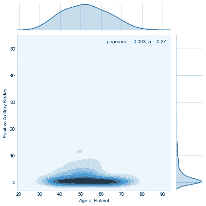**

**图片提供:iambipin**

****观察:****

1.  **在所有腋窝淋巴结阳性少于或等于 2 个的患者中，大多数患者的年龄在**50–56 岁之间。****

****确定观察值:**
我们可以通过对哈伯曼数据帧执行以下操作来确定观察值:**

```
df_axnodes_zero = haberman.loc[haberman['Positive Axillary Nodes']<=2]
print('No. of patients with positive axillary nodes<=2: ', len(df_axnodes_zero))
df_axnodes_zero_50 = df_axnodes_zero.loc[(df_axnodes_zero['Age of Patient']>=50) & (df_axnodes_zero['Age of Patient']<=56)]
print('No. of patients in the age group 50-56 who have positive axillary nodes<=2: ', len(df_axnodes_zero_50))Output:
No. of patients with positive axillary nodes<=2:  197
No. of patients in the age group 50-56 who have positive axillary nodes<=2:  40
```

**因此，在 50-56 岁年龄组中，20.30%腋窝淋巴结阳性小于或等于两个淋巴结的患者。**

**让我们总结一下我们在探索性数据分析过程中所做的重要观察。**

****结论:****

1.  **30-40 岁年龄段的大多数患者都从乳腺癌中幸存下来。**
2.  ****在 1961 年至 1968 年期间接受手术的大多数患者在手术后存活了 5 年或更长时间。****
3.  **出现**阳性腋窝淋巴结(淋巴结受累)**可以是乳腺癌的明显表现。一般来说，乳腺癌患者的生存机会与阳性腋窝淋巴结的数量成反比。**
4.  ****腋窝淋巴结无阳性的患者比腋窝淋巴结有阳性的患者有更高的存活几率**。**
5.  **少数**有大量阳性腋窝淋巴结的患者存活**，少数**无阳性腋窝淋巴结的患者死亡**。所以没有阳性腋窝淋巴结并不能预示着绝对的生存保证。**
6.  **只有一小部分**患者腋窝淋巴结阳性超过 25 个**。**
7.  ****所以基于探索性数据分析，我们可以提出一个关于乳腺癌患者生存几率的假设。****

****参考文献:****

*   **[https://www.breastcancer.org/symptoms/diagnosis/lymph_nodes](https://www.breastcancer.org/symptoms/diagnosis/lymph_nodes)**
*   **[https://www.kaggle.com/gilsousa/habermans-survival-data-set](https://www.kaggle.com/gilsousa/habermans-survival-data-set)**
*   **[https://en.wikipedia.org/wiki/Exploratory_data_analysis](https://en.wikipedia.org/wiki/Exploratory_data_analysis)**
*   **[https://matplotlib . org/API/_ as _ gen/matplotlib . py plot . hist . html](https://matplotlib.org/api/_as_gen/matplotlib.pyplot.hist.html)**
*   **[https://matplotlib . org/tutorials/intermediate/legend _ guide . html](https://matplotlib.org/tutorials/intermediate/legend_guide.html)**
*   **[https://seaborn.pydata.org/generated/seaborn.FacetGrid.html](https://seaborn.pydata.org/generated/seaborn.FacetGrid.html)**
*   **[https://pandas . pydata . org/pandas-docs/stable/reference/API/pandas。DataFrame.dtypes.html](https://pandas.pydata.org/pandas-docs/stable/reference/api/pandas.DataFrame.dtypes.html)**
*   **[https://www.appliedaicourse.com/](https://www.appliedaicourse.com/)**
*   **[https://en . Wikipedia . org/wiki/Cumulative _ distribution _ function](https://en.wikipedia.org/wiki/Cumulative_distribution_function)**
*   **[https://datavizcatalogue.com/methods/box_plot.html](https://datavizcatalogue.com/methods/box_plot.html)**
*   **[https://datavizcatalogue.com/methods/violin_plot.html](https://datavizcatalogue.com/methods/violin_plot.html)**
*   **[https://pixabay.com/users/geralt-9301/](https://pixabay.com/users/geralt-9301/)(来自 Pixabay 的 Gerd Altmann 的第一张背景图片)**
*   **我创建的所有其他图像(除了第一个背景图像)。**