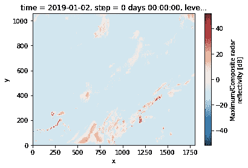

# 使用机器学习对图像进行压缩、搜索、插值和聚类

> 原文：<https://towardsdatascience.com/compression-search-interpolation-and-clustering-of-images-using-machine-learning-eb65fcf0abbb?source=collection_archive---------21----------------------->

## 如何使用图像嵌入进行压缩、搜索、插值和聚类

机器学习中的嵌入提供了一种创建复杂、非结构化数据的简明、低维表示的方法。自然语言处理中通常使用嵌入来将单词或句子表示为数字。

在之前的一篇文章中，我展示了如何创建一个 1059x1799 HRRR 图像的简洁表示(50 个数字)。在本文中，我将向您展示嵌入有一些很好的属性，您可以利用这些属性来实现用例，如压缩、图像搜索、插值和大型图像数据集的聚类。

## 压缩

首先，嵌入是否捕捉到了图像中的重要信息？我们能把嵌入的图像解码成原始图像吗？

嗯，我们将无法恢复原始图像，因为我们获取了 200 万像素的值，并将它们放入一个长度=50 的向量中。尽管如此，嵌入是否捕捉到了天气预报图像中的重要信息？

以下是世界协调时 2019 年 9 月 20 日 05:00 HRRR 的原始预报:


2019 年 9 月 20 日天气

我们可以获得时间戳的嵌入并如下解码([完整代码在 GitHub](https://github.com/GoogleCloudPlatform/ml-design-patterns/blob/master/02_data_representation/weather_search/wx_embeddings.ipynb) 上)。首先，我们通过加载 SavedModel、找到嵌入层并重建所有后续层来创建解码器:

```
import tensorflow as tf
def create_decoder(model_dir):
    model = tf.keras.models.load_model(model_dir)
    decoder_input = tf.keras.Input([50], name='embed_input')
    embed_seen = False
    x = decoder_input
    for layer in model.layers:
        if embed_seen:
            x = layer(x)
        elif layer.name == 'refc_embedding':
            embed_seen = True
    decoder = tf.keras.Model(decoder_input, x, name='decoder')
    print(decoder.summary())
    return decoderdecoder = create_decoder('gs://ai-analytics-solutions-kfpdemo/wxsearch/trained/savedmodel')
```

一旦我们有了解码器，我们就可以从 BigQuery 中提取时间戳的嵌入:

```
SELECT *
FROM advdata.wxembed
```

这给了我们一个这样的表格:


然后，我们可以将上表中的“ref”值传递给解码器:

```
import tensorflow as tf
import numpy as np
embed = tf.reshape( tf.convert_to_tensor(df['ref'].values[0], 
                     dtype=tf.float32), [-1, 50])
outimg = decoder.predict(embed).squeeze() * 60
plt.imshow(outimg, origin='lower');
```

请注意，TensorFlow 希望看到一批输入，因为我们只传入一个，所以我必须将其重新整形为[1，50]。类似地，TensorFlow 返回一批图像。我在显示它之前挤压它(删除虚拟尺寸)。结果呢？


如你所见，解码图像是原始 HRRR 的模糊版本。嵌入确实保留了密钥信息。它起到压缩算法的作用。

## 搜索

如果嵌入是一个压缩的表示，嵌入空间的分离程度会转化为实际预测图像的分离程度吗？

如果是这种情况，搜索过去与现在的一些情况“相似”的天气情况就变得容易了。在 200 万像素的图像上寻找相似物可能会很困难，因为风暴可能会略有不同，或者大小有所不同。

由于我们在 BigQuery 中有嵌入，所以让我们使用 SQL 来搜索类似于 2019 年 9 月 20 日 05:00 UTC:

```
WITH ref1 AS (
SELECT time AS ref1_time, ref1_value, ref1_offset
FROM `ai-analytics-solutions.advdata.wxembed`,
     UNNEST(ref) AS ref1_value WITH OFFSET AS ref1_offset
WHERE time = '2019-09-20 05:00:00 UTC'
)SELECT 
  time,
  **SUM( (ref1_value - ref[OFFSET(ref1_offset)]) * (ref1_value - ref[OFFSET(ref1_offset)]) ) AS sqdist** 
FROM ref1, `ai-analytics-solutions.advdata.wxembed`
GROUP BY 1
ORDER By sqdist ASC
LIMIT 5
```

基本上，我们计算在指定时间戳(refl1)的嵌入和每隔一个嵌入之间的欧几里德距离，并显示最接近的匹配。结果是:


这很有道理。前一小时/后一小时的图像最相似。然后，从+/- 2 小时开始的图像等等。

如果我们想找到不在+/- 1 天内的最相似的图像呢？由于我们只有 1 年的数据，我们不打算进行大的类比，但让我们看看我们得到了什么:

```
WITH ref1 AS (
SELECT time AS ref1_time, ref1_value, ref1_offset
FROM `ai-analytics-solutions.advdata.wxembed`,
     UNNEST(ref) AS ref1_value WITH OFFSET AS ref1_offset
WHERE time = '2019-09-20 05:00:00 UTC'
)SELECT 
  time,
  SUM( (ref1_value - ref[OFFSET(ref1_offset)]) * (ref1_value - ref[OFFSET(ref1_offset)]) ) AS sqdist 
FROM ref1, `ai-analytics-solutions.advdata.wxembed`
**WHERE time NOT BETWEEN '2019-09-19' AND '2019-09-21'**
GROUP BY 1
ORDER By sqdist ASC
LIMIT 5
```

结果有点出人意料:1 月 2 日和 7 月 1 日是天气最相似的日子；


好吧，让我们来看看这两个时间戳:



我们看到 9 月 20 日的图像确实落在这两张图像之间。两张图片中都有墨西哥湾沿岸和中西部北部的天气情况。就像 9 月 20 日的照片一样。

如果我们有(a)不止一年的数据,( b)在多个时间步加载 HRRR 预报图像，而不仅仅是分析场，以及(c)使用更小的切片来捕捉中尺度现象，我们可能会得到更有意义的搜索。这是留给感兴趣的气象学学生的练习

## 插入文字

回想一下，当我们寻找与 05:00 的图像最相似的图像时，我们得到了 06:00 和 04:00 的图像，然后是 07:00 和 03:00 的图像。在嵌入空间中，到下一个小时的距离大约为 sqrt(0.5)。

给定搜索用例中的这种行为，一个自然的问题是我们是否可以使用嵌入在天气预报之间进行插值。我们能对 t-1 和 t+1 的嵌入进行平均以得到 t=0 的嵌入吗？有什么错误？

```
WITH refl1 AS (
SELECT ref1_value, idx
FROM `ai-analytics-solutions.advdata.wxembed`,
     UNNEST(ref) AS ref1_value WITH OFFSET AS idx
WHERE time = '2019-09-20 05:00:00 UTC'
),...SELECT SUM( (ref2_value - (ref1_value + ref3_value)/2) * (ref2_value - (ref1_value + ref3_value)/2) ) AS sqdist
FROM refl1
JOIN refl2 USING (idx)
JOIN refl3 USING (idx)
```

结果呢？sqrt(0.1)，比 sqrt(0.5)少很多。换句话说，嵌入确实起到了方便的插值算法的作用。

*为了将嵌入作为一种有用的插值算法，我们需要用远远超过 50 个像素的像素来表示图像。丢失的信息不可能这么高。同样，这是留给感兴趣的气象学家的练习。*

## 使聚集

鉴于嵌入在可交换性和可加性方面看起来工作得非常好，我们应该期望能够对嵌入进行聚类。

让我们使用 K-Means 算法，要求五个聚类:

```
CREATE OR REPLACE MODEL advdata.hrrr_clusters
OPTIONS(model_type='kmeans', num_clusters=5, KMEANS_INIT_METHOD='KMEANS++')
ASSELECT arr_to_input(ref) AS ref
FROM `ai-analytics-solutions.advdata.wxembed`
```

生成的质心形成一个 50 元素的数组:


我们可以继续绘制五个质心的解码版本:

```
for cid in range(1,6):
    **embed = df[df['centroid_id']==cid].sort_values(by='feature')['numerical_value'].values**
    embed = tf.reshape( tf.convert_to_tensor(embed, dtype=tf.float32), [-1, 50])
    outimg = decoder.predict(embed).squeeze() * 60
    axarr[ (cid-1)//2, (cid-1)%2].imshow(outimg, origin='lower');
12.15992
```

以下是 5 个群集的结果形心:


当嵌入被聚类成 5 个簇时，这些是质心

第一个好像是你们班中西部风暴。第二个是芝加哥-克利夫兰走廊和东南部的大范围天气。第三个是第二个的强大变体。第四个是穿越阿巴拉契亚山脉的飑线。第五是内陆晴朗的天空，但是沿海的天气。

*为了将聚类用作有用的预测辅助工具，您可能想要对更小的切片进行聚类，可能是 500 公里 x 500km 公里的切片，而不是整个美国。*

在所有五个集群中，西雅图下雨，加利福尼亚阳光明媚。


## 后续步骤:

1.  仔细阅读 GitHub 上的[完整代码](https://github.com/GoogleCloudPlatform/ml-design-patterns/blob/master/02_data_representation/weather_search/wx_embeddings.ipynb)
2.  阅读前两篇文章。一个是关于如何[将 HRRR 文件转换成张量流记录](/how-to-convert-binary-files-into-tensorflow-records-3150d7236341)，另一个是关于[如何使用自动编码器](/how-to-create-a-concise-image-representation-using-machine-learning-20156c1e0c19)来创建 HRRR 分析图像的嵌入。
3.  我在华盛顿大学的科学研究所做了一个关于这个话题的演讲。看 YouTube 上的演讲: