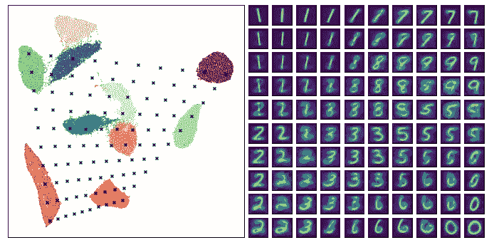

# compression vae——t-SNE 和 UMAP 的强大和多功能替代产品

> 原文：<https://towardsdatascience.com/compressionvae-a-powerful-and-versatile-alternative-to-t-sne-and-umap-5c50898b8696?source=collection_archive---------13----------------------->

## 介绍一种快速、易用、基于深度学习的降维工具


使用 CompressionVAE 的 MNIST 嵌入的风格化可视化，由[Qosmo](https://www.instagram.com/robinjungers/)的程序员[罗宾·荣格斯](https://www.instagram.com/robinjungers/)创建。

【TL；dr: CompressionVAE 是一个基于可变自动编码器思想的降维工具。它可以通过`pip install cvae`安装，使用方式与 scikit-learn 的 t-SNE 或 UMAP-learn 非常相似。完整的代码和文档可以在这里找到:[https://github.com/maxfrenzel/CompressionVAE](https://github.com/maxfrenzel/CompressionVAE)

降维是许多机器学习应用的核心。即使像 MNIST 这样简单的 28x28 像素黑白图像也要占据 784 维空间，而对于大多数感兴趣的真实数据来说，这可以轻松达到数万甚至更多。为了能够处理这种数据，第一步通常包括降低数据的维度。

这背后的一般思想是，不同的维度通常是高度相关和冗余的，并且不是所有的维度都包含等量的有用信息。降维算法的挑战是保留尽可能多的信息，同时用较少的特征描述数据，将数据从高维数据空间映射到低得多的维度潜在空间(也称为嵌入空间)。本质上是压缩的问题。一般来说，压缩算法越好，我们在这个过程中丢失的信息就越少(有一个小警告，根据应用程序的不同，并非所有信息都同样重要，因此最无损的方法不一定总是最好的)。

良好的降维技术允许我们创建更适合下游任务的数据，允许我们建立更紧凑的模型，并防止我们遭受[维数灾难](https://en.wikipedia.org/wiki/Curse_of_dimensionality)。它还使我们能够在二维或三维空间中可视化和分析数据。它可以发现大数据集中隐藏的潜在结构。

长期以来[t-分布式随机邻居嵌入(t-SNE)](https://lvdmaaten.github.io/tsne/) ，特别是它作为 [scikit-learn](https://scikit-learn.org/) 的一部分的实现，一直是降维的主力(与 PCA 一起)。它很容易使用，有很多好的属性，特别是可视化。但是它有几个缺点。找到正确的参数并解释结果可能有点挑战性，并且它不能很好地扩展到高维空间(在输入和潜在维度中都是如此)。它的特性也使它不太适合非可视化的目的。

最近，[均匀流形近似和投影(UMAP)](https://arxiv.org/abs/1802.03426) 变得流行起来，并开始在许多应用中补充甚至取代 t-SNE，这要归功于它提供的几个优点。UMAP 要快得多，并且能更好地适应高维数据。它还更好地保留了全局结构，使其更适合可视化之外的许多应用。

在本文中，我想介绍这两种方法的替代方法:CompressionVAE(或简称为 CVAE)。CVAE 建立在 t-SNE 和 UMAP 实现的易用性基础上，但提供了几个非常可取的属性(以及一些缺点——它不是银弹)。

在其核心，CVAE 是一个[变分自动编码器(VAE)](https://arxiv.org/abs/1312.6114) 的 TensorFlow 实现，包装在一个易于使用的 API 中。我决定将其命名为 CompressionVAE，以赋予该工具一个独特的名称，但从根本上来说，它只是一个 VAE(可选地添加了[反向自回归流层](https://arxiv.org/abs/1606.04934)，以使学习到的分布更具表现力)。

因此，它基于与 VAE 相同的强大理论基础，并且可以很容易地扩展以考虑该领域中许多正在进行的发展。如果你想了解更多关于 VAEs 的一般知识，[我写了一个关于这个主题的深入的三部分系列](https://maxfrenzel.com/articles/the-variational-autoencoder-as-a-two-player-game-part-i)，从一个双人游戏的独特角度解释它们。

我们将在下面的示例中更深入地探讨 CVAE 的一些优点(和缺点)，但这里只是一个总体概述:

*   CVAE 比 SNE 霸王龙和 UMAP 都快
*   CVAE 倾向于学习一个非常平滑的嵌入空间
*   学习到的表征非常适合作为下游任务的中间表征
*   CVAE 学会了从数据到嵌入空间的确定性和可逆的映射(注意:UMAP 的最新版本也提供了一些可逆性)
*   该工具可以集成到实时系统中，无需重新培训即可处理以前未见过的示例
*   经过训练的系统是完整的生成模型，可用于从任意潜在变量生成新数据
*   CVAE 很好地扩展到高维输入和潜在空间
*   原则上，它可以扩展到任意大的数据集。它既可以像 t-SNE 和 UMAP 实现那样获得全部训练数据，也可以一次只将一批训练数据加载到内存中。
*   CVAE 是高度可定制的，即使在其当前的实现中，也提供了许多可控制的参数(同时也为缺乏经验的用户提供了相当健壮的默认设置)
*   除了当前的实现，它是高度可扩展的，并且将来的版本可以提供例如卷积或递归编码器/解码器，以允许除简单向量之外的更多问题/数据特定的高质量嵌入。
*   VAEs 有一个非常强大和研究良好的理论基础
*   由于优化的目标，CVAE 往往不会得到一个非常强的集群之间的分离。非常手动地，在拥有平滑的潜在空间和获得强的团簇分离之间有一个权衡，VAE 更加平滑并且保留了全局结构。这可能是一个问题，也可能是一个优势，取决于具体的应用。
*   最大的缺点:和几乎任何深度学习工具一样，它需要大量的数据来训练。t-SNE 和 UMAP 在小数据集上工作得更好(当 CVAE 变得适用时没有硬性规定，但是通常通过运行`pip install cvae` (或[克隆库](https://github.com/maxfrenzel/CompressionVAE)并从那里安装), CVAE 就可以使用了。在自述文件中可以找到更广泛的代码示例，但在其最基本的用例中，我们可以使用以下几行代码在数据阵列 X 上训练 CVAE 模型:

默认情况下，初始化 CompressionVAE 对象会创建一个具有二维潜在空间的模型，将数据 X 随机分为 90%的训练数据和 10%的验证数据，应用特征规范化，并尝试将模型架构与输入和潜在特征维度相匹配。它还将模型保存在一个临时目录中，下次在那里创建新的 CVAE 对象时，该目录将被覆盖。所有这些都可以定制，但我建议您参考自述文件了解详细信息。

## 训练方法应用基于验证数据丢失的自动学习率调度，并且在模型收敛时(由某些可调整的标准确定)或者在 50k 训练步骤之后停止。我们也可以通过键盘中断(ctrl-c 或 Jupyter notebook 中的‘中断内核’)来提前停止训练过程。此时模型将被保存。也可以停止训练，然后使用不同的参数重新开始(更多详细信息，请参见自述文件)。

一旦我们有了一个训练好的模型，我们就可以使用工具的 embed 方法来嵌入数据。例如，为了嵌入整个数据集 X，我们可以运行

```
# Import CVAE 
from cvae import cvae# Initialise the tool, assuming we already have an array X containing the data 
embedder = cvae.CompressionVAE(X)# Train the model 
embedder.train()
```

在这种情况下，我们嵌入了模型在训练期间已经看到的数据，但是我们也可以向 embed 方法传递新的示例。

可视化嵌入

对于二维潜在空间，CVAE 自带可视化的内置方法。让我们假设我们在 MNIST 数据上训练我们的模型，并且最初以如下方式定义 X:

```
z = embedder.embed(X)
```

然后，我们可以通过以下方式绘制上面创建的嵌入

## 下面是一个这样的例子。

我们也可以扫描潜在空间，并使用 VAE 的生成器部分来可视化学习空间。

```
from sklearn.datasets import fetch_openml
mnist = fetch_openml('mnist_784', version=1, cache=True)
X = mnist.data
```

同样，您可以在自述文件中找到更多的详细信息和选项。

```
embedder.visualize(z, labels=[int(label) for label in mnist.target])
```

速度比较


CVAE 的好处之一是训练速度快。下面是在两个不同规模的流行数据集上与 UMAP 和 t-SNE 的一些比较:MNIST (70，000 个样本)和 Kuzushiji-49 (270，912 个样本)。

```
embedder.visualize_latent_grid()
```


为了进行比较，我使用了 scikit-learn 提供的 t-SNE 的基本版本，而不是任何多核版本。使用 UMAP 时，我收到一个“NumbaPerformanceWarning”，通知我不能使用并行化。所以这两种方法都有可能被加速，但是下面仍然是大多数用户会遇到的最普通的用例的一个很好的比较。所有测试都是在我的 MacBook Pro 上进行的，没有使用任何 GPU。

## **MNIST:**

t-SNE: 5735 秒(单次)

UMAP:611±1 秒(10 次运行的平均值和标准偏差)

CVAE:121±39 秒(10 次运行的平均值和标准偏差)

*   **Kuzushiji-49:**
*   t-SNE:甚至没有尝试
*   UMAP: 4099 秒(单次)

CVAE:235±70 秒(10 次运行的平均值和标准偏差)

*   我们看到，在这些数据集规模上，CVAE 在收敛时间方面明显更胜一筹，而且这种优势只会在更大的数据集上增强。请注意，CVAE 持续时间是由默认学习率计划和停止标准确定的收敛时间。
*   更详细的外观
*   下面的动画展示了一个在 MNIST 进行训练的例子。我们可以看到，CVAE 很快就接近了它的最终解，然后花了大部分时间来完善它。这表明，如果训练速度是一个关键问题，早期停止可能仍然会提供足够的结果，这取决于用例。自从我禁用了学习率衰减，这个特殊的模型实际上从未完全收敛。]

我们还在上面的速度数字中看到，由于当前版本对模型的初始化相当敏感，CVAE 在收敛时间上有相当大的差异。这种灵敏度既影响收敛速度，也影响最终结果。尝试几种模型并比较结果可能是值得的。作为一个例子，下面的潜在空间的三个不同的实例训练相同的 MNIST 数据。

## 然而，在所有情况下，我们看到 CVAE 倾向于实现一个非常平滑的潜在空间，并很好地保存全球结构。与此形成对比的是，例如，UMAP 的强聚类将相似的数字非常明显地分开，而对 CVAE 来说，它们平滑地流入彼此。

MNIST 嵌入和 UMAP 潜在空间的可视化，[摘自 UMAP 文件](https://umap-learn.readthedocs.io/en/latest/inverse_transform.html)。

上面的图也显示了 UMAP 逆变换的结果。与上面的 CVAE 版本相比，我们再次看到 CVAE 的潜在空间更加平滑。要明确的是，我在这里提出的“平滑”论点是非常定性的。如果你对更具体的东西感兴趣，我不久前给[写了一篇关于这个主题的论文](https://arxiv.org/abs/1902.02113)，但是我没有在这里的任何测试中应用这些更精确的指标。


关于用 CVAE 解码数据的一个注意事项:如果解码是主要的兴趣，我们可能应该有一个更专业的解码器。现在，解码器完全不受约束，例如，MNIST 模型可以输出值< 0 and > 255，即使它们作为像素值没有意义。我希望 CVAE 尽可能的通用和数据不可知。然而，在未来的版本中提供更多的选项来更加专门化这一点可能是值得的。例如，在 MNIST，通常的做法是通过 sigmoid 函数和适当的损耗将值限制在适当的范围内。



时尚 MNIST 是另一个简单而有用的玩具数据集，用于探索该工具的功能和输出。首先，让我们在 UMAP 的观想中寻找对比。

时尚 MNIST 的嵌入和 UMAP 的潜在空间的可视化，[摘自 UMAP 文献](https://umap-learn.readthedocs.io/en/latest/inverse_transform.html)。

与此相比，这是一个经过训练的 CVAE 模型的结果。

我们再一次看到了与上面非常相似的结果，CVAE 的星团分离不那么明显，但是过渡更加平滑。


这个例子也很好地展示了 CVAE 是如何抓住本地和全球结构的。

在全球范围内，我们看到“踝靴”、“运动鞋”和“凉鞋”类别都聚集在一起，无缝地相互融合。我们观察到从“连衣裙”，到“衬衫”和“t 恤/上衣”(几乎完全重叠)，到“套头衫”和“外套”的类似过渡。例如，我们在“裤子”和更大的鞋类集群之间看到了更强烈的区分(和不明确的重建)。有趣的是，包包几乎可以无缝地变成套头衫。


在局部我们也发现了很多结构，比如鞋子随着 y 的降低脚踝高度越来越高，随着 x 的增加脚踝高度越来越高。

所有这些都表明，模型已经清楚地学习/发现了数据集的一些底层潜在结构。

我们还可以玩数据插值。让我们随机挑选两个真实的例子，创建五个中介“假”数据点。

注意，这段代码假设`embedder`是一个 CVAE 实例，它是根据时尚 MNIST 数据`X_fashion`训练的。在做了一些整形和显示后，我们可以得到如下结果。

虽然这里讨论的所有示例都只是没有任何实际应用的玩具数据集，但 CVAE 可以应用于许多现实世界的问题，也可以用于生产环境。

在我现在的公司 [Qosmo](http://qosmo.jp/en/) ，我们在几个项目中使用 CVAE 的变体，从纯粹的艺术到商业。我们开发的各种音乐推荐和播放列表生成解决方案就是一个例子。

```
import random
import numpy as np# Get two random data points
X1 = np.expand_dims(random.choice(X_fashion), axis=0)
X2 = np.expand_dims(random.choice(X_fashion), axis=0)# Embed both
z1 = embedder.embed(X1)
z2 = embedder.embed(X2)# Interpolate between embeddings in five steps
z_diff = (z2 - z1) / 6 
z_list = [z1 + k*z_diff for k in range(7)]
z_interp = np.concatenate(z_list)# Decode
X_interp = embedder.decode(z_interp)
```

在其中的一些中，我们首先使用专有系统将歌曲转换为固定大小的非常高维的矢量表示，然后使用 CVAE 进一步压缩矢量，使它们更适合下游任务，最后使用另一个定制的系统，该系统使用创建的歌曲嵌入来生成有意义和自然的声音播放列表，可能还会考虑某些附加标准和实时数据(例如，当前天气或一天中的时间)。


如果您有兴趣使用这些系统中的一个，或者想根据您的特定需求与我们合作定制解决方案，请访问[我们的网站](http://qosmo.jp/en/)并与我们联系。

压缩阀仍处于非常早期的阶段。但是我鼓励你试着把它应用到你自己的问题上。

如果当前的基本版本不能完全满足您的需求，您可以根据自己的需要随意扩展和修改它。如果你愿意分享你的定制，并让它成为 CVAE 主发行版的一部分，那就更好了。虽然肯定有很大的改进空间，但我希望当前的实现提供了一个很好的框架和起点，使这个过程尽可能简单。

我期待着看到每个人的用例和贡献(希望也能修复我草率的代码、潜在的错误和不稳定性)。

CompressionVAE 无法取代其他各种维度缩减工具，但我希望它能为现有的工具库提供有价值的补充。

快乐压缩！

I’m looking forward to see everyone’s use cases and contributions (and hopefully also fixes to my sloppy code, potential bugs, and instabilities).

CompressionVAE won’t be able to replace the various other dimensionally reductions tools, but I hope it provides a valuable addition to the existing arsenal of tools.

Happy compressing!