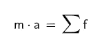
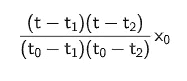
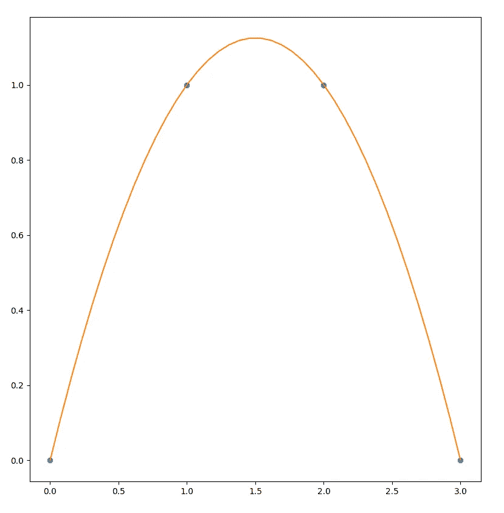
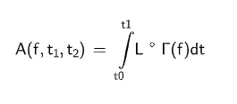
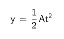
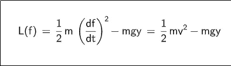
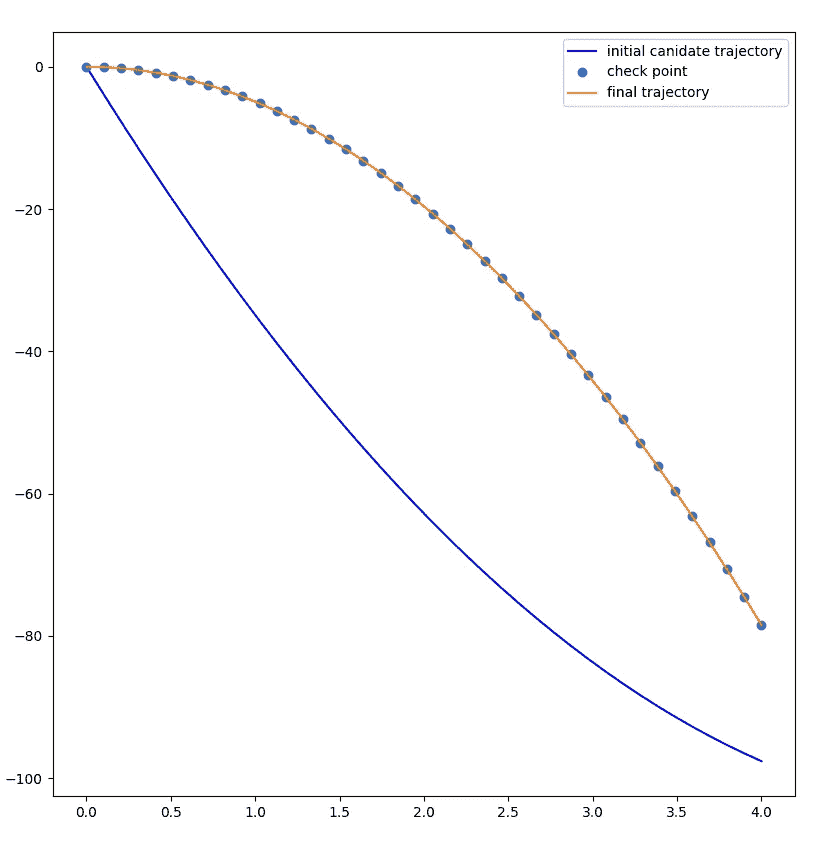
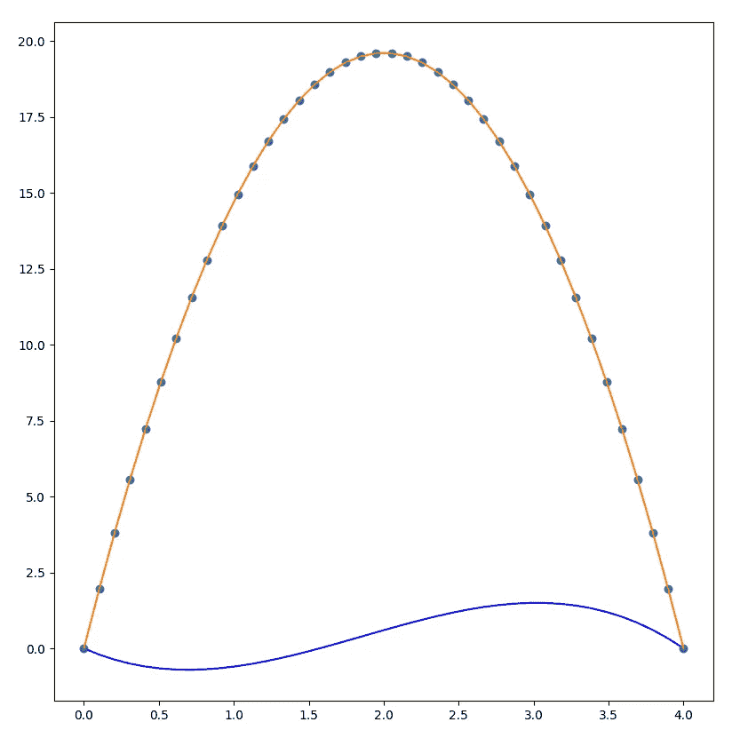

# 计算物理学

> 原文：<https://towardsdatascience.com/computational-physics-ed6c6a0bd22a?source=collection_archive---------35----------------------->

## 使用数据科学工具理解激发电影《到来》的物理定律

来自电影[的图像到达](https://en.wikipedia.org/wiki/Arrival_(film))。静止不动的原理启发了这本书的作者。

在看到电影[到来](https://en.wikipedia.org/wiki/Arrival_(film))的几天后，当我在写我之前的论文[微分编程](/differentiable-programming-from-scratch-abba0ebebc1c)时，我发现 [JAX](https://jax.readthedocs.io/) 的作者，一个实现*自动微分*的库，推荐阅读[结构和经典力学解释](https://mitpress.mit.edu/sites/default/files/titles/content/sicm_edition_2/toc.html)。我立刻被他们解释静止动作原理的巧妙方式所打动，这启发了我的到来。

这本书已经由麻省理工学院出版，并重新使用了同样的标题[计算机程序的结构和解释](https://web.mit.edu/alexmv/6.037/sicp.pdf)，也是由麻省理工学院出版的。两者都可以在网上免费获得！

*计算机程序的结构与解释，*又称*向导书*是一本著名的计算机科学书籍。我强烈推荐它的阅读。当我读得非常开心的时候，我被这本关于经典力学的新书吸引住了，这本书似乎遵循了同样的模式。

作为一名机械领域的前研究人员，我没有对这本书失望；至于 SICP，我真的很喜欢阅读 SICM 的作品。这本书的整体思想是使用计算机科学提供的工具接近经典力学:数值分析，符号计算，自动微分，…

在本文中，我们将看到如何使用我们熟悉的数学和数值工具来计算刚体轨迹，使用激发电影[降临](https://en.wikipedia.org/wiki/Arrival_(film))的物理学原理:静止作用原理。

## 牛顿第二定律

我们所熟悉的物理学本质上是基于牛顿的设想。在他的设想中，基于微分方法，运动和力通过加速度联系起来:对物体施加力会改变其速度，*即*物体的加速度与力成正比。物体质量越大，力对其速度的影响越小:加速度与质量成反比。

这个关系通常被他著名的第二定律所包含:

牛顿第二物理定律。图片由作者提供。

使用这个公式，或者稍微复杂一点的版本，完全可以模拟刚性或可变形物体的运动。

## 静止作用原理

然而，在本文中，我们将重点介绍另一种方法，该方法由法国数学家牟培尔堆开发，由杰出的英国数学家汉密尔顿完善，由俄罗斯数学家奥斯特罗夫斯基进一步扩展，并由法国科学家拉格朗日推广:最小作用的*原理*，推广为静止作用的*原理*。

另外，请注意，这一原则是美国作家姜峯楠写的引人入胜的书《你生活的故事》的故事基础。这本书启发了同样著名的电影*降临*。但是文化上的离题已经够多了。让我们回到数学和物理。

我不会给你这个原理的陈述，在任何一本好的力学教科书中都可以找到。相反，就像在 *SICM* 中一样，我将强调我们如何利用这一原则，使用我们首选的编程语言:Python，在候选轨迹中选择物理上可接受的运动。

事实上，这个原则本质上是说，任何物理上可接受的路径都会最小化特定的功能。或者更准确地说，可接受路径周围的任何微小变化都必须保持函数不变，*即*路径是*静止的*。

因此，为了找到正确的路径，我们所要做的就是对目标进行一些最小化。再简单不过了，这是我们的日常工作。

## 编程物理学

为了计算这些可接受的路径，我们只需要:

*   一种创建候选轨迹的方法。为此，我们需要一个返回位置的时间函数。普通的 python 和一些多项式魔法就能胜任这项工作。
*   从轨迹中提取特征的方法:通常是它们的位置、速度、加速度和可能的高阶导数。我们可以用自动微分来解决这个问题。
*   一种在候选轨迹中识别物理上更合理的轨迹的方法。我们知道，由于*静止动作*的原理，这是通过最小化由先前步骤提取的候选轨迹特性特征相对于候选轨迹的函数来实现的。我们把这个函数称为动作，它是拉格朗日函数的两个时间戳之间的积分，另一个函数执行我们想要模拟的物理定律。

让我们具体一点，给这些概念加上一些代码。

**创建轨迹**

有各种选项来定义轨迹。例如，我们可以使用样条、贝塞尔曲线和伯恩斯坦多项式。但是当我们处理一个物理问题时，我们将使用拉格朗日多项式。

这些多项式非常方便:它们通过强制曲线通过预定义的控制点来控制曲线。为了做到这一点，拉格朗日设计了他的多项式，使得每个点 x_i 之前的系数对于不同于 t_i 的任何时间 t_k 都是 0.0，并且对于 t_i 等于 1.0。

这是一个有 3 个控制点的曲线的第一个控制点 x_0 的系数公式的例子。

拉格朗日多项式系数的一个例子。图片由作者提供。

用 Python 写的，给出了:

拉格朗日多项式代码

我们可以如下应用该代码，以获得示例轨迹:

用拉格朗日多项式定义简单曲线

生成的轨迹如下所示:

穿过 4 个控制点的轨迹

请注意，曲线正好穿过控制点。

**提取特征特性**

既然我们有了一种使用参数定义曲线的方法，就像控制点一样容易处理，我们需要一种工具来提取这些曲线上任何一点的特征。

因为我们需要的特征是位置、速度或加速度，即曲线相对于时间的各阶导数，所以我们可以使用自动微分。

我们定义了下面的函数， *local_state* ，它采用任何时间函数，使用 AD 库 JAX 计算其特性:

local_state 计算由时间函数 *f.* 定义的轨迹特征

我们可以在上面定义的曲线上应用这个函数。看曲线告诉我们，导数在 t=1.5 时一定为零。让我们用这几行代码来检查一下:

数组的第三个元素，时间导数为零，如 t=1.5 时所预期的

一切都像魔咒一样管用。

**识别正确的轨迹**

创建候选轨迹现在就像选择一组控制点一样简单。我们还有自动计算微分几何特征的工具。

我们现在需要的是一种在候选人中选择正确轨迹的方法，或者更好的是，收敛到正确的轨迹。

正如上面写的几行，以及牟培尔堆的陈述，几个世纪以来，我们知道一个物理上可接受的轨迹可以最小化所谓的*动作。*

通过对作者的候选轨迹 f. Image 的拉格朗日积分，在时间 t0 和 t1 之间计算动作。

这里 l 代表拉格朗日量，γ是我们的函数 *local_state，*负责特征提取。

为了执行集成，我们将使用标准的 scipy *integrate* 方法。

作为第一次尝试，我们将计算自由落体的轨迹。在这种情况下，物体只受到重力加速度的作用。当以零初始速度下落物体时，其在时间 *t* 的 *y* 坐标为:

y，坐标一时间 t .作者图片

在这种物理设置下，拉格朗日被定义为动能和重力势能之差，即:

拉格朗日当物体只受重力作用时。图片由作者提供。

将所有这些放在一起，我们得到:

相对于受扰动的曲线，真实轨迹的作用实际上是最小的。

## 自由落体示例

现在让我们检查从任何候选轨迹开始，当最小化*动作*时，我们可以收敛到正确的轨迹。为此，我们将使用*scipy . optimize . minimize*函数，使用几何 *Nelder-Mead* 最小化方法。

这导致下面的代码:

正如所料，我们收敛到右边的曲线，显示在时间 *t* 的 *y* 坐标:

初始曲线以蓝色显示。最小化动作后，我们收敛到正确的轨迹。图片由作者提供。

## 自由运动示例

我们再举一个例子，要被说服。在这种情况下，我们不仅要考虑 *y* ，还要考虑 *x* 。

我们不仅在 t0 时刻，而且在 t1 时刻加强我们身体的位置。因此我们有两个边界条件:

*   t0: (0.0，0.0)
*   t1: (0.0，4.0)

这一次，我们插值 2D 向量，而不仅仅是浮点。为了处理这个问题，我们将对每个维度使用一个拉格朗日多项式。另一种选择是使用单个多项式并使用 2D 点作为控制点。

参见下面的代码:

真实轨迹的方程式在`real_trajectory`函数中定义。它用于显示一些检查点，以确保我们收敛到正确的运动，如下所示:

蓝色曲线，即使离正确的轨迹相当远，也成功地收敛到正确的运动。图片由作者提供。

再来一次，一切都按预期工作。

## 结论:用编程来教物理(和数学)

通过这些基本的例子，我们已经表明，使用我们用于数据科学的相同工具，有可能简化对相当复杂的物理理论的理解。

我们已经能够用几行代码说明经典力学的变分方法，因此使理解这些理论原理背后的概念变得更容易。

在物理教学中引入像 python 这样的编程语言，以其强大的功能和灵活性，是帮助掌握复杂学科的一个非常好的方法。有了它们，实验物理定律并理解它们的真正含义就简单了。如今测试一个假设，建造一个玩具模型，展示曲线，...

没有比创建自己的模拟器更好的方法来理解一个复杂的现象。编程应该是任何物理课堂都会用到的工具。