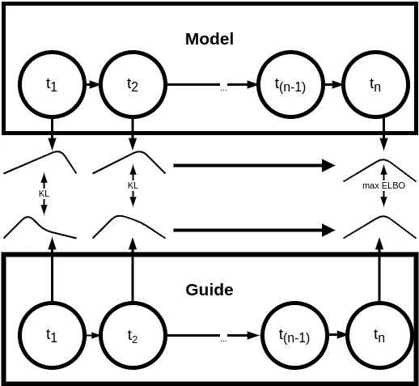

# 计算无法计算的| SVI 和艾尔波是如何工作的

> 原文：<https://towardsdatascience.com/compute-the-incomputable-how-svi-and-elbo-work-505ce0868fdd?source=collection_archive---------50----------------------->

## 贝叶斯建模与真实世界数据一起工作的一个原因。随机海洋中的近似灯塔。


*照片由威廉·布特在 U*[*n spash*](https://unsplash.com/photos/7cdFZmLlWOM)上拍摄

当你想对你的数据获得更多的洞察力时，你依赖于编程框架，它允许你与概率进行交互。开始时你所拥有的只是数据点的集合。它只是对数据来源的底层分布的一瞥。然而，您最终不仅仅想要简单的数据点。您想要的是精细的、健谈的密度分布，您可以用它来执行测试。为此，您使用概率框架，如[张量流概率](https://www.tensorflow.org/probability)、 [Pyro](https://pyro.ai/) 或 [STAN](https://mc-stan.org/) 来计算概率的后验概率。
正如我们将看到的，这种计算并不总是可行的，我们依靠马尔可夫链蒙特卡罗(MCMC)方法或随机变分推断(SVI)来解决这些问题。特别是对于大型数据集，甚至是每天的中型数据集，我们必须执行神奇的采样和推理来计算值和拟合模型。如果这些方法不存在，我们将被我们想出来的一个整洁的模型所困，但是没有办法知道它实际上是否有意义。
我们使用 Pyro 构建了一个预测模型，该模型使用的正是——SVI:

[](/pyro-top-down-forecasting-application-case-4781eb2c8485) [## Pyro 自上而下预测|应用案例

### 将一段时间内的点连接起来，并满怀信心地进行预测(-区间)。

towardsdatascience.com](/pyro-top-down-forecasting-application-case-4781eb2c8485) 

在这个故事中，我们将从 Pyro 的角度来看计算。
简而言之，Pyro 并没有强行计算后验概率，而是做出了一个我们可以改进的估计。但是为什么我们不能计算整个事情呢？很高兴你问了。

# 从无穷大到常数

假设我们有一个数据集 *D* ，我们想要拟合一个模型(θ)来准确描述我们的数据。为此，我们需要一组变量。这些变量对应于随机事件，我们称之为潜在随机变量，例如 *z.*
现在来看看我们的模型对后验概率分布 *P* 的依赖程度。这是一个很好的起点，现在我如何计算这个 P？为了让这个工作，我们必须做这样的推论:


(1) —给定我们数据中的观察值 x，计算潜在随机变量 z 的后验概率。

精通数学的读者已经看到上面等式的右边部分通常是不可计算的。我们面对未知事物上的全能积分的恐惧。现在把 z 作为连续变量，它可能是无限的。那相当大。
我们能做的是用一个**变分分布**；姑且称之为 *Q* 。在一个理想的世界中，这个近似的 Q 应该尽可能的接近我们正在计算的 P。那我们怎么去呢？
我们首先需要的是 P 和 Q 相似程度的**度量。输入 Kullback Leibler 散度——你可以在数理统计年鉴中找到 Kullback 和 Leibler 的传奇论文[1]。
我们用来比较分布的工具，Kullback Leibler 散度被
定义为:**


(2) —定义库尔贝克-莱布勒散度

这个度量告诉我们分布 *P* 和 *Q* 有多相似。如果它们相似，KL 就低，如果它们非常不同，差异就大。

现在，这个度量要求我们知道分布 P 和 q，但是我们还不知道 P。毕竟，这是我们正在计算的，到目前为止，我们的 Q 是一个野生猜测。
经过一些重新表述，我们最终得到了这个(参见[5]的分步解决方案):


(3) —从 KL 导出 ELBO，作为与常数 log(P)的和

第一部分(-E[log P(z，x)-log Q(z|x)])就是所谓的**证据下界**或 **ELBO** 。第二部分(log(P))是一个常数。这对我们以后的计算更有利。我们现在要做的就是最大化 ELBO，使 P 和 q 之间的偏差最小。

```
Minimizing KL divergence corresponds to maximizing ELBO and vice versa.
```

# 用深度学习学习 Q

既然我们已经有了基本的理论，那么我们该如何处理我们的问题呢？我们可以通过使用某种形式的神经网络来估计 Q。我们已经有了 TensorFlow 或者 PyTorch 来处理 Pyro。与我们已经建立的模型相比，我们现在可以建立一些东西来描述我们的变分分布。一旦我们有了这个分布估计，我们就可以使用[随机梯度下降](https://leon.bottou.org/papers/bottou-mlss-2004)来拟合我们的模型。所以让我们开始吧。

我们使用我们的数据作为模型和指南的输入。模型给了我们 P，而指南建议网络输出一个 Q。如果这是高斯分布，那么网络会给出平均值μ和标准差σ。如果我们用一个非常简单的形式来描绘这个过程，随着时间的推移，它看起来就像这样:



图 1 — *计算 n 个时间步上的后验概率时，用向导拟合模型的过程。*

# 跟我说说 Pyro

让我们举一个简单的例子，给定潜在随机变量 *z* ，我们拟合一个模型函数 *f* 。该变量来自β分布(仅作为一个例子)。我们观察到的事件是伯努利随机发生的。这意味着事件要么发生，要么不发生。最后，事件是独立同分布的，我们写为*烟火板*符号。所以我们的模型是:

```
def model(self):
        # sample `z` from the beta prior
        f = pyro.sample("z", dist.Beta(10, 10))
        # plate notion for conditionally independent events given f
        with pyro.plate("data"):
            # observe all datapoints using the bernoulli distribution
            pyro.sample("obs", dist.Bernoulli(f), obs=self.data)
```

到目前为止，这是标准的烟火，你不必总是指定一个向导。Pyro 可以处理，但是会有一个向导在那里。通过指定向导，你可以*完全控制你的建模过程。在这个例子中，向导的潜在 z 来自于此:*

```
def guide(self):
        # register the two variational parameters with pyro
        alpha_q = pyro.param("alpha_q", torch.tensor(15),
                             constraint=constraints.positive)
        beta_q = pyro.param("beta_q", torch.tensor(15),
                            constraint=constraints.positive)
        pyro.sample("latent_z", NonreparameterizedBeta(alpha_q, beta_q))
```

最后，我们通过使用 SVI 对象来运行我们的推理。我们提供先前指定的模型和指定的指南。我们还依赖标准 PyTorch [Adam optimizer](https://pytorch.org/docs/stable/optim.html) 进行随机梯度下降。

```
def inference(self):
        # clear everything that might still be around
        pyro.clear_param_store()
        # setup the optimizer and the inference algorithm
        optimizer = optim.Adam({"lr": .0005, "betas": (0.93, 0.999)})
        svi = SVI(self.model, self.guide, optimizer, loss=TraceGraph_ELBO())
```

你都准备好了。现在我们来看一些输出。

上面的例子只是伪代码，为了获得正确的输出，我使用了一个简单的贝叶斯回归任务，并计算了模型函数的后验概率(具体细节请参见我的[github](https://github.com/RMichae1/PyroStudies/blob/master/PyTorch_BayesRegr.ipynb))。
我们使用 Pyro SVI 和 Markov Chain Monte Carlo 程序以及 NUTS 采样器。

# 丑陋的真相|比较 SVI 和 MCMC

到目前为止，一切听起来都很有希望——好得令人难以置信。对于生活中的每一件事，你应该经常检查你的结果。下面的例子(图 2-3)显示了前面提到的[回归任务](https://github.com/RMichae1/PyroStudies/blob/master/PyTorch_BayesRegr.ipynb)的拟合后验分布，并同时使用 SVI 和 MCMC。


*图 2——使用 SVI 和 MCMC 对具有两个变量的函数 f 进行贝叶斯回归。*


*图 3——模型拟合后，贝叶斯回归任务的密度分布与后验分布重叠的等高线图。两个模型变量 bF2 的相互作用和相互作用项 bF12。*

先说好的一点:我们已经为 SVI 和麦克米伦安排了足够的后验概率。不太理想的是，它们明显不同。对马尔可夫方法和随机推理如何以及为什么不同的深入理解是各种研究的主题，深入的理解将是另一篇文章的主题。在这一点上，我们唯一能得出的结论是**推理程序对我们最终的模型**有明显的影响。

# 整洁——SVI 作品。关键点。

1.  我们正视了一个看似不可行的问题，并研究了潜在过程的理论，以找出解决它的方法。
2.  你可以使用深度学习框架，如 TF 和 PyTorch，通过近似另一个模型-分布来建立你的概率模型。
3.  这一切的目标是最小化我们的两个近似后验之间的分歧(或最大化下界)。
4.  我们应该总是看着我们的输出，问自己我们所看到的是否有意义。取样程序显然会影响我们的后验结果——所以我们应该小心。

总而言之，SVI 允许我们采用任何数据集，并用它进行贝叶斯建模。如果你问我，这是一个非常好的功能。

# 参考

1.  南 Kullback 和 r . lei bler*关于信息和充分性*。1951 年在[数理统计年鉴](https://projecteuclid.org/euclid.aoms/1177729694)。
2.  D.温盖特和 t .韦伯。*概率规划中的自动变分推理*。2013 年[月 arxiv](https://arxiv.org/abs/1301.1299) 日。
3.  Pyro 文档— [SVI 教程一](https://pyro.ai/examples/svi_part_i.html)
4.  烟火文档— [SVI 教程二](https://pyro.ai/examples/svi_part_ii.html)
5.  烟火文档— [SVI 教程三](https://pyro.ai/examples/svi_part_iii.html)
6.  礼萨·巴巴纳扎德。*随机变分推理。* [*UBC*](https://www.cs.ubc.ca/labs/lci/mlrg/slides/SVI.pdf)
7.  D.马德拉斯。 [*教程随机变分推理*](http://www.cs.toronto.edu/~madras/presentations/svi-tutorial.pdf) *。多伦多大学。2017.*

## 完整的烟火例子

上面提到的例子只是作为一个关于如何建立一个 Pyro 类的粗略概述。功能代码可在 Pyro 文档中找到(参见[ [5](https://pyro.ai/examples/svi_part_iii.html) ])。

```
class BetaExample:
    def __init__(self, data):
        # ... specify your model needs here ...
        # the dataset needs to be a torch vector
        self.data = data def model(self):
        # sample `z` from the beta prior
        f = pyro.sample("z", dist.Beta(10, 10))
        # plate notion for conditionally independent events given f
        with pyro.plate("data"):
            # observe all datapoints using the bernoulli likelihood
            pyro.sample("obs", dist.Bernoulli(f), obs=self.data) def guide(self):
        # register the two variational parameters with pyro
        alpha_q = pyro.param("alpha_q", torch.tensor(15),
                             constraint=constraints.positive)
        beta_q = pyro.param("beta_q", torch.tensor(15),
                            constraint=constraints.positive)
        pyro.sample("latent_z", NonreparameterizedBeta(alpha_q, beta_q)) def inference(self):
        # clear the param store
        pyro.clear_param_store()
        # setup the optimizer and the inference algorithm
        optimizer = optim.Adam({"lr": .0005, "betas": (0.93, 0.999)})
        svi = SVI(self.model, self.guide, optimizer, loss=TraceGra
```