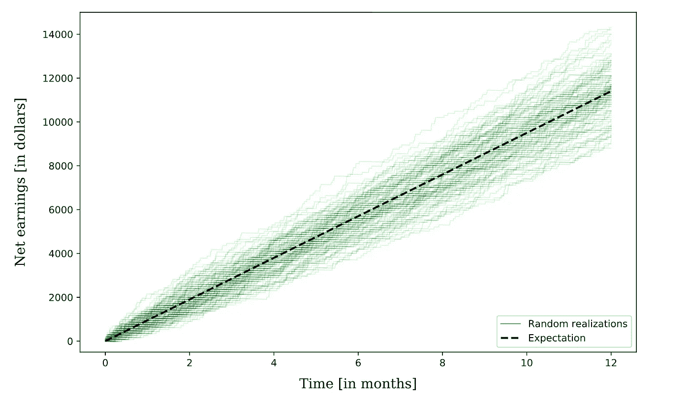
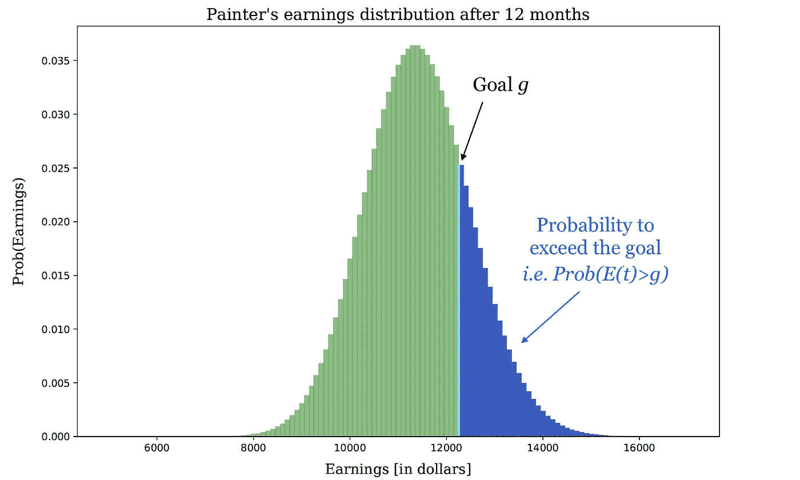
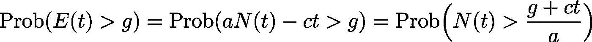
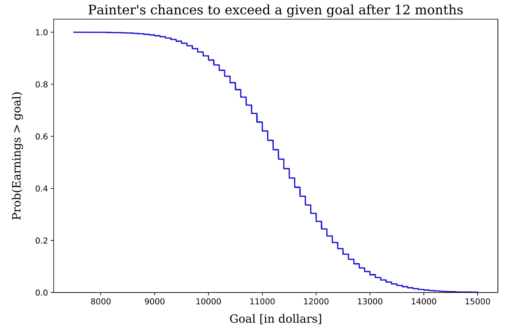
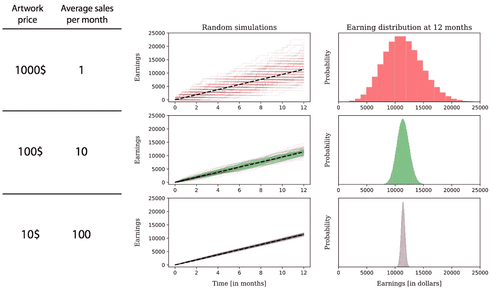

# 用一行代码计算你收入的概率

> 原文：<https://towardsdatascience.com/compute-the-probability-of-your-earnings-with-one-line-of-code-2ec819ca36b4?source=collection_archive---------50----------------------->

## 你有没有问过自己，你达到既定财务目标的概率是多少？

如果你是一个自由职业者，一个零售商或者仅仅是一个活跃的媒体作家，你可以在下面找到一个简单的公式来更好地预测你的收入机会。

下面的讨论是基于这样一个想法，即任何业务都有一定程度的随机性。尤其是在日冕危机时期，任何预测都是不确定的。

然而，即使在如此困难的情况下，我相信一些应用数学永远不会有坏处。下面，您可以欣赏随机过程理论应用于简单业务场景的一些概念。

**必要前提:**我的目的是展示一些工作中的数学，而不是给出任何理财建议。请不要忘记，数学公式只有在工作假设得到满足时才是可靠的。

# 出乎意料

让我们从简单的开始，考虑在你的生意中你只以固定的价格销售一种类型的产品。这可能是一个具体的对象、数字内容或任何服务。

例如，假设你是一名业余画家，你以每幅 100 美元的价格出售你的作品。为了简洁起见，我们将用字母 *a* 来表示这个价格。所以，*a*= 100 $/艺术品，意思是每件艺术品一百美元。很好。

*假设*你知道，平均来说，你一个月卖出 *r* =10 件艺术品。你也有一些固定支出，如颜色、画笔等。你每月花在绘画材料上的钱正好是 50 美元。

一年能赚多少？你打开你信任的计算器应用程序和数字

*a*×*r*×*t*–*c×t*=(100×10×12-50×12)$ = 11400 $，

其中时间 *t* 设置为 12 个月。不过，这只是你的 [***期望***](https://en.wikipedia.org/wiki/Expected_value) 。你不能确定今年能卖出*r*×t =120 件艺术品。相反，每月售出的艺术品数量将围绕平均值随机波动。

下面的图有助于形象化随机性的影响。每条绿线都是一个独立的随机模拟，代表了未来可能的净收益轨迹。直到年底，波动会显著增加并偏离预期！



画家一年净收入的随机轨迹。每一个都是作为艺术品销售的[齐次泊松过程](https://en.wikipedia.org/wiki/Poisson_point_process#Homogeneous_Poisson_point_process)产生的，并且由于画家的成本而不断向下漂移。黑线显示的是平均趋势。—图片由作者提供。

那么，如何主张不仅仅是期望值呢？

在假定卖出率 *r* 不随时间变化的情况下，结果是某段时间 *t* 卖出的艺术品数量 *N(t)* 按照一个均值等于 *r* × *t* 的 [*泊松分布*](https://en.wikipedia.org/wiki/Poisson_distribution) 分布。不出意外的话，平均值*r*×*t =*120*与预期的销售额是一致的，但是现在我们知道的更多了。精确分布的知识允许我们计算概率。*

*更准确地说，我们想知道在时间 *t* 时，净收益 *E(t)* 增长超过目标 *g* 的概率。用数学的话来说，这个概率可以简洁地写成 Prob( *E(t) > g* )。*

**

*蓝色区域代表净收入超过财务目标的概率。—图片由作者提供。*

*我们现在可以做一些数学计算并获得*

**

*超越财务目标概率的推导。—图片由作者提供。*

*这就是公式。我们已经表明，赚取超过目标 *g* 的概率与计算售出艺术品数量 *N(t)* 大于*(g*+*c×t)*/*a*的可能性是完全相同的，这很容易通过泊松分布的累积分布函数的倒数获得。数字怎么弄？*

*在 Julia 中，使用软件包发行版:*

```
***using** Distributions 
p = ccdf(Poisson(r*t),(g+c*t)/a)*
```

*在 Python 中，使用包 scipy:*

```
***import** scipy.stats **as** st 
p = 1 - st.poisson.cdf((g+c*t)/a,r*t)*
```

*首先，让我们做一个理智检查。在画家的例子中，获得超过预期的 11400 美元的概率是 47.6%。这是有道理的，因为卖出多于或少于 120 件艺术品的机会是相当对称的。(注:如果你在问自己为什么这个数字不是 50%，那只是因为 mean 和 [*median*](https://en.wikipedia.org/wiki/Median) 不一样，一般来说)。*

*为了更好地了解赚钱的机会，可以将 *Prob(E(t) > g)* 绘制成目标值 *g* 的函数。例如，大约有 90%的机会超过净收益 1 万美元，但只有 0.9%的机会超过 1.4 万美元。*

**

*该曲线显示了超过给定财务目标的概率，使用 painter 示例中提供的公式进行计算。画家最好在梦想过高之前知道几率！—图片由作者提供。*

## *更高的价格还是更多的销售？*

*在研究价格和平均销售额时，观察收入分布的行为很有趣。例如，通过调整价格 *a* 和平均销售额 *r* 同时保持他们的产品不变，人们很快就会意识到增加销售数字有一个稳定的效果:赚钱的概率集中在期望值附近。相反，以更高的价格卖出更少的商品会导致更不确定的结果。*

**

*预期销售额减少意味着收益的随机性增加。相反，由于大数定律，更多的销售是可以预测的。注意:使用的数字不反映价格和需求的规律。—图片由作者提供。*

*这个事实只不过是大数定律的一个结果:你加起来的随机事物越多，你就越能更好地描述它们的总和。实际上，我喜欢反过来思考这句话:*

> *数字越小，机会越重要。*

*两个方向都是如此。你可能表现不佳，也可能中了大奖。这只是运气。*

# *销售几种类型的产品*

*现在让我们考虑更常见的零售几种产品的情况，每种产品都有一个给定的价格。例如，再次以画家为例，我们可以想象我们出售三种不同类型的艺术品，取决于大小:小型、中型和大型画布，价格分别为 50 美元、100 美元和 200 美元。*

*我们*再次假设*平均每月卖出 *r* =10 件艺术品*和*来知道油画通常卖出的比例。比如 40%小，40%中，20%大。请注意，这些数字是这样的，期望是不变的，相对于一个产品的情况。但是赚的概率呢？现在会有显著的不同吗？*

*这种具体情况下，不会有太大变化。只需将 *a* 设置为项目价格的加权平均值( *a* =0.4×50 美元+0.4×100 美元+0.2×200 美元)，就可以使用前面的公式安全地再次估算收入概率。*

*然而，只要每件商品“经常”售出，这种方法就能可靠地发挥作用，因此不存在过于接近小数量不确定区域的风险。如果项目价格彼此相差不大，该公式尤其准确，因为平均值更有代表性。*

*如果情况不是这样，或者有些商品很少售出，那么为这种库存情况推导出一个特定的公式就很重要了。这可以通过泊松过程的 [*稀疏属性*](https://en.wikipedia.org/wiki/Poisson_point_process#Point_process_operations) 来实现:以全局速率 *r* 和各个分数 *f(i)* 销售更多产品在数学上等价于以速率 *r(i)=r×f(i)独立销售每一个项目 *i* 。*无论如何，最终公式在概念上与前面显示的公式相似，只是在计算净收益 *E(t)* 时，需要对所有项目的回报求和。*

# *估计中等收入*

*最后，让我们探索一下 Medium 上最有趣的案例。如何计算你写作回报的概率？*

*主要的复杂之处在于，我们无法将媒体报道的收益建模为我们事先知道价格的项目。相反，我们也可以通过引入*回报* *分布*来以概率的方式描述它们。*

*我们本质上想要将总的中等收入建模为在给定时间内将要出版的随机数量的故事的随机回报的总和。*

*回报分布可以被认为是前面提到的价格分数的连续版本。它描述了你发布的一个故事以何种概率获得一定的收益。显然，这种分布对于每个媒体作者来说是特定的，因为它强烈地依赖于媒体上的经验和受欢迎程度。*

*为了简单起见，我在这里用指数分布来描述 post 回报，原因有两个。首先，这适用于许多媒体作家:大多数帖子回报适中，少数稍好，但没有暴涨。其次，指数分布很简单，因为它只有一个参数，即每篇文章的平均回报。(还是那句话，姑且称之为*a)**

*在这些设置中，总中等收入由一个 [*复合泊松过程*](https://en.wikipedia.org/wiki/Compound_Poisson_process) 描述，比率为 *r×t* ，被加数为指数分布。具体是什么意思？首先，让我们看看平均值。*

*对于所考虑的复合过程，平均总收益等于 *a×r×t* ，标准差为 *a×sqrt(2×r×t)* 。[标准差](https://en.wikipedia.org/wiki/Standard_deviation)给出了波动大小的概念:作为中心极限定理的结果，收益将在期望值上下一个标准差的区间内以 68%的概率下降。然而，为了让中心极限定理体面地工作，经验法则是考虑至少 20 个以上的总销售额(即，中等故事，在这种情况下)。*

*例如，如果你每周发布一篇文章，平均每篇文章赚 25 美元，那么一年后你将会得到(1300 255)美元(52 周)。*

*如果你对达到某个目标的概率特别感兴趣，画家的公式在这种情况下也很好，即使只是作为一个*代理*。使用它仍然有效的原因是指数分布不太偏斜，就像画布价格的例子一样。*

*但是，请注意，获得的概率值的可信度取决于这些建模假设的满足程度:*

*   *你对你的出版率有一个很好的估计*
*   *你的岗位收入是相互独立的，并以已知的平均值 *a* 呈指数分布*
*   *在时间跨度 *t* 内，上述任何一项都不会改变*

*你可能想试试这个公式。相反，如果您不喜欢近似，可以通过直接模拟直接计算 *Prob(E(t) > g)* 。这也只是一行代码。*

*在朱莉娅身上，*

```
***using** Distributions 
S = 10^6  # Number of simulations you want
p = length(findall([sum(rand(Exponential(a),rand(Poisson(r*t)))) for i=1:S] .> g)) / S*
```

*或者用 Python*

```
***import** numpy **as** np
S = 10**6  # Number of simulations you want
p = sum(map(lambda x : x > g, [sum(np.random.exponential(a,np.random.poisson(r*t))) for i in range(S)])) / S*
```

*(附注:朱莉娅看起来好多了，而且速度快得惊人。我爱朱莉娅！)*

*上面的代码只是简单地将几次泊松分布的指数分布回报相加。然后，超过目标 *g* 的概率被简单地估计为总收益大于 *g* 的模拟的分数。*

*但是所有这些准确性真的有必要吗？但说实话，很可能不是。*

*应用于媒体的概率论的实际信息简单地证实了日常证据:确保你在媒体上成功的最强有力的方法是提高你的出版率和写出好东西。多一个*多一个*，多一个*多一个*，并且两者的时间都更长 *t* 。总之，更多的*艺术*。*

*即使我是一个学数学的人，我也相信生活有时会因为数字少而单词多而变得更加愉快。所以，写得好！*