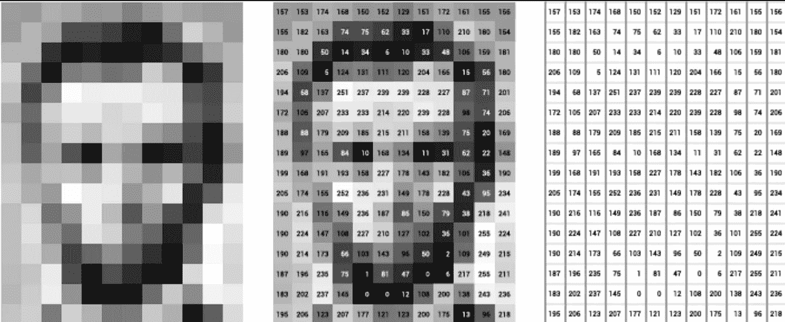
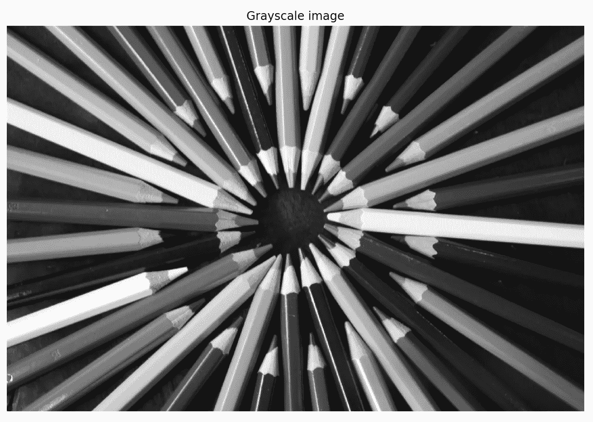
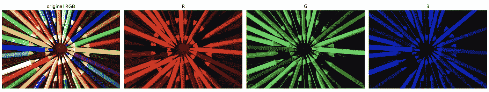
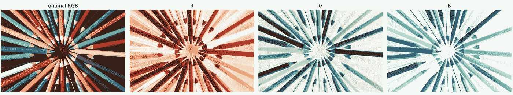
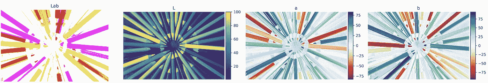
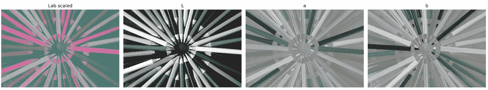
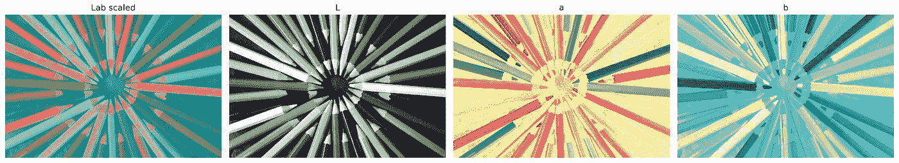

# 计算机视觉 101:用 Python 处理彩色图像

> 原文：<https://towardsdatascience.com/computer-vision-101-working-with-color-images-in-python-7b57381a8a54?source=collection_archive---------6----------------------->


来源:[佩克斯](https://www.pexels.com/photo/art-artistic-bright-color-220320/)。com

## 了解处理 RGB 和实验室图像的基础知识，以促进您的计算机视觉项目！

每一个计算机视觉项目——无论是猫/狗分类器还是[给旧图像/电影](https://github.com/jantic/DeOldify)添加颜色——都涉及到图像处理。而最终，模型只能和底层数据一样好——*垃圾入，垃圾出*。这就是为什么在这篇文章中，我重点解释在 Python 中处理彩色图像的基础知识，它们是如何表示的，以及如何将图像从一种颜色表示转换成另一种颜色表示。

# 设置

在本节中，我们将设置 Python 环境。首先，我们导入所有需要的库:

```
import numpy as npfrom skimage.color import rgb2lab, rgb2gray, lab2rgb
from skimage.io import imread, imshowimport matplotlib.pyplot as plt
```

我们使用 [scikit-image](https://scikit-image.org/) ，这是来自`scikit-learn`家族的一个库，专注于处理图像。有许多可供选择的方法，一些库包括`matplotlib`、`numpy`、 [OpenCV](https://pypi.org/project/opencv-python/) 、 [Pillow](https://pillow.readthedocs.io/en/stable/) 等。

在第二步中，我们定义一个 helper 函数，用于打印出关于图像的信息摘要——它的形状和每一层中的值的范围。

该函数的逻辑非常简单，一旦我们描述了图像是如何存储的，维度切片就有意义了。

# 灰度等级

我们从最基本的情况开始，灰度图像。这些图像完全是由灰色阴影构成的。极端情况是黑色(对比度的最弱[强度](https://en.wikipedia.org/wiki/Lightness))和白色(最强强度)。

在遮光罩下，图像被存储为整数矩阵，其中一个像素的值对应于给定的灰度。灰度图像的数值范围从 0(黑色)到 255(白色)。下图直观地概述了这一概念。



[来源](https://ai.stanford.edu/~syyeung/cvweb/Pictures1/imagematrix.png)

在这篇文章中，我们将使用你已经看到的缩略图，彩色蜡笔的圆圈。选了这么一张有色彩的图不是偶然的:)

我们首先将灰度图像加载到 Python 中并打印出来。

```
image_gs = imread('crayons.jpg', as_gray=True)fig, ax = plt.subplots(figsize=(9, 16))
imshow(image_gs, ax=ax)
ax.set_title('Grayscale image')
ax.axis('off');
```



由于原始图像是彩色的，我们使用`as_gray=True`将其加载为灰度图像。或者，我们可以使用默认设置`imread`加载图像(这将加载一个 RGB 图像——在下一节介绍),并使用`rgb2gray`功能将其转换为灰度。

接下来，我们运行 helper 函数来打印图像摘要。

```
print_image_summary(image_gs, ['G'])
```

运行代码会产生以下输出:

```
--------------
Image Details:
--------------
Image dimensions: (1280, 1920)
Channels:
G : min=0.0123, max=1.0000
```

图像存储为 1280 行×1920 列的 2D 矩阵(高清晰度分辨率)。通过查看最小值和最大值，我们可以看到它们在[0，1]范围内。这是因为它们被自动除以 255，这是处理图像的常见预处理步骤。

# RGB

现在是使用颜色的时候了。我们从 [**RGB 模型**](https://en.wikipedia.org/wiki/RGB_color_model) 开始。简而言之，这是一个加法模型，其中红色、绿色和蓝色(因此得名)的阴影以各种比例添加在一起，以再现广泛的颜色光谱。

在`scikit-image`中，这是使用`imread`加载图像的默认模式:

```
image_rgb = imread('crayons.jpg')
```

在打印图像之前，让我们检查一下摘要，以了解图像在 Python 中的存储方式。

```
print_image_summary(image_rgb, ['R', 'G', 'B'])
```

运行代码会生成以下摘要:

```
--------------
Image Details:
--------------
Image dimensions: (1280, 1920, 3)
Channels:
R : min=0.0000, max=255.0000
G : min=0.0000, max=255.0000
B : min=0.0000, max=255.0000
```

与灰度图像相比，这次图像存储为 3D `np.ndarray`。额外的维度表示 3 个颜色通道中的每一个。和以前一样，颜色的强度在 0-255 的范围内显示。它经常被重新调整到[0，1]范围。然后，任何层中的像素值为 0 表示该像素的特定通道中没有颜色。

一个有用的提示:当使用 OpenCV 的`imread`函数时，图像被加载为 BGR 而不是 RGB。为了使它与其他库兼容，我们需要改变通道的顺序。

是时候打印图像和不同的颜色通道了:

```
fig, ax = plt.subplots(1, 4, figsize = (18, 30))ax[0].imshow(image_rgb/255.0) 
ax[0].axis('off')
ax[0].set_title('original RGB')for i, lab in enumerate(['R','G','B'], 1):
    temp = np.zeros(image_rgb.shape)
    temp[:,:,i - 1] = image_rgb[:,:,i - 1]
    ax[i].imshow(temp/255.0) 
    ax[i].axis("off")
    ax[i].set_title(lab)plt.show()
```

在下图中，我们可以分别看到原始图像和 3 个颜色通道。我喜欢这幅图像的原因是，通过关注单个蜡笔，我们可以看到 RGB 通道中的哪些颜色以及哪些比例构成了原始图像中的最终颜色。



或者，我们可以绘制单独的颜色通道，如下所示:

```
fig, ax = plt.subplots(1, 4, figsize = (18, 30))ax[0].imshow(image_rgb) 
ax[0].axis('off')
ax[0].set_title('original RGB')for i, cmap in enumerate(['Reds','Greens','Blues']):
    ax[i+1].imshow(image_rgb[:,:,i], cmap=cmap) 
    ax[i+1].axis('off')
    ax[i+1].set_title(cmap[0])plt.show()
```

什么会生成以下输出:



我更喜欢这种绘制 RGB 通道的变体，因为我发现它更容易区分不同的颜色(由于其他颜色更亮和透明，它们更突出)及其强度。

在处理图像分类任务时，我们经常会遇到 RGB 图像。当将卷积神经网络(CNN)应用于该任务时，我们需要将所有操作应用于所有 3 个颜色通道。在这篇文章中，我展示了如何使用 CNN 来处理二值图像分类问题。

# 工党

除了 RGB，另一种流行的表示彩色图像的方式是使用 **Lab 色彩空间**(也称为 CIELAB)。

在进入更多细节之前，指出颜色模型和颜色空间之间的区别是有意义的。颜色模型是描述颜色的数学方法。颜色空间是将真实的、可观察的颜色映射到颜色模型的离散值的方法。更多详情请参考[本答案](https://photo.stackexchange.com/questions/48984/what-is-the-difference-or-relation-between-a-color-model-and-a-color-space)。

Lab 颜色空间将颜色表示为三个值:

*   *L* :从 0(黑色)到 100(白色)范围内的亮度，实际上是灰度图像
*   *a* :绿-红色谱，数值范围为-128(绿色)~ 127(红色)
*   *b* :蓝黄色光谱，数值范围为-128(蓝色)~ 127(黄色)

换句话说，Lab 将图像编码为灰度层，并将三个颜色层减少为两个。

我们首先将图像从 RGB 转换到 Lab，并打印图像摘要:

```
image_lab = rgb2lab(image_rgb / 255)
```

`rgb2lab`函数假设 RGB 被标准化为 0 到 1 之间的值，这就是为什么所有值都除以 255 的原因。从下面的总结中，我们看到实验室值的范围在上面规定的范围内。

```
--------------
Image Details:
--------------
Image dimensions: (1280, 1920, 3)
Channels:
L : min=0.8618, max=100.0000
a : min=-73.6517, max=82.9795
b : min=-94.7288, max=91.2710
```

下一步，我们将图像可视化——实验室一号和每个单独的通道。

```
fig, ax = plt.subplots(1, 4, figsize = (18, 30))ax[0].imshow(image_lab) 
ax[0].axis('off')
ax[0].set_title('Lab')for i, col in enumerate(['L', 'a', 'b'], 1):
    imshow(image_lab[:, :, i-1], ax=ax[i])
    ax[i].axis('off')
    ax[i].set_title(col)fig.show()
```



第一次尝试绘制实验室图像

嗯，第一次可视化 Lab 色彩空间的尝试远远没有成功。第一张图像几乎无法辨认，L 层不是灰度。根据本答案中[的见解，为了正确打印，实验室值必须重新调整到【0，1】范围。这一次，第一个图层的重定比例与后两个不同。](https://stackoverflow.com/questions/46415948/converting-rgb-images-to-lab-using-scikit-image)

```
#scale the lab image
image_lab_scaled = (image_lab + [0, 128, 128]) / [100, 255, 255]fig, ax = plt.subplots(1, 4, figsize = (18, 30))ax[0].imshow(image_lab_scaled) 
ax[0].axis('off')
ax[0].set_title('Lab scaled')for i, col in enumerate(['L', 'a', 'b'], 1):
    imshow(image_lab_scaled[:, :, i-1], ax=ax[i])
    ax[i].axis('off')
    ax[i].set_title(col)

fig.show()
```

第二次尝试要好得多。在第一幅图像中，我们看到了彩色图像的 Lab 表示。这一次， *L* 层是实际的灰度图像。仍然可以改进的是最后两层，因为它们也是灰度的。



第二次尝试绘制实验室图像

在最后一次尝试中，我们将彩色贴图应用到实验室图像的 *a* 和 *b* 层。

```
fig, ax = plt.subplots(1, 4, figsize = (18, 30))ax[0].imshow(image_lab_scaled) 
ax[0].axis('off')
ax[0].set_title('Lab scaled')imshow(image_lab_scaled[:,:,0], ax=ax[1]) 
ax[1].axis('off')
ax[1].set_title('L')ax[2].imshow(image_lab_scaled[:,:,1], cmap='RdYlGn_r') 
ax[2].axis('off')
ax[2].set_title('a')ax[3].imshow(image_lab_scaled[:,:,2], cmap='YlGnBu_r') 
ax[3].axis('off')
ax[3].set_title('b')

plt.show()
```

这一次结果令人满意。我们可以清楚的分辨出 *a* 和 *b* 图层中不同的颜色。仍然可以改进的是色彩映射表本身。为了简单起见，我使用了预定义的颜色贴图，它包含一种介于两种极端颜色之间的颜色(黄色代表图层 *a* ，绿色代表图层 *b* )。一个潜在的解决方案是手动编码彩色地图。



第三次尝试绘制实验室图像

在处理图像着色问题时，经常会遇到 Lab 图像，例如著名的[去模糊](https://github.com/jantic/DeOldify)。

# 结论

在本文中，我回顾了使用 Python 处理彩色图像的基础知识。使用所介绍的技术，你可以开始自己解决计算机视觉问题。我认为理解图像是如何存储的以及如何将它们转换成不同的表示是很重要的，这样你就不会在训练深度神经网络时遇到意想不到的问题。

另一个流行的色彩空间是 XYZ。`scikit-image`还包含将 RGB 或 Lab 图像转换成 XYZ 的功能。

您可以在我的 [GitHub](https://github.com/erykml/medium_articles/blob/master/Computer%20Vision/working_with_color_images.ipynb) 上找到本文使用的代码。一如既往，我们欢迎任何建设性的反馈。你可以在推特上或者评论里联系我。

我最近出版了一本关于使用 Python 解决金融领域实际任务的书。如果你有兴趣，我贴了一篇文章[介绍这本书的内容。你可以在亚马逊或者 T21 的网站上买到这本书。](/introducing-my-book-python-for-finance-cookbook-de219ca0d612)

# 参考

[1][https://ai.stanford.edu/~syyeung/cvweb/tutorial1.html](https://ai.stanford.edu/~syyeung/cvweb/tutorial1.html)

[https://github.com/scikit-image/scikit-image/issues/1185](https://github.com/scikit-image/scikit-image/issues/1185)