# 计算机视觉——当计算机能够看见和感知的时候！！！

> 原文：<https://towardsdatascience.com/computer-vision-ad2d0cbc6313?source=collection_archive---------39----------------------->

## 电脑能够看、听和学习。欢迎来到未来”——戴夫·沃尔特斯

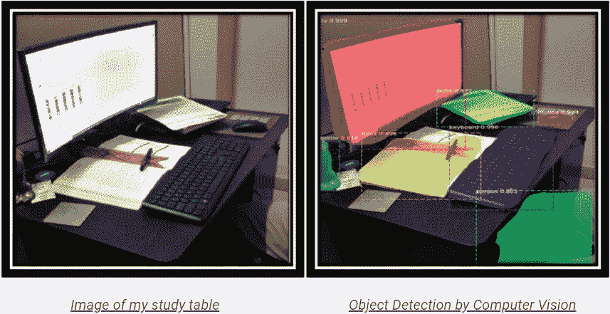

众所周知，计算机的计算能力远远超过人类。因此，自 20 世纪中期以来，已经尝试通过利用计算机来逐渐自动化计算繁重的活动。随着机器学习(ML)应用的出现和日益熟练，预测模型已经占据了优先地位。ML 接管的一些例子如下

1.  *通过主动识别可能终止订阅的客户来留住客户*
2.  *销售、需求、收入等的预测。对于任何行业*
3.  *识别任何行业中交叉销售的客户*
4.  *识别可能拖欠按揭付款的客户*
5.  *通过识别可能发生故障的机器进行预防性维护*

然而，历史上需要人类感知来解决的问题超出了经典(静态)ML 算法的范围。好消息是，随着 2010 年代初以来深度学习(DL)的大规模突破，在解决传统上需要人类直觉的问题时，可以观察到接近人类的表现。前面提到的感知问题需要处理声音和图像的技能。因此，通过听觉和视觉进行感知和处理的能力似乎是促进解决此类问题的主要技能。这些技能对人类来说是自然而直观的，但对机器来说却是难以捉摸的。下面给出了一些通过应用 DL 解决感知问题的例子

*   *接近人体水平的图像分类和目标检测*
*   *接近人类水平的语音识别*
*   *接近人类水平的笔迹转录*
*   *改进的机器翻译*
*   *改进的文本到语音转换*
*   *Google Now、亚马逊 Alexa 等数字助手*
*   *接近人类水平的自动驾驶*
*   回答自然语言问题的能力

然而，必须指出的是，这仅仅是一个开始，我们仅仅触及到所能取得的成就的表面。也有正在进行的对形式推理领域的研究。如果成功，这可能在科学、心理学、软件开发等领域帮助人类。

我想到的问题是，机器如何做到这一点，即获得感知能力来解决需要人类直觉的问题。数字处理，解决处理数字和/或类别的问题，应用监督学习(或无监督学习)属于具有巨大计算能力的机器领域。能够看到和识别图像的组成部分是一项新技能，本文的重点是关注现在赋予计算机像人类一样解决图像问题的能力的过程。本文的内容包括以下内容

1.  *人工智能(AI)和深度学习(DL)简介*
2.  *通过应用全连接层(FCN)即多层感知器(MLP)进行图像识别*
3.  *卷积神经网络介绍(CNN)*
4.  *为什么 CNN 在解决图像相关问题时比 MLPs 更常用*
5.  *CNN 的工作*
6.  *MLP 和 CNN 的表现对比*

## **人工智能和 DL 简介**

人工智能是一个通过应用逻辑、if-then 规则、决策树和 ML(包括 DL)使计算机能够模仿人类智能的领域。人工神经网络是人工智能的一个分支。以下图示将进一步阐明 AI 的子集，即 ML 和 DL。数据科学跨越了人工智能的所有层面。

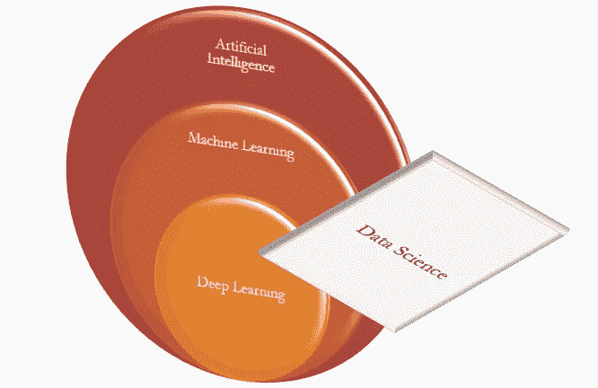

图 1:人工智能子集(图片由作者提供)

任何人工神经网络架构的基础都始于这样一个前提，即模型需要经历多次迭代，考虑到错误，从错误中学习，并在学习足够多的时候实现*拯救*或饱和，从而产生等于或类似于现实的结果。下图向我们简要介绍了人工神经网络，并介绍了 DL 神经网络。

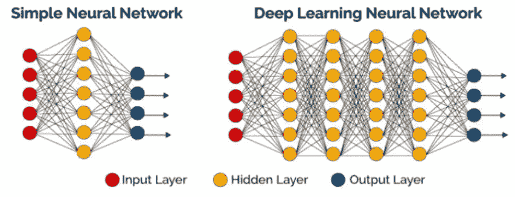

图 2:浅层网络与 DLNN 的比较(图片来自作者的早期文章

人工神经网络本质上是一种由多层处理单元(即神经元)组成的结构，这些处理单元获取输入数据，并通过连续的层对其进行处理，以获得有意义的表示。深度学习中的 deep 这个词代表了这种连续层表示的思想。有多少层对一个数据模型有贡献，称为模型的深度。上图更好地说明了结构，因为我们有一个只有一个隐藏层的简单 ANN 和一个有多个隐藏层的 DL 神经网络(DNN)。因此，DL 或 DLNN 是具有多个隐藏层的 ANN。

本文假设读者熟悉构成监督学习基础的概念，以及 DL 如何利用它来学习数据中的模式(在这种情况下是图像中的模式)以获得准确的结果。为了更好地理解本文的其余部分，需要对以下项目有概念性的理解

*   监督学习
*   深度学习
*   损失函数
*   梯度下降
*   向前和向后传播

为了复习，读者可以在互联网上探索关于这些主题的免费资料，或者浏览我发表的文章，[深度学习的基础](https://medium.com/analytics-vidhya/foundations-of-deep-learning-7832d4fe5458)。深入研究上述每个概念超出了本文的范围。

## **通过应用完全连接的层，即多层感知器的图像识别**

现在让我们深入研究一个实例，说明如何利用人工神经网络来查看图像并将它们分类到适当的类别。我们将从在真实世界数据集上应用 FCN 开始，并衡量所实现的效率。假设读者对什么是 FCN 及其操作方式有更深的理解。在非常高的层次上，FCN 或 MLP 是一个人工神经网络，其中每一层的每个元素都与下一层的每个元素相连接。下面的图 3 展示了 FCN 的样子。更多细节请参考我发表的文章，[深度学习的基础](https://medium.com/analytics-vidhya/foundations-of-deep-learning-7832d4fe5458)。

我们试图解决的问题包括从街道拍摄的门牌号图像中识别数字。数据集名为街景门牌号(SVHN)。SVHN 是一个真实世界的图像数据集，用于开发机器学习和对象识别算法，对数据格式的要求最低，但来自一个明显更难、未解决的真实世界问题(识别自然场景图像中的数字和数字)。SVHN 是从谷歌街景图片中的门牌号获得的。

我们要实现的目标是从 SVHN 数据集获取一个图像，并确定该数字是什么。这是一个多类分类问题，有 10 个可能的类，每个类对应一个数字 0-9。数字“1”的标签为 1，“9”的标签为 9，“0”的标签为 10。虽然，在这个数据集中有接近 6，000，000 幅图像，但我们已经提取了 60，000 幅图像(42000 幅训练图像和 18000 幅测试图像)来做这个项目。这些数据是以一个数字为中心的 32 乘 32 的 RGB 图像的类似 MNIST 的格式(许多图像在边上确实包含一些干扰物)。

我们将使用原始像素值作为网络的输入。这些图像是大小为 32×32 的矩阵。因此，我们将图像矩阵整形为一个大小为 1024 ( 32*32)的数组，并将该数组提供给如下所示的人工神经网络。

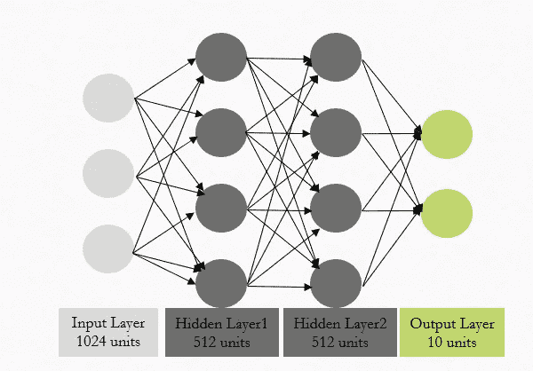

图 3: FCN 建筑(图片由作者提供)

链接到数据集的是[这里的](https://drive.google.com/file/d/1L2-WXzguhUsCArrFUc8EEkXcj33pahoS/view?usp=sharing)。

下面是加载数据和可视化一些图像的代码。

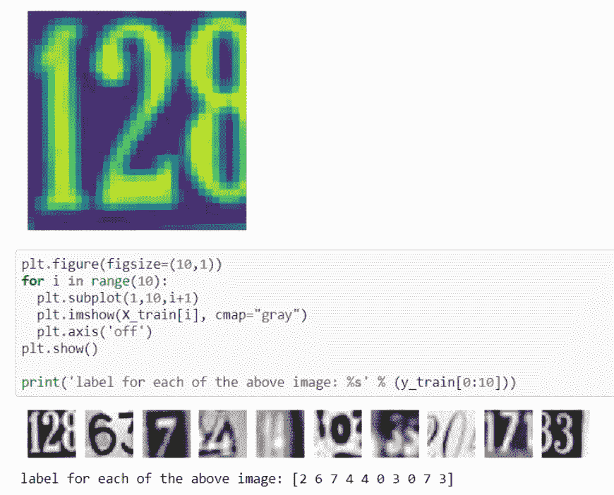

图 Jupyter 笔记本的截图，显示了一些图片及其标签

用不同数量的隐藏层和每层中不同数量的神经元构建多个 MLPs。对每个模型的结果进行比较，三个隐藏层的结果最好。模型架构如下所示。它达到了大约 80%的准确率。

下面描述了损失如何逐渐减少和精确度如何迭代增加的可视化

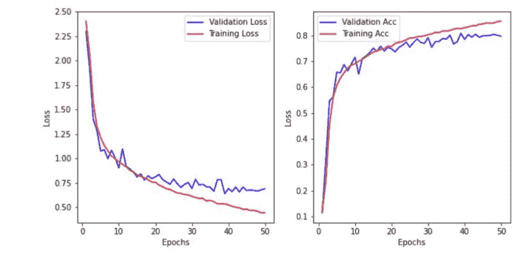

图 Jupyter 笔记本截图

预测了测试数据(未暴露于训练过程)中的一些图像。相同的可视化和与其原始标签的比较如下所示。

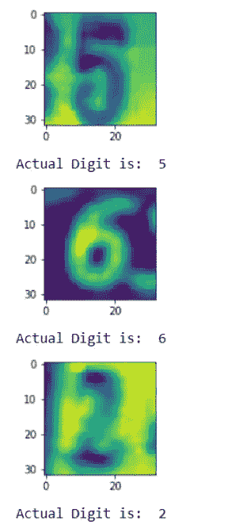

图 Jupyter 笔记本截图

我们测试了来自可视化测试集的 3 幅图像，并且看到分类是准确的，这可以给我们成就感和舒适感。如前所述，在整个测试集上达到的准确度为 80%。由于测试集由 18000 幅图像组成，80%的准确率是相当可接受的性能。然而，这是最好的方法吗？这是能达到的最好结果吗？或者有比这更好的方法吗？带着这些问题，让我们进入下一部分。

端到端项目的完整代码可以在我的 github 帐户中找到。代码的链接也可以在[这里](https://jovian.ai/pranov1984/mnist-denselayers)找到。

**卷积神经网络介绍(CNN)**

虽然上面解释的全连接网络(FCN)达到了可接受的精度，但它还可以进一步改进。除了 FCN，还有另一类神经网络称为卷积神经网络(CNN)，其内部操作更符合视觉图像的处理要求。已经发现 CNN 在涉及图像的用例中给出更好的性能。

CNN 比 FCN 好得多，因为基于它们的共享权重架构和平移不变性特征，它们是平移不变或空间不变的人工神经网络。我们将在下一节中深入探讨这个问题。

在我们详细了解 CNN 如何工作以及为什么它们比 fcn 更好之前，让我们先了解一下 CNN 的基本操作。理解 CNN 最重要的概念是卷积运算。

卷积是一种简单的数学运算，是许多常见图像处理运算符的基础。卷积提供了一种将通常大小不同但维数相同的两个数列“相乘”的方法，以产生维数相同的第三个数列。这可以用在图像处理中，以实现其输出像素值是某些输入像素值的简单线性组合的算子。

在图像处理环境中，输入数组之一通常只是图像的像素表示。第二个数组通常小得多，并且通常是二维的(尽管它可能只有单个像素厚)，并且被称为内核。下面是图像和可用于卷积的内核的图形表示。

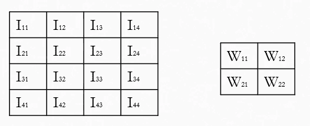

图 7:图像和内核(作者提供的图像)

卷积是通过在图像上滑动内核来执行的，通常从左上角开始，以便将内核移动通过所有位置，其中内核完全适合图像的边界。(请注意，实现的不同之处在于它们在图像边缘做了什么，如下所述。)每个内核位置对应于单个输出像素，其值通过将内核值和内核中每个单元的底层图像像素值相乘，然后将所有这些数字相加来计算。

因此，在我们的示例中，输出图像中右下角像素的值将由下式给出:

## o33 = I33 * W11+I34 * W12+I43 * W21+I44 * W22

由 CNN 完成的图像分类，通过获取输入图像、处理它并将其分类到某些类别下(例如，在我们的 use SVHN 用例中从 0 到 9)来工作。计算机将输入图像视为像素阵列。基于图像分辨率，它会看到 h x w x d( h =高度，w =宽度，d =尺寸)。

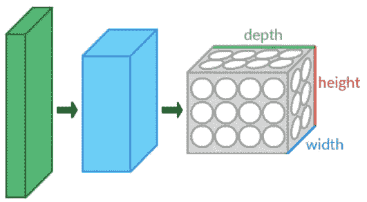

计算机视觉:计算机如何看到图像(来源:[维基百科](https://en.wikipedia.org/wiki/Convolutional_neural_network#/media/File:Conv_layers.png)

卷积是从输入图像中提取特征的第一层。卷积通过使用输入数据的小方块学习图像特征来保持像素之间的关系。它是一种数学运算，需要两个输入，如图像矩阵和滤波器或内核。

下图说明了卷积(或相关)运算是如何执行的。这里，I 表示图像，W 表示将对输入图像进行卷积的核。

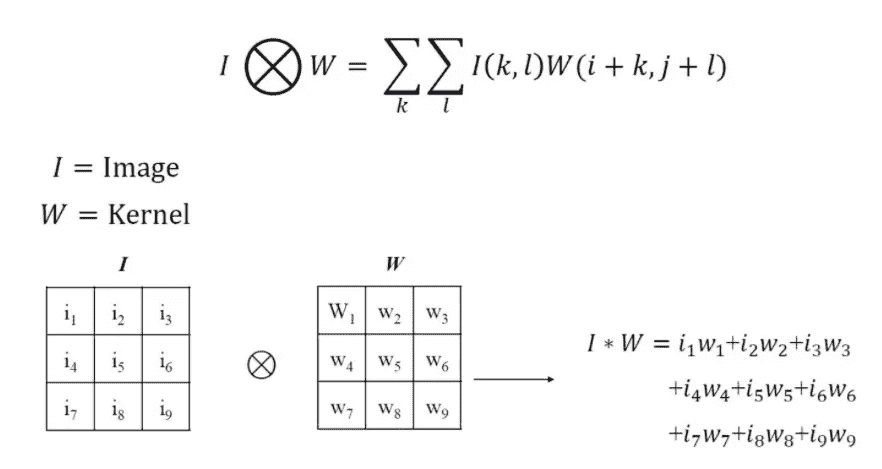

图 8:卷积运算

上面的描述可以通过一个核的实际例子来进一步简化，该核在由像素表示的图像上充当过滤器。上面的公式用于图像输入和内核权重，以得到内核或滤波器输出。

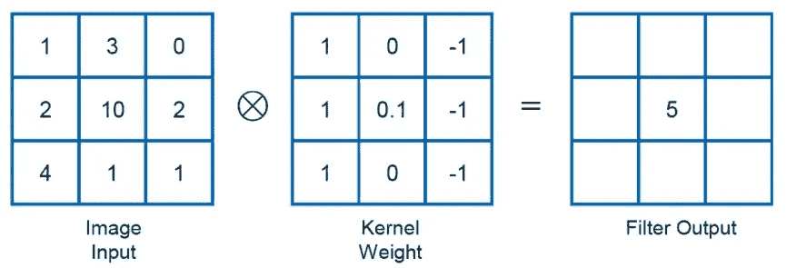

图 9:滤波器输出的计算

因此，当我们有一个更大的图像和一个典型的更小的内核时，内核将在图像上滑动，如下图所示，并通过卷积运算计算每次迭代的输出。滑过绿色方块的黄色方块就是内核。绿色方块是通过像素值表示的图像。卷积输出由右边的粉色方块表示，这实际上是学习到的特征。

图 10(来源:GIPHY 链接此处为。)

## ***为什么 CNN 比 MLPs 更能解决图像相关问题***

既然解决了卷积运算，让我们试着回答上面的问题。主要原因是

*   一个简单的 FCN 需要大量的参数来训练模型
*   *在图像中，空间相关性是局部的*
*   *通常可用的图像数量有限*
*   *平移不变性是处理图像的关键要素*

> 一个简单的 FCN 需要大量的参数来训练模型

FCNs(或 MLPs)对每个输入(例如，图像中的像素)使用一个感知器，并且对于大图像，权重的数量很快变得难以管理。它包含太多参数，因为它是完全连接的。每个节点都与上下一层中的所有其他节点相连，形成一个非常密集的网络。为了便于讨论，如果我们有一个如图 3 所示的人工神经网络，只有两个隐藏层的参数数量超过 2 亿个。这是一个尺寸只有 32*32 的图像。对于尺寸为 200*200 像素的中等大小的图像，需要训练的参数的数量将会达到顶点。因此，从(计算机的)计算能力的角度来看，使用 FCN(或 MLPs)来解决复杂的图像相关问题不是最佳方法。此外，如果可用图像的数量较少，用如此大量的参数进行训练将导致过度拟合。

> *在图像中，空间相关性是局部的。CNN 帮助实现平移不变性*

另一个常见的问题是 MLP 对输入(图像)及其平移版本的反应不同，它们不是平移不变的。例如，如果一个航天飞机的图片出现在一个图片的图像的左上角，而在另一个图片的右下角，MLP 将试图纠正自己，并假设航天飞机将总是出现在图像的这一部分。请参考下面的图 11 进行说明。因此，MLP 不是图像处理的最佳选择。一个主要问题是，当图像被展平(矩阵到矢量)成 MLP 时，空间信息丢失。在 FCN 中，像素之间的相关性不是局部的，即航天飞机的组件与背景或图像中存在的任何其他对象相关(例如图 11 第一部分中的汽车)。因此，如果画面移动，模型中的学习就会受到影响。这是在 CNN 中解决的，因为它们依赖于卷积运算，并且即使图像移动，激活也将保持不变。当内核在图像上滑动以在每次迭代中提供激活时，激活被定位。重量是共享的。

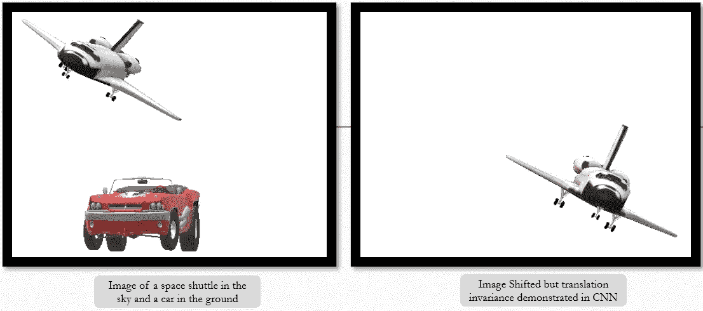

图 11:CNN 中空间不变性的图示(图片由作者提供)

## *CNN 的工作*

下图是一个 32*32 大小的输入图像的 CNN 表示。我们有 20 个维数为 5*5 的核，它们执行前面解释的卷积运算。对图像进行第一次卷积运算后得到的特征图像的尺寸为 28*28。下图中的 CONV 图层表示相同的图像，即 20 幅尺寸为 28*28 的特征图像。计算任何卷积运算的结果维数的数学公式将在本节后面给出。

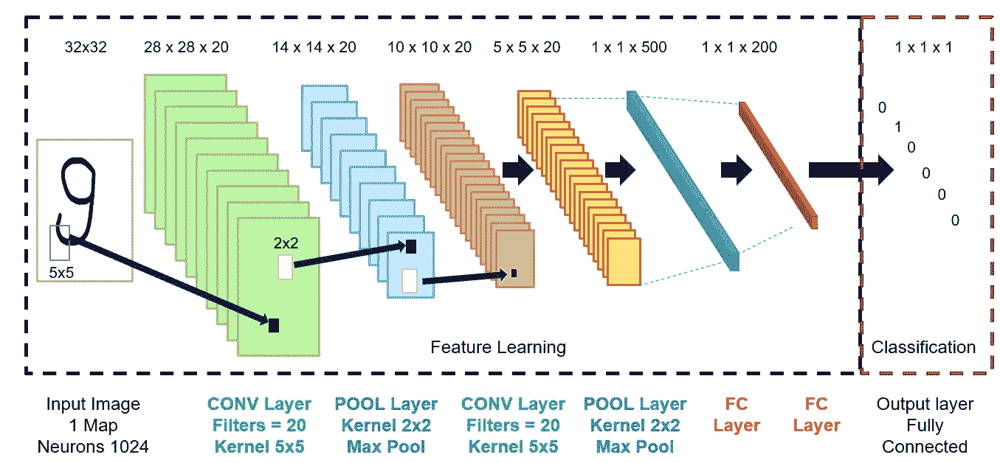

图 11:用于分类的 CNN 的端到端表示

这里引入的新概念是上图中的池层所表示的池操作，这个概念之前没有讨论过。

汇集操作包括在特征图的每个通道上滑动二维过滤器，并总结位于过滤器覆盖的区域内的特征。池层的数学计算与卷积运算非常相似。卷积层有助于学习图像的特征，并产生与使用的核的数量一样多的特征图。汇集层执行下采样操作，并汇总由卷积层生成的多个要素地图所产生的要素。这有助于巩固网络中的感受领域。典型的 CNN 架构通常具有一个接一个堆叠的多个卷积层和池层。

CNN 中的卷积层系统地将学习的滤波器应用于输入图像，以便创建概括输入中那些特征的存在的特征图。

卷积层被证明是非常有效的，并且在深度模型中堆叠卷积层允许靠近输入的层学习低级特征(例如，线)，而在模型中更深的层学习高阶或更抽象的特征，如形状或特定对象。

卷积图层的要素地图输出的局限性在于，它们记录了输入中要素的精确位置。这意味着输入图像中特征位置的微小移动将导致不同的特征地图。这可以通过引入池层来解决。汇集图层汇总了由卷积图层生成的要素地图区域中的要素。因此，将对汇总的要素而不是由卷积层生成的精确定位的要素执行进一步的操作。这使得模型对于输入图像中特征位置的变化更加鲁棒。下面给出了两种主要的汇集方法

*   **平均池**:计算特征图上每个面片的平均值。

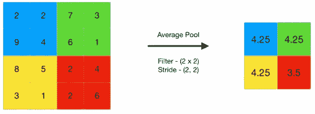

图 13:平均池操作的图示([来源](https://www.geeksforgeeks.org/cnn-introduction-to-pooling-layer/)

*   **最大池(或最大池)**:计算特征图每个面片的最大值。

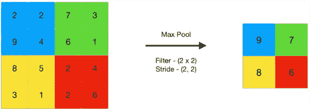

图 14:最大池操作的图示([来源](https://www.geeksforgeeks.org/cnn-introduction-to-pooling-layer/))

在开始运行案例研究之前，我想解释的最后一件事是，当卷积图层应用于输入图像时，列出用于计算特征图维度的公式。相同的公式仍然适用于卷积和池的后续层。

输出图像尺寸= (W - F +2P)/S +1

> *其中 W =图像尺寸*
> 
> *F =过滤器的尺寸*
> 
> *P =填充*
> 
> *S =步幅*

**步幅**表示我们在卷积中的每一步移动了多少步。默认情况下是一个。与**步距** 1 卷积。我们可以观察到输出的大小小于输入。为了保持输入中输出的维度，我们使用**填充**。**填充**是对输入矩阵对称加零的过程。对这两者更详细的解释可以在互联网上更多的免费内容中找到。

## *MLP 和 CNN 的表现对比*

让我们继续我们试图在 SVHN 数据集上解决的数字识别问题。我们之前使用 FCNs(或 MLPs)达到了 80%的准确率。我们现在将在用于训练的数据集上试验 CNN 的应用。

下面提供了加载数据和预处理数据(标准化输入和一个热编码标签)的代码

第一个 CNN 尝试的模型架构如下

然后编译该模型，并通过它解析数据以进行训练。该模型在验证数据上给出了 90%的准确度，这已经比 MLP 实现的性能提高了 10%。下面给出了编译、训练和评估验证数据性能的代码

上面打印语句的输出是 90%。

模型如何迭代地学习特征并逐渐提高性能的可视化表示如下。我们看到了一种趋势，即每一个时期的损耗都在减少，而精度却在提高。

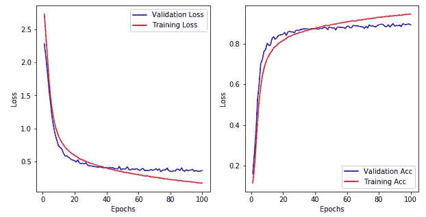

Jupyter Notebook 中模型精度随时期增加的图形表示

在用不同的模型架构进行了几次实验之后，从构建的 7 个 CNN 的集合中获得了最好的结果。准确率达到了 95%。模型中的混淆矩阵如下所示。整个代码的链接是 github 中的[这里的](https://github.com/Pranov1984/Digit-Recognition-in-photographs/blob/master/Digit_Recognition_SVNH_UsingKeras_HypTuning.ipynb)。

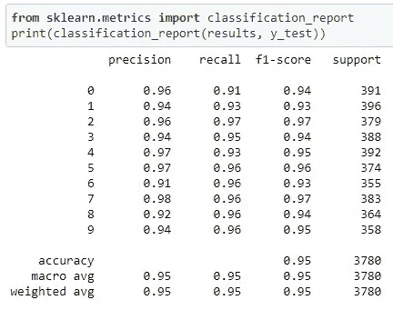

Jupyter 笔记本的模型输出

# **结论**

在这篇文章中，我们介绍了两种不同的方法来解决图像分类问题，即 FCNs 和 CNN。我们目睹了两种方法的性能差异，这是由于 CNN 优越的操作方式造成的。到目前为止，我们在 CNN 中看到的图像分类的优势进一步建立在解决更复杂的问题上，如对象检测和语义分割。它们都是复杂解决方案的关键组件，如自动驾驶汽车，机器必须识别汽车前方的不同物体及其结构，以便能够以适当的方向和角度驾驶汽车。本文开头的图片是我书房的桌子，后面是桌子上所有物品的标识。所有这些成就都建立在 CNN 潜在的和确定的概念之上。在接下来的几篇文章中，我们将探索一个称为迁移学习的新概念，它可以帮助我们处理训练图像数量不足的情况。敬请期待！！！