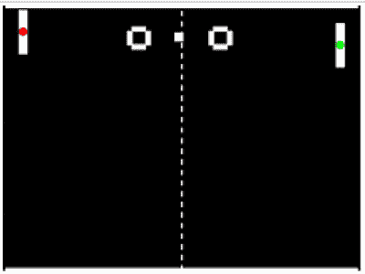
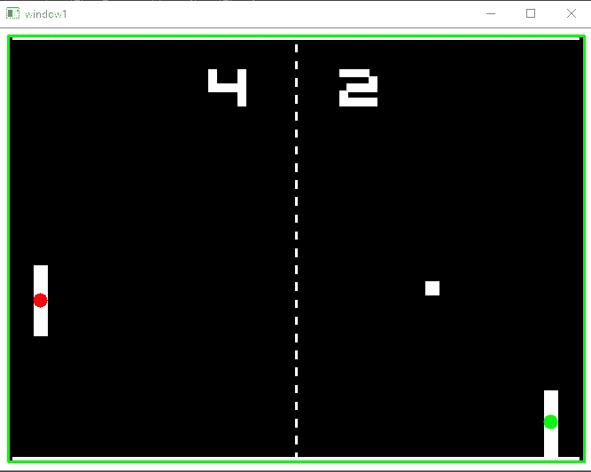
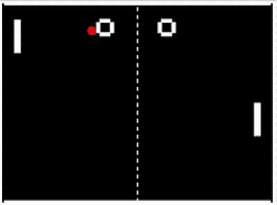
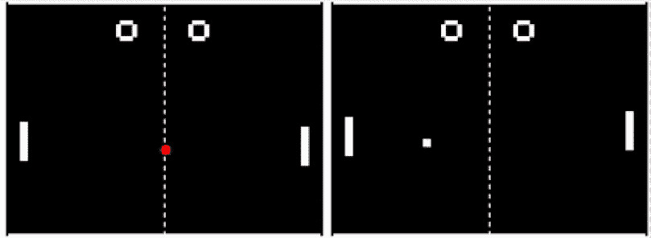
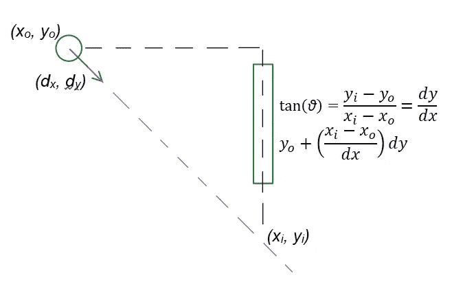
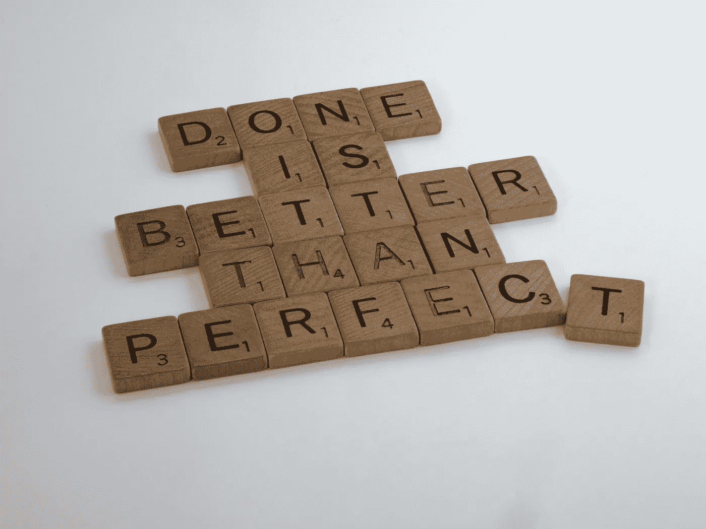

# 计算机视觉和终极乒乓人工智能

> 原文：<https://towardsdatascience.com/computer-vision-and-the-ultimate-pong-ai-e6d70153fc45?source=collection_archive---------21----------------------->

## 应用计算机视觉

## 使用 Python 和 OpenCV 在线玩 pong



人工智能在行动(右桨)

我最喜欢的一个 YouTuber，CodeBullet，曾经试图创造一个 pong AI 来统治他们。可悲的是，他遇到了麻烦，不是因为他没有能力，而是我不认为他当时的经验在计算机视觉方面有什么作用。他非常搞笑，我强烈推荐你观看他(建议家长咨询)，如果你正在考虑阅读这篇文章的其余部分。此外，他是他所做的天才。爱你伙计。看他的视频[这里](https://www.youtube.com/watch?v=tcymhYbRvw8&)。

这似乎是一个非常有趣和简单的任务，所以我必须尝试一下。在这篇文章中，我将概述我的一些考虑，如果你希望从事任何类似的项目，这可能会有所帮助，我想我会尝试更多的这些，所以如果你喜欢这种类型的事情，请考虑跟随我。

使用计算机视觉的好处是我可以使用一个已经构建好的游戏来处理图像。话虽如此，我们将使用与 CodeBullet 使用的来自 ponggame.org[的游戏版本相同的游戏版本。它也有一个 2 人模式，所以我可以对我自己的人工智能玩；我做到了，这很难…](https://www.ponggame.org/)

## 捕捉屏幕

最重要的事情是，得到屏幕。我想确保我的帧速率尽可能快，为此我发现 [MSS](https://pypi.org/project/mss/) 是一个很棒的 python 包。有了这个，我很容易达到 60 fps，相比之下，PIL 只有 20 fps。它以 numpy 数组的形式返回，所以我的生命是完整的。

## 挡板检测

为了简单起见，我们需要定义桨的位置。这可以用几种不同的方法来完成，但我认为最明显的方法是为每个桨屏蔽区域，并运行连接的组件来找到桨对象。下面是这段代码的一部分:

```
def get_objects_in_masked_region(img, vertices,  connectivity = 8):
    *'''****:return*** *connected components with stats in masked region
    [0] retval number of total labels 0 is background
    [1] labels image
    [2] stats[0] leftmostx, [1] topmosty, [2] horizontal size, [3] vertical size, [4] area
    [3] centroids
    '''* mask = np.zeros_like(img)
    # fill the mask
    cv2.fillPoly(mask, [vertices], 255)
    # now only show the area that is the mask
    mask = cv2.bitwise_and(img, mask)
    conn = cv2.connectedComponentsWithStats(mask, connectivity, cv2.CV_16U)
    return conn
```

在上面,“顶点”只是一个定义遮罩区域的坐标列表。一旦我有了每个区域内的对象，我就可以得到它们的质心位置或边界框。需要注意的一点是，OpenCV 将背景作为第 0 个对象包含在任何连接的组件列表中，所以在这种情况下，我总是抓取第二大的对象。结果如下——右边绿色质心的桨是玩家/即将成为 AI 控制的桨。



挡板检测结果

## 移动船桨

现在我们有了输出，我们需要一个输入。为此，我求助于一个有用的软件包和其他人的[代码](http://stackoverflow.com/questions/14489013/simulate-python-keypresses-for-controlling-a-game)——谢谢 StackOverflow。它使用 ctypes 来模拟键盘按键，在这种情况下，游戏是使用“k”和“m”键来玩的。我在这里得到了扫描码。在通过随机上下移动进行测试后，我们可以开始跟踪了。

## 乒乓检测

N ext up 用于识别和跟踪 pong。同样，这可以通过多种方式处理，其中一种方式是使用模板进行对象检测，但我还是使用了连接的组件和对象属性，即 pong 的面积，因为它是唯一具有其尺寸的对象。我知道每当乒乓球穿过或接触任何其他白色物体时，我都会遇到问题，但我也认为这没什么，只要我能在大多数时间里跟踪它。毕竟它是直线运动的。如果你看下面的视频，你会看到标记乒乓的红圈是如何闪烁的。这是因为它每 2 帧才发现 1 次。在 60 fps 时，这真的无关紧要。



乒乓检测显示为红色

## 用于反弹预测的光线投射

在这一点上，我们已经有了一个可以工作的人工智能。如果我们只是移动球员的球拍，使它和乒乓球在同一个 y 轴位置，它做得相当好。然而，当乒乓球反弹时，它确实会遇到问题。球拍太慢了，跟不上，需要预测乒乓球的位置，而不是移动到它现在的位置。这已经在上面的剪辑中实现了，但下面是两种方法的比较。



并排的两个 AI 选项。左为简单跟随，右为光线投射反弹预测

差别不是很大，但在正确的人工智能下，这绝对是一场更稳定的胜利。为此，我首先为 pong 创建了一个位置列表。为了平均起见，我将这个列表的长度保持在 5，但或多或少都可以。可能不想要更多，否则它需要更长的时间来发现它已经改变了方向。得到位置列表后，我使用简单的矢量平均来平滑并获得方向矢量——如绿色箭头所示。这也被标准化为一个单位向量，然后乘以一个长度，以便可视化。

投射光线只是这种方法的一种延伸——使正向投影变得更长。然后我检查未来的头寸是否在顶部和底部区域的边界之外。如果是这样，它只是将位置投射回游戏区域。对于左侧和右侧，它会计算与踏板 x 位置的交点，并将 x 和 y 位置固定到该点。这可以确保桨对准正确的位置。没有这一点，它往往会走得太远。下面是定义预测乒乓未来位置的光线的代码:

```
def pong_ray(pong_pos, dir_vec, l_paddle, r_paddle, boundaries, steps = 250):
    future_pts_list = []
    for i in range(steps):
        x_tmp = int(i * dir_vect[0] + pong_pos[0])
        y_tmp = int(i * dir_vect[1] + pong_pos[1])

        if y_tmp > boundaries[3]: #bottom
            y_end = int(2*boundaries[3] - y_tmp)
            x_end = x_tmp

        elif y_tmp < boundaries[2]: #top
            y_end = int(-1*y_tmp)
            x_end = x_tmp
        else:
            y_end = y_tmp

        ##stop where paddle can reach
        if x_tmp > r_paddle[0]: #right
            x_end = int(boundaries[1])
            y_end = int(pong_pos[1] + ((boundaries[1] - pong_pos[0])/dir_vec[0])*dir_vec[1])

        elif x_tmp < boundaries[0]: #left
            x_end = int(boundaries[0])
            y_end = int(pong_pos[1] + ((boundaries[0] - pong_pos[0]) / dir_vec[0]) * dir_vec[1])

        else:
            x_end = x_tmp

        end_pos = (x_end, y_end)
        future_pts_list.append(end_pos)

    return future_pts_list
```

在上面的计算中，可能不太明显的是确定桨片到达目标的左右位置的截距。我们基本上是通过下图所示的相似三角形和等式来实现的。我们知道在*边界*中给出的桨的 x 位置的截距。然后，我们可以计算 pong 将移动多远，并将其添加到当前的 y 位置。



桨式瞄准拦截位置的计算示意图

这些桨虽然看起来是直的，但实际上有一个弯曲的反弹面。也就是说，如果你用球拍向两端击球，球会反弹，就好像球拍是倾斜的一样。因此，我允许球拍打在边缘，这增加了人工智能的攻击性，导致乒乓球飞来飞去。

## 结论

答虽然是为 pong 的特定实现而设计的，但相同的概念和代码可以用于任何版本——它只是改变了一些预处理步骤。当然，另一种方法是通过强化学习或只是简单的 conv 网来使用机器学习，但我喜欢这种经典的方法；至少在这种情况下，我不需要强大的通用性或困难的图像处理步骤。正如我提到的，这个版本的 pong 是双人的，老实说，我不能打败我自己的 AI…



照片由[布雷特·乔丹](https://unsplash.com/@brett_jordan?utm_source=unsplash&utm_medium=referral&utm_content=creditCopyText)在 [Unsplash](https://unsplash.com/s/photos/done?utm_source=unsplash&utm_medium=referral&utm_content=creditCopyText) 拍摄

如果你在这篇文章的任何部分提供了一些有用的信息或一点灵感，请关注我。

你可以在我的 [github](https://github.com/robintwhite) 上找到源代码。

链接到我的其他帖子:

*   [《我的世界》测绘仪](https://medium.com/analytics-vidhya/minecraft-mapper-ab4478e98297) —计算机视觉和光学字符识别从截图和绘图中抓取位置