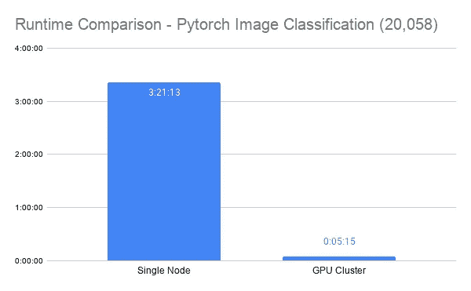

# Dask 和 PyTorch 的计算机视觉

> 原文：<https://towardsdatascience.com/computer-vision-at-scale-with-dask-and-pytorch-a18e17fc5bad?source=collection_archive---------41----------------------->

*免责声明:我是 Saturn Cloud 的高级数据科学家，Saturn Cloud 是一个使用 Dask 实现 Python 易于使用的并行化和扩展的平台。*

将深度学习策略应用于计算机视觉问题，为数据科学家打开了一个可能性的世界。然而，要大规模使用这些技术来创造商业价值，需要大量的计算资源可用——而这正是土星云要解决的挑战！

在本教程中，您将看到使用流行的 Resnet50 深度学习模型在土星云上使用 GPU 集群进行大规模图像分类推理的步骤。使用 Saturn Cloud 提供的资源，我们运行任务的速度比非并行方法快 40 倍！


照片由[维克多·格拉巴奇克](https://unsplash.com/@qrupt?utm_source=unsplash&utm_medium=referral&utm_content=creditCopyText)在 [Unsplash](https://unsplash.com/s/photos/dog?utm_source=unsplash&utm_medium=referral&utm_content=creditCopyText) 拍摄

在今天的例子中，我们将对狗的照片进行分类！

# 你将在这里学到:

*   如何在 Saturn Cloud 上设置和管理用于深度学习推理任务的 GPU 集群
*   如何在 GPU 集群上使用 Pytorch 运行推理任务
*   如何在 GPU 集群上使用 Pytorch 使用批处理来加速您的推理任务

# 设置

首先，我们需要确保我们的图像数据集可用，并且我们的 GPU 集群正在运行。

在我们的例子中，我们已经将数据存储在 S3 上，并使用`[s3fs](https://s3fs.readthedocs.io/en/latest/)`库来处理它，如下所示。如果你想使用同样的数据集，这是斯坦福狗的数据集，可以在这里找到:[http://vision.stanford.edu/aditya86/ImageNetDogs/](http://vision.stanford.edu/aditya86/ImageNetDogs/)

要设置我们的 Saturn GPU 集群，过程非常简单。

> *【2020–10–15 18:52:56】信息— dask-saturn |星团准备就绪*

我们没有明确说明，但是我们在集群节点上使用了 32 个线程，总共有 128 个线程。

**提示:**单个用户可能会发现您想要调整线程的数量，如果您的文件非常大，则减少线程数量——同时运行大型任务的太多线程可能需要比您的工作人员一次可用的内存更多的内存。

这一步可能需要一段时间才能完成，因为我们请求的所有 AWS 实例都需要启动。在最后调用`client`会监控旋转过程，并让你知道什么时候一切准备就绪！

## GPU 能力

此时，我们可以确认我们的集群具有 GPU 功能，并确保我们已经正确设置了一切。

首先，检查 Jupyter 实例是否具有 GPU 功能。

```
torch.cuda.is_available()
```

> *真实*

太棒了——现在让我们也检查一下我们的四个工人。

```
client.run(lambda: torch.cuda.is_available())
```

在这里，我们将“设备”设置为 cuda，这样我们就可以使用这些 GPU。

```
device = torch.device("cuda" if torch.cuda.is_available() else "cpu")
```

**注意:如果你需要一些帮助来建立如何运行单个图像分类，我在 github** **上有一个** [**扩展代码笔记本，可以给你那些说明以及其余的内容。**](https://github.com/saturncloud/saturn-cloud-examples/tree/main/pytorch-demo)

# 推理

现在，我们准备开始做一些分类！我们将使用一些定制的函数来高效地完成这项工作，并确保我们的工作能够充分利用 GPU 集群的并行性。

# 预处理

## 单一图像处理

这个函数允许我们处理一个图像，但是当然我们有很多图像要处理！我们将使用一些列表理解策略来创建我们的批次，并为我们的推断做好准备。

首先，我们将 S3 文件路径中的图像列表分成定义批处理的块。

```
s3fpath = 's3://dask-datasets/dogs/Images/*/*.jpg'batch_breaks = [list(batch) for batch in toolz.partition_all(60, s3.glob(s3fpath))]
```

然后我们将每个文件处理成嵌套列表。然后我们将稍微重新格式化这个列表设置，我们就可以开始了！

```
image_batches = [[preprocess(x, fs=s3) for x in y] for y in batch_breaks]
```

注意，我们已经在所有这些上使用了 Dask `delayed`装饰器——我们还不想让它实际运行，而是等到我们在 GPU 集群上并行工作的时候！

# 格式化批次

这一小步只是确保图像批次按照模型期望的方式组织。

# 运行模型

现在我们准备做推理任务了！这将有几个步骤，所有这些步骤都包含在下面描述的函数中，但是我们将通过它们进行讨论，以便一切都很清楚。

我们在这一点上的工作单位是一次 60 个图像的批次，这是我们在上一节中创建的。它们都整齐地排列在列表中，以便我们可以有效地使用它们。

我们需要对列表做的一件事是“堆叠”张量。我们可以在过程的早期这样做，但是因为我们在预处理中使用了 Dask `delayed` decorator，我们的函数实际上直到过程的后期才知道它们正在接收张量。因此，我们也通过把它放在预处理之后的函数中来延迟“堆栈”。

现在我们把张量堆叠起来，这样就可以把批次传递给模型了。我们将使用非常简单的语法来检索我们的模型:

方便的是，我们加载库`torchvision`,它包含几个有用的预训练模型和数据集。我们就是从那里拿到 Resnet50 的。调用方法`.to(device)`允许我们将模型对象分配给集群上的 GPU 资源。

现在我们准备运行推理！它在同一个函数中，风格如下:

我们将图像堆栈(只是我们正在处理的批处理)分配给 GPU 资源，然后运行推理，返回该批处理的预测。

# 结果评估

然而，到目前为止，我们得到的预测和事实并不是人类真正可读或可比的，所以我们将使用下面的函数来修正它们并得到可解释的结果。

这将从模型中获取我们的结果，以及一些其他元素，以返回好的可读预测和模型分配的概率。

```
preds, labslist = evaluate_pred_batch(pred_batch, truelabels, classes)
```

从这里开始，我们就快完成了！我们希望以一种整洁的、人类可读的方式将我们的结果传递回 S3，所以函数的其余部分会处理这一点。它将迭代每个图像，因为这些功能不是批处理。`is_match`是我们的自定义功能之一，您可以在下面查看。

# 把它们放在一起

现在，我们不打算手工将所有这些函数拼凑在一起，而是将它们组装在一个单独的延迟函数中，它将为我们完成这项工作。重要的是，我们可以将它映射到集群中的所有映像批次！

## 在群集上

我们真的已经完成了所有的艰苦工作，现在可以让我们的功能接手了。我们将使用`.map`方法来有效地分配我们的任务。

通过`map`,我们确保我们所有的批次都能应用该功能。使用`gather`，我们可以同时收集所有结果，而不是一个接一个地收集。用`compute(sync=False)`我们返回所有的期货，准备在我们需要的时候被计算。这可能看起来很艰巨，但是这些步骤是允许我们迭代未来所必需的。

现在我们实际上运行任务，我们也有一个简单的错误处理系统，以防我们的任何文件被搞乱或出现任何问题。

# 评价

当然，我们希望确保从这个模型中获得高质量的结果！首先，我们可以看到一个结果。

> *{'name': 'n02086240_1082 '，
> ' ground _ truth ':' Shih-zi '，
> 'prediction': [(b"203:'西高地白梗'，"，3.0289587812148966e-05)]，
> 'evaluation': False}*

虽然我们在这里有一个错误的预测，但我们有我们期望的那种结果！为了做更彻底的检查，我们将下载所有的结果文件，然后检查有多少有`evaluation:True`。

> *检查的狗狗照片数量:20580
> 分类正确的狗狗数量:13806
> 分类正确的狗狗比例:67.085%*

不完美，但整体效果不错！

# 比较性能

因此，我们在大约 5 分钟内成功地对超过 20，000 张图片进行了分类。这听起来不错，但有什么选择呢？



技术/运行时间

*   无集群批处理/ 3 小时 21 分 13 秒
*   **带批处理的 GPU 集群/ 5 分 15 秒**

添加一个 GPU 集群会带来巨大的不同！

# 结论

正如这表明的那样，你当然能够在单节点计算中进行深度学习推理，比如在笔记本电脑上，但当你这样做时，你会等待很长时间。GPU 集群为您提供了一种大幅加速工作流的方式，使您能够更快地迭代并改进业务或学术实践。试想:如果您想每小时对您的图像进行推理，该怎么办？在这种情况下，单个节点根本无法工作，因为作业甚至无法在一小时内完成！

GPU 通常被视为机器学习任务的一个极端选择，但在现实中，在 GPU 可能的加速下，您通常可以降低人力时间和美元的总体成本。AWS 的一个 CPU 实例不是免费的，在那个实例上三个小时的计算成本会增加。在许多情况下，为了获得相同的结果，这可能比您在 GPU 集群上花五分钟的时间还要多。

在土星云，我们希望为数据科学社区提供最优质的计算资源，我们希望帮助每个人成为更有效的机器学习实践者。您可以了解更多关于我们和上述工具的信息(并免费试用我们的平台！)[在我们的网站](https://www.saturncloud.io/s/)。