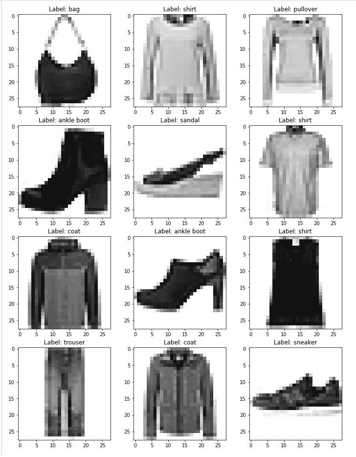

# 计算机视觉——使用卷积、池化和张量流创建分类器

> 原文：<https://towardsdatascience.com/computer-vision-creating-a-classifier-using-convolutions-pooling-and-tensorflow-7e75d809acbc?source=collection_archive---------64----------------------->

## 计算机如何识别图像，以及如何在分类中使用它

本文旨在解释扁平化、卷积和汇集思想背后的直觉，以及在创建图像分类器时如何在 TensorFlow 中使用这些概念。

使用的技术有 python，TensorFlow 和 Keras API。

使用的数据集:

**时尚 MNIST**——【https://www.kaggle.com/zalando-research/fashionmnist 

关于将用于说明关键概念的数据集的一些信息:

名称:**时尚 MNIST**

观察次数: **70000**

类别数量: **10**

类别的标签和名称:

**0 - T 恤/上衣**

**一条裤子**

**两件套衫**

**3 -连衣裙**

**四层涂层**

**5 -凉鞋**

**6 件衬衫**

**7 -运动鞋**

**8 袋**

**9 -踝靴**

随机样本:

集合中图像的随机样本

让我们从检查来自时尚 MNIST 数据集的图像开始:

28 x 28 t 恤图片

这是一个**灰度**(意味着它只有一个像素通道)图像，宽 28 像素，高 28 像素。我们只能看到图片的渲染形式，但图像本身是以数字矩阵的形式存储在计算机内存中的:

图片的矩阵表示

典型的像素值从 0 到 255，其中 0 为白色，255 为黑色。

计算机“看到”图像的方式仅仅是通过上面表示的像素值。即使是最先进的图像识别算法也只是将像素转换成数字数组。

基本上，当我们谈论计算机视觉时，我们谈论的是计算机学习数字矩阵和标签之间的关系。

当试图构造图像分类器时，最基本的方法是使用图像中的每个像素作为单独的特征。这个过程叫做展平。

拉平像素

在上面的图片中，我画了一个假想的笑脸图片，总共有 36 个像素。白色像素等于 0，黑色像素等于 1。

扁平化的过程只不过是将二维图片(或者更高维，如果图片有颜色的话)转换成一维向量。我假设数组从 0 开始，所以第 7 个坐标等于 1(代表[2][2]像素)，第 10 个坐标等于 1(代表[2][5]像素)，依此类推。展平的最终输出是一个 36 维向量。

一般规则是，如果输入是 n×m 像素化的图像，那么输出将是 n×m 长度的向量。

如果每张图片都有一个相关联的标签，比如“快乐”(=1)和“不快乐”(=0)，那么模型的矩阵 **X** 和 **Y** 的构造就很简单:

从图片中创建矩阵

这个过程是将每张图片展平，并将每个矢量一个叠一个地堆叠起来。所以现在，我们可以开始建立模型，因为我们已经创建了代表图片的数字矩阵，各种优化算法可以开始工作了。

在上面画的例子中，如果我们有 100 张图片，那么 X 矩阵将有 100 行和 36 列(特征)，Y 向量的长度将是 100。对于这样的小图片，像逻辑回归这样的技术在预测未来的图像标签时可以做得很好。然而，在本文中，我将只使用深度学习模型。

让我们使用时尚 MNIST 数据集和一个非常简单的深度学习模型，并为此使用 flatten()层:

模型拟合和测试

该模型在训练集和测试集中的准确率分别达到了 **91.5%** 和 **88.3%** 。

虽然仅使用展平层作为像素的主要预处理器工作良好，但它有其缺点。

首先，当图片从 28 x 28 像素增长到更真实的尺寸时，如 256 x 256、512 x 512 等等，每张图片的特征矩阵迅速扩展:

X 矩阵的指数增长

因此，即使对于现代机器来说，训练一个具有数百万特征的前馈网络也是非常昂贵的。

第二，当我们使用单个像素作为特征时，图片的轻微变化，如人脸不在中心，各种相机旋转，背景的变化都可能以戏剧性的方式扭曲特征矩阵。这将导致创建在测试集上推广良好的分类器非常困难。

第三，在大多数图片中，有大量的背景噪声，这不会以任何方式提高分类器的决策。例如，在时尚 MNIST 数据集中，背景中有许多白色像素，这只是扩展了特征矩阵，而没有向神经模型添加太多信息。

所有这三个问题都可以通过在神经网络中增加两层来解决——卷积和池化。

TensorFlow 官方文档中的卷积层可以在这里找到:[https://www . tensor flow . org/API _ docs/python/TF/keras/layers/Conv2D/](https://www.tensorflow.org/api_docs/python/tf/keras/layers/Conv2D/)。

卷积是一种简单的数学运算，是许多常见图像处理运算符的基础。卷积提供了一种将两个数字数组“相乘”的方法，这两个数组通常大小不同，但维数相同，从而产生第三个维数相同的数字数组。这可以用在图像处理中，以实现其输出像素值是某些输入像素值的简单线性组合的算子。

下面的动画很好地理解了卷积运算:

回旋在行动

左边的块代表具有特定像素值的图像，中间的小 3x3 块通常被称为**滤镜**。

最终值是通过一个简单的公式计算出来的——滤镜在图像上滑动，滤镜中的值乘以适当的像素值并求和。例如，结果块中的第一个值由以下公式计算:

**7 * 1+0 * 2+-1 * 3+1 * 4+5 * 0+3 *-1+3 * 1+3 * 0+2 *-1 = 6**

不同的滤镜会突出显示图像中的不同属性。一些过滤器强调水平线，另一些强调垂直线和其间的任何东西。

比如一个滤镜:
**【0 1 0】
【1-4 1】
【0 1 0】**

会突出照片的边缘。python 中的一个例子:

原图

应用滤镜后的图片

张量流卷积层创建固定大小的随机滤波器，然后在训练阶段，算法决定如何改变滤波器值以尽可能优化损失函数。

在获得上一节描述的卷积特征后，我们决定区域的大小，比如说𝑚𝑥𝑛来汇集卷积特征。然后，我们将我们的卷积特征分成不相交的𝑚𝑥𝑛区域，并在这些区域上取平均(或最大)特征激活以获得汇集的卷积特征。然后，这些汇集的特征可用于分类。

联营业务

这种技术很有用，因为至少在某种程度上，**它消除了图像中小像素变化的影响**。例如，一只鸟的头可以在图像的中间，或者稍微偏左或偏右。

TensorFlow 官方文档:[https://www.tensorflow.org/api_docs/python/tf/nn/pool](https://www.tensorflow.org/api_docs/python/tf/nn/pool)

让我们将两个新层添加到我们的神经网络中:

**model.summary()** 输出:

模型概述

您可能会注意到，第一个卷积层的输出形状是 26 x 26 x 16，而图片的原始形状是 28 x 28。像素的损失是由于过滤的性质。回想一下第一部分的动画。图片边缘的像素仅用于计算滤波器值和丢弃值。

max-pooling 层输出的形状为 13 x 13 x 16，这是因为我们使用了(2，2)正方形，将原始图片大小缩小到原始图片的四分之一(回想一下动画)。展平层输出大小可以通过公式 13 * 13 * 16 来计算。

数字 16 等于 tf.keras.layers.Conv2D 层中定义的滤镜数。这意味着创建了 16 个独特的过滤器。因此，在网络的中心，从每一张输入图片中，有 16 张新图片被创造出来。

该模型的结果具有与更简单模型中相同的历元数:

模型的训练

池化和卷积层的加入提高了模型的训练和测试精度:训练集中的 **96.08%** ，测试集中的 **91.4%** 。

为了更好地理解计算机如何看待图像以及图像中的哪些特征最重要，我们可以直观地检查模型中第一层(即卷积层)的输出。

为此，我将使用以下代码:

对于 t 恤衫:

t 恤的卷积层

对于鞋子:

鞋子的回旋层

对于 t 恤，我们可以看到 t 恤边缘的直线被照亮，这意味着这些像素有助于确定类别。此外，前面的标志也是一个明显的特征。

对于鞋子，完全不同的像素被点亮。在这种情况下，鞋子顶部轮廓的水平线被照亮。

现在卷积的图像与最大池层一起滑动，变平并馈送到简单的前馈网络。

总的来说，最先进的图像分类器是使用数百万张图片训练的，在这些网络的核心，有各种池和卷积层的组合。

在获奖车型中，如

【https://keras.io/api/applications/resnet/#resnet50-function 

或者

 [## Keras 文档:异常

### 实例化异常架构。参考可选择加载 ImageNet 上预先训练的重量。请注意，数据…

keras.io](https://keras.io/api/applications/xception/) 

有数百万个参数和数百个层，但是基本的构建块是卷积和池。

我希望对于基本的图像分类任务，读者可以使用我提供的代码。

编码快乐！