# 用于自动道路损伤检测的计算机视觉

> 原文：<https://towardsdatascience.com/computer-vision-for-automatic-road-damage-detection-68f99888f892?source=collection_archive---------14----------------------->

城市道路鸟瞰图([来源](https://newsignature.com/2015_12_life-of-pix-free-stock-photos-plane-boston-road-macnicolae/))

*注:本项目由* [*尼古拉斯·斯特恩*](https://www.linkedin.com/in/nzstern/) *，* [*克莱尔·斯托尔兹*](https://www.linkedin.com/in/claire-stolz-3599a3105/) *，* [*内森·爱因斯坦*](https://www.linkedin.com/in/neinstein/) *，* [*安卡·德勒古列斯库*](https://www.linkedin.com/in/anca-dragulescu-1278a4185/) *合著。*

# 介绍

日益恶化的道路困扰着气候多变、预算紧张的地区。市政府在对热点地区进行分类和定位以解决问题时，如何保持领先是一个持续的挑战。在美国，大多数州仅采用半自动方法来跟踪道路损坏情况，而在世界其他地区，该过程完全是手动的，或者完全被放弃。收集这些数据的过程既昂贵又耗时，而且必须以相对较高的频率进行以确保数据是最新的。这就引出了一个问题:计算机视觉有帮助吗？

对于我们哈佛大学数据科学硕士项目的顶点项目，我们旨在与我们的行业合作伙伴 [Lab1886](https://www.lab1886.com/) 一起深入研究这个问题。特别是，我们寻求以下问题的答案:

*我们能否通过利用汽车仪表盘上智能手机拍摄的原始视频片段，自动检测道路损坏的严重程度并进行分类？这样做需要克服哪些技术挑战？*

这篇文章介绍了我们解决这个任务的方法，强调了我们在这个过程中遇到的意外问题。我们希望与更广泛的数据科学社区分享这些信息，以便为那些致力于类似目标的人提供信息并做好准备。

# 目前的技术水平

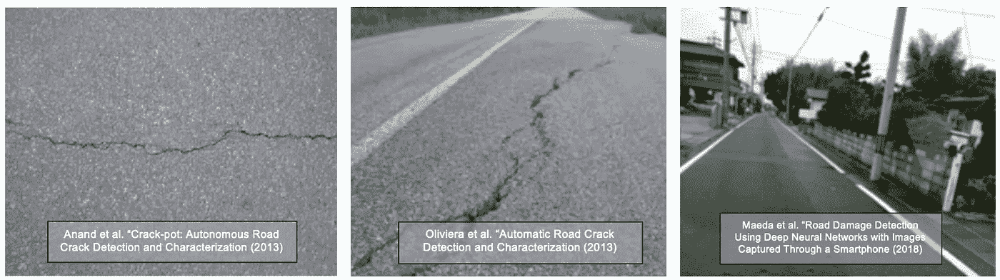

图 1:现有道路损坏检测论文的示例图像。

在深入我们自己的实现之前，我们调查了当前的技术水平，以了解其他人已经完成了什么。根据我们的文献综述，我们发现大多数方法可以分为以下几类:

*   **3D 分析:**使用立体图像分析或激光雷达点云检测路面异常情况。
*   **基于振动的分析:**利用车载加速度计或陀螺仪。
*   **基于视觉的模型:**从边缘检测等传统技术&光谱 segmentation⁴到通过卷积神经网络(CNN)进行表示学习和分割。⁵

由于我们的主要任务是固有的视觉，并且无法访问激光雷达或振动数据，我们选择专注于基于视觉的算法，特别是监督学习方法。

我们早期注意到的一个问题是，相关研究主要依赖于特写图像或垂直于路面拍摄的图像。这是有问题的，因为这些图像看起来与从安装在仪表板上的摄像机流出的图像明显不同，所以不能用于训练或校准旨在摄取后者的模型。

# 我们的数据

我们可以访问从安装在汽车上的照相手机收集的数据集。整个数据集包括大约 27，000 张德国的道路图像，拍摄于 40 多次不同的旅行中，通常是在阳光充足和干燥的条件下。我们图像中的道路类型变化很大:一些是多车道的城市道路，周围有建筑，另一些是没有路标或建筑的乡村道路。路面也各不相同，从混凝土到沥青再到鹅卵石。以大约每秒 1 幅图像的速度连续拍摄图像。下面的图 2 中包含了一些例子。

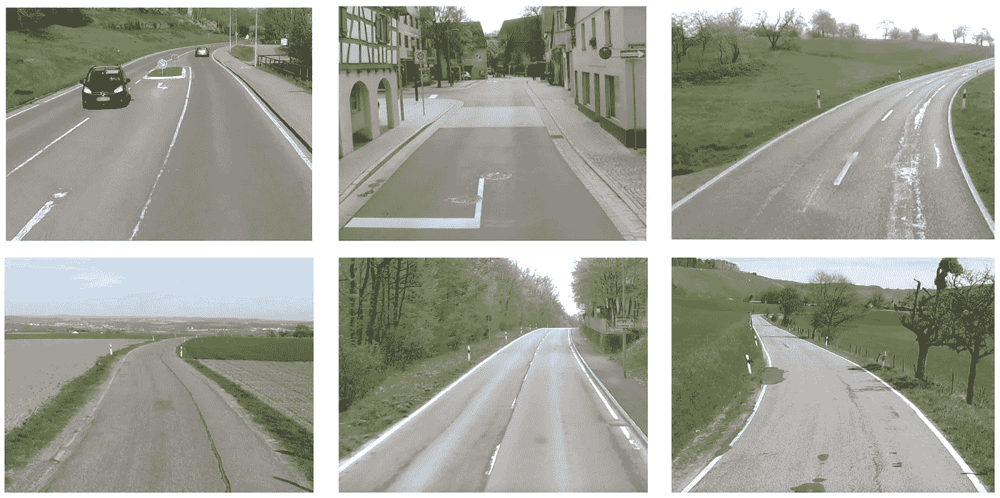

图 2:来自 Lab1886 提供的数据集的样本图像。

# 数据注释困境

由于我们的数据集缺少标签，我们需要一种方法来解析每幅图像，并分割出每种道路损坏类型的相关像素，以及某种严重程度标签。手动，这是一个可怕的任务，所以我们的目标是以几种方式简化我们的生活。

首先，由于有许多不同形式的道路损坏(即鳄鱼裂缝、纵向裂缝、坑洼、补丁、油漆)，我们选择缩小工作范围，仅查看油漆损坏。我们希望这不仅能使注释数据更容易处理，还能为我们以后识别其他类型的道路损坏提供信息。

其次，我们尝试使用预先训练的分类模型筛选出没有油漆损坏的图像。特别是，我们从前田等人的 al.⁶公司提取了两个预训练模型——在 10，000 多张图像上训练的分类器，以识别 8 种不同类型的道路损坏(包括磨损的油漆线)和边界框。这些模型很难推广到我们的数据集。看看图 3 中的小提琴图，我们可以看到，无论是否存在油漆损坏，模型预测的分布几乎是相同的。

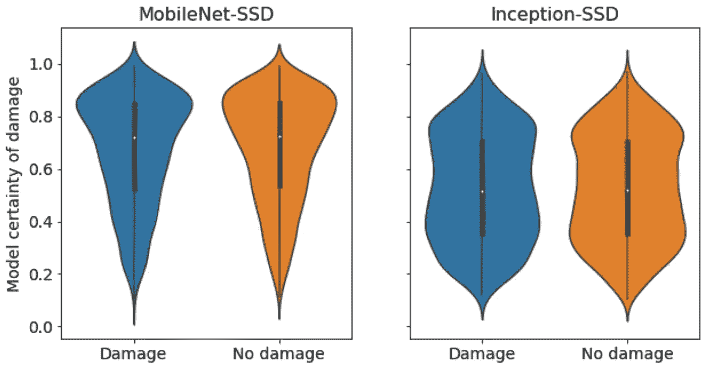

图 3:来自 *Maeda 等人、* MobileNet-SSD 和 Inception-SSD 的模型的小提琴图。这些图表明，再多的参数调整也无法帮助模型区分油漆损坏的存在与否。

第三，我们尝试通过 Mechanical Turk (MTurk)众包注释，这是亚马逊提供的一项服务，参与者可以执行简单的任务，以换取金钱补偿。我们的任务是:通过突出显示该区域并从下拉菜单中选择相应的严重性标签来注释图像中的油漆损坏。我们选择了以下简单的严重性等级:

*   1 —轻度损坏
*   2 —中度/中度损坏
*   3 —严重损坏

图 4 提供了一个 MTurk 注释接口的例子。我们用 200 幅图像的样本进行了几次试点实验，每次都修改指令，以纠正我们在之前的实验中观察到的不必要的行为。我们至少有三名工人为每张图片贴标签，以衡量贴标机的一致性。

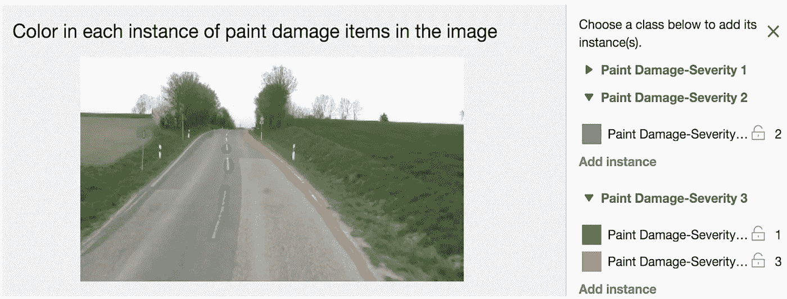

图 MTurk 注释接口的例子。

即使在我们第三次迭代说明之后，工人们在注释什么和如何注释上仍有分歧。我们使用联合交集(IoU)“一致性”分数来量化同一图像的不同贴标机之间的一致性，如图 5 所示。根据协议分布，大多数标注者在他们的注释中根本没有重叠*。这是一个重要的迹象，表明对非专业人员来说，始终如一地标注油漆损坏是一项意想不到的困难任务。*

因此，我们最终选择自己标记数据。总的来说，我们注释了 1，357 幅图像，包括每个严重性级别的至少 300 个实例。

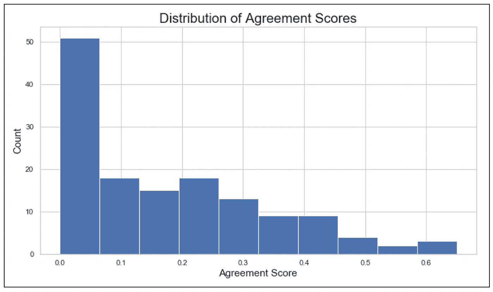

图 5:通过 MTurk 标记的图像的贴标机一致性分数的分布(通过对每个单独图像的不同注释取并集的交集来计算)。这显示了任务的高度主观性，以及众包它很难的原因。

# 建模

我们的核心任务是回答两个问题:

1.  损伤在哪里？
2.  有多糟糕？

不确定从建模的角度来看哪个问题更难回答，我们采用了两种方法。我们最初的方法是一个多阶段的方法，用两个不同的模型分别解决每个问题。

我们首先需要一种分割算法来识别输入图像中存在油漆损坏的区域。为了激励深度学习的使用，我们尝试了一些传统的计算机视觉技术，看看它们是否能够充分掩盖绘画。我们探索了阈值处理、分水岭分割和简单线性交互聚类(SLIC ),所有这些都需要大量的手动超参数调整，并且无法在多个图像之间进行推广。图 6 显示了这些方法在一个示例图像上的结果。

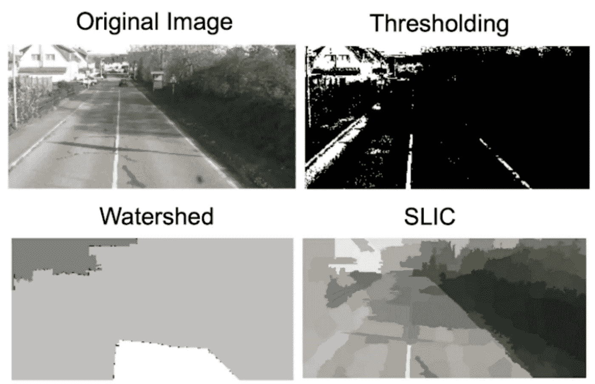

图 6:三种图像分割算法在我们的数据集中的单个图像上运行的结果。

因此，我们转向流行的卷积编码器-解码器网络，U-Net⁷，来执行单通道语义分割。模型的输出是每个像素的预测概率，即它是否代表油漆损坏。

理论上，我们将对预测进行阈值处理，以生成从输入图像中提取受损区域的掩模，然后将其输入分类器，以预测严重性标签。在实践中，我们使用基础事实注释来准备严重性分类模型的输入，认识到分段模型可能表现不佳的可能性。这样，我们能够分别评估分段和严重性分类的难度。我们使用的分类器是基于 ResNet18 架构的 CNN。

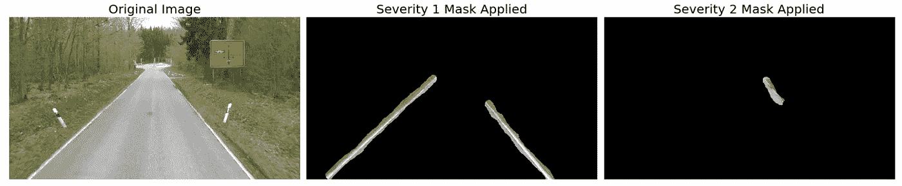

图 7:左图:原始图像。中/右:传递到我们的分类器模型中的相应屏蔽输入。

我们在总图像的 15%的测试集上评估了我们的每个模型。单类语义分割模型的输出示例如图 7 所示。与传统的计算机视觉方法相比，一个巨大的改进是该模型学会了分割油漆线(见图 8)。然而，该模型倾向于过度预测油漆损坏的存在，正如图 9 中显示的像素级精度和召回曲线所揭示的那样。

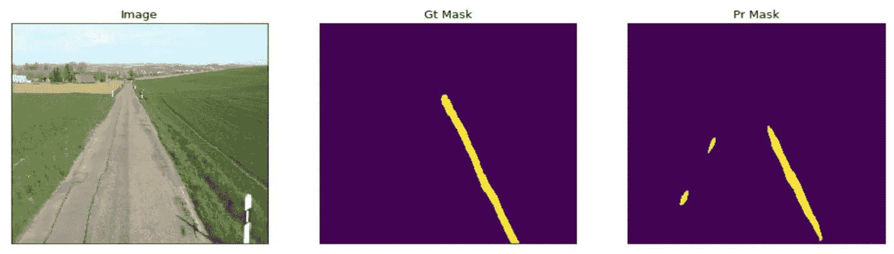

图 8:左图:原图。中间:地面真相面具。右图:单通道分段模型的阈值输出。

严重性分类器的结果显示，网络能够在一定程度上区分低和高严重性油漆损坏，但难以区分低和中等严重性损坏(见图 10)。这是一个危险信号，可能标记的低度和中度损害的实例彼此过于相似，因为模型对两者做出了相似的预测。考虑到我们自己在区分轻度和中度损伤时的困难程度，这个结果并不令人惊讶。

图 9:作为概率阈值函数的单通道分割模型的像素级精度和召回率。该模型预测，随着阈值的提高，损害会减少。

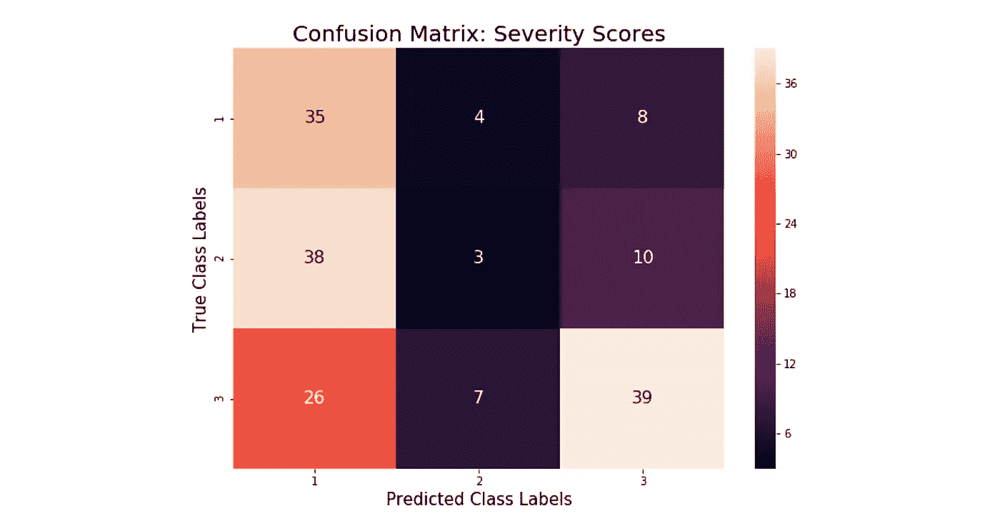

图 10:严重性分类网络的混淆矩阵。每一类的预测准确率如下:1–74.5%，2–5.9%，3–54.2%，总体:45%。

作为建模的第二种方法，我们调整了我们的 U-Net 以执行多类分割，现在除了包含所有无损坏像素的“背景”遮罩之外，还为每个严重性级别生成一个遮罩。一些预测的例子如图 11 所示。

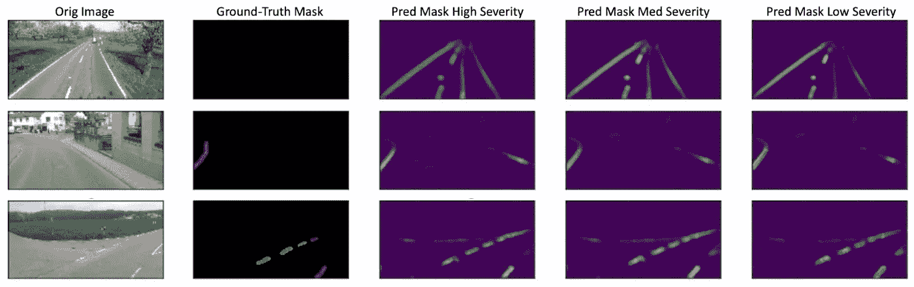

图 11:多类分割模型的示例输出。从左至右:严重性等级 1、2 和 3 的输入、目标和像素级预测。

多级分割模型的性能与多级方法的分类器非常相似，因为它能够部分地将低严重性油漆损坏与高严重性油漆损坏区分开来，但对低严重性和中等严重性级别做出了相似的预测。这在图 12 中表现得最为明显。

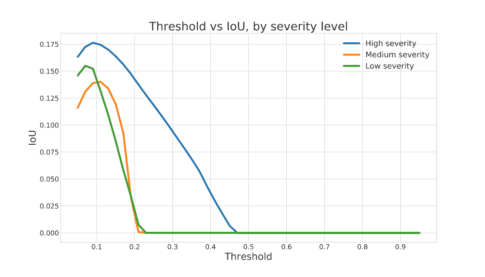

图 12:作为概率阈值函数的多类分割模型的交集/并集。

多类模型的性能对预测阈值非常敏感，即在我们将该像素指定为“受损”之前，该模型在其逐像素预测中必须具有的确定性鉴于该模型在低和中等损害等级之间的不确定性，它倾向于给这两个等级分配非常低的概率。高于 20%的确定性阈值时，我们的多类分割模型仅预测高严重性损害。然而，较低的阈值导致了对受损区域的过度预测。这样，区分严重程度的困难就与识别损伤存在的困难混为一谈了。这支持了我们的假设，即从建模的角度来看，多阶段方法可能更有利于阐明任务的哪些方面最具挑战性。

# 关键要点

## 1.普遍性

理想情况下，我们的模型对于在新地点、从不同角度、在不同光照条件或天气下获取的新数据保持准确。我们发现，对于道路损坏检测，概化是一个真正的挑战。特别是，Maeda 等人的模型根本不能推广到我们的数据集。虽然日本的道路和德国的道路确实有细微的系统差异(德国的道路通常更宽，颜色更浅)，但我们的工作表明，任何现有的模型都需要大量的再培训和调整，才能处理新的数据。此外，我们已经证明了用复杂的神经网络进行表征学习是必要的，因为简单的计算机视觉方法无法做到这一点。

在你说“咄”之前，事实上，当你考虑到已经注释道路损坏的公开可用数据的缺乏时，这是一个大问题。上面带有严重性标签的数据是不存在的。由于数据收集和注释的艰巨性，对于没有资源获取自己的数据或雇佣受过培训并具有专业知识的人员来构建复杂模型的地方政府来说，拥有预先训练的可概括模型将是一笔巨大的资产。

## 2.嘈杂的注释

我们的注释目标看似简单明了:识别受损的油漆，并给它分配 1、2 或 3 的严重性分数。然而，当我们开始回顾 MTurk 的结果时，我们发现事情并不那么简单。

即使贴标签机提供了极其详细的说明和大量的例子，工人之间也很少有一致意见。出现的一些意想不到的问题是:

1.  应该突出显示整条油漆线，还是只突出显示虚线部分？
2.  这里应该有油漆吗？
3.  我们应该标记多远的距离？
4.  损伤周围的“缓冲”区域有多少应该被注释以提供建模的背景？

即使在讨论了这些要点并自己标注了数据之后，我们还是目睹了几个矛盾的例子，说明什么构成了低与中等严重程度损害的实例。因此，我们建议研究人员将他们的严重程度分成满足他们要求的尽可能少的类别。我们怀疑这是我们的模型学会区分极端情况，但无法区分低度和中度严重程度的关键原因。为了减少这种错误，我们需要更一致的标签(也许由专家)，更多的数据，或者更少的严重性等级。

## 3.模型评估

分割模型的定量评估是微妙的。首先，任何与地面真实遮罩的比较都会受到两个噪声源的影响:

1.  来自不一致注释的非故意噪音(对我们来说是一个真正的问题)。
2.  在注释过程中，围绕绘画高亮显示的场景上下文的数量。

为了说明第二点，考虑 IoU 指标。假设我们有一个完美的模型，只分割绘画线条，在突出场景上下文中的注释越自由，IoU 分数就越低。

另一种评估选择涉及以像素或图像为单位计算精度和召回率(即，可以对每个像素进行预测或对每个图像进行预测)。为了将像素级预测映射到图像，我们认为图像中任何正像素预测的存在都是该图像的正预测。哪个信息量更大？此外，任何精度和召回率的计算必须由最终用户希望模型有多保守来限定。

请注意，我们用于评估模型的指标并不构成一个详尽的列表。我们的建议是使用一套以像素和图像为单位的指标来了解模型在不同特异性水平上的表现。

# 结束语

深度学习模型在精选数据集上表现非常好，但在非结构化数据上还有改进的空间。当应用计算机视觉模型来执行自动道路损坏检测时，必须考虑的一些重要因素包括:

*   如何正确地对不同类型的损害进行分层。
*   如何保证标注一致？
*   几百万参数的深度学习模型需要多少标注才能有效学习:(1)哪里有损伤，*和* (2)有多坏。
*   如何有效地评估一个细分模型，考虑注释是如何制作的以及最终用户是谁。

我们的贡献是概述这些挑战，并证明即使只有有限的数据和嘈杂的标签，我们的模型也能够学习分割油漆线，并开始分离严重程度的极端例子。建模能力是存在的；瓶颈是数据。

# 确认

我们要感谢我们的行业合作伙伴 Lab1886 给我们这个机会。此外，我们要感谢我们的导师，帕夫洛斯·普罗托帕帕斯博士和克里斯·坦纳博士，以及顶点课程的学生和教师在注释我们的图像方面给予的帮助。有关哈佛数据科学峰会的更多信息，请访问:[capstone.iacs.seas.harvard.edu](https://capstone.iacs.seas.harvard.edu)。

# 参考

[1] R. Fan，M. Liu，(2019)【IEEE 智能交通系统汇刊】

[2] S. Chen 等， [3D 激光雷达扫描桥梁损伤评估](https://ascelibrary.org/doi/10.1061/9780784412640.052) (2012)，*法医工程 2012:通向更安全的明天*

[3] S. Sattar 等人，[使用智能手机传感器进行路面监控:综述](https://www.ncbi.nlm.nih.gov/pmc/articles/PMC6263868/) (2018)，*传感器(瑞士巴塞尔)*

[4] E. Buza 等，[基于图像处理和谱聚类的坑洞检测](https://pdfs.semanticscholar.org/78d5/c9c0c9bcdb939e028bc4d6f808300253dca1.pdf) (2013)，*第二届信息技术与计算机网络国际会议论文集*

[5] J. Singh，S. Shekhar，[使用 Mask 的智能手机捕获图像中的道路损坏检测和分类 R-CNN](https://arxiv.org/pdf/1811.04535.pdf%60) (2018)， *arXiv 预印本 arXiv:1811.04535*

[6] H. Maeda，et al., [利用智能手机捕获的图像使用深度神经网络进行道路损伤检测](https://arxiv.org/pdf/1801.09454.pdf) (2018)， *Comput。辅助民用基础设施。英语。*

[7] O. Ronneberger 等， [U-net:卷积网络用于生物医学图像分割](https://arxiv.org/pdf/1505.04597.pdf) (2015)，*医学图像计算和计算机辅助介入国际会议*