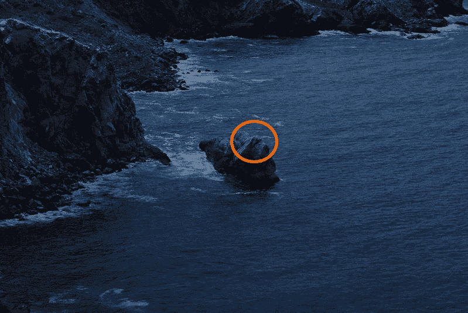
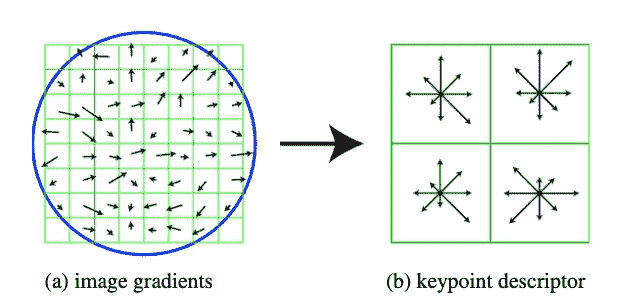
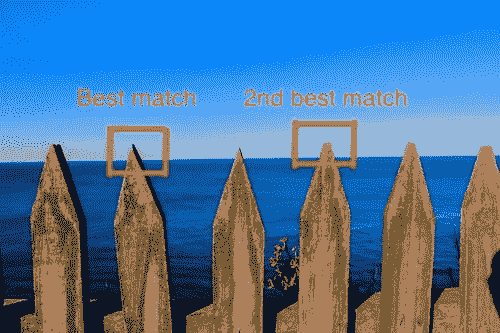

# 计算机视觉:全景拼接背后的直觉

> 原文：<https://towardsdatascience.com/computer-vision-intuition-behind-panorama-snitching-5c4be7205426?source=collection_archive---------30----------------------->

田纳西州了望山顶的景色(1864 年)来源:[https://en.wikipedia.org/wiki/Panoramic_photography](https://en.wikipedia.org/wiki/Panoramic_photography)

全景拼接的工作原理有 4 个主要部分。在这篇文章中，我将给出一个非常简短的概述，能够充分(希望)建立图像拼接工作背后的直觉。这也意味着我很可能会跳过任何数学概念和计算。

1.  **探测兴趣点**
2.  **描述这些兴趣点**
3.  **匹配我们兴趣点的这些描述符**
4.  **执行单应完成拼接**

# 1.检测兴趣点

当我们在图像中寻找兴趣点时，有几个特征。它们是:

**a)可重复的兴趣点**

我们希望能够找到图像中的特征，这些特征最终可以告诉我们同一场景的不同图像之间的匹配位置(从附近的视点)。

**b)兴趣点的独特性**

我们希望能够可靠地确定一幅图像中的哪个兴趣点与另一幅图像中的相应兴趣点相匹配。

**c)缩放和旋转不变性**

我们希望能够找到相同的兴趣点，即使图像被旋转、缩放或平移。

**d)地点**

局部特征将使我们对感兴趣点的检测对杂乱和遮挡更加鲁棒。

图一。我的 mac 默认背景截图。

想象上面的两张图片(图 1)，很容易看出，如果我们选择海洋作为兴趣点，很难将左侧图像中的海洋与右侧图像中的海洋特别匹配(因为海洋在大范围的空间中看起来是相同的)。我们还注意到，选择诸如小石峰(橙色圆圈)的区域能够为我们以后的匹配提供更有价值的信息。

事实证明，角实际上是一个非常好的特征，可以作为兴趣点！有一种叫做 Harris 角点检测器的算法，可以帮助我们在图像中找到这样的角点作为兴趣点。

哈里斯角探测器

> 注意，哈里斯角点检测器只是帮助我们找到这些兴趣点的众多算法之一。还有其他方法，例如 SIFT，它使用高斯差分(DoG)来检测不同尺度的兴趣点。我个人认为这篇文章很值得一读。在后面的部分中理解 SIFT 很重要，因为我们将使用 SIFT 描述符来描述我们发现的兴趣点。

本质上，在取局部最大值(非最大值抑制)的点之前，Harris 角点算法从图像的梯度计算角点分数(使用二阶矩 H 矩阵)并将高于设定阈值的值标记为角点。哈里斯角对于旋转(因为 H 矩阵的特征值即使在旋转之后也保持不变)、平移和强度的附加变化是不变的。然而，它对于强度的缩放和比例不是不变的。为了使 Harris 角点在尺度上保持不变，我们需要一个额外的自动尺度选择步骤来找到一个给出我们的角点分数的局部最大值的尺度。

总结一下从图像中检测兴趣点的第一部分，角是兴趣点的良好表示，可以使用 Harris 角检测器找到。

# 2.描述我们的兴趣点

描述符基本上是以数学方式描述图像中某个区域的矢量表示。描述符也应该对旋转、缩放和平移不变。我将直接进入 SIFT 描述符，我们可以在我们的 Harris 角点检测器发现的兴趣点上使用它。

尺度不变特征变换 [(SIFT)](https://www.cs.ubc.ca/~lowe/papers/ijcv04.pdf) 由 David Lowe 于 2004 年发表。如果他的论文太难阅读，你可以参考[这里的](https://aishack.in/tutorials/sift-scale-invariant-feature-transform-features/)快速阅读 SIFT。SIFT 实际上是一种检测兴趣点并描述它们算法。然而，在这种情况下，我将只关注描述符本身。

图 2(显示了缩小的版本)。鸣谢:理查德·塞利斯基

SIFT 描述符的基本功能是在检测到的兴趣点周围提取一个 16x16 的窗口(图 2)，然后将其划分为一个 4x4 的单元网格。在由高斯函数加权的窗口中的每个像素处计算梯度方向和幅度。然后，在每个单元中计算具有 8 个面元的加权梯度方向直方图(方向由其幅度加权)。最后，我们将这些直方图折叠成一个 128(16×8)维的向量(每个向量有 16 个 4×4 的单元，每个单元有 8 个面元)。

单元的划分给描述符一种空间知识的感觉，而主方向对直方图宁滨的移动使得描述符旋转不变。我们可以将最终向量归一化为单位长度，基于阈值箝位值，并再次重新归一化，以使其对光照变化相对更鲁棒。

总而言之，SIFT 对于一个描述符来说是非常健壮的。它对比例和旋转是不变的，可以处理视点的变化(高达 60 度的平面外旋转)并且可以处理照明的显著变化。

现在，我们已经通过 Harris 角点找到了我们的兴趣点，并使用 SIFT 描述符将这些兴趣点描述为一个区域。现在剩下的是形成不同点之间的匹配，并执行单应性以将不同的图像缝合在一起以形成全景图！

# 3.匹配我们兴趣点的描述符

为了在两幅图像的描述符之间形成匹配，我们使用最佳匹配的距离/第二最佳匹配的距离的比率距离方法。

图 3。图片来自 Unsplash。作者:[伊山·瓦扎尔瓦](https://unsplash.com/@ishanwaza)

在图 3 中，如果我们只使用目标和最佳匹配的绝对距离(这里的距离指的是描述符的相似性——如果它们非常相似，那么距离就很小，反之亦然)，很容易看到有多个模糊匹配可用(这里有许多类似的栅栏作为图像中的兴趣点，因此，我们不能确定最佳匹配是要匹配的正确特征)。

为了拒绝这些不明确的匹配，我们使用比率方法—接近 1 的高值表明匹配是不明确的，因为到最佳匹配的距离非常接近到第二最佳匹配的距离。然后，我们设置一个阈值(通常在 0.5-0.7 左右)，并接受低于该阈值的匹配。换句话说，我们拒绝包含高度不确定性的匹配——在图 3 的情况下，不确定性很高，因为许多木质尖端靠近目标。

# 4.执行单应

> 维基百科对单应性的解释是这样的:在[计算机视觉](https://en.wikipedia.org/wiki/Computer_vision)领域，空间中同一平面的任意两幅图像都是通过一个 [**单应性**](https://en.wikipedia.org/wiki/Homography) **联系起来的。**

一旦我们能够想象当我们试图把不同的图像拼接在一起时，我们试图做什么，就很容易理解单应性。想象两个场景。

(1)-每次拍摄照片时向左移动一步，同时保持相机不动。

(2)-站在固定的位置，手持相机旋转身体，并在旋转的同时拍摄不同的照片。

如果我们想将(1)中的图像拼接在一起，我们可以简单地将一张照片叠加在序列中的另一张照片上，并获得良好的效果。然而，在(2)中，如果我们想要通过简单地将图像依次叠加在另一个的顶部来将图像拼接在一起，我们将意识到拼接的结果是不好的(由于所捕获的图像的不同平面，区域将被遗漏)。因此，我们需要单应映射将一幅图像投影到另一幅图像的同一平面上，然后将它们拼接在一起。

接下来，您可以将单应性基本上视为一个矩阵——一个将点从一个图像转换到同一平面的另一个图像的矩阵。那么下一个问题是我们如何求解单应矩阵 H？

我们使用[直接线性变换(DLT)](https://en.wikipedia.org/wiki/Direct_linear_transformation) 并通过计算[奇异值分解(SVD)](https://en.wikipedia.org/wiki/Singular_value_decomposition) 来求解 H，该计算最少需要 4 次对应。我将跳过数学，但如果你感兴趣的话，可以随意查阅。

然而，DLT 可以在噪声环境中产生坏的结果，因为 DLT 是线性最小二乘估计，其考虑了我们的匹配中的坏的离群值。(注意，即使我们在前面的步骤中在匹配描述符时设置了阈值，仍然有可能出现不正确的匹配)。然后，我们可以使用随机样本一致性(RANSAC)产生更稳健的结果，其中我们在 H 矩阵的计算中仅包括内联体(近似正确的匹配)。然后，我们利用 DLT 和 RANSAC 给我们更好的结果。

一旦我们解决了单应矩阵，我们就可以使用矩阵计算从图像 A 到图像 B 的点，并很好地扭曲它以完成我们的全景拼接！

# **结论**

在这里，我简要介绍了全景拼接的工作原理。具体来说，我谈到了使用 Harris 角点来检测作为兴趣点的角点，使用 SIFT 描述符来描述我们的兴趣点周围的区域，我们如何匹配这些描述符，以及我们如何计算单应性来形成不同图像的拼接。请注意，由于这是一个简短的概述，我有意省略了数学细节，并试图不要深入每个特定的算法/概念，因为我的目标是建立整个概念背后的直觉！

还有，这其实是我第一篇关于 medium 的文章！我希望你喜欢这篇文章，并从这篇文章中学到了一些东西。谢谢！

## 参考

*   [https://aishack.in/tutorials/harris-corner-detector/](https://aishack.in/tutorials/harris-corner-detector/)
*   [https://ai shack . in/tutorials/sift-scale-invariant-feature-transform-introduction/](https://aishack.in/tutorials/sift-scale-invariant-feature-transform-introduction/)
*   https://www.cs.ubc.ca/~lowe/papers/ijcv04.pdf
*   【https://en.wikipedia.org/wiki/Direct_linear_transformation 
*   [https://en.wikipedia.org/wiki/Singular_value_decomposition](https://en.wikipedia.org/wiki/Singular_value_decomposition)

# 感谢阅读！我希望你喜欢它，这篇文章对你有帮助！