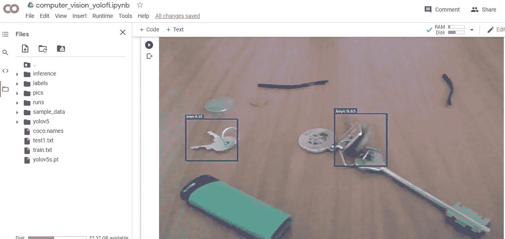

# 计算机视觉——通过人工智能自我学习进行物体定位

> 原文：<https://towardsdatascience.com/computer-vision-object-location-through-ai-self-learning-52467ef3fb99?source=collection_archive---------21----------------------->

## 我希望我有一个机器人可以扫描我的房子，找到我丢失的钥匙

随着像脸书这样的公司在增强现实上花费数百万美元，在不久的将来，简单的眼镜将取代世界上几乎每一个屏幕，包括电视、手机，并将我们所有的环境转换成现实和屏幕的混合物。

> 我相信我的房子里有一个喜欢每天早上吃掉所有钥匙的洞，这是每次我上班迟到时它们从地球上消失的唯一原因。

但我仍然会等待有一天，我可以让我的眼镜或机器人扫描我的房间，找到我每天早上都在努力寻找的钥匙或我在房子某个地方丢失的耳机。

尽管每天都在不停地挣扎，但我决定为未来可能的机器人创建一个小小的后端项目，机器人/人工智能可以扫描房子的周围，为我找到东西。尽管:

*   问题的第一部分是告诉计算机一个物体看起来像什么，所以计算机知道实际上要找什么，所以我选择了最明显的方法，我们都做的检查一个物体看起来像什么，即通过在谷歌上搜索，所以当我告诉机器人在房间里找到我的钥匙或 AirPods 时，首先 Ai 会进行谷歌搜索，看看钥匙或 AirPods 实际上看起来像什么。
*   问题的第二部分是让人工智能意识到物体在图像中的位置，人工智能可以自动学习并决定物体的实际形状和大小，并可以在图像中定位物体。为了解决这个问题，我实现了**最小生成树聚类的研究工作——**你可以在这里找到研究论文——>[http://cs.brown.edu/people/pfelzens/segment/](http://cs.brown.edu/people/pfelzens/segment/)
*   问题的第三部分是教 Ai，如何定制训练一个**物体检测 YOLO 模型，——**所以不管我要求什么，不管是钥匙，AirPods，还是我丢失的 u 盘 AI 将自动—
    1 谷歌搜索对象的图像
    2 从这些图像中生成训练数据
    3 标记/标注图像中的对象
    4 写下 YOLO 模型所需的所有适当的注释和文本文件
    5 编辑具有适当配置的 YOLO·YAML 文件
    6 训练图像，生成推理图，然后机器人将最终知道“钥匙”是什么，**因此它可以打开摄像机并开始寻找它**


自学模式的结果

## 这是完整自动化过程的算法-

1 **Google 通过 AI 搜索物体的图片** -
在 Colab 环境中安装 Google chrome 和 Selenium

制作一个数据框，从谷歌获取前 200 个图像结果。

这里计算机/机器人会问你想看什么，我用了键，然后得到 200 个图像

**最小生成树聚类** 通过这种聚类分割，Ai 将理解对象在图像中的位置，并通过在它周围制作一个方框来标记它，以创建一个训练数据，实现自研究论文[http://cs.brown.edu/people/pfelzens/segment/](http://cs.brown.edu/people/pfelzens/segment/)


人工智能标记的对象

现在物体被标记了，是时候找到 Ai 在物体周围创建的黄色轮廓的“框”值了。我们需要找到 xmin，xmax，ymin，ymax，这样就可以为 YOLO 对象模型编写注释了

**Ai 自/自动 Yolo 模型训练和注释编写**

为了得到物体周围盒子的 xmin、xmax、ymin 和 ymax，我们需要找到物体周围所有黄色的像素点，然后从所有这些点，我们可以很容易地得到我们的坐标。

**按照下面我创建的代码，Ai 将首先在我们的训练数据中寻找每个图像中对象周围的所有黄色点，然后用坐标**创建一个熊猫数据框


要编写 YOLO 注释，人工智能必须遵循一定的格式，人工智能需要在包含图像的同一文件夹中创建每个图像的文本文件，然后人工智能必须创建一个包含所有图像路径的 train.txt 文件。

```
image text file formula and fromat
<class_number> (<absolute_x> / <image_width>) (<absolute_y> / <image_height>) (<absolute_width> / <image_width>) (<absolute_height> / <image_height>) 
```

上面的代码将会给 Ai 训练一个定制的 **YOLO 物体检测模型**所需的所有文本文件

**Ai 将在 YOLO 上训练数据集**

现在，人工智能将从图像和标记的注释中学习，一把钥匙或任何其他物体看起来是什么样子，

使用下面的代码，Ai 正在做三件事
1 安装 Yolo API
2 将 train.txt 拆分成训练和测试数据
3 打开 Yolo 模型的 YAML 文件并编辑所有必要的东西，如类的数量、训练的链接、测试数据和类名——在这种情况下，类名是键

训练数据和保存重量

打开网络摄像头并检测物体
现在，人工智能已经学会了什么是钥匙，现在我们可以将这个人工智能放入机器人或我们的增强眼镜中，然后它可以为我们扫描房间并找到钥匙。虽然眼镜或机器人还需要一些时间才能进入市场。所以现在我只是用我的笔记本电脑摄像头测试。



**结论**

看到 Ai 学习自己并检测物体是非常令人兴奋的，但整个笔记本需要 3 分钟来完成学习过程，这对于实际使用来说太长了。但随着量子计算的发展和并行处理的更好编码，实时自我训练和学习过程可能在未来几年内完成。虽然这个项目确保了让一个机器人去寻找你家丢失的东西不再是科幻幻想

对于，完整的 jupyter 笔记本和代码，可以通过[github.com](https://github.com/Alexamannn/Computer-Vision-Object-Location-through-Ai-Self-Learning)——[https://github . com/Alexa Mann/Computer-Vision-Object-Location-through-Ai-Self-Learning](https://github.com/Alexamannn/Computer-Vision-Object-Location-through-Ai-Self-Learning)查看我的知识库