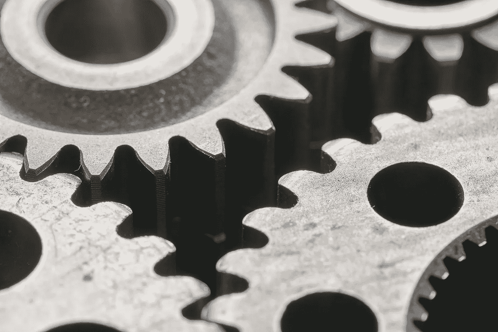
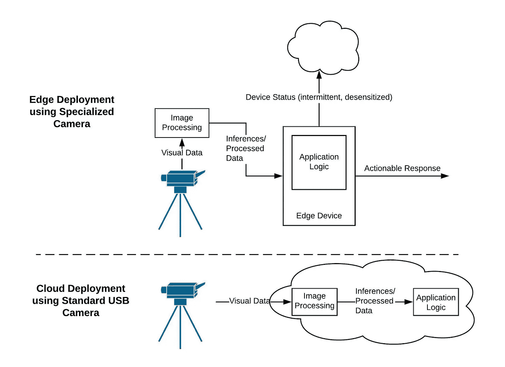
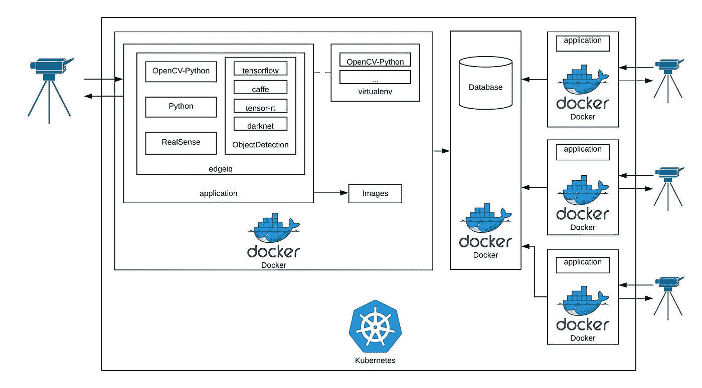

# 边缘的计算机视觉

> 原文：<https://towardsdatascience.com/computer-vision-on-the-edge-1804257a20a?source=collection_archive---------38----------------------->

## 克服将 CV 应用引入生产的挑战

比尔·牛津在 [Unsplash](https://unsplash.com/s/photos/working-together-technology?utm_source=unsplash&utm_medium=referral&utm_content=creditCopyText) 上的照片

开发计算机视觉(CV)应用程序并将其投入生产需要集成几个硬件和软件。我们如何确保各部分无缝协作？使用正确的方法，我们可以加快 CV 应用程序的开发和部署。有必要找到一个平台，其目标是帮助开发人员使用一套集成的免费工具快速、轻松地从头开始创建计算机视觉应用程序。本文描述了开发和部署 CV 应用程序的一些挑战，以及如何减轻这些挑战。如果您想了解更多信息，可以观看关于计算机视觉部署挑战的免费[网络研讨会](https://www.youtube.com/watch?v=l381u5WfAkc)。

## 世界上的计算机视觉

首先，一些背景。术语“计算机视觉”是指计算机能够像人类一样分析视觉数据，并对数据包含的内容做出推断的过程。当集成到应用程序中时，这些推理可以转化为可操作的响应。例如，以自动驾驶汽车为例:计算机视觉可以用来分析实时视频数据，以检测道路上的物体，然后运行计算机视觉模型的软件可以对这种检测做出反应，以停止汽车或改变其路径来避开物体。

CV 越来越多地被用来解决各种现实世界的问题，从安全和医疗保健到制造业、智能城市和机器人。CV 可用于检测放射报告中的癌细胞，帮助分析身体运动，如正确的步态和姿势，或跟踪生产线上的生产。

在本文的其余部分，我们将探讨构建和部署安全摄像机 CV 应用程序的挑战。您可以找到已经构建在 [GitHub](https://github.com/alwaysai/snapshot-security-camera) 上的这种应用程序的实现。当一个新人进入一个画面时，这个应用程序会注意到并记录下这个人的图像。在这篇博客中，我们将讨论构建这样一个应用程序的挑战，以及那些涉及部署它的人，可能使用多个摄像头，但是如果你想了解更多关于应用程序本身的代码逻辑，你可以阅读这个[博客。](https://alwaysai.co/blog/detect-people-using-alwaysai?&utm_campaign=Open%20Beta&utm_source=medium&utm_content=challenges_edge_deployment)

## 原型设计和开发 CV 应用程序

CV 应用程序包含许多组件，开发起来非常复杂。除了将执行处理的硬件与应用软件本身集成之外，开发生产就绪的计算机视觉应用程序的过程还包括许多步骤:数据收集和注释、训练计算机视觉模型、将使用不同框架制作的现有模型集成到您的应用程序中、将现有计算机视觉库集成到应用程序中，等等。考虑到开发计算机视觉解决方案的潜在成本和工作量，理想情况下，您还希望确保您的应用程序是灵活的，以便您的应用程序可以随着您的问题空间的发展而发展。这意味着确保您可以使用额外的模型类型，转移到不同的模型框架，或者在不中断应用程序的情况下更改硬件。

考虑到安全应用，假设您只想检测人。如果你想要一个能保证在一天的不同时间、不同天气等条件下工作的模型。对于生产质量的应用程序，您很可能需要收集和注释从您将使用的相机的角度以及在不同环境中拍摄的图像，并训练您自己的模型，反复几次此工作流以实现所需的性能。然而，假设你只是想要一个原型应用程序，在这种情况下，你可能会使用一个现有的检测人的模型，如 [mobilenet_ssd](https://alwaysai.co/model-catalog?model=alwaysai/mobilenet_ssd?&utm_campaign=Open%20Beta&utm_source=medium&utm_content=challenges_edge_deployment) 或 [yolo_v2_tiny](https://alwaysai.co/model-catalog?model=alwaysai/yolo_v2_tiny?&utm_campaign=Open%20Beta&utm_source=medium&utm_content=challenges_edge_deployment) 。理想情况下，您可以尝试不同的模型，看看哪一个(哪些)效果最好，也许您的应用程序将受益于同时使用两个模型，以检测不同距离或不同条件下的人。一旦有了对象检测模型，就可以构建应用程序了。您将需要使用软件包，使您能够访问来自摄像机的视频流，并且您需要知道如何访问从您训练的模型返回的预测，以便您可以查看该人是否是新加入该帧的，并保存图像中与检测到的人的边界框相对应的部分。

## 部署计算机视觉应用

开发计算机视觉应用的另一个挑战是部署。一旦你有了一个计算机视觉应用的工作原型，你如何让它在世界上产生影响？虽然云通常被视为机器学习应用程序的一种非常灵活的解决方案，但它可能非常昂贵，具有更高的延迟，并且数据传输会带来安全风险。另一个越来越受欢迎的选择是将你的简历应用到边缘。

## 边缘上的简历

什么是边缘？一般而言，边缘设备是小型、轻量级的设备，计算机视觉应用可以在其上部署和运行。今天，许多边缘设备甚至具有图形处理单元(GPU)或视觉处理单元(VPU)，这使得能够使用更大范围的模型和应用程序复杂性。在本文的上下文中，边缘设备是指诸如 Raspberry Pi、NVIDIA Jetson 设备(如 Jetson Nano 或 TX2)或各种物联网(Iot)设备之类的设备，这些边缘设备能够感知或评估其使用环境，并可能与其进行交互。

虽然可以使用互联网连接来部署应用程序，但是一旦应用程序位于边缘设备上，就不需要使用云连接来运行。这意味着应用程序所做的任何推理都是在边缘设备本身上进行的，而不是在云中，从而大大减少了应用程序将这些推理转化为行动的时间。对于某些用例，如自动驾驶车辆或安全摄像头，这是必不可少的。除了数据可能在发送到云或从云接收时丢失的风险之外，使用云方法所需的额外时间可能意味着无法及时响应任务，这对自动驾驶等任务来说可能是灾难性的。

除了边缘设备，还有专门的外围设备，特别是摄像机，它们本身没有互联网连接，边缘设备使用它们来提高性能或扩展应用功能。有了这样的设备，这种边缘处理的概念就更进一步了。虽然边缘设备通常连接到 USB 或带状摄像机，将图像数据传递到设备进行处理，但这些设备将处理器集成到摄像机本身中，进一步减少了推断时间。

此外，由于数据不需要通过边缘部署传输到云，所有数据都可以留在设备本身的封闭电路中，这更加安全，并且不需要云处理，成本也更低。

在边缘和云中部署 CV 应用程序的比较。创作于卢西德哈特([www.lucidchart.com](http://www.lucidchart.com/))。

## 边缘部署面临的挑战

在边缘上部署生产质量的计算机视觉应用程序会带来一系列挑战。使用云计算，当计算需求增加时，您可以扩展实例，但是使用边缘设备，您会受到单个设备能力的限制。此外，通过边缘部署，如果不集成其他包，您可能无法访问设备状态。

## 让一切运转起来

我们已经讨论了开发和部署计算机视觉应用程序的复杂性；我们如何缓解这些挑战，尽快将 CV 应用投入生产？如果你看看 alwaysAI 这样的平台，有几个关键的方法可以用来降低工作流的复杂性:容器化和应用程序编程接口(API)抽象。

**容器化**是指将软件和依赖项捆绑在一个单元中的过程，可以在不同的环境中执行。AlwaysAI 利用使用 Docker 映像的容器化来实现在不同设备上的部署，包括 Raspberry Pi 和 Jetson Nano。它还整合了开源计算机视觉工具，如[计算机视觉注释工具](https://github.com/openvinotoolkit/cvat/blob/develop/cvat/apps/documentation/installation.md) (CVAT)，这些工具依赖于直接打包到我们的包中，以简化这些工具的安装和使用。

alwaysAI 还开发了一个 **API** 来进一步加速开发。通过这个 API，用户可以与计算机视觉相关的对象进行交互并对其进行操作，例如关键点、边界框、标签等。从模型推断返回的，以及硬件特征如照相机，和外部实体如文件(图像、视频等)。)而不必知道这些请求背后的所有细节。这是如何工作的？API 充当复杂后端和最终用户之间的某种协商者。它定义了用户可以发出什么样的请求以及如何返回数据。通过隐藏这些调用中涉及的一些复杂性，这简化了用户的使用，并有助于确保只能发出适当的请求。

alwaysAI API 包装了其他 API，有助于进一步促进应用程序开发。OpenCV-Python API 是一个流行的计算机视觉库；alwaysAI 已经将一些最常见的 OpenCV-Python API 调用合并到其库中，以便简化这些函数的使用，并确保它们与其库的其他方面一起工作。此外，任何 alwaysAI 应用程序都可以直接导入 cv2，即 OpenCV 库，而无需安装库或添加任何依赖项。这样，依赖于 cv2 的遗留代码仍然可以工作，如果需要，用户可以默认使用 OpenCV-Python API，但是为了简单起见，可以使用一个库进行开发。

API 还可以帮助开发人员更好地访问硬件。一些专业相机，如 RealSense 和 OpenNCC Knight 相机，有自己的软件开发工具包(SDK)来促进应用程序的创建。这些 SDK 还包括 API，可能足以将这些相机与现有应用程序集成。虽然可以通过使用这些 API 直接访问硬件功能，但也可以将特定于相机的 API 合并到另一个已经用于应用程序开发的库中，这就是我们对 API 所做的。这意味着最终用户可以使用他们的应用程序已经使用的相同库来访问这些相机功能，并且可以保证正常工作。

API 和容器化也有助于克服上述与部署相关的挑战。使用基于容器的部署服务，您可以部署多个边缘设备并监控它们的状态。Kubernetes 和 T2 Docker Swarm 都支持监控和管理多个 Docker 容器，T4 balena 和 T5 也是如此，balena 是一项免费的商业服务。这两种方法都利用 API，第三方应用程序如开源的 [Prometheus](https://prometheus.io/) 或商业的 [Datadog](https://www.datadoghq.com/blog/monitor-kubernetes-docker/) 可以使用 API 来获得对原始指标的更多洞察。虽然这种方法确实依赖于一些云连接，但实际的计算机视觉数据并不通过网络传输，因此您仍然可以保持在边缘部署的速度和低成本特性，并且安全性得到了提高，因为连接到边缘设备需要身份验证，并且应用程序数据仍保留在边缘上。

让我们最后一次回到我们的安全摄像头应用。您已经构建了自己的应用程序，可以轻松地更换不同的摄像机，并且可以在检测到物体时存储图像。现在，您可以使用我们上面提到的容器化技术来协调跨多个边缘设备的应用程序部署，如下图所示。使用正确的方法，平台、库和硬件可以无缝集成，使 CV 应用程序更容易开发和部署，并可扩展用于生产。

已部署的 CV 应用程序概述。创建于卢西德哈特([www.lucidchart.com](http://www.lucidchart.com/))。

如果您想了解更多关于克服计算机视觉部署挑战的信息，您可以观看 YouTube 上的[网络研讨会](https://www.youtube.com/watch?v=l381u5WfAkc)。

Eric VanBuhler 和 Stephanie Casola 对本文的贡献