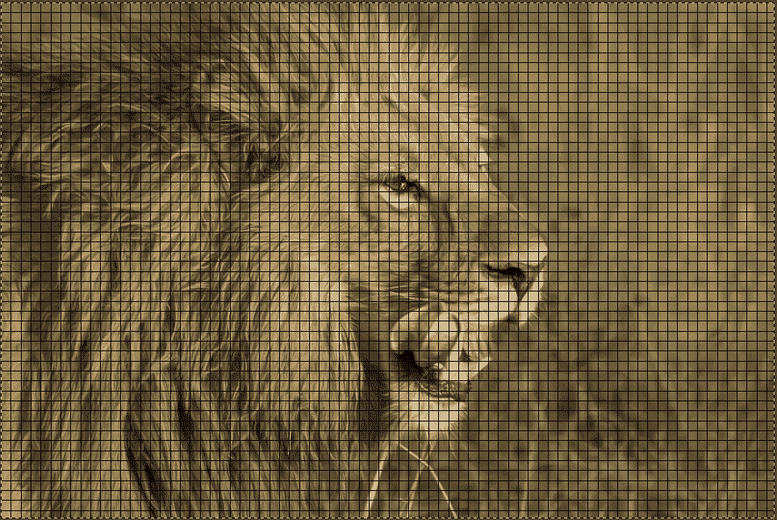
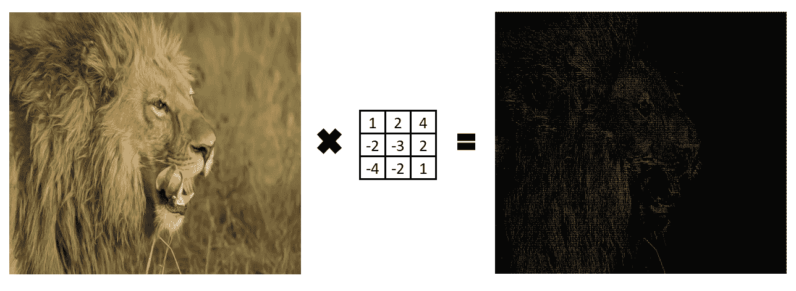

# 计算机视觉深度学习导论

> 原文：<https://towardsdatascience.com/computer-vision-part-1-774113a2bec5?source=collection_archive---------36----------------------->

## **图像数据处理和特征提取背后的直觉是什么？**

“计算机视觉”是机器学习的一个领域，处理图像识别和分类。可以开发计算机视觉模型来完成诸如面部识别、识别狗属于哪个品种，甚至从 CT 扫描中识别肿瘤等任务:可能性是无限的。

在关于这个主题的一系列文章中，我将探讨一些围绕计算机视觉的关键概念。在这篇文章中，我将提供一些关于计算机如何处理图像以及如何识别物体的直觉。
后续文章将处理深度学习模型的实际实现，该模型将学习将图像分类到几个类别中的一个——所有这些都在不到一百行代码中。

# **计算机是如何“看见”图像的？**

计算机看图像的方式与人类不同——它们只能理解数字。因此，任何计算机视觉问题的第一步都是将图像包含的信息转换成机器可读的形式。幸运的是，一旦我们把一幅图像分解成它的组成部分，这是非常容易做到的。

图像由像素网格组成，每个像素就像一个小盒子，覆盖了图像的很小一部分，如下所示:

来自[像素](https://www.pexels.com/photo/lion-on-green-grass-field-46522/)的原始图像

每个像素可以被看作是单一颜色的“点”。像素越多，就越能精细地表现图像的各个部分(分辨率越高的图像像素越多)。

现在我们知道了每个图像的构建模块是什么，但我们仍然需要弄清楚如何将它转换成一系列准确描述图像的数字。让我们来看一张 1920 * 1080 像素的高清图像。我们已经确定这个图像可以被分解成小盒子。在这种情况下，我们将有 2，073，600 个这样的小盒子，每个盒子可以用它的颜色来表示。因此，我们实际上有大约 200 万条信息——每条信息都描述了图像特定部分的颜色。

幸运的是，有一种用数字形式描述颜色的方法。每种可能的颜色都由一个独特的 3 位数字代码描述——这是 RGB 坐标(你可以在这里看到任何颜色的 RGB 代码)。所以我们现在可以用数字来表示任何图像，把它分解成像素，用一组 3 个数字来表示每个像素。我们现在已经把高清图像分解成大约 600 万个我们的计算机可以理解的数字。唷！

# 我们如何识别物体？

想想人类是如何识别物体的:即使我们只看到它们的轮廓，我们也能区分猫和狗，也就是说，我们不必进行彻底的视觉检查，也不必处理它们形状的每个细节，就能区分它们。这是因为我们的大脑会将一些关键的“特征”(比如大小和形状)与每个物体联系起来。然后，我们可以只关注这些特征，我们的大脑仍然能够识别它是什么。

显而易见，计算机视觉模型应该做同样的事情——从图像中提取特征，并将每个特征与特定类别的对象相关联。然后，当给它一张新的图像时，它会尝试通过将其特征与正确的类别进行匹配来识别它。但是我们如何训练计算机从一系列数字中提取这些特征呢？我们通过一个叫做“卷积”的过程来做到这一点。

# **卷积和特征提取**

让我们通过一个简单例子来理解卷积是如何工作的:

**卷积:作者图片**

要将原始网格转换为“卷积”网格，我们需要一个卷积矩阵。该矩阵的目的是指定要提取的“特征”。然后，我们将该矩阵应用于原始数字网格，方法是将其值乘以原始网格的相应值，然后将结果相加。

在上面的例子中，我们有一个 9*9 的网格，我们希望与我们的 3*3 卷积矩阵卷积。我们将原始网格分成 9 个更小的 3*3 网格(以匹配卷积矩阵的大小)。然后，我们将前 9 个单元格(灰色)乘以卷积矩阵。在这个简化的例子中，除了 14 之外，所有的单元格都将变成 0，加上所有这些数字，我们得到:14。这就成为我们“转换”网格的第一个单元。我们对原始网格中的所有其他单元都遵循这一过程来填充我们的卷积网格。实际上，这个过程还需要考虑其他参数，例如“步长”，即每次运算后卷积矩阵向右“移动”多少位置，以及“填充”边缘，但核心原则保持不变。

那么我们在这里做了什么？我们将 9*9 的网格缩减为 3*3 的网格。如果我们认为这个操作是在图像中每个像素的 RGB 坐标上执行的，那么我们已经有效地从原始图像中“提取”了一些特征。这个非常简单的过程可以产生强大的效果，并且是每个图像过滤器的底层机制！
不服气？我们可以在下面的例子中看到这一点:

**卷积特征提取:“轮廓”:作者图片**

(你可以通过[下载](https://www.gimp.org/downloads/)GIMP GUI 并遵循这里的说明[来尝试应用你自己的卷积。)](https://docs.gimp.org/2.6/en/plug-in-convmatrix.html)

我们现在可以从以下几个方面来理解卷积是多么强大。减少数据的维度(我们的 9*9 网格变成了 3*3 网格)
2。从我们的图像中提取特征，然后我们的模型可以学习将这些特征与不同的物体联系起来，从而学习识别它们。

在实践中，我们也可以“汇集”卷积的结果，进一步降低图像的维度。事实上，这是我们在开发深度学习模型以学习识别本系列后面的对象时将遵循的方法。

# **把所有的放在一起**

在一个非常高的层面上，为了开发一个计算机视觉模型，我们将遵循的步骤是:
1。将图像转换成机器可读的数据(数字)
2。设置一些卷积，可以从图像中提取“特征”3。将这些信息输入神经网络，然后神经网络学习哪些特征与哪类物体相关(比如“狗”和“猫”)
4。拟合和评估这个模型