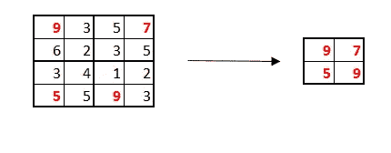
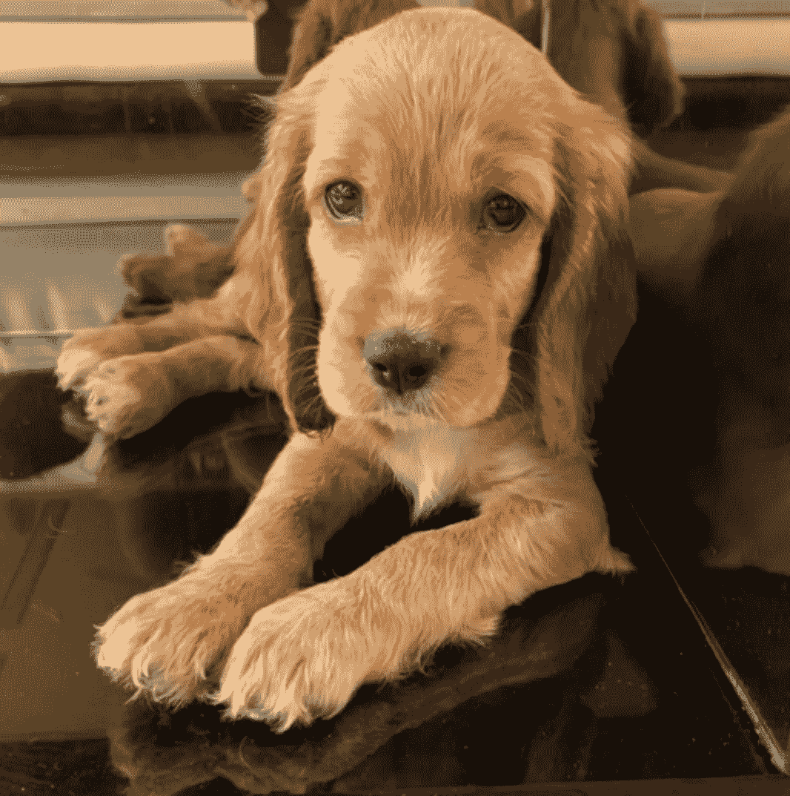
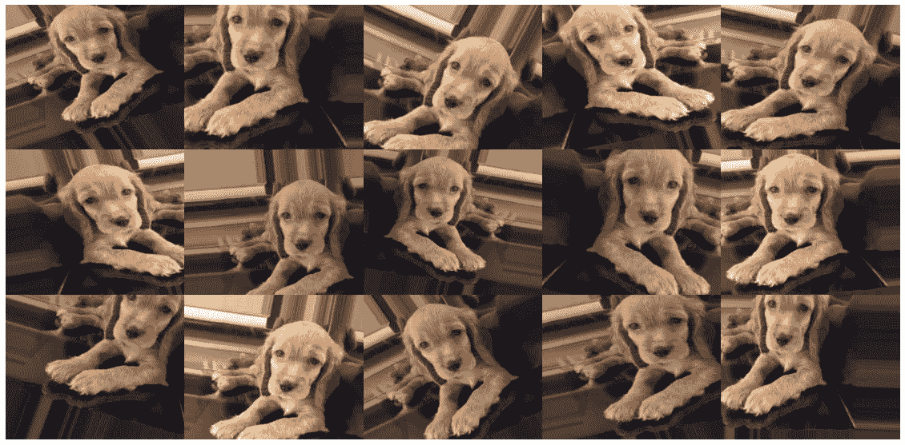
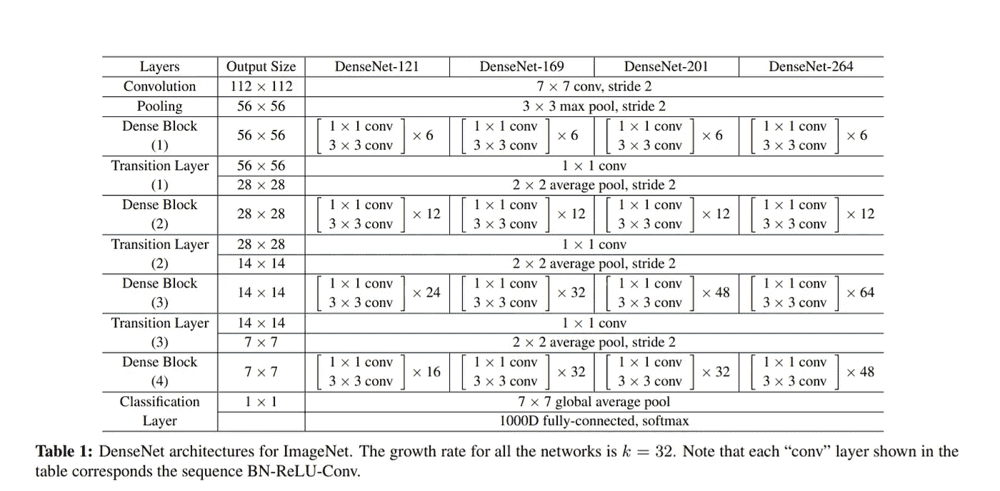
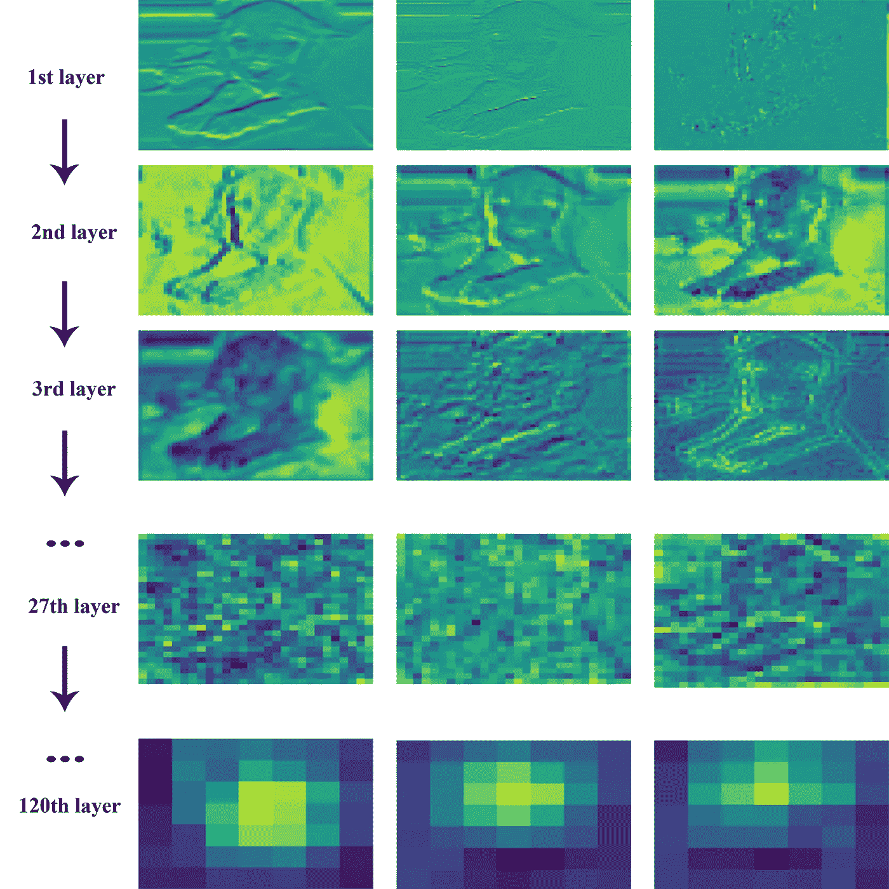
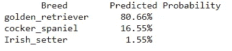

# 利用深度学习识别狗的品种

> 原文：<https://towardsdatascience.com/computer-vision-part-2-8e07029955ee?source=collection_archive---------50----------------------->

继续我们关于计算机视觉的讨论(关于该领域的详细介绍，请参见[这篇](https://aditya-mehta.medium.com/computer-vision-part-1-774113a2bec5)文章)我们将建立一个深度学习模型，根据狗的图像将狗分类到 120 个品种中的一个。为此，我们将使用谷歌的[tensor flow](https://www.tensorflow.org/)Python 平台。

# 卷积神经网络:蓝图

在我们建立实际的模型之前，有必要讨论一下卷积神经网络的构建模块。每个模型都是由几个堆叠在一起的“层”组成的，每一层都有特定的功能。我将在下面简要讨论最重要的层的直觉，但是有许多资源提供了关于这些层如何工作以及如何针对特定任务对它们进行微调的更详细的文档(我将从来自 [Keras](https://keras.io/api/layers/) 的官方文档开始)。

*   **卷积层** 卷积层用于从图像中提取特征，正如本系列第 1 部分所讨论的。我们通过指定要从图像中提取多少特征以及要使用的卷积矩阵的大小来设置卷积层。我们不需要告诉模型提取哪些特征:例如，我们不需要告诉它检测边缘和轮廓——模型“学习”这一点，因为它被给予数据进行训练。
*   **汇集层**
    汇集层用于通过“汇总”图像特定片段中包含的信息来减少数据的维度。这方面的一个例子是，通过用最大值表示每个线段(我们也可以选择平均值而不是最大值)，将 4*4 的网格缩减为 2*2 的网格。池化有两个目的，一是减少维度，二是使模型对要素的确切位置不太敏感，这是我们所希望的，因为我们希望模型能够识别出一个要素，即使它稍微偏于其参考位置的左侧或右侧。

最大池:*作者图片*

*   **密集层** 密集层由固定数量的“神经元”或细胞组成，它们从卷积层(在 CNN 的情况下)获取一维输入，并对其进行处理以供进一步使用——这些层的输出要么被前馈到其他密集层，要么用于预测最终输出。例如，如果我们有一个从图像中提取 64 个特征的卷积层，我们希望使用这些特征来达到我们的预测。我们可以将此信息传递给密集层，例如 16 个节点。密集层中的每个节点都完全连接到卷积层，即它从所有 64 个特征中收集信息。然后，每个节点将一组不同的权重应用于来自每个特征的输入，并得出一个“分数”，该分数随后被提供给其他密集层或用于预测结果。
*   **展平和删除层** 卷积层返回 2D 输出(因为图像被处理为 2D 网格)，但我们的密集层只接受 1D 输入。为了允许这些层进行通信，我们需要将这些信息从 2D“扁平化”到 1D。我们可以通过使用“全局池”来做到这一点，即通过用单个概要图来表示整个图像，或者通过使用“展平”层。
    删除层用于防止模型过度拟合数据。例如，丢失率为 30%的层将告诉模型每次随机忽略前一层的 30%的节点。这意味着，当 30%的节点将被随机忽略时，模型必须很好地“概括”以给出准确的输出。

**过度拟合与欠拟合的快速说明** 理解过度拟合和欠拟合的最佳方式是使用类比。让我们想象一下，我们有三个学生正在准备考试。a 的准备包括记忆课程材料，B 花了时间去理解概念，而 C 根本懒得准备。“过拟合”模型就像一个——它“记忆”它所训练的数据集的特征。我们不希望模型过度拟合的原因是，当我们实际上想要对它没有见过的数据使用模型时，它将表现不佳(就像在要求应用他应该已经学习过的概念的考试中一样)。“欠适应”模型就像 C——它没有学习训练数据的特征，我们显然不希望这样。理想的模型就像 B——它从我们训练它的数据中学习，但能够概括这个数据集的特征，并仍然对新数据做出准确的预测。

通常，我们会在同一个模型中使用几个卷积层和密集层。一个简单的结构可能如下所示:

简单的模型结构

# 数据

我们将使用 10，000 多张属于 120 个品种的狗的图像数据集。数据集在[这里](https://www.kaggle.com/jessicali9530/stanford-dogs-dataset)可用。我们将把这个数据集的大部分交给模型来训练它，然后看看它能够在剩余的图像上预测品种的准确程度，这是它以前没有见过的。随机猜测正确品种的概率约为 1/120——让我们看看我们的模型表现如何。

# 数据扩充

对于大多数计算机视觉问题，增加数据集通常是个好主意。我们获取现有的图像，然后在一些设定的参数内随机变换它们。例如，我们可以将图像旋转多达 30 度，将图像的亮度增加和减少多达 20%，增加图像的缩放等。这做了两件事——它增加了我们必须处理的数据量，它有助于确保模型仍然可以识别(在这种情况下)狗的品种，即使图像略有移动。这有明显的优势，因为我们遇到的每一张新图像都不会有完全相同的缩放、亮度等。

为了说明这一点，让我们见见黑兹尔。她是一只可卡犬，不属于用于训练或测试模型的数据集。

原图:*作者*

现在，让我们“放大”这张图片，创建 15 张图片，每张图片都略有不同。输出如下所示:

增强图像:*作者*

# 模型

现在考虑到问题的复杂性(我们必须区分 120 个品种，其中许多看起来很像)，像前面描述的简单模型不太可能胜任这项任务。我们可能想要一个更深的模型，有更多的层次。选择正确的模型结构的过程必然涉及大量的试验和错误。幸运的是，有一些“预训练”模型可供使用，这些模型已经被训练(当然是在不同的数据集上)来分类多达 1000 个类别。我们可以使用这些模型，重新训练数据集上的所有或部分图层，并观察其表现如何。这就是所谓的“迁移学习”。

在这里，我使用了 DenseNet 121 模型(它有 121 层和超过 800 万个参数！).我用一个有 120 个节点的密集层替换了最后一个有 1000 个节点的密集层(因为原始模型是在一个有 1000 个类的数据集上训练的，而我们只有 120 个品种)，并且只重新训练了模型的最后 11 层。

模型架构在他们的[论文](https://arxiv.org/abs/1608.06993)中有详细描述，摘录如下:

DenseNet 架构:摘自上述 DenseNet 论文

作为 Keras 库的一部分，所有可用的预训练模型的详细信息可在[此处](https://keras.io/api/applications/)找到。

# 寻找“引擎盖下”

由于其复杂性，神经网络通常是一个“黑箱”。因此，在展示代码和模型性能之前，尝试并可视化模型在最终预测的不同步骤中“看到”的内容是一个好主意。

最终的模型有 120 个卷积层(每个卷积层从图像中提取几个特征)和一个密集层。虽然看到每个图像经历的所有卷积的结果是不实际的，但我使用 Hazel 的图像作为例子，并在下面展示了最终(训练)模型的不同层生成的 3 个“卷积”图像。这将允许我们看到模型所看到的内容(即使它只是模型用来进行预测的全部信息的一小部分)。

看 CNN 的“引擎盖下”:*作者图片*

正如我们所看到的，在前几层提取的特征对我们来说可能仍然是可识别的，但当模型到达第 27 层(120 层)卷积层时，最终的图像基本上是人眼无法识别的。(重要的是要明白，我们没有告诉 CNN 要寻找什么样的特征，这是它自己学会的。)
最后一行显示了最终的一组图像(注意，这是一个 7*7 的像素网格，每个像素用不同的颜色来表征)，然后将这些图像“展平”，并传递到密集层上进行预测。这意味着该模型达到了它的预测，即图像显示的 120 种狗中的哪一种是基于一堆 7*7 的图像，我们甚至不能再将这些图像与原始图像联系起来。虽然这对我们来说看起来像是胡言乱语，但 CNN 经过仔细校准，可以识别这些“点”中复杂的模式，帮助它做出预测。

# 模型性能

该模型在测试数据集中的准确率约为 75%(请记住，这些图像不是该模型训练的图像)。虽然可以通过调整一些参数和重新训练原始 DenseNet 模型的更多层来提高性能，但考虑到随机猜测正确品种的概率小于 1%，并且许多狗品种看起来彼此非常相似，这已经是很好的了。

至于预测黑兹尔属于哪个品种，这个模型是这么说的:

# 密码