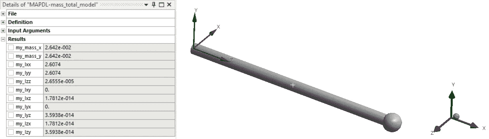

# 计算 Ansys 动力学模型的质量特性

> 原文：<https://towardsdatascience.com/computing-mass-properties-of-ansys-dynamic-models-f0d8dacb2d7c?source=collection_archive---------19----------------------->

## 使用 MAPDL 命令计算任意坐标系质量特性的方法


群众要紧！(鸣谢: [xibarodays](https://pixabay.com/photos/number-vintage-scale-toledo-green-1943293/) 上 Pixaby)

[Ansys](https://www.ansys.com/) 是一个商用有限元分析(FEA)软件包。虽然 Ansys 已经获得并集成了许多不同的分析工具，但是它的隐式结构包是健壮的并且得到了很好的支持。Ansys 的隐式结构求解器的一个独特功能是能够使用简单的逗号分隔的 MAPDL 命令编写命令。无论是使用 Ansys 经典接口还是通过 Workbench 接口使用现代 Ansys Mechanical，MAPDL 对于预处理模型和/或后处理结果都非常有用。本文介绍了一些 MAPDL 命令，用于提取关于用户定义坐标系的模型整体或部分的质量属性。

执行动态有限元分析时，验证质量是一个重要步骤。毕竟这是等式的一半！对于三维实体模型，质量是非常微不足道的。但是，在动态模型中，元件通常表示为壳、梁和/或弹簧。此外，动态模型通常包含非结构质量，如`SURF154`表面元素和点质量元素。验证质量可能变得不简单。

在切换到 Ansys Mechanical 之前的黑暗时代，我会严重依赖 MAPDL 文本文件来定义所有的材料属性和元素类型数据。我会尝试对这些属性进行分组或者控制它们的编号(通常在电子表格中)，这样我就可以根据我的意图检查 solve.out 文件中的元素类型批量输出列表。如果动态表示与组件质量(通常从 CAD 获得)不匹配，我会将“质量系数”应用于密度，然后冲洗并重复，直到单个元素类型质量和总质量与预期值匹配。虽然这种方法有效，但有点麻烦，而且没有给我我有时想要的良好控制。

我现在几乎只使用 Ansys 机械应用程序进行预处理。在 Mechanical 中，你可以点击单个物体，从属性窗口中获得质量(无需求解！)或使用选择工具获取多个选定实体的体量，非结构体量的存在会带来一些挑战。使用 Ansys Mechanical，我们放弃了属性编号控制，以换取一系列易于使用的功能。您可以使用选择工具获得一些有限的信息，但同样，我们错过了非结构质量和惯性质量属性。

这些年来，我从谢尔登·今冈的/合作解决方案、nsys.net 以及 PADT 主办的 xansys 论坛(看起来并不活跃)中得到一些提示。因此，站在巨人的肩膀上，我创建了一个锅炉板 MAPDL 脚本，它使用组件对模型的各个部分进行分组，并写出一个 csv 摘要文件，然后我可以将它复制/粘贴到电子表格中进行额外的验证。它提供的主要优势是:

*   使用组件对模型的任意部分进行分组
*   获取任意坐标系的部分模型质量属性(包括转动惯量)
*   专门用于质量属性摘要的格式化输出文件

[这里有一个 github 存储库](https://github.com/shkiefer/MAPDL-Medium/tree/master/Mass)，它包含了几个版本的 MAPDL 脚本文件和一个包含它们的示例工作台项目档案。让我们来看看重要的部分！

# 关于用户定义坐标系的模型的质量属性

虽然我们可以将模型转换到感兴趣的坐标系，运行分析，并从`solve.out`文件中读取属性，但这并不总是理想的。注意:我们不能使用`CSYS`或`RSYS`命令来强制 Ansys 分析不同坐标系的质量。

[这里有一个脚本](https://github.com/shkiefer/MAPDL-Medium/blob/master/Mass/MAPDL-mass_total_model.txt)，它计算关于用户定义的坐标系的整个模型的质量属性。我们走一遍吧！

在上面的部分中，我们确保用`ALLSEL`选择了一切，然后将我们的坐标系 id 分配给`cs_mass`参数。`my_cs`如果使用手动编号控制(或 Ansys Classic ),可以是一个整数，也可以是坐标系属性卡上定义的“APDL 名称”。我们`*GET`坐标系的位置和欧拉角。注意变量替换语法(`%var_name%`)的使用将在执行时用变量值填充字符串或命令的该部分。这在这里并不重要，但以后会有帮助。

在下一节中，我们进入`/sol`模块并运行魔法命令(`IRLF`、& `PSOLVE`)，这些命令形成元素矩阵，因此我们可以获得质量属性，但不会运行模型的完整解。同样，这对于整个模型的质量属性来说并不完全必要，但是我们稍后会用到它。

现在我们开始一些计算！在上面的部分中，我们将惯性属性从重心(CG)转换到坐标系的位置。然后，我们创建一个 APDL 2D 数组，并将其填充为惯性张量。

在这里，我们建立转换矩阵，并将其分配给一个 APDL 2D 数组。

现在来看一些有趣的东西。为了将一些线性代数命令用于矩阵乘法，我们需要将 APDL 数组移到“APDL 数学”空间。我们用`*DMAT`命令来做这件事。在“APDL 数学”中，我们用适当的转置执行矩阵乘法，最后用`*EXPORT`命令将结果从 APDL 数学空间复制回 APDL。接下来，我们将质量属性分配给以`my_`开头的变量，这是默认前缀，Mechanical 会查找该前缀以将参数值打印到命令片段属性卡。



关于从全局 CS 旋转的 CS 计算质量属性

# 关于唯一坐标系的多个分量的质量性质

虽然获得整个模型在任意坐标系下的质量属性很好，但这并不是特别有用。这里，我们将扩展上面的命令，向一些数组添加组件，定义一个`*DO`循环，并使用`*VWRITE`命令将格式化的输出写入一个文本文件。[这是基于组件的质量属性的完整文件](https://github.com/shkiefer/MAPDL-Medium/blob/master/Mass/MAPDL-mass_by_component.txt)，我将在下面一一介绍。

首先，我们开始将模型分成我们想要计算质量属性的*部分*。如果使用 Ansys Mechanical 应用程序*，命名选择*将作为具有相同名称*的*组件*发送到解算器。*一个警告是，Mechanical 允许命名选择的名称中有空格，但解算器不允许。最好在 N 个命名选择的名称中避免空格。组件可以包含节点或元素，但不能同时包含两者。对于质量属性，我们希望使用基于元素的组件。通常，当选择模型的任何部分作为质量属性时，我们还希望这些实体上有非结构质量。Ansys 使用与底层结构元素共享相同节点的`SURF154`元素添加分布式非结构质量，但不添加任何刚度。我认为这比将非结构性体量与一处房产捆绑在一起要灵活得多。下面的代码片段确保 C *组件*中的元素节点上的任何`SURF154`元素都被添加到 C *组件*中。对于每个*命名的选择，它可以重复。*

```
cmsel,s,my_named_selection
nsle,s 
esln,1 
cm,my_named_selection,elem
```

以类似的方式，我们可以通过使用*远程点上的 P *ilot 节点 APDL 名称*属性，创建一个附加到*远程点*的*点质量*元素的组件。*下面我们创建一个组件，它包括单节点质量元素，通过选择连接到远程点的引导节点的所有元素，这些元素完全由该节点定义。

```
nsel,s,node,,my_rp_name
esln,1
cm,my_pm_component,elem
```

现在，我们已经根据需要创建并扩充了所有构件，以包括非结构体量元素，我们可以继续下一步。下面的命令设置我们将用于文件名的 f_name 参数，并初始化两个数组。一个数组用于组件名称字符串，另一个数组用于分配给坐标系 id 的变量字符串。这样，我可以保持大部分脚本的通用性，并在每次使用时修改这个数组。

接下来，我初始化输出文件。`%_wb_userfiles_dir(1)%`被替换为工作台项目目录中项目 *user_files* 文件夹的绝对路径，而`%f_name%` 被替换为上面我们分配给`f_name`参数的字符串。然后，我使用`*VWRITE`将标题写入文件。我初始化了一个临时输出数组`outVars`,并告诉 Ansys 使用一个新的文件名来将这个输出与结构分析输出分开。

接下来，我们进入组件循环，与总模型情况一样，我们从获取该组件坐标系的属性(位置和角度)开始。唯一的区别是使用了`%css(1,j)%`来获取参数值，该参数值是使用变量的名称和坐标系 ID 作为值来分配的。然后，我们只选择感兴趣的组件中的元素和相关的节点，并发出`IRLF` 和`PSOLVE`命令。这些命令的美妙之处在于，Ansys 不必执行完整的求解来获得每个组件的质量属性。

下一组命令与通过`*EXPORT` 命令将惯性张量从重心转换到坐标系的总模型情况完全相同，此时我们将旋转张量带回 APDL 2D 阵列。唯一的区别是我们在圈内。这里就不赘述了。

现在，我们不再将质量属性赋给以`my_`前缀开头的变量，而是将它们赋给`outVars`数组。然后我们退出循环并`*vwrite`我们的组件名称、坐标系变量名和每个组件的质量属性。然后用`*cfclos`关闭文件，返回默认文件名和后处理器。

以下是输出文件中的一个示例:

我通常把包含这些命令的命令片段放在机械模型树的*解*对象中，作为后处理步骤。一旦求解完成，您应该在项目目录的 *user_files* 文件夹中找到一个`my_mass.txt`文件。

就是这样！查看 [github 资源库](https://github.com/shkiefer/MAPDL-Medium/tree/master/Mass)中的命令片段、一个示例输出文件和一个非常简单的工作台归档文件(2020 版 R1 ),其中包含了使用这些命令片段的两个系统。我希望这对你在 Ansys 中的动态建模/大规模验证冒险有所帮助！

查看其他与 Ansys MAPDL 相关的文章:

[](https://medium.com/@steve.kiefer/ansys-mechanical-all-about-joints-173f1fa40e15) [## Ansys Mechanical:关于接头的一切

### 用 MAPDL 定义和后处理关节

medium.com](https://medium.com/@steve.kiefer/ansys-mechanical-all-about-joints-173f1fa40e15) [](https://medium.com/@steve.kiefer/energize-your-ansys-dynamic-mechanical-analyses-b94c58da9a30) [## 激活您的 Ansys 动态和机械分析

### 利用 MAPDL 命令在 Ansys Mechanical 中对模态有效质量和势能进行后处理

medium.com](https://medium.com/@steve.kiefer/energize-your-ansys-dynamic-mechanical-analyses-b94c58da9a30)