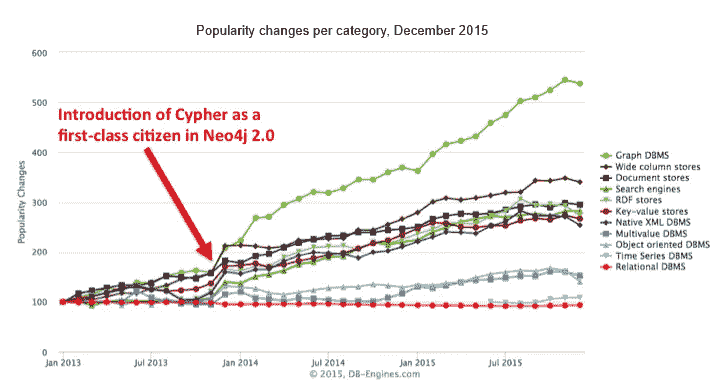
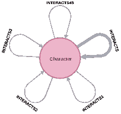
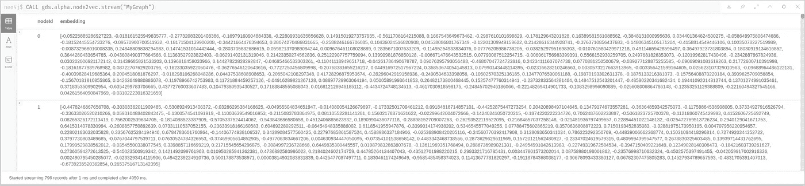
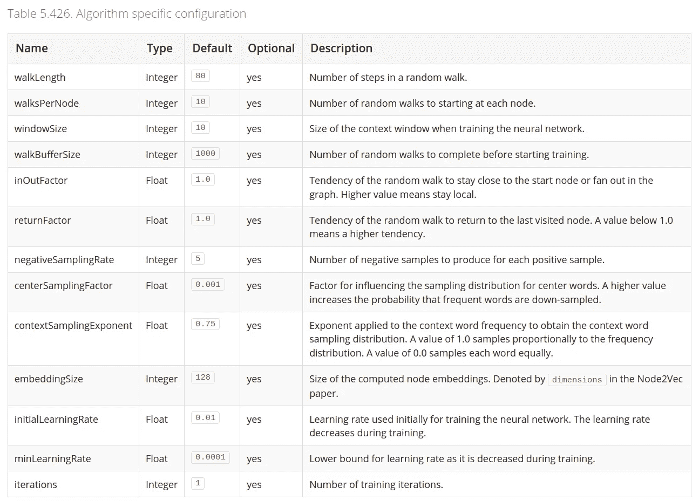
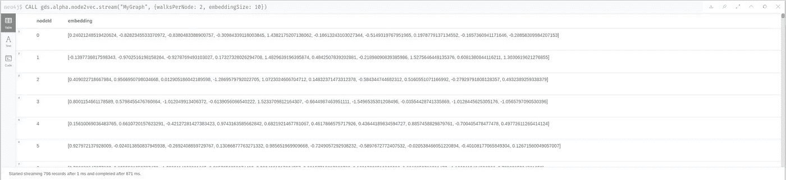
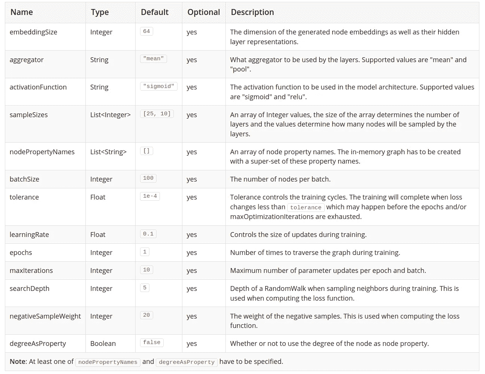

# 用图形数据库嵌入计算节点:Neo4j 及其图形数据科学库

> 原文：<https://towardsdatascience.com/computing-node-embedding-with-a-graph-database-neo4j-its-graph-data-science-library-d45db83e54b6?source=collection_archive---------24----------------------->

## *借助 pygds，使用新版 Neo4j 图形数据科学插件计算节点嵌入并将其提取到熊猫数据帧中。*


图片作者[格尔德·奥特曼](https://pixabay.com/fr/users/geralt-9301/)

现在的机器学习都是关于向量的。执行分类任务要求将数据排列成行(观测值)，每行包含相同数量的要素(列)。虽然这很容易从最初存储在 Excel 表或 SQL 或 noSQL 数据库中的数据中获得，但当问题涉及复杂对象(如文本、图像或图形)时，转换就远不明显。

为了将这些对象表示为向量，使用了嵌入技术。嵌入算法将一个给定“小”尺寸的向量分配给这些复杂对象中的每一个，否则这些复杂对象将需要数千个(至少)特征。嵌入的挑战是保留您试图建模的对象的一些特征，同时减少特征的数量。例如，单词嵌入将尝试并捕获单词*的含义，*使得语义上彼此接近的单词具有相似的向量表示。

# 图形嵌入

根据要表示的对象，图嵌入涵盖了几种技术。最常见的是节点嵌入，其中要表示为向量的实体是节点，但我们也可以找到边嵌入或整图嵌入。本文将重点讨论前一个问题，节点嵌入。

# 图形数据库和 Neo4j

图形数据库的主要目的是使关系更容易管理，无论我们谈论的是具有复杂的多对多关系的 web 应用程序，还是图形数据科学。对这种商店的兴趣几乎一直在增加，特别是自从 Cypher 查询语言被引入 Neo4j 之后。



来源:[https://db-engines.com/de/blog_post/53](https://db-engines.com/de/blog_post/53)

Cypher 让编写直观的查询变得如此容易。例如，我确信您将立即了解这个查询正在做什么:

```
MATCH (:User {name: "Emil"})-[:FOLLOWS]->(u:User)
WHERE NOT u.name STARTS WITH "neo"
RETURN u.name, u.dateJoined
```

上面的查询需要注意一些事情:

*   由括号`()`分隔的节点有一个标签，通过前导`:`可以识别
*   由方括号`[]`分隔的关系必须有一个类型。按照惯例，关系类型是大写的。

## 正在尝试 Neo4j

说服给 Neo4j 一试？你有两种方法可以做到:

*   使用沙箱在有限的时间内(3 天，可以延长 7 天)运行 Neo4j 实例:[https://sandbox.neo4j.com/](https://sandbox.neo4j.com/)
*   下载 Neo4j 桌面并在本地运行，享受所有功能:[https://neo4j.com/download/](https://neo4j.com/download/)

在这两种情况下，这是完全免费的。在这篇博客的后面，我将使用 Neo4j 4.1 创建一个新的图表。

## 导入一些数据

让我们将一些数据导入图表。为此，我们将使用`got`浏览器指南来使用“权力的游戏”数据集。类型:

```
:play got
```

在浏览器中，并按照说明进行操作。

导入数据后，图表模式如下所示:



“权力的游戏”图表模式。(调用 db.schema.visualization)

它包含一个节点标签，`Character`，五种关系类型(取决于哪本书中的人物彼此交互)和一个全局`INTERACTS`关系。在这篇文章的剩余部分，我们将只使用最后一个。如果您想要可视化某些数据，您可以使用:

```
MATCH (n)
RETURN n
LIMIT 200
```

让我们继续进行图形分析和节点嵌入。

# 图形数据科学插件(GDS)

GDS 是图形算法插件的继任者，其首次发布可追溯到 2018 年。它的目标是支持使用图形算法，从路径查找算法到图形神经网络，而不必从 Neo4j 中提取数据。

按照[https://neo4j . com/docs/graph-data-science/current/installation/# _ neo4j _ desktop](https://neo4j.com/docs/graph-data-science/current/installation/#_neo4j_desktop)中的步骤进行安装。

## 投影图

Neo4j 图通常包含大量数据:具有不同标签的节点、具有不同类型的关系以及附加到它们的属性。大多数时候，数据科学算法只需要这些实体中的一小部分:只有一些节点标签或一些关系类型，以及只有一个属性(例如，最短路径算法的关系权重)。这就是为什么 GDS 没有在完整的 Neo4j 图上运行，而是在一个**投影**(更轻)版本上运行。所以，让我们开始建立我们的投影图。在 Neo4j 浏览器中，执行:

```
CALL gds.graph.create(
    "MyGraph", 
    "Character", 
    "INTERACTS"
)
```

这里我们创建一个名为`MyGraph`的投影图，包含所有标签为`Character`的节点。此外，我们将类型`INTERACTS`添加到这个投影图关系中。

我们在这里，我们的投影图创建，我们可以继续下去，并在它上面执行算法。

## 执行节点 2vec

在`MyGraph`投影图上运行 node2vec 算法的最简单方法是使用这个简单的查询:

```
CALL gds.alpha.node2vec.stream("MyGraph")
```

浏览器中的结果如下图所示，其中一个编号列表被分配给每个节点(由其内部 Neo4j ID，`nodeId`标识):



带有默认参数的 node2vec 过程的输出。

如果您对 node2vec 的工作原理有所了解，您就会知道有许多配置参数可以用来配置:

*   **建立训练数据**(随机行走参数):步数、每个节点生成的行走数、输入输出和返回因子。
*   **训练 skip-gram 神经网络**:嵌入大小、初始学习速率等。

参数的完整列表如下所示，来自 GDS 文档页面。



来自 GDS 文档的 Node2vec 参数[https://neo4j . com/docs/graph-data-science/current/algorithms/node-embeddings/node 2 vec/](https://neo4j.com/docs/graph-data-science/current/algorithms/node-embeddings/node2vec/)

例如，让我们尝试减小嵌入大小:

```
CALL gds.alpha.node2vec.stream(“MyGraph”, {walksPerNode: 2, embeddingSize: 10})
```

不出所料，现在的输出如下所示:



在处理这些结果的用法之前，让我们看看如何使用另一个嵌入算法 GraphSAGE。

## 正在执行 GraphSAGE

虽然 Node2vec 只考虑图结构，但是 GraphSAGE 能够考虑节点属性(如果有的话)。

在我们的 GoT 图中，节点只有一个`name`属性，这个属性对于嵌入没有多大意义。然后，我们将只使用节点度，或附加到它的关系数，作为属性:

```
CALL gds.alpha.graphSage.stream("MyGraph", {degreeAsProperty: true})
```

完整的参数列表包括属性配置(`nodePropertyNames`)、聚合器功能(默认为`mean`)、批量……完整列表见下图。



来自 GDS 文档的 GraphSAGE 参数:[https://neo4j . com/docs/graph-data-science/current/algorithms/alpha/graph-sage/](https://neo4j.com/docs/graph-data-science/current/algorithms/alpha/graph-sage/)

# 通过 Python 利用结果

Neo4j 提供了一个 python 驱动，可以通过 pip 轻松安装。然而，在这篇文章中，我将谈论我开发的一个小工具，它允许毫不费力地从 Python 中调用 GDS 过程: [pygds](https://github.com/stellasia/pygds) 。它仍然需要大量的测试，所以如果您发现任何问题，请随时报告。

让我们从在您最喜欢的 python 环境中安装软件包开始:

```
pip install "pygds>=0.2.0"
```

然后，您可以导入库并定义连接到 Neo4j 图形的凭证:

```
from pygds import GDS

URI = "bolt://localhost:7687"
AUTH = ("neo4j", "<YOUR_PASSWORD>")
```

`pygds`的用法如下:

```
with GDS(URI, auth=AUTH) as gds:
    # create the projected graph
    # NB: make sure a graph with the same does not already exists
    # otherwise run CALL gds.graph.drop("MyGraph") 
    gds.graph.create(
        "MyGraph", 
        "Character", 
        "INTERACTS",
    ) # run any algorithm on it 
```

例如，要运行 node2vec 算法，我们将编写:

```
result = gds.alpha.node2vec.stream(
    "MyGraph", 
    {
        "walksPerNode": 2, 
        "embeddingSize": 10
    }
)
```

然后可以将结果解析成一个`DataFrame`:

```
import pandas as pd_tmp = pd.DataFrame.from_records(result)
df = pd.DataFrame(_tmp["embedding"].tolist())
print(df.head())
```

从那里开始，您可以执行任何机器学习算法，从可视化的 PCA 到分类，如果节点也有一些目标类…

> 最后一步，无论你使用的是 Cypher 还是 pygds，你都必须删除存储在你的计算机内存中的投影图:`gds.graph.drop("MyGraph")`

# 想了解更多？

太好了！GDS 包含更多奇妙的算法实现(路径查找、节点重要性、社区检测、节点相似性、链接预测)和功能(例如，将算法结果作为节点属性写入，以将结果持久存储在图中，而不是以流的形式存储)。

如果您有兴趣了解更多关于图算法和 Neo4j 的信息，可以查看以下几个在线资源:

*   免费书籍“图算法:Apache Spark 和 Neo4j 中的实际例子”，作者:[马克·李约瑟](https://medium.com/u/68584b0be0fb?source=post_page-----d45db83e54b6--------------------------------):[https://neo4j.com/graph-algorithms-book/](https://neo4j.com/graph-algorithms-book/)(注意:这本书是使用图算法库(GDS 的前身)编写的，但仍然是理解图算法用例的必读书籍(此处有迁移指南以及使用 GDS 更新的[示例)；警告 2:它可能不会无限期免费，Neo4j 会定期宣布其“免费期”的结束，到目前为止，免费期一直在延长，但谁知道呢)](/introducing-the-neo4j-graph-data-science-plugin-with-examples-from-the-graph-algorithms-19b831f66f2)
*   查看 [Neo4j](https://medium.com/u/26bec2028463?source=post_page-----d45db83e54b6--------------------------------) 创建的 GraphAcademy 及其数据科学课程:
    [https://Neo4j . com/graph academy/online-training/data-science/part-0/](https://neo4j.com/graphacademy/online-training/data-science/part-0/)
*   你可以关注 medium 上的[托马兹·布拉坦尼克](https://medium.com/u/57f13c0ea39a?source=post_page-----d45db83e54b6--------------------------------)和他的博客，看看 GDS 所有算法的许多有趣的用例:[https://tbgraph.wordpress.com/](https://tbgraph.wordpress.com/)
*   当然，阅读文件:[https://neo4j.com/docs/graph-data-science/current/](https://neo4j.com/docs/graph-data-science/current/)
*   关于这里讨论的算法的更多信息，例如参见 Kung-Hsiang，Huang (Steeve) 的【图神经网络(Basis、DeepWalk 和 GraphSage)的温和介绍】(T3):