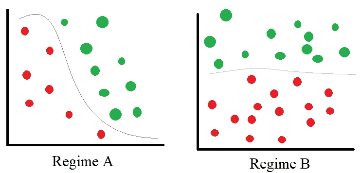
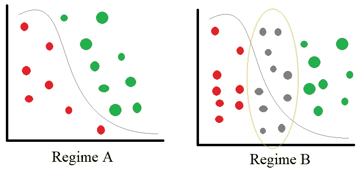

# 概念漂移如何破坏你的模型性能

> 原文：<https://towardsdatascience.com/concept-drift-can-ruin-your-model-performance-and-how-to-address-it-dff08f97e29b?source=collection_archive---------39----------------------->

## 概念漂移特征的理论回顾和实用技巧，确保您的模型随着时间的推移而适应

在 [Unsplash](https://unsplash.com?utm_source=medium&utm_medium=referral) 上由 [Manja Vitolic](https://unsplash.com/@madhatterzone?utm_source=medium&utm_medium=referral) 拍摄的照片

T 今年是 2019 年，你部署了一个预测卫生纸(或其他任何东西，真的)需求的机器学习模型。2020 年，新冠肺炎出现，消费者去商店抢购空前数量的卫生纸。实际的销售数字并不是异常值，因为由于人们更经常呆在家里，消费者的行为已经发生了变化。因此，你的卫生纸需求模型不再符合新的、COVID 时代的消费者需求。

机器学习系统如何解释这种损害模型性能的变化？

> 世界本质上是动态和不稳定的——也就是说，不断变化。

随着时间的推移，许多机器学习模型的性能下降是不可避免的。这与人类行为相关的模型尤其相关。如果没有明确的训练示例，当代机器学习模型不能很好地推广到新环境。随着数据和“基本事实”的变化，模型性能可能会开始下降。这些是机器学习系统中必须考虑的关键弱点。但是，这种导致模型低质量响应的变化的特征是什么？您如何监控和维护您的模型，以便下游用户总是看到高质量的输出？

> 预测来自动态现实环境的数据变化将如何影响您的模型以及如何处理这些变化是至关重要的。

本文将首先为理解概念漂移如何出现和表现提供理论基础，然后讨论解决漂移的方法。了解数据和模型如何漂移对于设计模型监视器和响应计划至关重要。

 [## 模型监控背后的直觉

### 让你的机器学习系统能够适应世界的变化

towardsdatascience.com](/the-intuition-behind-model-monitoring-bd8b5d8e540b) 

# 什么是概念漂移？

下图提供了一个“概念”的简单说明。根据某个未知过程 *G.* 二维数据点被映射为红色或绿色,“概念”是数据点到颜色的真实映射*G→*{绿色，红色}。浅灰色线显示了已学习的映射 *F* ，它区分了接近 *G.* 的红色和绿色数据点

一个概念——红色和绿色数据点的区别。灰线代表学习到的区分红色和绿色的概念。

简而言之，**概念*漂移*** 发生在 *G* 发生变化的时候，这是生成你观察到的数据的基础函数。当然，我们无法直接观察到 *G* 。相反，我们通过从由 *G.* 生成的数据中采样来间接观察 *G* 。该定义假设我们随着时间的推移接收到描述我们想要建模的某些现象的数据点，例如卫生纸消耗。

在卫生纸需求的情况下，基础数据生成函数是消费(和囤积)的卫生纸数量。当然，无法直接观察到实际的冲水( *G)* 和卫生纸的囤积。相反，我们只能通过观察通过各种供应渠道购买的数量，从实际消费中“取样”。然后，我们使用观察到的购买数据来训练卫生纸消费的模型， *F，*。新冠肺炎引发了卫生纸消费和购买模式的变化——也就是 G*G*的漂移。

# 概念漂移是什么样子的？

漂移可以表现为虚拟漂移(对模型性能没有直接影响)或真实漂移(对模型性能有影响)。请注意，区别是*相对于模型。*

## **真实概念漂移**

**真实概念漂移**是生成数据的机制发生变化，从而导致模型性能下降。如下图所示，概念(红色和绿色数据点之间的区别)已经旋转并改变了形状。在方案 A 期间学习该概念的模型现在在方案 B 下已经过时，并且将具有较差的性能。在真实概念漂移之后缺少对模型的更新，模型将不再正确地描述完整的目标概念空间。

真实概念从状态 A 漂移到状态 b。在状态 A 期间学习的函数对在状态 b 中观察到的一些数据点进行了错误分类。

卫生纸方面，COVID 前消费模式为“A 区制”，COVID 后消费模式为“B 区制”。一个在疫情之前熟练预测 2019 年 TP 需求的模型将在 2020 年疫情期间表现不佳。反之亦然，在 COVID 导致的经济封锁(人们很少离开家)期间，一个已经更新的预测 TP 需求的模型可能会在人们经常离开家的历史数据上表现不佳。

## **虚拟概念漂移**

*G* 中的概念漂移不一定影响你的模型 *F.* 在**虚拟概念漂移**中，观测数据的分布发生了变化，但之前学习的映射 *F* 仍然正确地应用于新的数据生成过程*G’*。下图显示了从状态 A 到状态 b 的虚拟漂移。尽管每个状态中的数据分布不同，但模型 *F* 仍然根据浅灰色线正确分配数据点颜色。**因此，你的机器学习模型只有在真正的概念漂移下才会变得过时。**

虚拟概念从状态 A 漂移到状态 b。根据状态 A 的数据训练的函数 F(划分红色和绿色点的灰线)在状态 b 中仍然有效。

在现实世界中，您的模型性能不会表明发生了虚拟漂移，因为您的模型仍然表现良好！事实上，即使您正在监视数据本身的分布，您也可能需要“大量”的观察来确定虚拟漂移的存在。(如果数据有多个维度，直接监控数据的分布通常是不切实际的)。

虚拟漂移是个问题吗？看情况。如果您的目标是确保您的模型继续满足给定的性能指标，那么您的模型在存在虚拟漂移的情况下是足够的。虚拟漂移带来了一个隐藏的风险，即模型可能会错误地对待新分布中的某些异常值。

潜在的虚拟漂移风险:B 区灰色数据点的正确分类是什么？模型(灰线)会继续对这些点做出准确的预测吗？

# **漂移严重程度**

漂移的严重程度变化很大。大多数概念漂移以**交叉漂移**的形式出现，其中部分输入空间在新旧概念中都有相同的目标类。在极端情况下，当所有的例子在新的目标概念下被错误分类时，就会发生严重的漂移。错误分类可能是由于目标概念中的新类和类定义中的变化造成的。

状态 A 和状态 B 之间出现交叉漂移，因为只有一些数据点分类发生了变化。在状态 A 和状态 C 之间发生了严重的漂移，其中所有数据点的所有分类都发生了变化。

如果您可以检测和测量漂移，您可以指定一个阈值来区分“主要”和“次要”漂移。二元分类任务的漂移量级可以用类别已改变的观测值的百分比来度量。如果漂移幅度小于阈值，模型只需用新数据更新。如果漂移幅度大于阈值，则漂移是“严重的”,应该放弃该模型，而采用新训练的模型。严重漂移通常很少见，如果不使用复杂的漂移检测，严重漂移的存在往往很明显。

# 漂移速度和稳定性

## 突然漂移

漂移持续时间短的概念漂移称为**突然漂移**。当数据生成函数突然停止生成概念为 *G* 的数据，并突然根据概念*G’*生成数据时，会发生突然漂移。突变漂移范式假设概念漂移发生在离散的时间周期内，以没有漂移的稳定周期为界。

作为一系列突然漂移的例子，医学杂志 [Lancet](https://www.thelancet.com/journals/lanpub/article/PIIS2468-2667(20)30089-X/fulltext) 报道称，在 2020 年 1 月 15 日至 3 月 3 日期间，中国七次改变了新冠肺炎的病例定义。定义的每一次变化都会导致病例统计方法的改变；因此，每一次变化都会导致中国每日 COVID 病例计数概念的突然转变。

## 增量漂移和稳定性

***增量漂移*** 寓意漂移持续时间长，也称**连续漂移**。在这种情况下，变化是从概念 *G* 到概念*G’的稳定进展。*概念漂移的**速度或持续时间**是一个新概念完全取代一个旧概念的时间步数。

在分类的情况下，在每个随后的时间步，根据旧概念 *G* 分类较少的数据点，根据新概念*G’*分类较多的数据点。你可以把 G 和 G '之间的每一个时间步长看作不同的中间概念。

增量漂移的一个例子是，随着新冠肺炎经济封锁在一个地区解除，消费者行为如何逐渐改变——人们可能会犹豫是否要恢复“正常”,只是慢慢恢复。行为中的每一个小变化都是 G(锁定期间的行为)和 G’(解除限制后的“正常”行为)之间的一个中间概念。值得注意的是，从 G(锁定)到 G’(“正常”)的行为进展是非线性的，因为人们会对像病例数变化这样的外部因素做出反应，从而特异性地改变他们的行为。

一个概念是**不稳定的**在概念 G 和 G’之间，概念之间的周期因为它会再次改变。这种不稳定性可以通过数据和模型度量中更大的噪声观察到。此外，一些概念本质上是不稳定和混乱的，永远不会达到一个稳定的概念，如市场价格运动。

下图显示了 100 个时间步长内的增量漂移。函数 v1(t)和 v2(t)分别模拟新旧概念中的一个例子在时间 t 出现的概率。漂移的*速度*是 v2(t)的斜率。

增量漂移的图示。(资料来源:[民酷、怀特、姚 2010](https://www.cs.bham.ac.uk/~xin/papers/MinkuWhiteYaoTKDE09.pdf) )

# 如何检测和解决漂移问题？

当然，如果没有检测和校正模型和数据漂移的解决方案，这个讨论将是不完整的。许多人将漂移检测的主题称为**模型监控**。

> 解决概念漂移的基本方法是监控您的模型以检测漂移，重新训练模型，并部署新的模型版本。

这种基本方法适用于你期望概念漂移从一个稳定的概念突然转移到一个新的稳定的概念的情况。如果对模型性能的变化有一定的容差，在小漂移和/或增量漂移的情况下，这也是可以接受的。对于不太稳定的状态或持续漂移的情况，用新的观测值对模型进行增量更新可能更合适。在在线模型更新的情况下，监控模型漂移仍然很重要。

监测概念漂移有三种基本方法。

## **监控模型性能**

原则上，监控模型性能是直接的:如果模型性能下降到某个预期水平之下，那么重新评估模型。要实现这一点，您需要做出几个决定，这些决定将影响漂移检测的灵敏度和频率。

1.在计算模型性能时，您使用了多少新的预测？

2.您评估哪些绩效指标，应用哪些阈值？

3.您多久监测一次漂移？

4.你的模型的用户有多容错？这将有助于你对(1)-(3)的回答。

5.你如何应对漂移？对你的模型进行人工评估和再培训？自动更新？

## **监控模型预测置信度的统计测量值**

另一种方法是监控模型预测或残差值的分布或这些值的置信度。与潜在的高维输入数据相比，监控模型产生的值的分布变化要容易得多。统计监视器的具体形式取决于要监视的预测的速度和数量。除了上一节中的问题之外，要做出的一些相关决策包括:

*   [Kolmogorov–Smirnov(KS)测试](https://en.wikipedia.org/wiki/Kolmogorov%E2%80%93Smirnov_test)是否表明您的预测或残差值的分布发生了变化？为了用 KS 检验准确地比较两个分布是否相同，需要一些最小数量的例子。
*   给定的预测/残差是否落在训练期间观察到的预测/残差分布的给定置信区间内？

有关学术文献中漂移检测的其他自适应测试统计，请参考参考文献部分的 Dries 和 Ruckert (2009 年)。

## 在线更新

一种选择是在线训练你的模型*——也就是说，定期用新的观察值自动更新你的模型权重。更新的周期可以是每天、每周或每次收到新数据时。如果您预期增量概念漂移或不稳定的概念，这个解决方案是理想的。*

*这种选择并不是万无一失的，因为尽管在线更新，仍然存在模型偏离真实目标的风险。发生这种情况的原因有很多。*

*   *一个离群值可能对在线训练中的模型产生过大的影响，使学习到的模型进一步远离目标概念。这种风险可以通过使用成批的观察数据而不是单个数据点进行在线更新来降低。*
*   *学习率可能太小，从而在存在大漂移的情况下阻止模型足够快地更新。*
*   *学习率也可能太大，导致模型超出目标概念并继续表现不佳。*

*由于这些原因，监视在线更新的模型仍然很重要。*

## *其他方法*

*在学术文献中已经提出了各种算法来检测概念漂移。漂移检测中的工作通常旨在高效、准确地识别概念漂移的真正点，同时最小化漂移检测时间。对这些提议的回顾超出了本文的范围。*

# *结论*

*理解和检测漂移是一项艰巨的任务。最终，选择检测和应对漂移的最佳方法通常需要对数据、模型和应用有深入的了解。漂移检测和模型再训练的理想频率是主观的，取决于您的数据和应用。最后，在任何解决方案中，重要的是要考虑模型性能指标的变化是否是由于样本偏差，或者感知的漂移是否是由于随机性或异常值，而不是数据分布或目标概念的变化。*

# *参考*

*巴赫斯蒂芬和马克.马洛夫。2010."概念漂移的贝叶斯方法."神经信息处理系统进展。127–135.*

*陈，凯莉，许允声，和帕特丽夏里德尔。2015."跟踪数据流中的漂移严重程度."《人工智能 2015:人工智能的进步:第 28 届澳大拉西亚联合会议》,澳大利亚堪培拉，ACT，2015 年 11 月 30 日-12 月 4 日，会议录，Bernhard Pfahringer 和 Jochen Renz 编辑，96–108。查姆:斯普林格国际出版公司。doi:10.1007/978–3–319–26350–2 _ 9*

*德里斯，安东和乌尔里希·拉克特。2009.“自适应概念漂移检测。”统计分析和数据挖掘(威利在线图书馆)2:311–327。*

*Gama、Joao、Indre Zliobaite、Albert Bifet、Mykola Pechenizkiy 和 Abdelhamid Bouchachia。2014."概念漂移适应综述."ACM 计算机。Surv。(美国计算机学会)46:44:1–44:37。doi:10.1145/2523813。*

*明库，莱安德罗 l，艾伦 p .怀特和姚欣。2010."存在概念漂移时多样性对在线集成学习的影响."IEEE Trans。据了解。和数据工程。(IEEE 教育活动部)22:730–742。doi:10.1109/TKDE*

*韦伯、杰弗里·I、罗伊·海德、曹洪、阮海龙和弗朗索瓦·珀蒂让。2016.“表征概念漂移。”数据挖掘和知识发现 30:964–994。doi:10.1007/s 10618–015–0448–4。*