# 15 分钟的概念和无痛介绍蒙特卡罗方法和应用贝叶斯推理

> 原文：<https://towardsdatascience.com/conceptual-background-for-painless-introduction-to-applied-bayesian-regression-using-pystan-c8f744e3823f?source=collection_archive---------15----------------------->

## 贝叶斯方法和推理

## 这篇文章应该作为我的教程[使用(Py)Stan](/painless-introduction-to-applied-bayesian-inference-using-py-stan-36b503a4cd80) 的应用贝叶斯推理的无痛介绍和使用 r-INLA 的(近似)贝叶斯回归的无痛介绍的背景。

在这篇文章中，我将对贝叶斯推理和蒙特卡罗方法提供一个非常简短、自成一体的介绍，希望能启发你更深入地研究我所包含的一些参考资料。

图片来自 [Pixabay](https://pixabay.com/?utm_source=link-attribution&amp;utm_medium=referral&amp;utm_campaign=image&amp;utm_content=602944) 的 [imarksm](https://pixabay.com/users/imarksm-701058/?utm_source=link-attribution&amp;utm_medium=referral&amp;utm_campaign=image&amp;utm_content=602944)

你可能听说过也可能没有听说过贝叶斯推理/回归/建模/分析...您可能只是偶然遇到它，从未真正想过它的用途，或者没有任何好的资源来开始。

事实上，贝叶斯推理[1]比它的频率主义对应物要复杂一些，大多数人都曾在学术界或非常专业的工业应用中真正使用过它。然而，它提供了一个非常丰富的框架来理解并最终在推理过程中利用更多的信息。此外，它以一种令人愉快的方式提升了概率和应用统计学之间的联系——一个真正的贝叶斯模型是一个生成模型。

对于这一系列文章，我将采用(传统的)基于可能性的建模方法。

# 贝叶斯推理 5 分钟

贝叶斯推理允许我们将一些先入为主的，即**先于**的信念纳入到我们的建模中。我们可以从后验概率分布中进行采样，从而在完成实验后很好地了解我们感兴趣的参数的行为，而不是找到使我们的可能性最大化的参数值(最大可能性估计)。

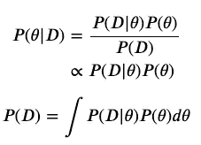

模型拟合和推理中的原始贝叶斯恒等式。

简单来说，我为我的模型参数( *𝜃* )声明一个先验分布，并将其乘以我的观察数据的可能性(d)。为了让这个量作为概率密度函数，我必须用一个归一化常数来除它。然后我得到我的后验分布函数。

请注意，上面的归一化常数 P(D )(通常表示为 C)是难以处理的，除了在您有**共轭**先验的情况下，我们通常依靠蒙特卡罗方法从这种推断的后验分布中取样。在用各种各样的基本模型这样做的时候，我们可以排除这个量 C 而不会失去我们的睡眠。

你可能会问:**为什么要这样做？**

更好的科学，更古板的推理，正则化，数值稳定性，昂贵的数据采集不允许极大似然估计，还有很多很多更多的原因。

你可能会问:**什么是好的前科？**

*   易处理性？共轭！例如，正态先验 x 正态似然产生一个正态后验，可以解析求解！
*   科学相关性
*   正规化。在标准线性回归的情况下，回归器/beta 服务器上的 N(0，1)先验可以用作 L2 正则化。

理想情况下，先验知识不需要查看数据。

你可能会问:**有什么样的前科？**

*   无信息的(扁平的)前科。在大多数情况下，原始的无信息先验将是均匀分布的，更具体地说，在下面掷硬币问题的上下文中。
*   信息不足的前科。我在下面的抛硬币问题中声明的β先验提供的信息很少，因为我没有丢弃θ参数空间中的区间或点，而我倾向于“公平”。
*   信息丰富的前科。这些通常基于专家意见或扎实的科学知识。

举个例子，假设我在地板上发现了一枚硬币，我想知道它是否公平。我宣布 *p=𝜃* 是在一次给定的投掷中，硬币将产生“正面”的概率(y=1)。那么 q=1- *𝜃* 就是硬币产生“反面”(y=0)的概率。注意，硬币的这种行为可以被建模为具有以下函数形式的伯努利随机变量:

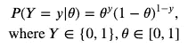

假设我掷硬币 4 次，观察到它总是给我“反面”如果我采用最大似然框架，那么我有以下 ML 估计(样本比例):

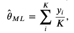

在我们的例子中，上述结果为 0。但这有点太极端了……两面表面积相等意味着硬币应该有非零的“正面”落地概率(尽管非常小)。如果一边比另一边小得不成比例，我们会立即注意到。

现在，作为 Bayesians 人，说我们遇到了同样的硬币。在我们自己扔硬币之前，我们会形成一个关于硬币的先验信念。根据我的经验，硬币通常是公平的，所以我认为这枚硬币很可能是公平的，也有可能是不公平的。然后，我会进行我的实验，并获得一种感觉，这个硬币是否坚持我的信念。哦，我得到相同的结果{0，0，0，0}。

对于有效的(弱信息)先验，我将使用 beta(a，b)分布，其中 a，b 为非负整数。这个先验是有意义的，因为贝塔分布的支持度是[0，1]，这里的 *𝜃* 对应一个概率**不能小于 0 或者大于 1。设置 a=b=u，其中 u 是正整数，产生在 0.5 附近对称的分布。此外，贝塔分布与伯努利分布共轭(也与二项式分布共轭，因为二项式随机变量由伯努利随机变量的和组成)。**

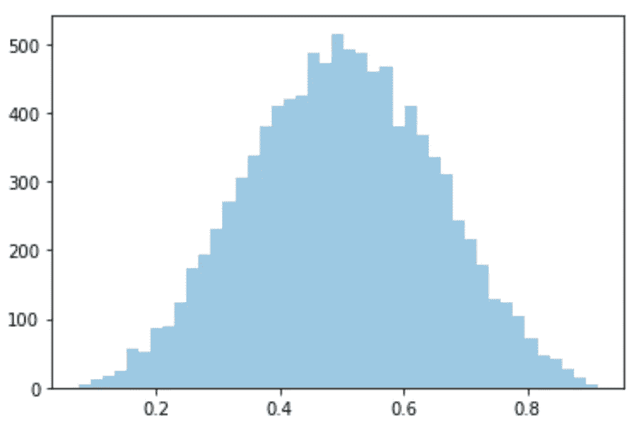

贝塔(5，5)分布的模拟

然后我考虑以下模型:

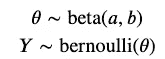

这导致了:

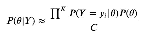

此处 C ≥0 表示归一化常数，对于本应用而言，不需要估计该常数。

如果我们在上面的先验中设置 a=b=5，**stan**[2]——如何操作参见教程——得出 *𝜃* 的近似后验均值**0.36**<5。因此，我们的估计表明一个有偏见的硬币，没有立即去 0。

# 蒙特卡罗方法 5 分钟

出于本教程的目的，蒙特卡罗方法[3]将允许我们从模型参数的后验分布中取样。

估计一个实值可积函数 f(x)的积分(I)的最简单的蒙特卡罗方法(假设在 0 ≤x≤1 上)表明，我们在[0，1]上对 x 的 K>0 个独立样本进行采样，对这些 x_{i}中的每一个估计 f(x})，然后对它们求和并求平均。我们来要求 I

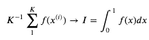

As K goes to infinity, this vanilla Monte Carlo estimate should converge to the value of the integral.

The above is nice and easy, but we can actually use even more knowledge of statistics by observing the below:

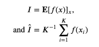

We can think of the integral I as the expected value of f(x) and the below quantity as its unbiased estimator

Our estimator is just an approximation, so it would behoove us to quantify its accuracy:

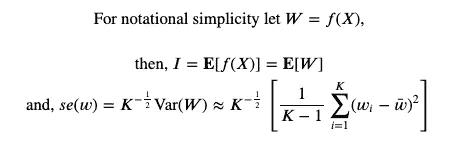

Here we simply change the notation a bit and show the formula for the standard error

So, what can we do now that we have an unbiased estimate for the mean and an estimate of the standard error? Let’s invoke the **中心极限定理**，对于 K 足够大是合理的。

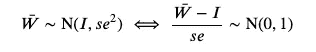

使用上述方法，我们可以为积分的估计量建立 95%的置信区间:

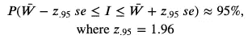

上面的方法非常幼稚和不准确，特别是当目标(概率)在维度、多模态等方面增长时。然而，这给了你 MC 方法的要点:

> *从一个分布中抽取样本，以逼近另一个分布或感兴趣的数量。*

请注意，蒙特卡罗方法是一个非常活跃的研究领域，具有非常丰富的理论和应用，我鼓励你阅读更多关于它们的内容。蒙特卡洛计算引擎上也有几个包装器(PyMC3、Stan、BUGS 等)，可以很容易地集成到 Python、R 和其他现代统计/机器学习软件中。

下面是一些非常基本的方法让你开始:

*   重要性抽样
*   拒绝抽样
*   Metropolis-Hastings 算法(马尔可夫链蒙特卡罗)
*   奖励:模拟退火(优化)

# 乳胶和数学交流

最后一件事。如果你真的想发展简洁而精确地交流数学/统计思想的能力，那么我鼓励你开始尝试使用 **LaTeX** [5]。LaTeX 是一个强大的排版系统，可以让你写出漂亮的公式，并无缝地呈现在你的文档中。我在本文档和我的所有作品中的所有数学表达式中都使用 LaTeX。

# 结论

随着更好的计算硬件和软件的出现，贝叶斯推理和计算最近经历了一次辉煌的复兴。此外，贝叶斯方法跨越了大量活跃的研究领域，包括统计学、数学、计算机科学、人口学、经济学和许多其他领域。

以下是现代 ML 和统计研究中的一些最热门的主题，它们依赖或大量使用贝叶斯框架进行推理:

*   因果推理
*   可解释性(DL 和 RL)
*   贝叶斯超参数优化(AlphaGo)
*   多任务学习
*   RL 中的探索与开发
*   高效、计算稳定的 MCMC (HMC)

# **参考文献**

[1] R. Neal， [**贝叶斯推理教程，供 ML**](https://www.cs.toronto.edu/~radford/ftp/bayes-tut.pdf) (2004)，NeurIPS，2004 .

[2] B. Carpenter 等， [**Stan:一种概率编程语言**](https://www.jstatsoft.org/article/view/v076i01) (2017)，统计软件杂志。

[3] C .罗伯特和 g .卡塞拉， [**蒙特卡洛统计方法**](https://www.amazon.ca/Monte-Statistical-Methods-Christian-Robert/dp/0387212396/ref=sr_1_1?ie=UTF8&s=books&qid=1226423218&sr=1-1) (2005)，施普林格文本《统计学》。

[4] D .瓦克利等人， [**数理统计与应用**](https://www.cengage.com/c/mathematical-statistics-with-applications-7e-wackerly/9780495110811/) (2014)，森盖奇学习

[5]LaTeX 3 项目， [**LaTeX — A 文件编制系统**](https://www.latex-project.org/) (1985)，LaTeX 项目公共许可证[(https://www.latex-project.org/lppl/](https://www.latex-project.org/lppl/))