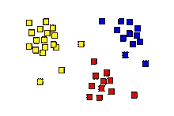
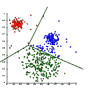
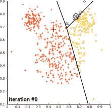
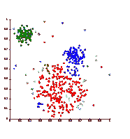
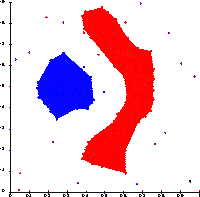
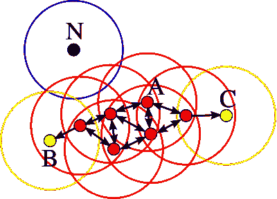
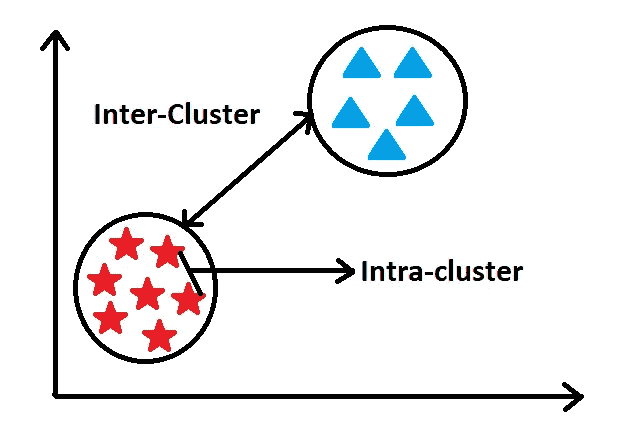
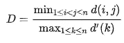
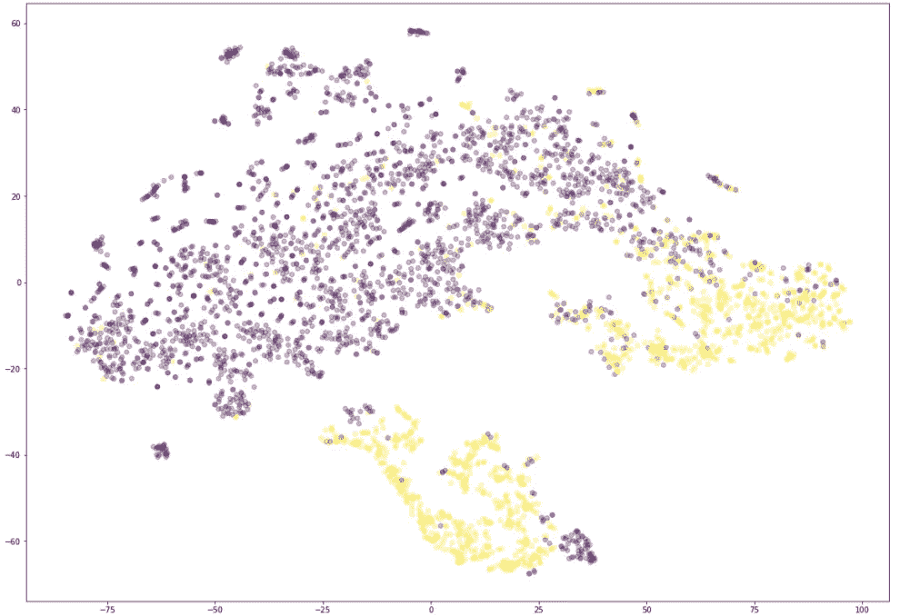

# 聚类无监督学习简明指南！

> 原文：<https://towardsdatascience.com/concise-guide-to-unsupervised-learning-with-clustering-4924cdbb27cb?source=collection_archive---------40----------------------->

## 借助聚类算法详细理解无监督学习的概念。


威廉·艾文在 [Unsplash](https://unsplash.com?utm_source=medium&utm_medium=referral) 上的照片

机器学习任务通常有一些数据集，其中我们有一些参数，对于那些结果参数，我们有它们各自的输出。从这些数据集中，我们建立的机器学习模型可以预测类似数据的结果。这个过程就是在**监督学习中发生的。**

监督学习的一个例子是用于确定患者是否出现肿瘤。我们有一个大型数据集，其中有一组与他们各自的结果相匹配的患者参数。我们可以假设这是一个简单的分类任务，1 代表肿瘤，0 代表无肿瘤。


照片由 [Tran Mau Tri Tam](https://unsplash.com/@tranmautritam?utm_source=medium&utm_medium=referral) 在 [Unsplash](https://unsplash.com?utm_source=medium&utm_medium=referral) 上拍摄

然而，假设我们有一个关于狗和猫的数据集。没有预先训练好的结果让我们来判断他们中的哪一个是猫还是狗。这种具有未标记数据集的问题可以在**无监督学习**的帮助下解决。用技术术语来说，我们可以将**无监督学习**定义为一种机器学习，在没有预先存在的标签和最少人工监督的情况下，在数据集中寻找以前未检测到的模式。**聚类**和**关联**是两种最重要的无监督学习算法。今天，我们将只关注**集群**。

# 聚类:



来源:维基百科

使用某些数据模式，机器学习算法能够找到相似之处，并将这些数据分组。换句话说，**聚类分析**或**聚类**是对一组对象进行分组的任务，使得同一组中的对象(称为**聚类**)彼此比其他组(聚类)中的对象更相似(在某种意义上)。

在聚类中，我们没有任何预测或标记数据。我们得到了一组输入数据点，使用这些数据点，我们需要找到最相似的匹配，并将它们分组到聚类中。聚类算法有广泛的应用，我们将在以后的章节中讨论。

让我们分析各种可用的聚类算法。我们将讨论三个最流行和最受欢迎的算法技术。我们还将了解用于无监督学习的性能指标，并最终讨论它们在现实世界中的应用。

# 聚类算法:

有许多聚类算法，但今天我们将主要关注三种最流行和最重要的聚类算法。这些聚类算法是—

1.  基于质心的聚类(K 均值聚类)
2.  基于连通性的聚类(层次聚类)
3.  基于密度的聚类(DBSCAN)

我们将详细分析每一种算法，并理解它们到底是如何工作的。我们也将看看这些算法的优点和局限性。所以，事不宜迟，让我们开始吧！

## 1.k 均值聚类:



来源:维基百科

K-means 聚类算法是执行聚类分析的最流行的方法之一。在 K 均值聚类中，用于评估的超参数是“K”

**‘K’**=聚类数。

聚类的数量将决定将要执行的聚类分类的类型。在上图中，我们可以假设选择的 K 值为 3。K 值将决定分离和分组过程中考虑的中心数量。

超参数 K 的“正确”值可以用网格搜索或随机搜索等方法来确定。因此，我们可以说，K-means 的主要目标是找到最佳质心，并相应地以适合特定数据集的方式对聚类进行分组。

K 均值聚类要遵循的步骤—

```
1\. Initialization: Randomly picking the n points from the dataset and initialize them. Choose the K value as well.
2\. Assignment: For each selected point find the nearest centroid values. 
3\. Update: Re-compute the centroid values and update them accordingly. 
4\. Repetition: Repeat the step 2 and step 3 until you reach convergence. 
5\. Termination: Upon reaching convergence terminate the program. 
```



上图展示了 K-means 的收敛过程。

**优势:**

1.  实现和执行相对简单。
2.  有效且高效地处理大型数据集。
3.  保证在某一点上收敛。

**局限性:**

1.  选择最佳超参数“k”可能很困难。
2.  计算高维数据的问题。
3.  在存在异常值或噪声的情况下，更容易出错。

## 2.分层聚类:



来源:维基百科

基于连通性的聚类，也称为层次聚类，其核心思想是对象与附近的对象比与更远的对象更相关。

层次聚类的概念基本上是将相似的事物从较大的块分组到较小的块，反之亦然。当我们看下面两种类型的层次聚类方法时，可以更好地理解这一点:

*   凝聚聚类—这是一种“自下而上”的方法:每个观察从自己的聚类开始，随着一个观察在层次结构中向上移动，聚类对被合并。
*   分裂聚类——这是一种“自上而下”的方法:所有的观察都从一个聚类开始，随着一个聚类向下移动，分裂被递归地执行。

凝聚聚类通常优于分裂聚类。因此，我们将进一步研究凝聚性集群而不是分裂性集群的分析。


来源:维基百科

上面的树状图展示了层次聚类的工作原理，特别是凝聚聚类的工作原理。

让我们来理解聚集成簇过程中所涉及的步骤

```
1\. Compute the [proximity matrix](https://hlab.stanford.edu/brian/proximity_matrix.html) which is basically a matrix containing the closest distance of each of the similarities i.e., the inter/intra cluster distances. 
2\. Consider each point to be a cluster.
3\. Repeat the following step for every point. 
4\. Merge the two closest points. 
5\. Update the proximity matrix. 
6\. Continue until only a single cluster remains. 
```

**优点:**

1.  查看树状图更容易判断集群的数量。
2.  总体上易于实现。

**限制:**

1.  对异常值非常敏感。
2.  不适合较大的数据集。
3.  它具有很高的时间复杂度，这对于某些应用来说是不理想的。

## 3. **DBSCAN:**



来源:维基百科

DBSCAN 代表基于密度的带噪声应用程序空间聚类，并且越来越受欢迎。在 DBSCAN 中，我们为密度高于数据集其余部分的区域创建聚类。需要分离聚类的稀疏区域中的对象通常被认为是噪声和边界点。

DBSCAN 在最小点(或 MinPts)和ε中使用了两个重要的超参数。在我们查看如何解决这些问题的步骤之前，让我们分析一下这些超参数到底是如何工作的。

*   **MinPts:** 数据集越大，MinPts 的值应该选得越大。minPts 必须至少选择 3 个。
*   **ε'ϵ':**然后可以通过使用 k-距离图来选择ϵ的值，绘制到 k = minPts 最近邻居的距离。ϵ的好值是图中显示一个像肘形的强弯曲的地方。



来源:维基百科

对于 DBSCAN 算法的实现，我们需要遵循的逐步过程如下所述:

```
1\. Find the points in the ε (eps) neighborhood of every point, and identify the core points with more than minPts neighbors.
2\. Label each of the selected points as a core point or border point or noise point. This initial labeling is an important step for the overall functionality.
3\. Remove all the noise points from your data because sparse regions do not belong to any clusters. 
4\. for each core point 'p' not assigned to a cluster create a loop as follows - 
   a. Create a new cluster with the point 'p'. 
   b. Add all points that are density connected to into this newly created cluster. 
5\. Assign each non-core point to a nearby cluster if the cluster is an ε (eps) neighbor, otherwise assign it to noise. Repeat the procedure until convergence is reached. 
```

**优点:**

1.  基于密度的聚类方法对噪声和异常值有很强的抵抗力。
2.  它通常适用于任何形状，不像前面提到的两种算法在处理非球形(非凸形)形状时有困难。
3.  与 K-means 不同，它们对要设置的聚类数没有特定的要求。

**限制:**

1.  DBSCAN 不能很好地对密度差异较大的数据集进行聚类。
2.  它不是完全确定的，并且在高维数据集上容易出错。
3.  由于它有两个可变的超参数，因此容易受到它们的变化的影响。

# 绩效指标:

监督学习中使用的性能指标，如 AUC(ROC 曲线下面积)或 ROC(接收器操作特性)曲线，不适用于无监督学习。因此，为了评估无监督学习的性能度量，我们需要计算一些参数，如类内和类间参数。看看下面的参考图。



作者图片

**类内:**属于同一类的两个相似数据点之间的距离。

**类间:**属于不同类的两个相异数据点之间的距离。

任何好的聚类算法的主要目标是减少类内距离和最大化类间距离。用于聚类的主要性能指标之一是**邓恩指数**参数。

**邓恩指数:**邓恩指数旨在识别密集且分离良好的集群。它被定义为最小类间距离与最大类内距离之比。对于每个聚类分区，邓恩指数可以通过以下公式计算:



比率中的第一行试图最小化类间距离，第二部分试图增加类内距离。由于内部标准寻找具有高的组内相似性和低的组间相似性的组，所以产生具有高 Dunn 指数的组的算法是更理想的。

如果有人对这种说法感到困惑，请将邓恩指数“D”视为衡量两个参数最坏情况的参数，因此当“D”较高时，它被视为理想的聚类。也有其他性能指标可供选择，如戴维斯–波尔丁指数，但在大多数情况下，邓恩指数通常更受青睐。

# 聚类的应用:

1.  **数据挖掘:**从现有数据集中提取有用的数据元素。聚类算法可用于选择对任务有用的数据组，其余的数据可以忽略。
2.  **模式识别:**我们还可以利用聚类算法找出对象之间的明显模式。**模式识别**是自动识别数据中的模式和规律。
3.  **图像分析:**可以将相似性和相似类型的图像分组到一起，得到想要的结果。这方面的一个例子是猫和狗的隔离，这在前面的章节中已经提到过。
4.  **信息检索:**信息检索是从资源集合中获取与信息需求相关的信息系统资源的活动。搜索可以基于全文或其他基于内容的索引。聚类可用于类似的自然语言处理任务，以获得选定的重复模式。
5.  **生物医学应用和生物信息学:**聚类在分析医学数据和扫描以确定模式和匹配的领域中极其有益。这方面的一个例子是 **IMRT 分割，**聚类可用于将注量图分成不同的区域，以便在基于 MLC 的放射治疗中转换成可实施的射野。
6.  **异常检测:**聚类是推断模式和检测异常值存在的最佳方式之一，通过将相似的组分组为聚类，同时忽略异常值，即数据集中存在的不必要的噪声信息。
7.  **机器人学:**机器人学领域以跨学科的方式利用上述所有学科的集群。机器人需要在没有标记数据的情况下自己寻找模式，聚类会有很大帮助。它们还用于机器人情境感知，以跟踪物体和检测传感器数据中的异常值。
8.  **电子商务:**我们要讨论的最后一个但肯定不是最不重要的应用是电子商务。聚类广泛用于市场营销和电子商务，以确定客户在其业务中的规格。这些独特的模式允许这些公司决定向他们特定的客户销售什么产品。

集群还有很多应用，我强烈推荐大家去看看在集群领域可以利用的各种应用。

# 结论:



作者图片

聚类是机器学习的一个极其重要的概念，可以用于各种任务。它在数据挖掘过程和探索性数据分析的初始阶段也非常有用。上图是对数据应用聚类后使用 TSNE 构建的图表图像。

在上述三种算法的帮助下，您应该能够非常容易地解决大多数集群任务。提到的技术和应用让我们简要了解为什么聚类算法有助于对未标记数据集进行分类。我希望这篇文章有助于解释这些概念。

看看这些你可能感兴趣的最近的文章吧！

[](/natural-language-processing-made-simpler-with-4-basic-regular-expression-operators-5002342cbac1) [## 4 个基本正则表达式操作符使自然语言处理变得更简单！

### 了解四种基本的常规操作，以清理几乎任何类型的可用数据。

towardsdatascience.com](/natural-language-processing-made-simpler-with-4-basic-regular-expression-operators-5002342cbac1) [](/5-best-python-project-ideas-with-full-code-snippets-and-useful-links-d9dc2846a0c5) [## 带有完整代码片段和有用链接的 5 个最佳 Python 项目创意！

### 为 Python 和机器学习创建一份令人敬畏的简历的 5 个最佳项目想法的代码片段和示例！

towardsdatascience.com](/5-best-python-project-ideas-with-full-code-snippets-and-useful-links-d9dc2846a0c5) [](/artificial-intelligence-is-the-key-to-crack-the-mysteries-of-the-universe-heres-why-56c208d35b62) [## 人工智能是破解宇宙奥秘的关键，下面是原因！

### 人工智能、数据科学和深度学习的工具是否先进到足以破解人类大脑的秘密

towardsdatascience.com](/artificial-intelligence-is-the-key-to-crack-the-mysteries-of-the-universe-heres-why-56c208d35b62) [](/opencv-complete-beginners-guide-to-master-the-basics-of-computer-vision-with-code-4a1cd0c687f9) [## OpenCV:用代码掌握计算机视觉基础的完全初学者指南！

### 包含代码的教程，用于掌握计算机视觉的所有重要概念，以及如何使用 OpenCV 实现它们

towardsdatascience.com](/opencv-complete-beginners-guide-to-master-the-basics-of-computer-vision-with-code-4a1cd0c687f9) [](/lost-in-a-dense-forest-intuition-on-sparsity-in-machine-learning-with-simple-code-2b44ea7b07b0) [## 迷失在密林中:用简单的代码对机器学习中稀疏性的直觉！

### 为什么 ML 需要稀疏性？理解稀疏性的核心概念。

towardsdatascience.com](/lost-in-a-dense-forest-intuition-on-sparsity-in-machine-learning-with-simple-code-2b44ea7b07b0) 

谢谢你们坚持到最后。我希望你喜欢读这篇文章。祝大家有美好的一天！