# 基于机器学习的混凝土抗压强度预测

> 原文：<https://towardsdatascience.com/concrete-compressive-strength-prediction-using-machine-learning-4a531b3c43f3?source=collection_archive---------5----------------------->


里卡多·戈麦斯·安吉尔在 [Unsplash](https://unsplash.com/s/photos/construction-site?utm_source=unsplash&utm_medium=referral&utm_content=creditCopyText) 上的照片

## 机器学习在土木工程中的应用

# 混凝土抗压强度

混凝土的抗压强度决定了混凝土的质量。这通常由混凝土圆柱体上的标准压碎试验来确定。这需要工程师用不同的原材料组合建造小型混凝土圆柱体，并测试这些圆柱体的强度随每种原材料的变化而变化。测试钢瓶的建议等待时间是 28 天，以确保正确的结果。这消耗了大量的时间，并且需要大量的劳动力来准备不同的原型并测试它们。此外，这种方法容易出现人为错误，一个小错误就可能导致等待时间急剧增加。

减少等待时间和减少尝试组合数量的一种方法是利用数字模拟，我们可以向计算机提供我们所知道的信息，计算机尝试不同的组合来预测抗压强度。这样，我们可以减少物理上可以尝试的组合数量，并减少实验时间。但是，要设计这样的软件，我们必须知道所有原材料之间的关系，以及一种材料如何影响强度。可以推导出数学方程，并基于这些方程进行模拟，但我们不能期望现实世界中的关系是相同的。此外，这些测试已经进行了很多次，我们有足够的现实世界的数据可以用于预测建模。

在本文中，我们将分析[混凝土抗压强度](https://archive.ics.uci.edu/ml/datasets/Concrete+Compressive+Strength)数据集，并建立机器学习模型来预测抗压强度。这个[笔记本](https://github.com/pranaymodukuru/Concrete-compressive-strength/blob/master/ConcreteCompressiveStrengthPrediction.ipynb)包含了所有的代码，可以并行使用。

# 数据集描述

数据集由 1030 个实例组成，具有 9 个属性，没有缺失值。有 8 个输入变量和 1 个输出变量。七个输入变量代表原材料的数量(以 kg/m 计量),一个代表龄期(以天计)。目标变量是混凝土抗压强度，单位为兆帕(MPa —兆帕)。我们将研究这些数据，看看输入特征是如何影响抗压强度的。

# 探索性数据分析

数据科学项目的第一步是在建模之前理解数据并从数据中获得洞察力。这包括检查任何缺失值、绘制与目标变量相关的特征、观察所有特征的分布等等。让我们导入数据并开始分析。

让我们检查输入特征之间的相关性，这将给出每个变量如何影响所有其他变量的想法。这可以通过计算特征之间的皮尔逊相关来实现，如下面的代码所示。

```
corr = data.corr() sns.heatmap(corr, annot=True, cmap='Blues')
```

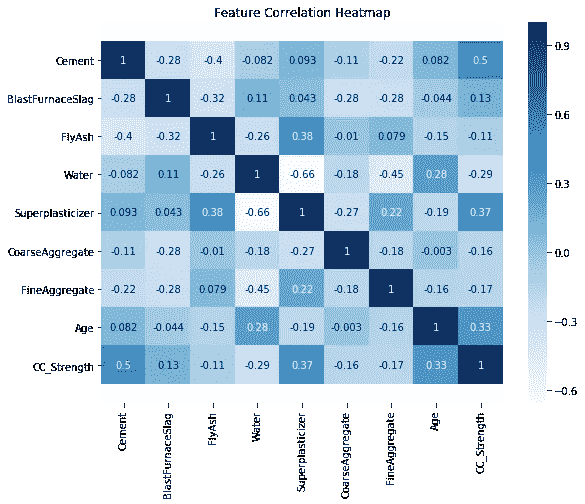

我们可以观察到**抗压强度** (CC_Strength)和**水泥**之间的高度正相关。这是真的，因为混凝土的强度确实随着制备过程中水泥用量的增加而增加。另外，**龄期**和**超塑化剂**是影响抗压强度的另外两个因素。

这些特征之间还有其他强相关性，

*   **超塑化剂**与**水**呈强负相关。
*   **超塑化剂**与**粉煤灰**、**细骨料**呈正相关关系。

这些相关性有助于详细理解数据，因为它们给出了一个变量如何影响另一个变量的想法。我们可以进一步使用 seaborn 中的 **pairplot** 来绘制所有特性之间的成对关系以及特性沿对角线的分布。

```
sns.pairplot(data)
```

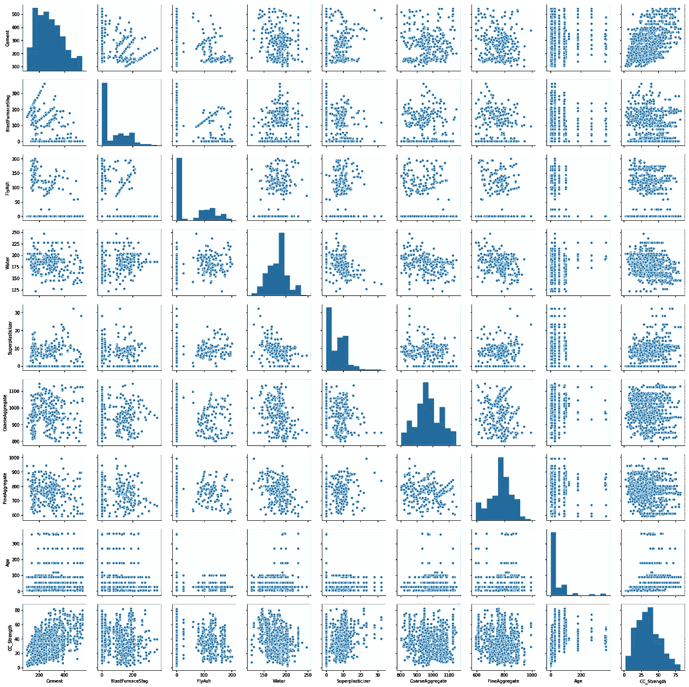

配对图直观地展示了所有特征之间的相关性。

我们可以在 **CC_Strength** 和其他特征之间绘制散点图，以查看更复杂的关系。

CC _ 强度 vs(水泥、龄期、水)

```
sns.scatterplot(y="CC_Strength", x="Cement", hue="Water",size="Age", data=data, ax=ax, sizes=(50, 300))
```

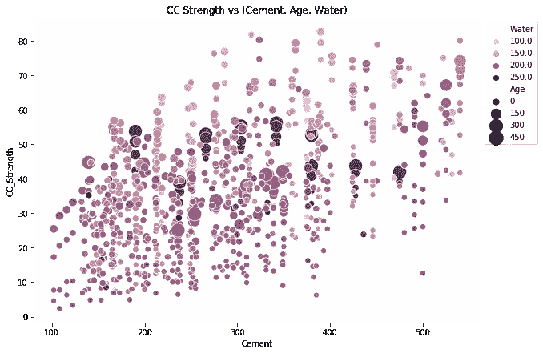

从这幅图中我们可以观察到，

*   **抗压强度随着水泥量的增加而增加**，当我们在 x 轴上向右移动时，圆点向上移动。
*   **抗压强度随着年龄的增长而增加**(因为圆点的大小代表年龄)，情况并非总是如此，但在一定程度上是可以的。
*   **时间越短的水泥需要越多的水泥来获得更高的强度**，因为当我们在 x 轴上向右移动时，较小的点会向上移动。
*   **水泥越老，需要的水就越多**，可以通过观察圆点的颜色来确认。深色的大点表示年龄大，水多。
*   **制备混凝土时使用较少的水**混凝土强度增加，因为较低侧(y 轴)的点较暗，较高端(y 轴)的点较亮。

CC 强度 vs(细骨料、超塑化剂、粉煤灰)

```
sns.scatterplot(y="CC_Strength", x="FineAggregate", hue="FlyAsh",
   size="Superplasticizer", data=data, ax=ax, sizes=(50, 300))
```

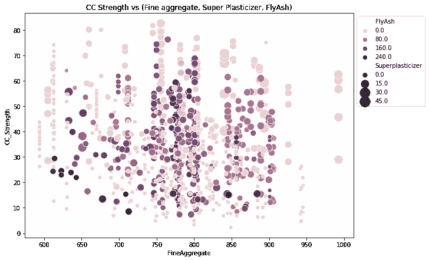

观察，

*   **抗压强度降低飞灰增加**，因为黑点集中在代表低抗压强度的区域。
*   **抗压强度随着超塑化剂的增加而增加**，因为点越大，曲线中的点越高。

我们可以直观地理解 2D、3D 和 max 直到 4D 图(由颜色和大小表示的特征)如上所示，我们可以进一步使用 seaborn 的行和列绘图特征来做进一步的分析，但我们仍然缺乏自己跟踪所有这些相关性的能力。出于这个原因，我们可以转向机器学习来捕捉这些关系，并对问题给出更好的见解。

# 数据预处理

在我们对数据拟合机器学习模型之前，我们需要将数据分割成训练和测试分割。可以重新调整特征的比例，使其均值为零，标准差为 1，即所有特征都落在相同的范围内。

```
X = data.iloc[:,:-1] # Features 
y = data.iloc[:,-1] # Target X_train, X_test, y_train, y_test = train_test_split(X, y, test_size=0.2, random_state=2) sc = StandardScaler() X_train = sc.fit_transform(X_train) 
X_test = sc.transform(X_test)
```

# 模型结构

在准备好数据之后，我们可以在训练数据上拟合不同的模型，并比较它们的性能，以选择性能好的算法。由于这是一个回归问题，我们可以使用 RMSE(均方根误差)和$R $分数作为评估指标。

## 1.线性回归

我们将从线性回归开始，因为这是任何回归问题的首选算法。该算法试图在输入特征和目标变量之间形成线性关系，即它拟合由下式给出的直线，

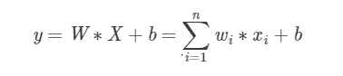

线性回归

其中 w_i 对应于特征 x_i 的系数。

通过对成本函数使用正则化项，可以进一步控制这些系数的大小。将系数的大小相加将导致系数接近于零，这种线性回归的变化称为**拉索**回归。将系数的平方和添加到成本函数将使系数在相同的范围内，这种变化被称为**岭**回归。这两种变化都有助于降低模型的复杂性，从而减少数据过度拟合的机会。

```
# Importing models 
from sklearn.linear_model import LinearRegression, Lasso, Ridge # Linear Regression 
lr = LinearRegression() # Lasso Regression 
lasso = Lasso() # Ridge Regression 
ridge = Ridge() # Fitting models on Training data 
lr.fit(X_train, y_train) 
lasso.fit(X_train, y_train) 
ridge.fit(X_train, y_train) # Making predictions on Test data y_pred_lr = lr.predict(X_test) 
y_pred_lasso = lasso.predict(X_test) 
y_pred_ridge = ridge.predict(X_test) from sklearn.metrics import mean_squared_error, mean_absolute_error, r2_score print("Model\t\t\t RMSE \t\t R2") 
print("""LinearRegression \t {:.2f} \t\t{:.2f}""".format(  np.sqrt(mean_squared_error(y_test, y_pred_lr)), r2_score(y_test, y_pred_lr))) print("""LassoRegression \t {:.2f} \t\t{:.2f}""".format( np.sqrt(mean_squared_error(y_test, y_pred_lasso)), r2_score(y_test, y_pred_lasso))) print("""RidgeRegression \t {:.2f} \t\t{:.2f}""".format( np.sqrt(mean_squared_error(y_test, y_pred_ridge)), r2_score(y_test, y_pred_ridge)))
```

输出

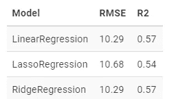

这三种算法的性能没有太大差别，我们可以用下面的代码画出这三种算法为特性分配的系数。

```
coeff_lr = lr.coef_ 
coeff_lasso = lasso.coef_ 
coeff_ridge = ridge.coef_ labels = req_col_names[:-1] 
x = np.arange(len(labels)) 
width = 0.3 fig, ax = plt.subplots(figsize=(10,6)) 
rects1 = ax.bar(x - 2*(width/2), coeff_lr, width, label='LR') 
rects2 = ax.bar(x, coeff_lasso, width, label='Lasso') 
rects3 = ax.bar(x + 2*(width/2), coeff_ridge, width, label='Ridge') ax.set_ylabel('Coefficient') 
ax.set_xlabel('Features') 
ax.set_title('Feature Coefficients') 
ax.set_xticks(x) 
ax.set_xticklabels(labels, rotation=45) 
ax.legend() def autolabel(rects): 
   """Attach a text label above each bar in *rects*, displaying its height.""" 
   for rect in rects: 
      height = rect.get_height() 
      ax.annotate('{:.2f}'.format(height), xy=(rect.get_x() + rect.get_width() / 2, height), xytext=(0, 3), textcoords="offset points", ha='center', va='bottom') autolabel(rects1) 
autolabel(rects2) 
autolabel(rects3) 
fig.tight_layout() 
plt.show()
```

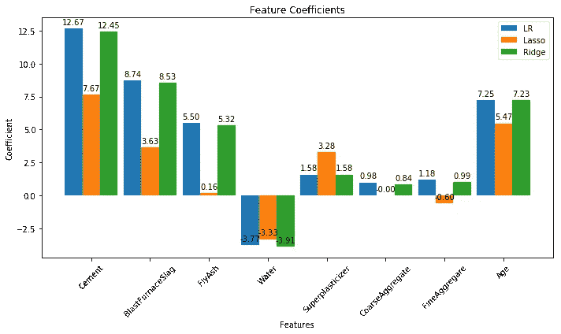

如图所示，Lasso 回归将系数推向零，而正常线性回归和岭回归的系数几乎相同。

我们可以通过绘制真实值和预测值来进一步了解预测情况，

```
fig, (ax1, ax2, ax3) = plt.subplots(1,3, figsize=(12,4)) ax1.scatter(y_pred_lr, y_test, s=20) 
ax1.plot([y_test.min(), y_test.max()], [y_test.min(), y_test.max()], 'k--', lw=2) 
ax1.set_ylabel("True") 
ax1.set_xlabel("Predicted") 
ax1.set_title("Linear Regression") 
ax2.scatter(y_pred_lasso, y_test, s=20) ax2.plot([y_test.min(), y_test.max()], [y_test.min(), y_test.max()], 'k--', lw=2) ax2.set_ylabel("True") 
ax2.set_xlabel("Predicted") 
ax2.set_title("Lasso Regression") 
ax3.scatter(y_pred_ridge, y_test, s=20) ax3.plot([y_test.min(), y_test.max()], [y_test.min(), y_test.max()], 'k--', lw=2) 
ax3.set_ylabel("True") 
ax3.set_xlabel("Predicted") 
ax3.set_title("Ridge Regression") 
fig.suptitle("True vs Predicted") 
fig.tight_layout(rect=[0, 0.03, 1, 0.95])
```

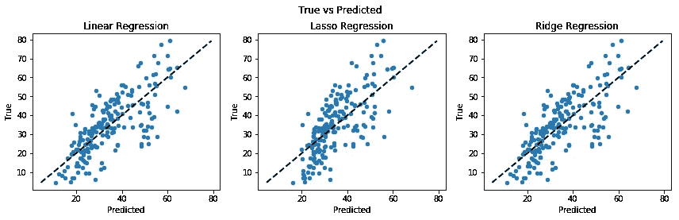

如果预测值和目标值相等，那么散点图上的点将位于直线上。正如我们在这里看到的，没有一个模型能正确预测抗压强度。

## 2.决策树

决策树算法用树状结构表示数据，其中每个节点表示对某个功能做出的决策。在这种情况下，这种算法将提供更好的性能，因为我们在一些输入特征中有许多零，如上面的对图中的分布所示。这将有助于决策树基于某些特征条件构建树，从而进一步提高性能。

```
from sklearn.tree import DecisionTreeRegressor 
dtr = DecisionTreeRegressor() 
dtr.fit(X_train, y_train) 
y_pred_dtr = dtr.predict(X_test) print("Model\t\t\t\t RMSE \t\t R2") 
print("""Decision Tree Regressor \t {:.2f} \t\t{:.2f}""".format( np.sqrt(mean_squared_error(y_test, y_pred_dtr)), r2_score(y_test, y_pred_dtr))) plt.scatter(y_test, y_pred_dtr) 
plt.plot([y_test.min(), y_test.max()], [y_test.min(), y_test.max()], 'k--', lw=2) 
plt.xlabel("Predicted") 
plt.ylabel("True") 
plt.title("Decision Tree Regressor") plt.show()
```

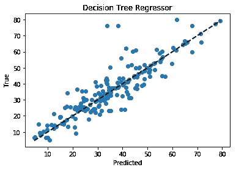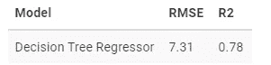

均方根误差(RMSE)从 10.29 下降到 7.31，因此决策树回归器显著提高了性能。这可以在图中观察到，并且更多的点更靠近线。

## 3.随机森林

使用决策树回归器提高了我们的性能，我们可以通过集成更多的树来进一步提高性能。随机森林回归器使用从训练数据中采样的随机数据子集来训练随机初始化的树，这将使我们的模型更加健壮。

```
from sklearn.ensemble import RandomForestRegressor rfr = RandomForestRegressor(n_estimators=100) 
rfr.fit(X_train, y_train) y_pred_rfr = rfr.predict(X_test) print("Model\t\t\t\t RMSE \t\t R2") print("""Random Forest Regressor \t {:.2f} \t\t{:.2f}""".format( np.sqrt(mean_squared_error(y_test, y_pred_rfr)), r2_score(y_test, y_pred_rfr))) plt.scatter(y_test, y_pred_rfr) 
plt.plot([y_test.min(), y_test.max()], [y_test.min(), y_test.max()], 'k--', lw=2) 
plt.xlabel("Predicted") 
plt.ylabel("True") 
plt.title("Random Forest Regressor") 
plt.show()
```

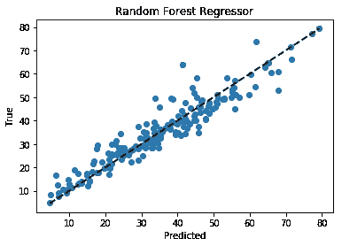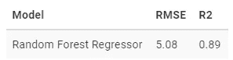

通过集合多棵树，RMSE 进一步减少。我们可以为基于树的模型绘制特征重要性。特征重要性显示了在进行预测时特征对模型的重要性。

```
feature_dtr = dtr.feature_importances_ 
feature_rfr = rfr.feature_importances_ labels = req_col_names[:-1] 
x = np.arange(len(labels)) 
width = 0.3 
fig, ax = plt.subplots(figsize=(10,6)) 
rects1 = ax.bar(x-(width/2), feature_dtr, width, label='Decision Tree') 
rects2 = ax.bar(x+(width/2), feature_rfr, width, label='Random Forest') 
ax.set_ylabel('Importance') 
ax.set_xlabel('Features') 
ax.set_title('Feature Importance') 
ax.set_xticks(x) 
ax.set_xticklabels(labels, rotation=45) 
ax.legend(loc="upper left", bbox_to_anchor=(1,1)) 
autolabel(rects1) 
autolabel(rects2) 
fig.tight_layout() 
plt.show()
```


基于树的模型将水泥和年龄视为最重要的特征。在预测混凝土强度时，粉煤灰、粗骨料和细骨料是最不重要的因素。

## 比较

最后，让我们比较所有算法的结果。

```
models = [lr, lasso, ridge, dtr, rfr] 
names = ["Linear Regression", "Lasso Regression", "Ridge Regression", "Decision Tree Regressor", "Random Forest Regressor"] rmses = [] for model in models: 
   rmses.append(np.sqrt(mean_squared_error(y_test, model.predict(X_test)))) x = np.arange(len(names)) 
width = 0.3 
fig, ax = plt.subplots(figsize=(10,7)) 
rects = ax.bar(x, rmses, width) 
ax.set_ylabel('RMSE') 
ax.set_xlabel('Models') 
ax.set_title('RMSE with Different Algorithms') 
ax.set_xticks(x) 
ax.set_xticklabels(names, rotation=45) 
autolabel(rects) 
fig.tight_layout() 
plt.show()
```

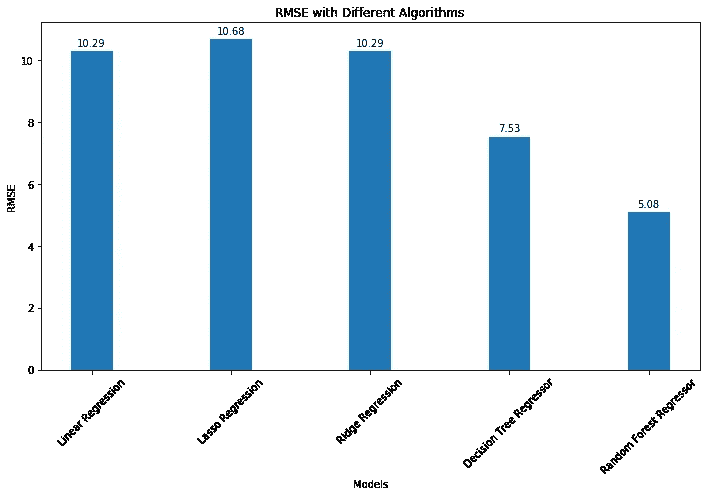

# 结论

我们分析了抗压强度数据，并使用机器学习来预测混凝土的抗压强度。我们使用了线性回归及其变体、决策树和随机森林来进行预测，并比较了它们的性能。随机森林回归器具有最低的 RMSE，是解决该问题的好选择。此外，我们可以通过执行网格搜索或随机搜索来调整超参数，从而进一步提高算法的性能。

# 参考

1.  叶一成，“使用人工神经网络对高性能混凝土的强度进行建模”，水泥与混凝土研究，第 28 卷，第 12 期，第 1797–1808 页(1998 年)。
2.  Ahsanul Kabir，医学博士 Monjurul Hasan，Khasro Miah，“混凝土的[强度预测模型”，ACEE Int .土木与环境工程学报，第 2 卷第 1 期，2013 年 8 月。](https://www.researchgate.net/publication/258255660_Strength_Prediction_Model_for_Concrete)
3.  [https://archive . ics . UCI . edu/ml/datasets/Concrete+抗压+强度](https://archive.ics.uci.edu/ml/datasets/Concrete+Compressive+Strength)

*原载于 2020 年 3 月 5 日*[*https://pranaymudukuru . github . io*](https://pranaymodukuru.github.io/post/concrete-compressive-strength/)*。*