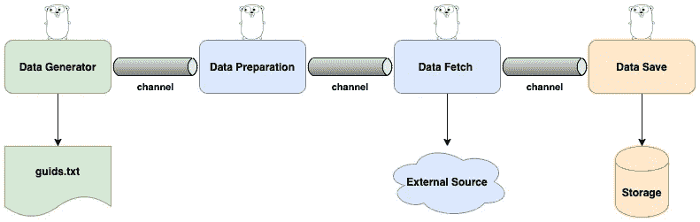

# Golang 中的并发数据管道

> 原文：<https://towardsdatascience.com/concurrent-data-pipelines-in-golang-85b18c2eecc2?source=collection_archive---------22----------------------->

## 利用 Golang 的并发模型为数据密集型应用创建并发数据管道


米卡·鲍梅斯特在 [Unsplash](https://unsplash.com?utm_source=medium&utm_medium=referral) 上的照片

数据是所有应用程序的重要组成部分。应用程序主要接收数据，处理数据，然后从中生成某种输出。如今可用的数据量是巨大的，这在试图理解数据并将其转化为有用信息时带来了许多挑战。除了通常的数据系统流程之外，我们还必须考虑由这些系统的执行所产生的数据，比如日志和指标。一切都是数据。

因此，对数据驱动的应用程序的需求越来越大。系统只处理移动和转换数据的情况并不少见。从一个地方到另一个地方或者从一个建筑到另一个建筑。这在分布式系统中更为常见，因为每个系统都为自己的目的生成数据，并以更易于处理的方式进行组织。然而，这些系统仍然必须进行通信，因此数据必须进行转换和移动。此外，有时数据必须转移到不同的环境或不同的平台。更麻烦！

有非常复杂的工具来完成这项工作，但通常配置和维护它们都是一件非常痛苦的事情，更不用说所涉及的成本了。因此，它们并不总是最佳选择。有时，根据用例，您可以创建自己的管道，用更简单的解决方案来移动数据。在本文中，我们将了解如何使用 golang 构建数据管道。

## 数据管道

管道是表达我们想要如何处理数据的一种非常好的方式。根据定义，管道是一系列被执行的步骤或动作。通常上一步的输出被用作下一步的输入。当设计管道时，每一步都不必担心其他步骤的工作，只依赖于输入和输出契约。这使得设计非常健壮，因为它是基于契约和抽象的。此外，这是一个非常灵活的设计，因为你可以添加更多的步骤，只要你不违反合同。好玩！

做这件事有无数种方法。在这篇文章中，我们将关注如何利用 go 的并发模型来创建数据管道，我在这里写的是关于。

## 使用 goroutines 和通道创建数据管道

正如我们前面提到的，数据管道是一系列的步骤，使用前一个步骤的输出作为下一个步骤的输入来执行。这听起来像是 goroutines 和 channels 的一个很好的用法。我们可以将每个步骤创建为一个 goroutine，并将它们之间的通信创建为通道。这意味着我们的数据管道可以并发执行，如果明智地使用，这是一个很大的好处。让我们跳到一个例子来简化一下。

在本例中，我们将创建一个简单的管道，用于从文本文件中读取一些 GUID，将它们转换为我们要用于处理的输入数据结构，从外部服务中获取相关数据，最后使用批处理操作将数据保存在数据存储中。以下是高级工作流的外观:



高级工作流

正如我们在这张图上看到的，每个操作都将使用一个 goroutine(由 gophers 表示)创建，并使用通道连接在一起。这样做的整体思路是，每个函数(除了数据生成器之外)将接收其输入通道作为参数，并返回输出通道作为函数的返回值。在每个函数中，我们将旋转一个 goroutine 来实际监听输入通道，并对收到的每一项进行操作，同时在输出通道上发送结果。

为简单起见，所有通道都是无缓冲的，这意味着存储在`guids.txt`文件中的每个 GUID 都将单独通过管道。唯一的批处理操作是在最后，我们将它们保存到数据存储的批处理中。此外，为了简单起见，错误处理已经被简化，请记住，对于生产管道，您可能希望使其更加健壮。好了，解释够了，让我们开始这个例子。你可以在[我的 github 库](https://github.com/RicardoLinck/data-pipeline-golang)中找到完整的源代码。

下面是`guids.txt`文件的样子:

```
ea464197-d864-4f8a-8a60-2d3a6f3d87bf
74c1a7bd-b536-4f9e-be36-5e16c491d833
c524c1e9-e473-42eb-b74d-97d82575b720
d5003029-7e10-4128-8a18-392e384ef0bd
b1fbf405-7b3c-4b82-8b51-4c5c2c0cca56
b4f6a28c-86b2-4741-89e5-612451346eb7
353629f7-c9ba-4ed1-8e1b-b7694381a36a
d3b305cb-eb1b-4f8a-8a23-4741960c26a4
66c03c1a-45f7-4255-b568-669d9dc553d9
9272d9f4-da5a-4449-8826-f8529ce4f428
```

我们管道的第一部分是读取该文件的每一行，将其解析为一个`uuid.UUID`类型，并通过一个通道发送出去。这个函数可能是这样的:

这里重要的部分是我们正在创建输出通道(第 13 行)并返回它(第 37 行)，以及在实际执行读取文件和发送解析后的`uuid.UUID`值(第 15 行)工作的 goroutine 上使用它。这非常强大，因为它允许我们直接使用通道作为另一个函数输入，而不用担心内部工作是如何完成的。同样重要的是，一旦工作完成，我们就关闭通道，这样我们就可以在通道上安全地使用`for range`语句，而不用担心无限循环。让我们进入第二步，准备数据:

这里，函数签名略有变化。我们正在接收我们想要用作输入的频道。然而，创建通道输出通道(第 16 行)并返回它(第 26 行)的内部技术仍然是相同的。对于这个特定的步骤，我们只使用在输入通道上接收到的`uuid.UUID`，并将它们转换成一个虚拟结构`inputData`，同时记录正在处理的内容。这是一个非常基本的例子，但是它说明了你可以为数据转换做什么(数据管道中非常常见的一步),你只需要为你想要的任何结构改变应用相同的逻辑。让我们来看一个更深入的例子，关于我们的第三步，数据获取:

这个函数使用了和以前几乎一样的技术，我们接收一个输入通道并返回一个输出通道。在这种情况下，为了简单起见，我决定模拟外部调用，因此我们实际上是在内存中为给定的 GUID 生成随机相关的值。有趣的是，我们实际上使用并发来调用这个(假的)外部服务。这允许管道的其余部分在我们等待从外部值返回特定值时仍然运行。我们仍然希望在关闭我们的输出通道之前，等待对外部服务的所有调用完成(也就是说，我们对这部分管道的工作已经完成)。

为了做到这一点，我引入了一个非常常见的模式，使用`sync.WaitGroup`来处理需要在某个时间点同步的异步调用。我们在调用第 29 行上的`close(oc)`之前等待(同步)。这样，我们可以确保在关闭通道之前，所有对外部服务的调用都已完成。发生这种情况是因为这个特定的步骤可能比数据管道上的前一个步骤运行得慢，因为它依赖于外部服务，所以在我们调用外部服务处理所有值之前，可能会从输入通道接收所有值。

这是一个非常有趣的步骤，让我们来看看管道的最后一步，数据存储:

在这一步中，我们将介绍一种不同的技术，批处理。这对于为每个项目调用每个操作在性能或成本方面效率不高的服务来说可能很有用。因此，为了解决这个问题，我们可以将一些项目成批放在一起。我创建了一个简单的批处理机制，它基于我们想要添加到批处理中的数据量。你可以使用任何你想要的机制，我相信逻辑会非常相似。在本例中，我们一次批处理 7 个项目，所以每次我们有 7 个项目要持久存储到数据库中时，我们调用 persisting 函数(false)并打开下一批。在结束之前，我们检查是否有一个开放的批处理，并保存在这种情况下。此外，我们将返回一个通道，其中包含保存了哪些项目的信息以及时间戳。现在我们只需要把这条管道组装起来:

如你所见，我们以相反的顺序调用管道。如果您愿意，可以更改参数以使其更加清晰。然而，在这种情况下，它几乎像一个装饰模式。如果我们从`generateData()`函数开始，它不接收通道，但返回一个。因此从该函数返回的通道被用作`prepareData`的输入参数。该功能的输出通道用作`fetchData`的参数。输出通道最终被`saveData`用作输入。最后一个函数也返回一个通道，我们将在这个通道上打印哪些项目已经保存。如果我们执行这个示例，我们将会看到类似这样的内容:

```
./data-pipeline-golang
2020/06/10 09:49:50 Data ready for processing: {id:ea464197-d864-4f8a-8a60-2d3a6f3d87bf timestamp:1591778990056111000}2020/06/10 09:49:50 Data ready for processing: {id:74c1a7bd-b536-4f9e-be36-5e16c491d833 timestamp:1591778990056467000}2020/06/10 09:49:50 Data ready for processing: {id:c524c1e9-e473-42eb-b74d-97d82575b720 timestamp:1591778990056587000}2020/06/10 09:49:50 Data ready for processing: {id:d5003029-7e10-4128-8a18-392e384ef0bd timestamp:1591778990056744000}2020/06/10 09:49:50 Data ready for processing: {id:b1fbf405-7b3c-4b82-8b51-4c5c2c0cca56 timestamp:1591778990056773000}2020/06/10 09:49:50 Data ready for processing: {id:b4f6a28c-86b2-4741-89e5-612451346eb7 timestamp:1591778990056803000}2020/06/10 09:49:50 Data ready for processing: {id:353629f7-c9ba-4ed1-8e1b-b7694381a36a timestamp:1591778990056814000}2020/06/10 09:49:50 Data ready for processing: {id:d3b305cb-eb1b-4f8a-8a23-4741960c26a4 timestamp:1591778990056984000}2020/06/10 09:49:50 Data ready for processing: {id:66c03c1a-45f7-4255-b568-669d9dc553d9 timestamp:1591778990057220000}2020/06/10 09:49:50 Items saved: {idsSaved:[66c03c1a-45f7-4255-b568-669d9dc553d9 c524c1e9-e473-42eb-b74d-97d82575b720 353629f7-c9ba-4ed1-8e1b-b7694381a36a b4f6a28c-86b2-4741-89e5-612451346eb7 74c1a7bd-b536-4f9e-be36-5e16c491d833 b1fbf405-7b3c-4b82-8b51-4c5c2c0cca56 ea464197-d864-4f8a-8a60-2d3a6f3d87bf] timestamp:1591778990097935000}2020/06/10 09:49:50 Items saved: {idsSaved:[d3b305cb-eb1b-4f8a-8a23-4741960c26a4 d5003029-7e10-4128-8a18-392e384ef0bd] timestamp:1591778990105146000}
```

我们可以看到，`prepareData`函数记录了 9 个准备处理的项目，而`main`函数记录了 2 个实际保存的批次，第一个包含 7 个项目，第二个包含 2 个项目。

## 最后的想法

对于处理数据驱动或数据密集型应用程序的工程师来说，创建数据管道是一项非常常见的任务。数据管道对于将数据从一个系统转移到另一个系统、从一个平台转移到另一个平台，甚至从一个环境转移到另一个环境是必不可少的。如果我们理解了 golang 的并发模型，我们就可以利用它以一种非常简单明了的方式创建并发数据管道。这里使用的主要模式是为每个步骤创建并返回一个通道，这样我们可以很容易地将所有步骤连接在一起。使用这种范式，我们可以用各种酷的东西来提升我们的管道，比如步骤的并行执行，特定管道步骤的多个工人，等等。

这种技术并不总是正确的选择，有许多工具可以根据具体情况成为更简单的解决方案。