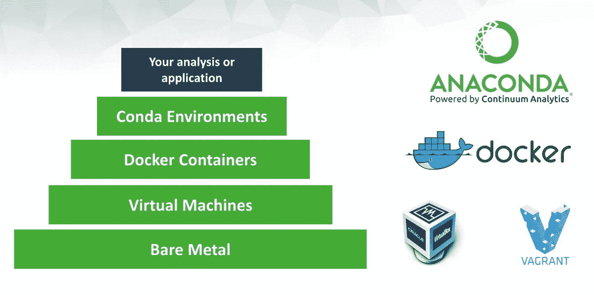

# 康达(+ pip)和 Docker FTW！

> 原文：<https://towardsdatascience.com/conda-pip-and-docker-ftw-d64fe638dc45?source=collection_archive---------2----------------------->

## 困扰数据科学项目的环境和包管理问题的解决方案。



结合 Conda envs 和 Docker 容器可以提高数据科学工作流的可重复性。[来源](https://www.anaconda.com/)

# 进入鲸鱼！

因为这篇文章的重点是将 Docker 整合到现有的 Conda (+ pip)工作流中，所以我假设您已经在使用 Conda (+ pip)来管理数据科学项目的环境。如果您不熟悉 Conda 的基础知识，或者还没有使用 Conda 管理特定项目的环境，那么我建议您查看我最近的文章[*Conda*](https://medium.com/@davidrpugh/managing-project-specific-environments-with-conda-b8b50aa8be0e)入门和 [*使用 Conda*](/managing-project-specific-environments-with-conda-406365a539ab) *管理特定项目的环境。*

我还假设您对 Docker 背后的基本思想有所了解。如果没有，那么我推荐你看一看杰夫·黑尔的这个优秀的系列文章

# 为什么不用康达(+ pip)？

虽然 Conda (+ pip)解决了我的大多数日常数据科学环境和包管理问题，但将 [Docker](https://www.docker.com/) 整合到我的 Conda (+ pip)开发工作流中，使我的数据科学工作流从我的笔记本电脑/工作站移植到远程云计算资源变得更加容易。将 Docker 整合到我的开发工作流程中，通过消除不明显的操作系统级依赖性(特别是当从运行 Mac OSX 和 Windows 的本地笔记本电脑/工作站迁移到运行 Linux 的远程服务器时)，也使我的工作更具可重复性。

然而，让 Conda (+ pip)像预期的那样在 Docker 容器中工作比我预想的要困难得多。我遇到的大多数困难涉及到如何在图像内部正确激活环境，以便在容器内部使用 Conda (+ pip)时的 UX 与在容器外部使用 Conda (+ pip)时的 UX 相同。

所有这些困难都可以通过使 docker 文件“恰到好处”来解决。在下一节中，我将一步一步地向您介绍我开发的 Dockerfile 文件。

# 写作`Dockerfile`

让 Conda (+ pip)和 Docker 顺利合作的诀窍是编写一个好的`Dockerfile`。在这一节中，我将带你一步一步地了解我开发的`Dockerfile`的各个部分。希望你可以在下一个数据科学项目中不加修改地使用这个`Dockerfile`。

从这里开始，我假设您已经组织了类似于我的 [Python 数据科学项目模板](https://github.com/kaust-vislab/python-data-science-project)的项目目录。特别是，我将假设您存储了所有与 Docker 相关的文件，特别是项目根目录下的`docker`子目录中的`Dockerfile`。

## 使用标准基础图像

每个`Dockefile`都有一个基础或父映像。对于父映像，我使用的是 [Ubuntu 16.04](http://releases.ubuntu.com/16.04/) ，这是数据科学社区中最常用的 Linux 版本之一(恰好也是我的工作站上安装的同一操作系统)。

```
FROM ubuntu:16.04
```

## 将`bash`设为默认外壳

构建 Docker 映像时用于运行`Dockerfile`命令的默认 shell 是`/bin/sh`。不幸的是`/bin/sh`目前不是`conda init`命令支持的 shells 之一。幸运的是，可以使用`[SHELL](https://docs.docker.com/engine/reference/builder/#shell)`指令改变用于运行`Dockerfile`命令的默认 shell。

```
SHELL [ "/bin/bash", "--login", "-c" ]
```

注意`--login`标志的使用，它确保`~/.profile`和`~/.bashrc`都有正确的来源。为了使用各种`conda`命令在 Docker 映像中构建 Conda 环境，正确地提供`~/.profile`和`~/.bashrc`是必要的。

## 创建非超级用户

在您的 Docker 映像中创建一个非 root 用户是一个 [Docker 安全“最佳实践”](https://snyk.io/blog/10-docker-image-security-best-practices/)。我创建非根用户的首选方法是使用构建参数来定制非根用户的`username`、`uid`和`gid`。我对`uid`和`gid`使用标准默认值；默认用户名设置为`[al-khawarizmi](https://en.wikipedia.org/wiki/Muhammad_ibn_Musa_al-Khwarizmi)`(为了纪念这位著名的波斯学者，他的名字就在我工作的大楼上)

```
# Create a non-root user
ARG username=al-khawarizmi
ARG uid=1000
ARG gid=100
ENV USER $username
ENV UID $uid
ENV GID $gid
ENV HOME /home/$USERRUN adduser --disabled-password \
    --gecos "Non-root user" \
    --uid $UID \
    --gid $GID \
    --home $HOME \
    $USER
```

## 复制配置文件

创建非 root 用户后，我复制了创建 Conda 环境所需的所有配置文件(即`environment.yml`、`requirements.txt`、`postBuild`)。我还复制了一个 Bash 脚本，我将把它用作 Docker `ENTRYPOINT`(下面将详细介绍)。

```
COPY environment.yml requirements.txt /tmp/
RUN chown $UID:$GID /tmp/environment.yml /tmp/requirements.txtCOPY postBuild /usr/local/bin/postBuild.sh
RUN chown $UID:$GID /usr/local/bin/postBuild.sh && \
    chmod u+x /usr/local/bin/postBuild.shCOPY docker/entrypoint.sh /usr/local/bin/
RUN chown $UID:$GID /usr/local/bin/entrypoint.sh && \
    chmod u+x /usr/local/bin/entrypoint.sh
```

Docker 的新版本支持以非根用户的身份复制文件，但是 DockerHub 上的 Docker 版本还不支持以非根用户的身份复制文件，所以如果你想为你的 Git 存储库设置[自动构建](https://docs.docker.com/docker-hub/builds/)，你需要以根用户的身份复制所有文件。

## 以非根用户的身份安装 Miniconda。

作为 root 用户复制配置文件后，我切换到非 root 用户并安装 [Miniconda](https://docs.conda.io/en/latest/miniconda.html) 。

```
USER $USER# install miniconda
ENV MINICONDA_VERSION 4.8.2
ENV CONDA_DIR $HOME/miniconda3
RUN wget --quiet https://repo.anaconda.com/miniconda/Miniconda3-$MINICONDA_VERSION-Linux-x86_64.sh -O ~/miniconda.sh && \
    chmod +x ~/miniconda.sh && \
    ~/miniconda.sh -b -p $CONDA_DIR && \
    rm ~/miniconda.sh# make non-activate conda commands available
ENV PATH=$CONDA_DIR/bin:$PATH# make conda activate command available from /bin/bash --login shells
RUN echo ". $CONDA_DIR/etc/profile.d/conda.sh" >> ~/.profile# make conda activate command available from /bin/bash --interative shells
RUN conda init bash
```

## 创建项目目录

接下来，我在非根用户主目录中创建一个项目目录。Conda 环境将在项目目录中的`env`子目录中创建，然后所有其他项目文件和目录可以挂载到这个目录中。

```
# create a project directory inside user home
ENV PROJECT_DIR $HOME/app
RUN mkdir $PROJECT_DIR
WORKDIR $PROJECT_DIR
```

## 构建康达环境

现在我已经准备好构建 Conda 环境了。请注意，我可以使用与我在笔记本电脑或工作站上为项目构建 Conda 环境几乎相同的`conda`命令序列。

```
# build the conda environment
ENV ENV_PREFIX $PWD/env
RUN conda update --name base --channel defaults conda && \
    conda env create --prefix $ENV_PREFIX --file /tmp/environment.yml --force && \
    conda clean --all --yes# run the postBuild script to install any JupyterLab extensions
RUN conda activate $ENV_PREFIX && \
    /usr/local/bin/postBuild.sh && \
    conda deactivate
```

## 确保运行时激活 Conda 环境

快完成了！倒数第二步是使用一个`[ENTRYPOINT](https://docs.docker.com/engine/reference/builder/#entrypoint)`脚本来确保 Conda 环境在运行时被正确激活。

```
ENTRYPOINT [ "/usr/local/bin/entrypoint.sh" ]
```

下面是`/usr/local/bin/entrypoint.sh`脚本，供参考。

```
#!/bin/bash --login
set -econda activate $ENV_PREFIX
exec "$@"
```

## 为 Docker 容器指定默认命令

最后，我使用`[CMD](https://docs.docker.com/engine/reference/builder/#cmd)`指令来指定 Docker 容器启动时运行的默认命令。因为我在所有的 Conda 环境中都安装了 JupyerLab，所以在执行容器时，我倾向于默认启动一个 JupyterLab 服务器。

```
# default command will launch JupyterLab server for development
CMD [ "jupyter", "lab", "--no-browser", "--ip", "0.0.0.0" ]
```

# 建立码头工人形象

下面的命令(应该从包含`Dockefile`的`docker`子目录中运行)用定制的`$USER`(以及相关的`$UID`和`$GID`)以及特定的`$IMAGE_NAME`和`$IMAGE_TAG`为您的项目构建一个新的映像。这个命令应该在项目的`docker`子目录中运行，因为 Docker 构建上下文被设置为`../`，它应该是项目根目录。

```
docker image build \
  --build-arg username=$USER \
  --build-arg uid=$UID \
  --build-arg gid=$GID \
  --file Dockerfile \
  --tag $IMAGE_NAME:$IMAGE_TAG \
  ../
```

# 运行 Docker 容器

一旦构建了映像，下面的命令将运行基于映像的容器`$IMAGE_NAME:$IMAGE_TAG`。该命令应该从项目的根目录中运行。

```
docker container run \
  --rm \
  --tty \
  --volume ${pwd}/bin:/home/$USER/app/bin \
  --volume ${pwd}/data:/home/$USER/app/data \ 
  --volume ${pwd}/doc:/home/$USER/app/doc \
  --volume ${pwd}/notebooks:/home/$USER/app/notebooks \
  --volume ${pwd}/results:/home/$USER/app/results \
  --volume ${pwd}/src:/home/$USER/app/src \
  --publish 8888:8888 \
  $IMAGE_NAME:$IMAGE_TAG
```

# 使用 Docker 撰写

手写上述 docker 命令时很容易出现打字错误。一种不太容易出错的方法是使用 [Docker Compose](https://docs.docker.com/compose/) 。上述 docker 命令可以封装到`docker-compose.yml`配置文件中，如下所示。

```
version: "3.7"services:
  jupyterlab-server:
    build:
      args:
        - username=${USER}
        - uid=${UID}
        - gid=${GID}
      context: ../
      dockerfile: docker/Dockerfile
    ports:
      - "8888:8888"
    volumes:
      - ../bin:/home/${USER}/app/bin
      - ../data:/home/${USER}/app/data
      - ../doc:/home/${USER}/app/doc
      - ../notebooks:/home/${USER}/app/notebooks
      - ../results:/home/${USER}/app/results
      - ../src:/home/${USER}/app/src
    init: true
    stdin_open: true
    tty: true
```

以上`docker-compose.yml`文件依靠[变量替换](https://docs.docker.com/compose/environment-variables/#the-env-file)。获取`$USER`、`$UID`和`$GID`的值。这些值可以存储在一个名为`.env`的文件中，如下所示。

```
USER=$USER
UID=$UID
GID=$GID
```

您可以通过在项目的`docker`子目录中运行以下命令来测试您的`docker-compose.yml`文件。

```
docker-compose config
```

该命令获取`docker-compose.yml`文件并替换`.env`文件中提供的值，然后返回结果。

一旦您确信`.env`文件中的值被正确地替换到了`docker-compose.yml`文件中，就可以使用下面的命令来打开一个基于项目 Docker 映像的容器，并启动 JupyterLab 服务器。这个命令也应该从项目的`docker`子目录中运行。

```
docker-compose up --build
```

当您完成开发并关闭 JupyterLab 服务器后，下面的命令将拆除正在运行的容器的网络基础设施。

```
docker-compose down
```

# 摘要

在这篇文章中，我经历了一个将 Conda (+ pip)环境注入 Docker 映像的`Dockerfile`。我还详细介绍了如何使用 Docker Compose 构建结果图像和启动容器。

如果你正在寻找一个生产质量的解决方案，概括上述方法，那么我会鼓励你看看`[jupyter-repo2docker](https://repo2docker.readthedocs.io/en/latest/)`。

`jupyter-repo2docker`是一个从源代码库中构建、运行和推送 Docker 映像的工具。`repo2docker`获取一个存储库(从 GitHub、GitLab、Zenodo、Figshare、Dataverse installations、Git 存储库或本地目录)并构建一个可以执行代码的容器映像。映像构建过程基于存储库中的配置文件。

Conda (+ pip)和 Docker 的结合显著提高了我的数据科学开发速度，同时提高了我的数据科学工作流的可移植性和可重复性。

希望这篇文章可以帮助你在下一个数据科学项目中将这三个伟大的工具结合起来！