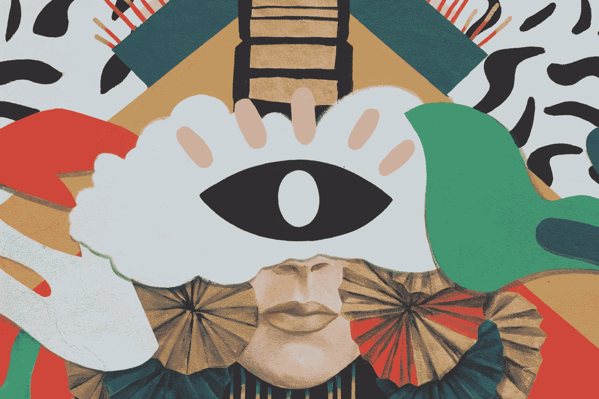

# 条件可控的生成对抗网络

> 原文：<https://towardsdatascience.com/conditional-and-controllable-generative-adversarial-networks-a149691ddae6?source=collection_archive---------25----------------------->

## 理解条件可控 GAN 并在 TensorFlow 2.x 中实现 CGAN

[TT 先生](https://unsplash.com/@mrtt?utm_source=unsplash&utm_medium=referral&utm_content=creditCopyText)在 [Unsplash](https://unsplash.com/s/photos/art?utm_source=unsplash&utm_medium=referral&utm_content=creditCopyText) 上的照片

在本文中，我们将了解条件和可控 GAN，它们的需求是什么，以及如何使用 TensorFlow 2.x 实现简单的条件 GAN。在您进一步阅读之前，我希望您熟悉 DCGANs，您可以在这里找到。

## 为什么有条件甘

到目前为止，生成器是随机生成图像的，我们无法控制要生成的图像的类别，即在训练 GAN 时，生成器每次都会生成一个随机数字，即它可能会生成一个、六个或三个，我们不知道它会生成什么。但是条件句我们可以告诉生成器生成一个或六个图像。这就是有条件的 GAN 派上用场的地方。通过有条件的 GAN，您可以生成您选择的类别的图像。

## 它是如何工作的？

到目前为止，我们将图像作为唯一的输入提供给我们的生成器和鉴别器。但是现在我们将向两个网络提供班级信息。

1.  生成器将随机噪声和一个独热编码类标签作为输入。并输出特定类别的假图像。
2.  鉴别器获取一个带有作为深度添加到图像(通道)的独热标签的图像，即，如果您有一个大小为 28 * 28 *1 的图像和大小为 n 的独热向量，则图像大小将为 28 * 28 * (n+1)。
3.  鉴别器输出图像是否属于该类别，即真实或虚假。

# 密码

本文的代码与 DCGAN 的代码几乎相同，只是做了一些修改。让我们看看这些差异。

> 注意:跟随实现是一种幼稚的方式，并且非常慢。你可以参考 [**这里的**](https://machinelearningmastery.com/how-to-develop-a-conditional-generative-adversarial-network-from-scratch/) 找到一个更好的编码条件 gan 的方法。

## 组合图像和标签

1.  首先，我们加载 MNIST 数据集并归一化图像。
2.  然后，我们定义一个 add_channels 函数，它将一个图像和相应的一个 hot 标签作为输入。并且输出具有表示独热标签的附加深度通道的图像。在添加的所有深度通道中，只有一个通道包含值 1，所有其他通道都包含零值。
3.  首先，我们迭代所有的图像和相应的标签。对于独热标签中的每个数字，我们创建一个图像形状向量，其中包含等于该数字的每个值。之后，我们把这些向量和图像叠加起来。
4.  这里，我们有 10 个类，这就是为什么我们在一个热标签中循环了 10 个数字。

## 结合噪音和标签

1.  以下代码将噪声向量与一键标签和其他函数结合起来，输出生成器和鉴别器的输入尺寸。
2.  这是必要的，因为我们的模型是使用顺序 API 编码的，我们需要显式地传递输入维度。

## 训练循环

1.  训练循环也与 DCGAN 相同，但这一次我们为生成器合并了噪声和标签。并且在将伪图像送入鉴别器之前对其进行图像处理。

上面的 condition GANs 实现代码非常慢，但它运行良好，有助于理解这个概念。

# 可控 GANs

条件甘帮助生成我们选择的类的图像。但是我们无法控制输出图像的内容，也就是说，如果我们想要一只戴着红帽子或眼镜的狗怎么办。这就是可控 GANs 出现的原因。但是它是如何工作的呢？所以让我们来找出答案。

## 概念

可控的 GANs 对于在生成的图像中获得选择的特征是有用的。例如，如果我们想生成一个黑头发绿眼睛的人的图像，那么你需要调整输入噪声。

1.  当您向发生器提供随机噪声向量时，该噪声向量中的元素对应于所生成图像中的某些特征。
2.  当您更改噪波向量中的元素时，它会更改图像中的一些特征，例如向量中的一些更改可能会更改人的头发或眼睛的颜色。
3.  这可以通过在一些向量空间中映射具有相关特征的向量来实现。
4.  这可以通过使用预先训练的分类器来执行，该分类器告知特定特征是否出现在生成的图像中，例如人的眼睛是否是绿色的。这可以用于找到不同特征的噪声矢量。

## 可控氮化镓面临的挑战

可控 GANs 面临以下两个主要挑战。

1.  **相关性黑白特征:**当我们为了改变一个特征而改变噪声向量的一个元素时(就像给女性的图像添加面部毛发)，会导致其他特征的改变(就像改变图像中人的性别)。这可能是因为模特们见过面部毛发带有阳刚之气的脸。
2.  **矢量空间纠缠:**噪声矢量中的元素在对应特征时发生纠缠。

# 结论

条件 gan 用于生成属于我们选择的类的图像，而可控 gan 用于控制图像中的特征。

你可以在这里找到这篇文章的完整代码。请继续关注即将发表的文章，我们将在那里实现更多的算法。

所以，本文到此结束。谢谢你的阅读，希望你喜欢并且能够理解我想要解释的内容。希望你阅读我即将发表的文章。哈里奥姆…🙏

# 参考

 [## 生成对抗网络

### 由 DeepLearning.AI 提供关于 GANs 生成对抗网络(GANs)是强大的机器学习模型…

www.coursera.org](https://www.coursera.org/specializations/generative-adversarial-networks-gans)