# Power BI 中的条件格式

> 原文：<https://towardsdatascience.com/conditional-formatting-in-power-bi-3e3bd1198b8e?source=collection_archive---------43----------------------->

## 了解如何在 Power BI 视觉效果中应用条件格式

在本文中，我将解释什么是 Power BI 中的条件格式。顾名思义，条件格式是一种可视化数据的方式，它基于一些预定义的条件对所选指标的值应用特殊的格式规则。它主要用于数据以表格形式呈现的情况；但是，它也可以用于任何图表，如条形图、折线图等。

# Power BI 中的条件格式是什么？

当有大量数据以表格形式表示时，乍一看很难理解哪个值更高或更低。通常，您需要深入观察单元格值，以了解或比较显示的各种指标。

例如，如果您考虑下面左边的图，数据太多了，您需要单独比较每个单元格的值，以便了解更多信息。然而，如果你看到右边的图，你只要看一眼就能明白，什么是较高的值，什么是中间值，什么是较低的值。这就是 Power BI 中的条件格式。

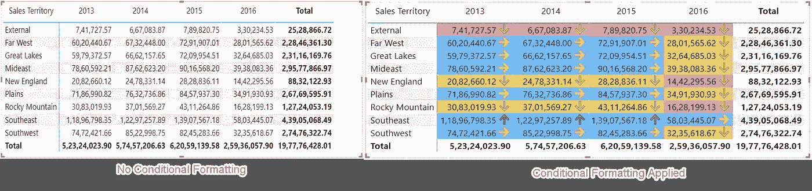

*图 1 —条件格式比较*

# 设置数据

让我们首先尝试将一些数据导入 Power BI 数据模型。一旦数据被导入，我们将研究如何实现条件格式。为了这篇文章，我将从微软提供的著名的 **WideWorldImportersDW** 数据库中导入数据。你可以[在本地轻松下载并安装](https://docs.microsoft.com/en-us/sql/samples/wide-world-importers-dw-install-configure?view=sql-server-ver15)这个数据库。因为我已经安装了数据库，所以我不会在这里介绍这些步骤。为了将数据导入到 Power 中，您可以按照下面的步骤与我一起进行:

打开 Power BI 桌面，点击**获取数据。**从出现的下拉菜单中选择 **SQL Server** 。

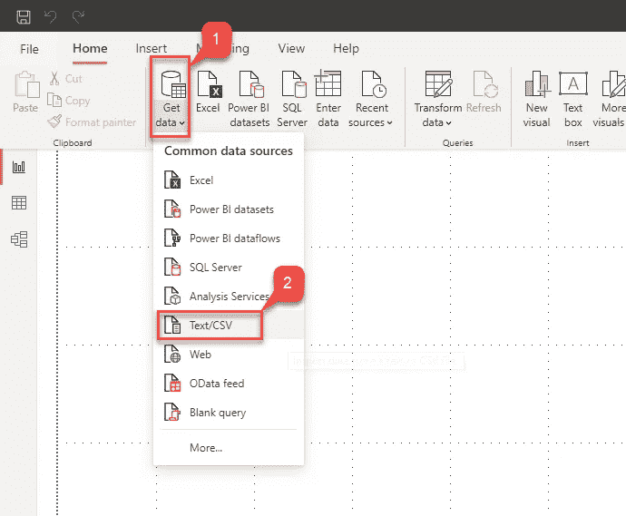

*图 2 —获取功率 BI 中的数据*

在出现的连接服务器对话框中，提供**服务器名称**和**数据库名称**并点击**确定。**

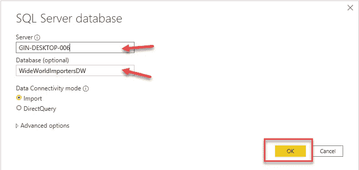

*图 3 —服务器详情*

单击 Connect 后，您会看到对话框中列出了数据库中的所有表。对于本文，我们将只选择三个表— **维度。**，**维度城市。日期**和**事实。销售**。完成后点击**加载**。

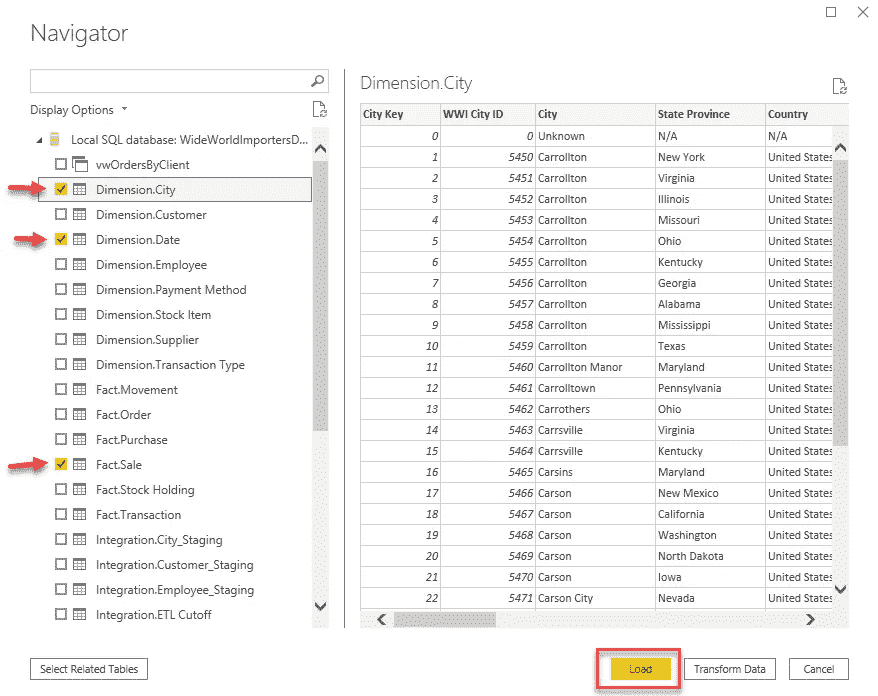

*图 5 —选择表格*

# 在 Power BI 中构建报告

现在，让我们使用矩阵可视化快速构建一个电源 BI 报告。它将使用我们刚刚导入的表中的数据。点击*可视化*面板上的**矩阵**，将各个字段拖放到*行*、*列*和*值*中，如下图所示。

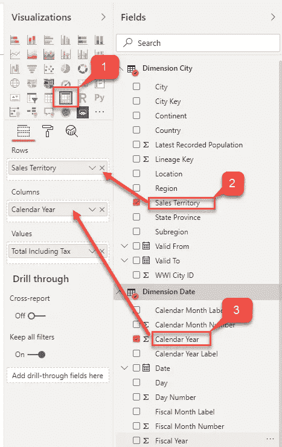

*图 7 —构建矩阵*

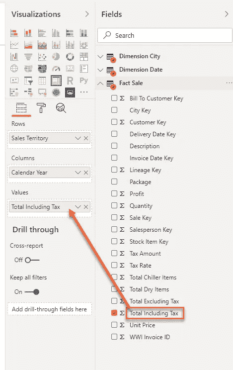

*图 8 —构建矩阵*

一旦字段就绪，您将看到 Power BI 报告中创建了一个类似的矩阵。这是一个简单的矩阵，显示每个**销售区域**和**年度**的**含税总额**。如你所见，理解矩阵中的最高值和最低值并不容易；我们需要深入视觉，理解这些价值观。

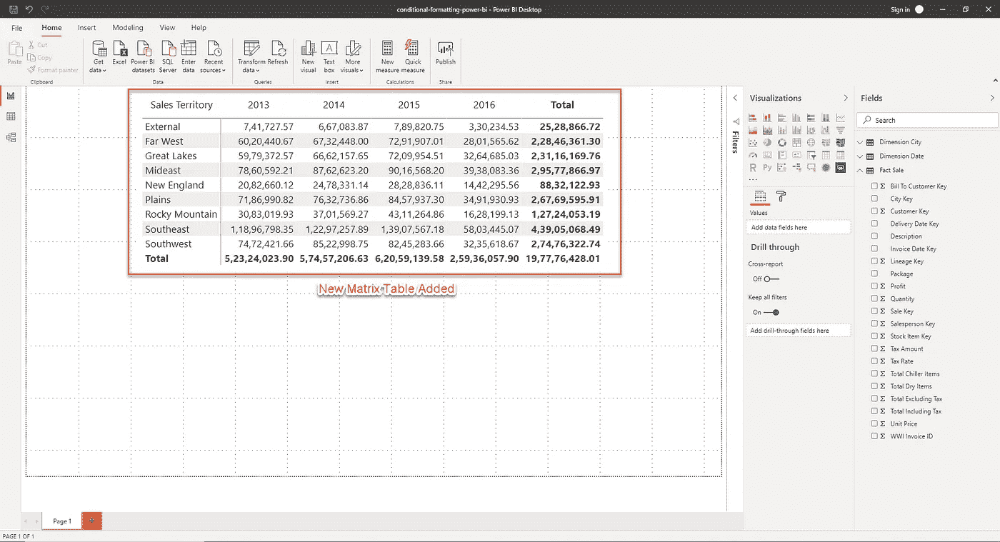

*图 9 —新矩阵*

# 在 Power BI 中实现条件格式

为了在 Power BI 中实现条件格式，让我们继续定义我们想要可视化的规则。让我们考虑一下，我们将根据每个单元格保存的值来更改单元格的背景颜色。例如，具有最低值的单元格将具有红色的背景色，而最高值将以蓝色突出显示。您可以按照下面的步骤来实现相同的功能。

右键单击*值*部分的**含税总额**字段。或者，您也可以点击**格式**按钮，打开**条件格式下的**背景色**。**

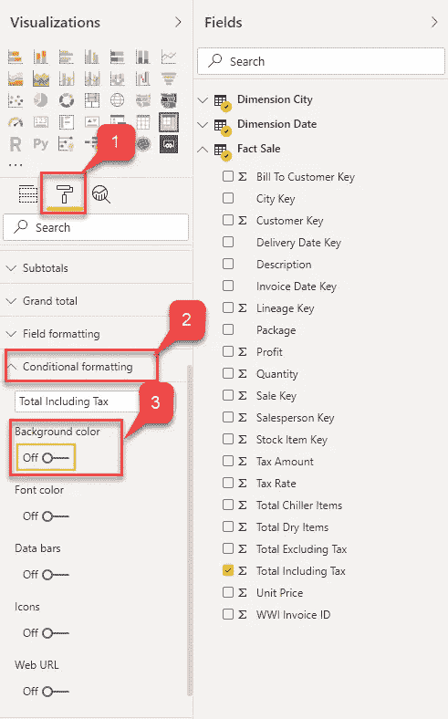

*图 11 —条件格式*

## 将打开背景颜色-格式对话框

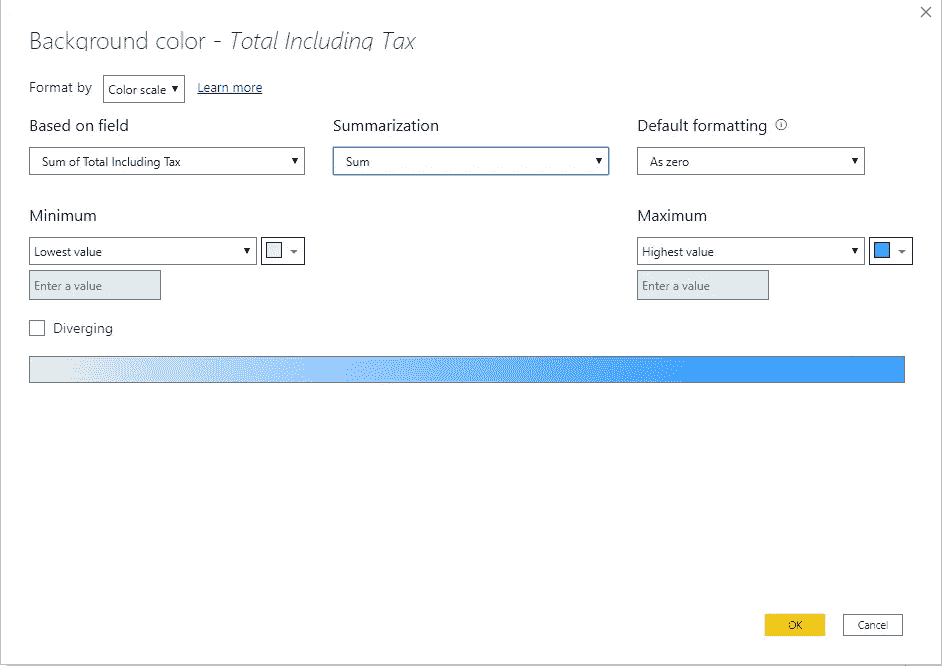

*图 12 —背景颜色*

现在让我们通过选项选择**色标**作为**格式，并如前所述选择颜色。对于**最低值，**我们将指定**为红色**，而**最高值**的颜色将为**蓝色**。完成后点击**确定**。**

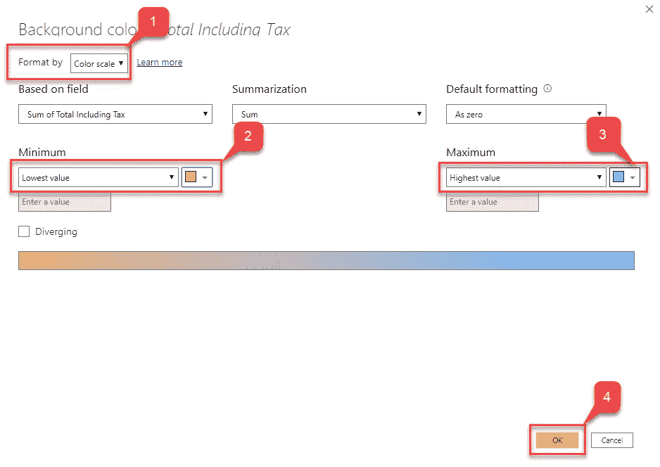

1.  *图 13 —定义色标*

现在我们已经了解了 Power BI 中的条件格式是怎么回事，让我们来探索一些实现相同内容的不同方法。在上述步骤中，格式规则基于单元格值的范围。这意味着，根据单元格的值，背景颜色的饱和度会发生变化。但是，在某些情况下，您可能希望基于固定数值来可视化格式，而不希望更改颜色的饱和度。或者，您可能还希望将度量值分为、和值等类别。

在下面的步骤中，我们将尝试将条件格式的规则从范围修改为固定值。

1.  右键单击*值*部分的**含税总额**字段
2.  选择**条件格式**然后点击**背景颜色**
3.  或者，您也可以点击**格式**按钮，打开**条件格式**下的**背景色**
4.  将打开背景颜色-格式对话框
5.  现在，我们将创建一些规则，基于这些规则来应用格式。您可以通过点击**新规则**按钮创建尽可能多的规则

因此，在上面的练习中，我们看到了如何基于两种不同的方式在 Power BI 中实现条件格式。第一个是通过使用**色标**，第二个是通过为格式定义特定的**规则**。

# Power BI 中带有图标的条件格式

现在让我们更进一步，在单元格中实现一些图标作为视觉指示器。这些特定的图标在定义任何 KPI 或根据标准比较指标时非常有用。您可以按照下面提到的步骤来实现单元格中的图标。

1.  右键单击*值*部分的**含税总额**字段
2.  *图标*——格式化对话框打开
3.  让选项的**格式作为**规则****
4.  选择**图标布局**为数据右侧的**，选择**图标对齐**为**中间的****
5.  从**样式**下拉菜单中选择任意选项，点击**确定**
6.  *图 20 —图标定义规则*
7.  现在你可以看到矩阵根据上一步定义的条件显示了额外的**图标**

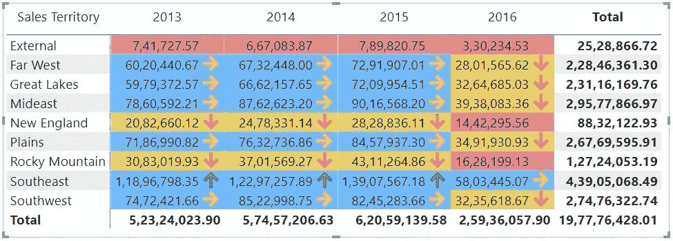

1.  *图 21 —带有图标的条件格式*
2.  这是一个重要的特性，有助于用户直观地了解指标是否表现良好
3.  同样，您可以根据需求添加任意多的规则

# 结论

在本文中，我解释了 Power BI 中的条件格式是什么以及如何实现它。我还解释了如何应用条件格式以及在什么情况下应用条件格式的不同方式。最后，我们看到了如何在视觉效果中包含一些信息图视觉效果(图标),这有助于在很大程度上提高报告的可读性。

*原载于 2020 年 3 月 18 日 https://www.sqlshack.com***。**