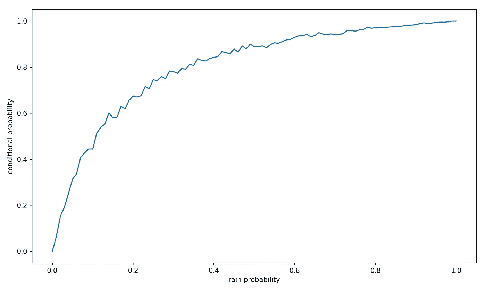

# 条件概率、西雅图雨和狡猾的朋友

> 原文：<https://towardsdatascience.com/conditional-probabilities-seattle-rain-and-tricky-friends-aa1f33c20e29?source=collection_archive---------20----------------------->


本·达顿在 [Unsplash](https://unsplash.com?utm_source=medium&utm_medium=referral) 上的照片

## 通过解决这个数据科学面试问题(使用 Python)更好地理解概率

我最不喜欢的一种数据科学面试题是概率。只是这不是我每天想的事情，所以每当我被迫锻炼概率肌时，我总是感觉它们超级生锈。但是，如果你正在寻找一份数据工作，不可避免的是，你会在某个时候遇到一份——所以让我们通过一些实践来保持我们的概率技能。像往常一样，我们将使用模拟(和 Python 代码)来更好地可视化正在发生的事情。

# 这个问题

> 你要去西雅图。你想知道你是否应该带一把伞，所以你打电话给住在那里的三个随机的朋友，分别问他们是否在下雨。每个朋友都有 2/3 的机会对你说真话，1/3 的机会撒谎(好刻薄！).三个朋友都告诉你“是的，下雨了”。西雅图真的下雨的概率有多大？

我第一次看到这个问题时，我想“只有当我的三个朋友都对我撒谎时，这才意味着西雅图没有下雨”。因为只要我的一个朋友没有撒谎，那么肯定会有一个是真的(暗示下雨)。

```
probability rain = 1 - probability all lying= 1 - (1/3)^3 = 0.963
```

但后来我觉得这似乎太简单了。如果这个问题如此简单，它怎么会如此臭名昭著。遗憾的是，我的直觉是对的，这个问题比看起来更复杂。

# 这是一个条件概率

我以前的方法忽略了给定的条件。**你问什么条件？面试官告诉我们，我们的三个朋友都回答是。**这是我们的解决方案需要考虑的相关信息。


奥斯曼·拉纳在 [Unsplash](https://unsplash.com?utm_source=medium&utm_medium=referral) 上拍摄的照片

要知道为什么，想象一下西雅图正在下雨。当我们问朋友是否在下雨时，他们回答[是，是，是]。让我们仔细想想在这种世界状态下可能出现的结果。如果他们都说了实话，那么这与我们所处的世界状态是一致的(因为西雅图正在下雨)。

如果他们都撒谎了呢？那是不可能的。在世界正在下雨的情况下，我们的朋友不可能回答“是”并撒谎(要撒谎，他们必须回答“不是”)。有没有可能他们中只有一个撒谎了？这也是不可能的——所有人都说“是”,而躺在下雨的世界里需要说“不”。所以如果西雅图下雨，唯一可能的结果就是我们的朋友都在说实话。


塞尔吉奥·索萨在 [Unsplash](https://unsplash.com?utm_source=medium&utm_medium=referral) 上的照片

现在想象西雅图阳光明媚。我们可以做同样的练习来找出在这个世界状态下可能发生的事情。如果是晴天，那就意味着我们的三个朋友都对我们撒了谎。那是唯一的可能！因为在阳光明媚的世界里，我们的朋友必须回答“不，没有下雨”才能说实话。他们都没这么说过。

所以只有两种可能:

```
**World state = it is raining:**
[yes,yes,yes] = **[truth,truth,truth] = raining**
                [lie,lie,lie] = impossible
                [lie,lie,truth] = impossible
                [lie,truth,truth] = impossible
                [lie,truth,lie] = impossible
                [truth,truth,lie] = impossible
                [truth,lie,lie] = impossible
                [truth,lie,truth] = impossible**World state = it is not raining:**
[yes,yes,yes] = [truth,truth,truth] = impossible
                **[lie,lie,lie] = not raining**
                [lie,lie,truth] = impossible
                [lie,truth,truth] = impossible
                [lie,truth,lie] = impossible
                [truth,truth,lie] = impossible
                [truth,lie,lie] = impossible
                [truth,lie,truth] = impossible
```

> 基本上，如果下雨，他们一定都在说实话。如果不是，他们一定都在撒谎。如果我们的三个朋友都同意，这是唯一的可能性。

因此，我们正在估计一个条件概率:

```
Prob(rain | [yes,yes,yes])Which is read as probability of rain given that the responses were yes, yes, and yes].
```

我们可以在这里突破[贝叶斯定理](/understanding-bayes-theorem-7e31b8434d4b)，但我更喜欢一种更直观和深入的方法，这样我们才能真正掌握正在发生的事情。

# 用 Python 模拟

让我们写一些代码来模拟这个脑筋急转弯。我在代码中添加了一些注释来描述它是如何工作的以及我的思考过程。但是让我们也快速浏览一下。

我们将运行 10 万次模拟。我们还需要具体说明下雨的概率。很奇怪，对吧？我们不是在估算下雨的概率吗？不，实际上我们是在估计下雨的概率，因为我们的朋友都说“是的，下雨了”。为了做到这一点，我们需要模拟世界的两种可能状态(下雨或不下雨)。我们可以通过类似抛硬币的随机变量(0 和 1 之间的均匀分布)来实现这一点，如果随机变量 rain 小于 prob_rain，则在我们的模拟中正在下雨。

接下来，我们以同样的方式模拟我们 3 个朋友的反应——如果反应中的 3 个随机变量中的任何一个大于 2/3，那么这个特定的朋友对我们撒谎了(因为他们有 2/3 的机会说真话，1/3 的机会撒谎)。

我们有 3 个计数器变量来跟踪我们关心的结果:

1.  times_rained_3yes 记录下雨的次数，我们的朋友都实话实说，说“是的，下雨了”。
2.  times_dry_3yes 记录了没有下雨的次数，我们的朋友都撒谎说“是的，下雨了”。
3.  times_rained 跟踪我们的模拟中下雨的次数(大约是我们设置 prob_rain = 0.5 以来的 50%)。

```
# Inputs
sims = 100000
prob_rain = 0.50# Counter variables to tally the simulation outcomes
times_rained_3yes = 0
times_dry_3yes = 0
times_rained = 0# Loop that runs the simulations
for i in range(sims):   
    # Random variable to simulte whether it rains or not
    rain = np.random.random()

    # Raining Case
    if rain < prob_rain:
        # If it is raining, increment counter
        times_rained += 1
        # Random variables to simulate whether friends lie
        responses = [np.random.random(),
                     np.random.random(),
                     np.random.random()]
        # Tally the number of lies
        lies = sum([1 for i in responses if i > 2/3])

        # If sum(lies) == 0, then all truth
        if lies == 0:
            # This is outcome we are looking for, where the
            # world state = RAINING and all friends tell truth
            times_rained_3yes += 1

    # Not Raining Case
    else:    
        # Random variables to simulate whether friends lie
        responses = [np.random.random(),
                     np.random.random(),
                     np.random.random()]
        # Tally the number of lies
        lies = sum([1 for i in responses if i > 2/3])

        # If sum(lies) == 3, then all lies
        if lies == 3:
            # This is outcome we are looking for, where the
            # world state = DRY and all friends lie
            times_dry_3yes += 1
```

运行模拟后，我们可以使用计数器变量来计算我们感兴趣的概率。

```
sims = 100,000times_rained = 49,990times_rained_3yes = 14,852times_dry_3yes = 1,889
```

所以大约 50%的时间都在下雨(因为我们是这样设置的)。而当真的下雨的时候，我们的朋友大约有 29% (14，852/49，990)的时候会说实话——(2/3)= 0.295。而不下雨的时候，我们 3 个朋友对我们撒谎的时间都是 3.77% (1，889/50，010)-(1/3)= 0.037，由于模拟噪音的原因略有差异。

我们现在已经有了解决问题所需的所有数字！你能看出是怎么回事吗？让我们回想一下我们的问题——当我们的三个朋友都说“是的，下雨了”时，我们想知道下雨的概率。所以我们概率计算的分子应该是下雨的次数和所有人都说是的次数。而分母应该是我们所有的朋友在世界所有的状态下回答是的次数(只有 2 种状态——下雨和不下雨)。

```
**Numerator** = times_rained_3yes = 14,852**Denominator** = number of times our friends said 3 yeses
            = times_rained_3yes + times_dry_3yes
            = 14,852 + 1,889 = 16,741**The Answer = 14,852 / 16,741 = 0.888**
```

所以**根据我们朋友的回答，西雅图有 89%的可能在下雨**(一定要带伞)。

## 解析解

我们也可以如下解析求解:

*   分子是 3 赞成和下雨的联合概率。因为它们是独立的事件，我们可以用下雨的概率乘以 3 个真相的概率(因为下雨时回答是等于说实话)。
*   分母是 3 通过的概率。我们可以通过认识到 3 个“是”只能产生于 2 种情况来计算:要么是下雨时的 3 个真相，要么是不下雨时的 3 个谎言。我们已经有了第一个概率(它是我们的分子)。我们可以用同样的方法计算第二个(不下雨时的 3 个谎言)——用 3 个谎言的概率乘以不下雨的概率。最后，我们将两个案例的概率相加，得到 3 个通过的概率。

```
**Numerator** = Prob. 3 Truths * Prob. Rain 
 = (2/3)^3 * (1/2)**Denominator** = Prob. 3 Yeses
 = (Prob. 3 Truths * Prob. Rain) + (Prob. 3 Lies * (1 - Prob. Rain))
 = (2/3)^3 * (1/2) + (1/3)^3 * (1/2)**Plugging into Python:**
(2/3)**3*(1/2) /((2/3)**3*(1/2) + (1/3)**3*(1/2))**We get:**
**0.888**
```

最后，需要注意的是，根据我们对下雨概率的估计(我们之前设定为 0.5)，答案会有所不同。这是有道理的——不管我们朋友的反应如何，我们先前对下雨概率的假设仍然很重要。我们朋友的反应会改变我们开始的先验假设，但不会推翻它。例如，如果我们要去拉斯维加斯而不是西雅图，即使有三个“是的，下雨了”的回答，我们也可以不带伞。下图显示了我们关于下雨概率的假设(我代码中的 prob_rain 变量)如何改变我们的答案:



我们的开始下雨概率假设对答案的影响

今天的节目到此结束。祝你面试和数据科学一切顺利。干杯！