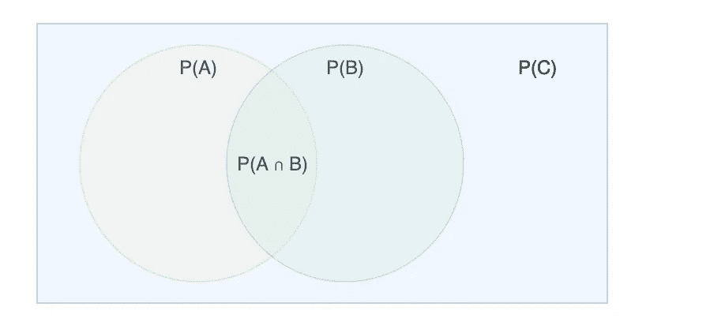
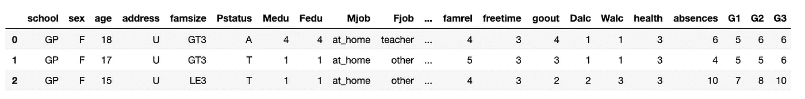
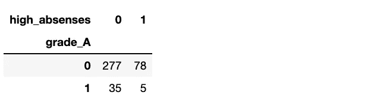

# Python 示例中的条件概率

> 原文：<https://towardsdatascience.com/conditional-probability-with-a-python-example-fd6f5937cd2?source=collection_archive---------4----------------------->

## 假设一个学生错过了 10 节或更多的课，使用 python 计算该学生数学得 A 的条件概率。


**本文有 2 个部分:**
1。条件概率背后的理论
2。python 的例子

# 第一部分:条件概率背后的理论和公式

这一次，[维基百科](https://en.wikipedia.org/wiki/Conditional_probability)有了一个平易近人的定义，

> 在[概率论](https://en.wikipedia.org/wiki/Probability_theory)中，**条件概率**是一个[事件](https://en.wikipedia.org/wiki/Event_(probability_theory))发生的[概率](https://en.wikipedia.org/wiki/Probability)的度量，假设另一个事件已经发生(通过假设、推测、断言或证据)。

**翻译:**给定 B 为真，A 也为真的概率是多少。

有具体例子的东西更容易理解。下面是一些我们可以计算的条件概率的随机例子。

## **例子:**

1.  如果一个人是大学生，睡眠少于 8 小时的概率是多少？
2.  如果一只狗是边境牧羊犬，它活超过 15 年的概率有多大？
3.  如果你为政府工作，用掉所有假期的概率是多少？

## 公式:


条件概率的公式是`P(A|B) = P(A ∩ B) / P(B)`。

**零件:**
P(A | B)= A 发生的概率，给定 B 发生
P(A∩B)= A 和 B 都发生的概率
P(B)= B 发生的概率

`|`意为“给定”。意思是“在其他事情发生的情况下”。

`∩`的意思是相交，你可以把它想象成`and`，或者是维恩图中的重叠。


但是为什么我们在公式中用`P(B)`除`P(A ∩ B)`？

因为我们要排除非 B 情况的概率。我们正在确定落入`B`的概率。



除以`P(B)`去除了非`B`的概率。`C — B`以上。

# 第 2 部分:python 示例

我们将计算一个学生数学得 A (80%+)的概率，假设他们错过了 10 节或更多的课。

从 [kaggle](https://www.kaggle.com/uciml/student-alcohol-consumption#student-mat.csv) 下载数据集并检查数据。

```
import pandas as pd
df = pd.read_csv('student-alcohol-consumption/student-mat.csv')
df.head(3)
```



并检查记录的数量。

```
len(df)
#=> 395
```

我们只关心列，`absences`(缺席次数)，和`G3`(从 0 到 20 的最终分数)。

让我们基于这些列创建几个新的布尔列，使我们的生活更容易。

添加一个名为`grade_A`的布尔列，记录学生最终分数是否达到 80%或更高。原始值在 0-20 范围内，所以我们乘以 5。

```
df['grade_A'] = np.where(df['G3']*5 >= 80, 1, 0)
```

如果学生缺了 10 节或更多的课，创建另一个名为`high_absenses`的布尔列，值为 1。

```
df['high_absenses'] = np.where(df['absences'] >= 10, 1, 0)
```

再添加一列，使构建数据透视表更容易。

```
df['count'] = 1
```

删除所有我们不关心的栏目。

```
df = df[['grade_A','high_absenses','count']]
df.head()
```


很好。现在我们将由此创建一个数据透视表。

```
pd.pivot_table(
    df, 
    values='count', 
    index=['grade_A'], 
    columns=['high_absenses'], 
    aggfunc=np.size, 
    fill_value=0
)
```



我们现在有了进行计算所需的所有数据。让我们从计算公式中的各个部分开始。

**在我们的例子中:**
`P(A)`是一个等级 80%或更大的概率。
`P(B)`是缺课 10 节及以上的概率。
`P(A|B)`是 80%+成绩的概率，给定缺课 10 节或以上。

**零件的计算:**
P(A)=(35+5)/(35+5+277+78)= 0.10126582278481013
P(B)=(78+5)/(35+5+277+78)= 0.21012658227848102
P(A∩B)= 5/(35+1

并且按照公式，`P(A|B) = P(A ∩ B) / P(B)`，把它拼在一起。

p(A | B)= 0.012658227848101266/0.21012658227848102 = 0.06

我们找到了。如果缺课 10 节或更多，得到至少 80%最终成绩的概率是 6%。

# 结论

虽然从我们的具体例子中学到的很清楚——如果你想要好成绩就去上课，条件概率可以应用于更严重的情况。

例如，在给定测试结果的情况下，一个人患有特定疾病的概率。

在使用贝叶斯定理进行更复杂的概率估计之前，理解也是必不可少的。